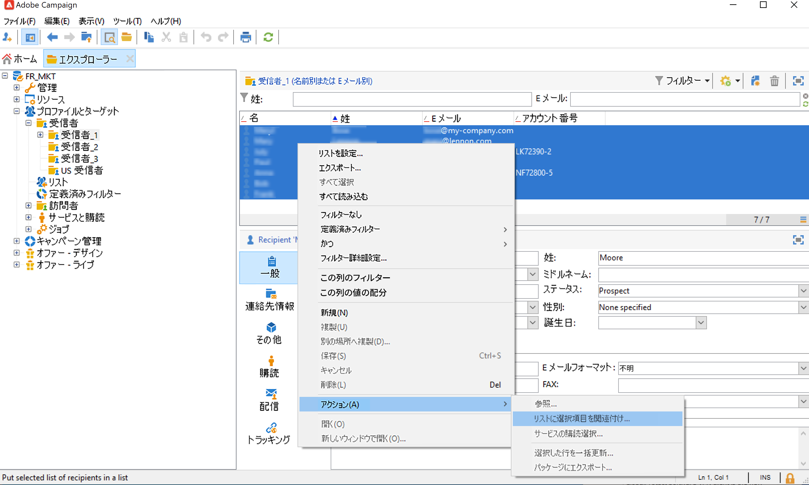

# リストでのオーディエンスの作成{#create-segments}

Campaign リストを使用すると、オーディエンスを作成および整理できます。

リストは、配信アクションのターゲットにしたり、インポート操作時や別のワークフロー実行時に更新したりできる、連絡先の静的なセットです。例えば、クエリによってデータベースから抽出した母集団からリストを作成できます。

リストの作成と管理は、「**[!UICONTROL プロファイルとターゲット]**」タブの&#x200B;**[!UICONTROL リスト]**&#x200B;リンクを使用して実行します。これらのリストは、デフォルトの Adobe Campaign プロファイルテーブル（nms:recipient）に基づいています。[詳細情報](../dev/datamodel.md#ootb-profiles.md)

リストを作成するには、ワークフローで&#x200B;**リストを更新**&#x200B;アクティビティを使用します。このアクティビティは、結果の母集団をリストに格納します。これを使用すると、新しいリストを作成したり、既存のリストを更新したりできます。組み込みのプロファイルテーブル以外のタイプのデータを含むリストを作成するには、ワークフローを実行する必要があります。例えば、訪問者テーブルでクエリを使用してからリストを更新することによって、訪問者リストを作成できます。[詳細情報](#create-a-list-wf)。

Adobe Campaign でのリスト管理について詳しくは、このビデオをご覧ください。

>[!VIDEO](https://video.tv.adobe.com/v/334909?quality=12)

## 連絡先のリストの作成 {#create-a-list-of-contacts}

連絡先のリストを作成するには、次の手順に従います。

1. 「**[!UICONTROL 作成]**」ボタンをクリックし、「**[!UICONTROL 新しいリスト]**」を選択します。

   

1. リスト作成ウィンドウの「**[!UICONTROL 編集]**」タブで情報を入力します。

   

   * 「**[!UICONTROL ラベル]**」フィールドにリスト名を入力し、必要に応じて内部名を変更します。
   * このリストの説明を入力します。
   * 有効期限を指定できます。この日付に達すると、リストはパージされ自動的に削除されます。

1. 「**[!UICONTROL コンテンツ]**」タブで「**[!UICONTROL 追加]**」をクリックし、リストに属するプロファイルを選択します。

   

   新しいプロファイルを作成し、このウィンドウから直接リストに追加するには、「**[!UICONTROL 作成]**」アイコンを使用します。プロファイルはデータベースに追加されます。

1. 「**[!UICONTROL 保存]**」をクリックしてリストを保存します。リストの概要にリストが追加されます。

## フィルター済み連絡先をリストに変換 {#convert-data-to-a-list}

プロファイルを選択してリストに追加できます。手順は次のとおりです。

1. Campaign エクスプローラーから、プロファイルを選択して右クリックします。

   これらのプロファイルは、特定の条件を満たすようにフィルターできます。

1. **[!UICONTROL アクション／リストに選択項目を関連付け...]** を選択します。

   

1. 既存のリストを選択するか、新しいリストを作成して、「**[!UICONTROL 次へ]**」をクリックします。

   

1. 「**[!UICONTROL 開始]**」ボタンをクリックします。

   

「**[!UICONTROL リストを再作成]**」オプションを選択して、リストから既存のコンテンツを削除し、リストの作成を最適化します（プロファイルが既にリストにリンクされているかどうかを確認するためのクエリは必要ありません）。

「**[!UICONTROL データベースにこのジョブのトレースを保存しない]**」オプションをオフにした場合、このプロセスにリンクされた情報を保存する実行フォルダーを選択（または作成）できます。

ウィンドウの上部セクションで実行を監視できます。「**[!UICONTROL 停止]**」ボタンを使用してプロセスを停止できます。既に処理された連絡先がリストにリンクされます。

実行が完了したら、**[!UICONTROL プロファイルとターゲット／リスト]**&#x200B;メニューにアクセスし、リストを選択します。「**[!UICONTROL コンテンツ]**」タブには、このリストにリンクされているプロファイルが表示されます。

## ワークフローでのリストの作成  {#create-a-list-wf}

**[!UICONTROL リスト更新]**&#x200B;アクティビティを使用して、リストを作成したり、受信者のリストに母集団を追加したりできます。

次の例では、25～40 のすべての受信者のリストを作成します。

1. 「**[!UICONTROL プロファイルとターゲット]**」および「**[!UICONTROL ターゲティングワークフロー]**」を選択し、「**[!UICONTROL 作成]**」ボタンから新しいワークフローを作成します。
1. このワークフローのラベル（例： 「25～40 の連絡先」）を入力し、説明を追加して、「**[!UICONTROL 次へ]**」をクリックします。

   

1. **[!UICONTROL クエリ]**&#x200B;アクティビティを挿入してターゲット母集団を定義し、クエリを編集します。

   

1. 次のように、フィルター条件を定義します。

   

   ワークフローでクエリを作成する方法については、[この節](https://experienceleague.adobe.com/docs/campaign/automation/workflows/wf-activities/targeting-activities/query.html?lang=ja)を参照してください。

1. このクエリのラベルを追加し、変更を保存します。
1. **[!UICONTROL リスト更新]**&#x200B;アクティビティをを追加し、編集します。

   

1. アクティビティのラベルを入力します。
1. 「**[!UICONTROL 必要に応じてリストを作成 (名前を自動生成)]**」オプションを選択します。このオプションでは、最初のワークフローの実行時にリストが作成され、その後、ワークフローを実行すると更新されます。
1. フォルダーを選択し、リストのラベルを入力します。
1. 「**[!UICONTROL ターゲティングディメンションのデータベース]**」を選択し、テーブルを格納します。
1. 「**[!UICONTROL 存在する場合、リストをパージして再利用 (存在しない場合、リストに追加)]**」オプションを選択しておくと、ターゲティング条件に一致しない受信者は削除され、新しい受信者がリストに追加されます。
1. また、「**[!UICONTROL 独自のテーブルを持つリストを作成または使用]**」オプションも選択した状態にしておきます。
1. 「**[!UICONTROL アウトバウンドトランジションを生成]**」オプションは選択を解除します。
1. 「**[!UICONTROL OK]**」をクリックし、ワークフローを保存します。
1. ワークフローを開始します。

   条件に一致する受信者のリストが作成されます。このリストには、ホームページの&#x200B;**[!UICONTROL リスト]**&#x200B;エントリからアクセスできます。

   

   ワークフローにスケジューラーを追加することで、このワークフローを繰り返し実行できます。[詳細情報](https://experienceleague.adobe.com/docs/campaign/automation/workflows/wf-activities/flow-control-activities/scheduler.html?lang=ja)。

## リストからのプロファイルの削除 {#remove-a-profile-from-a-list}

リストからプロファイルを削除するには、リストを編集し、「**[!UICONTROL コンテンツ]**」タブでプロファイルを選択して、**[!UICONTROL 削除]**&#x200B;アイコンをクリックします。

## プロファイルリストの削除 {#delete-a-list-of-profiles}

リストを削除するには、Campaign エクスプローラーからリストを参照し、選択して右クリックします。「**[!UICONTROL 削除]**」を選択します。削除を確定するよう求める警告メッセージが表示されます。

>[!NOTE]
>
>リストを削除した場合、リストのプロファイルは影響を受けませんが、プロファイルのデータは更新されます。
