# フィルターの作成と管理{#create-filters}

データのフィルタリングとは、データセットの一部を選択し、特定の条件に一致するレコードのみを選択し、そのサブセットを特定のアクション（更新、オーディエンスの作成）または分析に使用するプロセスです。

**[!UICONTROL エクスプローラー]**&#x200B;から Campaign を参照すると、データがリストに表示されます。 既存の組み込みフィルターを使用して、このデータの特定のサブセット（強制隔離されたアドレス、ターゲティングされていない受信者、特定の年齢範囲や作成日など）にアクセスできます。

独自のフィルターを作成し、後で使用するために保存したり、他の Campaign ユーザーと共有したりすることもできます。

フィルター設定を使用すると、リストからデータを&#x200B;**[!UICONTROL 動的に]**&#x200B;選択できます。データが変更されると、フィルターされたデータが更新されます。

>[!NOTE]
>
>ユーザーインターフェイスの設定は、デバイスレベルでローカルに定義されます。 このデータはクリーンアップが必要になる場合があります。 特に、データの更新時に問題が発生した場合に必要です。それには、**[!UICONTROL ファイル／ローカルキャッシュをクリア]**&#x200B;メニューを使用します。

Adobe Campaign では、次のタイプのフィルターを使用できます。

## 定義済みフィルター{#predefined-filters}

定義済みフィルターは、各リストの上にある「**フィルター**」ボタンから使用できます。

例えば、プロファイルの場合、次の組み込みフィルターを使用できます。

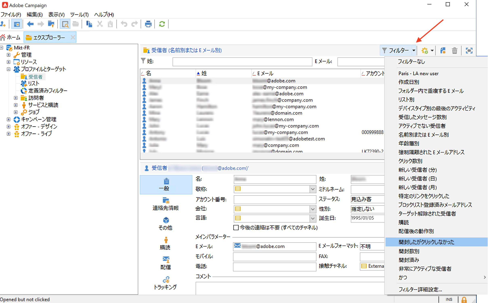

フィルターの詳細には、エクスプローラーの&#x200B;**[!UICONTROL プロファイルとターゲット／定義済みフィルター]**&#x200B;ノードでアクセスできます。

>[!NOTE]
>
>その他のすべてのリストのデータの場合、定義済みフィルターは&#x200B;**[!UICONTROL 管理／設定／定義済みフィルター]**&#x200B;ノードに格納されます。

定義を表示するフィルターを選択します。

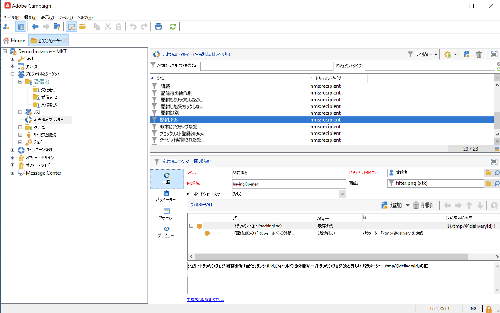

最後のタブを使用すると、フィルターされたデータをプレビューできます。

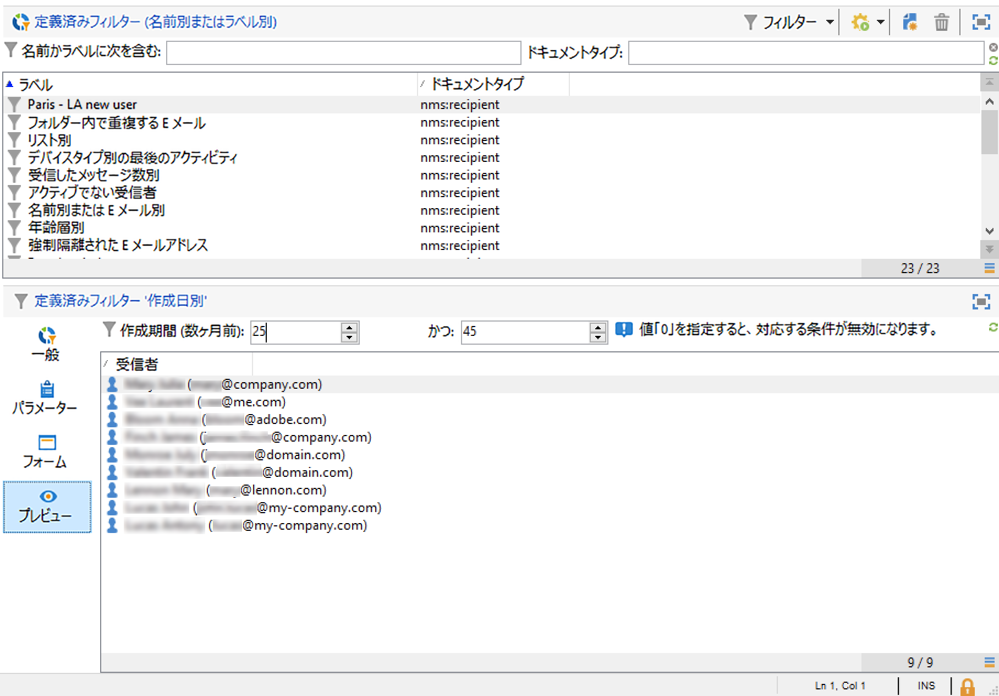

組み込みの定義済みフィルターは、次のとおりです。

<table> 
 <tbody> 
  <tr> 
   <td> <strong>ラベル</strong>  </td> 
   <td> <strong>クエリ</strong>  </td> 
  </tr> 
  <tr> 
   <td> 開封済み  </td> 
   <td> 配信を開封した受信者を選択します。  </td> 
  </tr> 
  <tr> 
   <td> 開封したがクリックしなかった  </td> 
   <td> 配信を開封したがリンクをクリックしていなかった受信者を選択します。  </td> 
  </tr> 
  <tr> 
   <td> アクティブでない受信者  </td> 
   <td> 配信を X ヶ月間開封していない受信者を選択します。  </td> 
  </tr> 
  <tr> 
   <td> デバイスタイプ別の最後のアクティビティ  </td> 
   <td> 過去 Z 日間にデバイス X を使用して配信 Y をクリックしたか開封した受信者を選択します。  </td> 
  </tr> 
  <tr> 
   <td> デバイスタイプ別の最後のアクティビティ（トラッキング）  </td> 
   <td> 過去 Z 日間にデバイス X を使用して配信 Y をクリックしたか開封した受信者を選択します。  </td> 
  </tr> 
  <tr> 
   <td> ターゲット解除された受信者  </td> 
   <td> チャネル Y 経由で X ヶ月間ターゲットとされていない受信者を選択します。  </td> 
  </tr> 
  <tr> 
   <td> 非常にアクティブな受信者  </td> 
   <td> 過去 Y ヶ月間に少なくとも X 回、配信内でクリックした受信者を選択します。  </td> 
  </tr> 
  <tr> 
 <td> ブロックリスト登録済みメールアドレス  </td> 
    <td> E メールアドレスがブロックリストに登録されている受信者を選択します。  </td>
  </tr> 
  <tr> 
   <td> 強制隔離された E メールアドレス  </td> 
   <td> E メールアドレスが強制隔離されている受信者を選択します。  </td> 
  </tr> 
  <tr> 
   <td> フォルダー内で重複する E メールアドレス  </td> 
   <td> フォルダー内で E メールアドレスが重複している受信者を選択します。  </td> 
  </tr> 
  <tr> 
   <td> 開封もクリックもなし  </td> 
   <td> 配信を開封していなくかつ配信内でクリックもしていない受信者を選択します。  </td> 
  </tr> 
  <tr> 
   <td> 新しい受信者（日数）  </td> 
   <td> 過去 X 日間に作成された受信者を選択します。  </td> 
  </tr> 
  <tr> 
   <td> 新しい受信者（分）  </td> 
   <td> 過去 X 分間に作成された受信者を選択します。  </td> 
  </tr> 
  <tr> 
   <td> 新しい受信者（月）  </td> 
   <td> 過去 X ヶ月間に作成された受信者を選択します。  </td> 
  </tr> 
  <tr> 
   <td> 購読  </td> 
   <td> 購読別に受信者を選択します。  </td> 
  </tr> 
  <tr> 
   <td> 特定のリンクをクリックする  </td> 
   <td> 配信内の特定の URL をクリックした受信者を選択します。  </td> 
  </tr> 
  <tr> 
   <td> 配信後の行動別  </td> 
   <td> 配信の受信後の行動に従って受信者を選択します。  </td> 
  </tr> 
  <tr> 
   <td> 作成日別  </td> 
   <td> X ヶ月（現在の日付 - n ヶ月）から Y ヶ月（現在の日付 - n ヶ月）までの期間で、作成日別に受信者を選択します。  </td> 
  </tr> 
  <tr> 
   <td> リスト別  </td> 
   <td> リスト別に受信者を選択します。  </td> 
  </tr> 
  <tr> 
   <td> クリック数別  </td> 
   <td> 過去 X ヶ月間に配信内でクリックした受信者を選択します。  </td> 
  </tr> 
  <tr> 
   <td> 受信したメッセージ数別  </td> 
   <td> 受信したメッセージ数に従って受信者を選択します。  </td> 
  </tr> 
  <tr> 
   <td> 開封数別  </td> 
   <td> Z の期間で X 件から Y 件の配信を開封した受信者を選択します。  </td> 
  </tr> 
  <tr> 
   <td> 名前別または E メール別  </td> 
   <td> 名前または E メールに従って受信者を選択します。  </td> 
  </tr> 
  <tr> 
   <td> 年齢層別  </td> 
   <td> 年齢に従って受信者を選択します。  </td> 
  </tr> 
 </tbody> 
</table>

### デフォルトのフィルター{#default-filters}

各リストの上のフィールドでは、このリストに&#x200B;**デフォルトの定義済みフィルター**&#x200B;を使用できます。受信者リストの場合、デフォルトで名前とメールアドレスでフィルターできます。

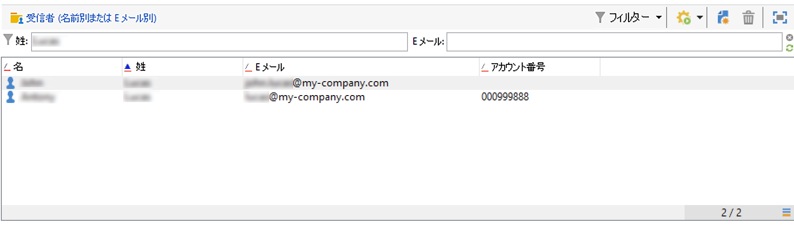

>[!NOTE]
>
>**%** 文字は任意の文字列を置き換えます。例えば、Gmail アドレスを持つすべてのプロファイルを表示するには、「メール」フィールドに「`%@gmail.com`」と入力します。姓に「L」が含まれるすべてのプロファイルを表示するには、「姓」フィールドに「`%@L`」と入力します。

受信者リストのデフォルトのフィルターを変更するには、**[!UICONTROL プロファイルとターゲット／定義済みフィルター]**&#x200B;ノードを参照します。

その他のすべてのタイプのデータについては、**[!UICONTROL 管理／設定／定義済みフィルター]**&#x200B;ノードを使用してデフォルトのフィルターを設定します。

次の手順に従います。

1. デフォルトで使用するフィルターを選択します。
1. 「**[!UICONTROL パラメーター]**」タブをクリックし、「**[!UICONTROL 関連付けられたドキュメントタイプのデフォルトのフィルター]**」を選択します。

   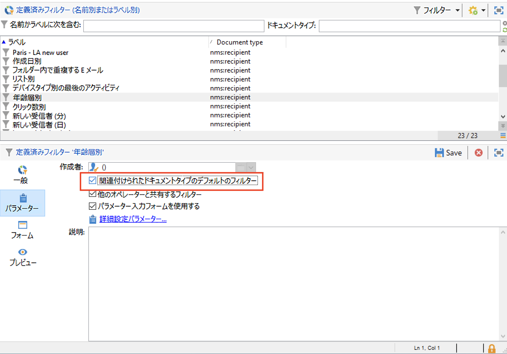

1. 現在のデフォルトの定義済みフィルターに対して、同じオプションのチェックを外します。
1. 「**[!UICONTROL 保存]**」をクリックしてフィルターを適用します。
1. 受信者フォルダーを参照し、現在のフィルターの右側にある「**[!UICONTROL このフィルターを削除]**」アイコンをクリックします。新しいデフォルトのフィルターが使用可能です。
   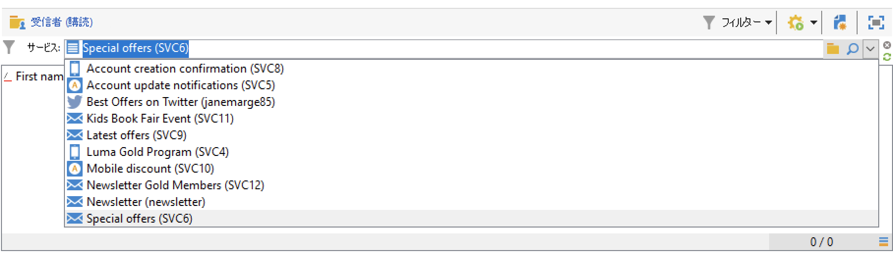

## クイックフィルター{#quick-filters}

**クイックフィルター**&#x200B;を使用および組み合わせて、特定のフィールドにフィルターを定義します。

追加したクイックフィルターフィールドは、データリストの上に次々と表示されます。これらは、それぞれ個別に削除できます。

クリックフィルターは各オペレーター専用であり、オペレーターがクライアントコンソールのキャッシュをクリアするたびに再初期化されます。

フィルターを再利用する必要がある場合は、**詳細フィルター**&#x200B;を作成して保存します。[詳細情報](#advanced-filters)。

**クイックフィルター**&#x200B;を作成するには、次の手順に従います。

1. フィルターするフィールドを右クリックし、「**[!UICONTROL このフィールドでフィルター]**」を選択します。

   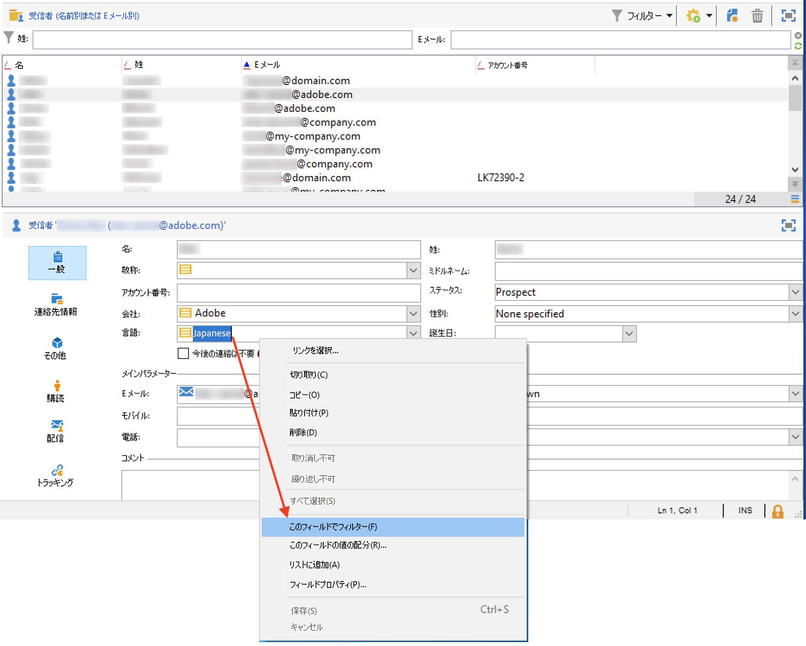

   デフォルトのフィルターフィールドがリストの上に表示されます。

   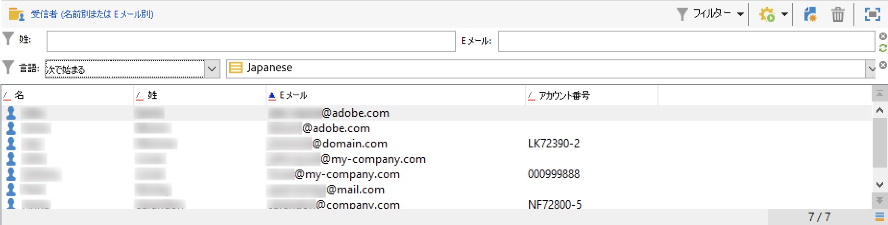

1. フィルターオプションを選択します。
1. 必要に応じて、フィルターの右側にあるグレーのアイコンを使用し、フィルターを削除します。
1. フィルターを組み合わせて絞り込むことができます。

   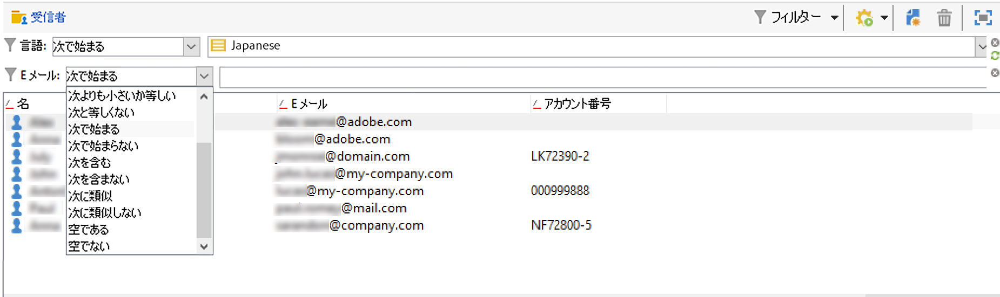

フォーム内で使用できないフィールドをフィルタリングする必要がある場合は、そのフィールドを列に表示させ、その列でフィルターします。手順は次のとおりです。

1. **[!UICONTROL リストを設定]**&#x200B;アイコンをクリックします。

   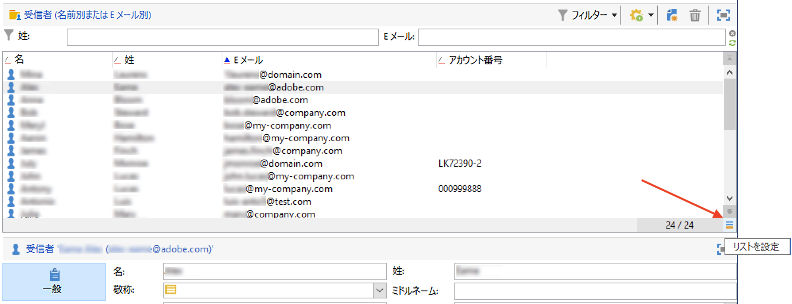

1. 表示する列（受信者の年齢など）を選択し、「**OK**」をクリックします。

   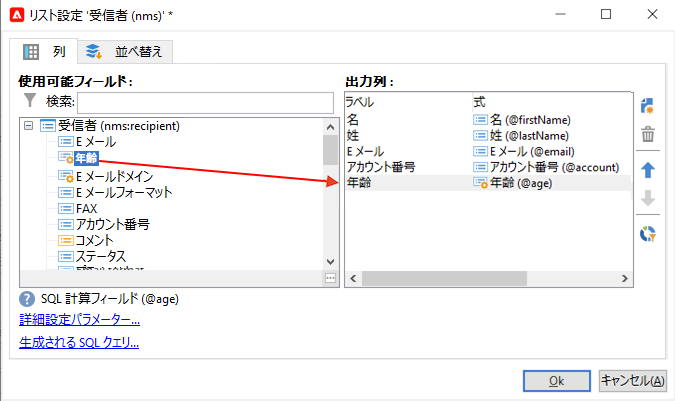

1. 受信者リストで「**年齢**」列を右クリックし、「**[!UICONTROL この列でフィルター]**」を選択します。

   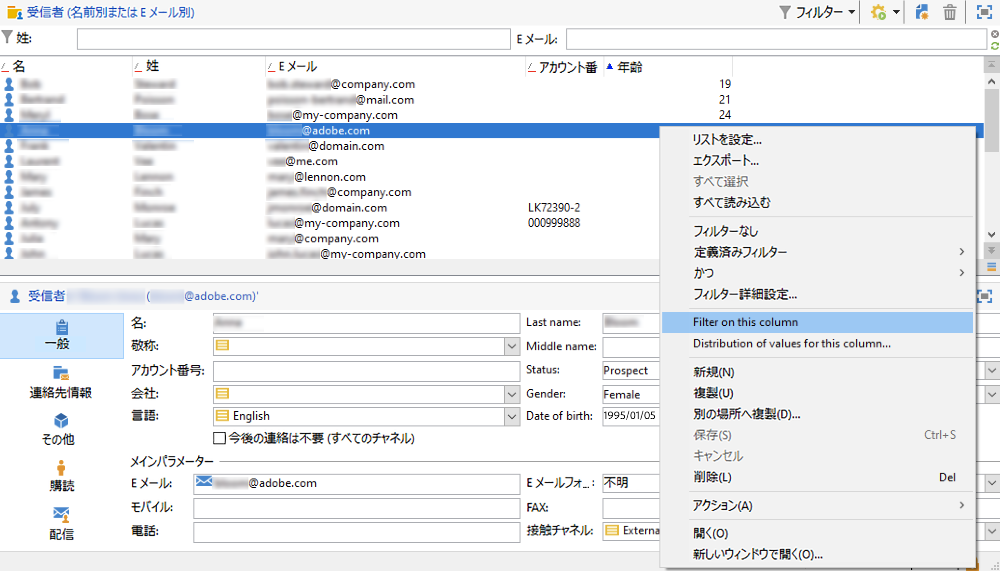

   年齢のフィルターオプションを選択できるようになります。年齢に別のフィルターを追加して、範囲を定義します。

   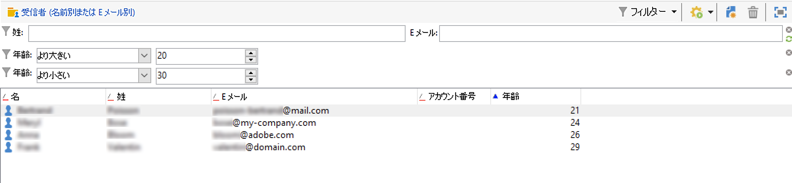

## 詳細フィルター{#advanced-filters}

**詳細フィルター**&#x200B;で複雑な条件を組み合わせます。これらのフィルターを使用して、データに対する複雑なクエリやクエリの組み合わせを作成します。これらのフィルターは、保存して、他の Campaign ユーザーと共有できます。

### 詳細フィルターの作成{#create-adv-filters}

**詳細フィルター**&#x200B;を作成するには、「**[!UICONTROL フィルター]**」ボタンをクリックして「**[!UICONTROL 詳細フィルター...]**」を選択します。

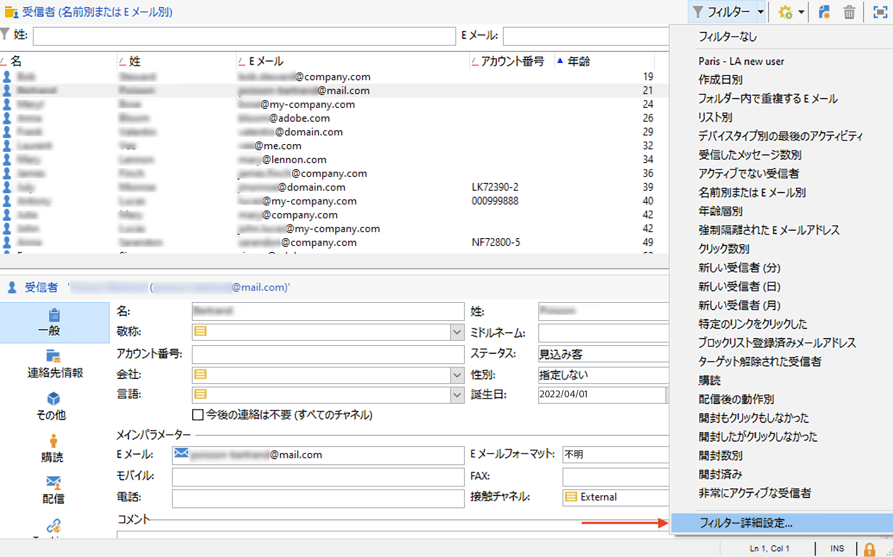

データのリストを右クリックして、「**[!UICONTROL 詳細フィルター...]**」を選択することもできます。

フィルター条件を定義します。次の例では、アカウント番号が NL で始まらず、パリまたはロサンゼルスに住んでいる受信者をフィルターします。

1. 「**[!UICONTROL 式]**」列の「**[!UICONTROL 式を編集]**」アイコンをクリックします。

   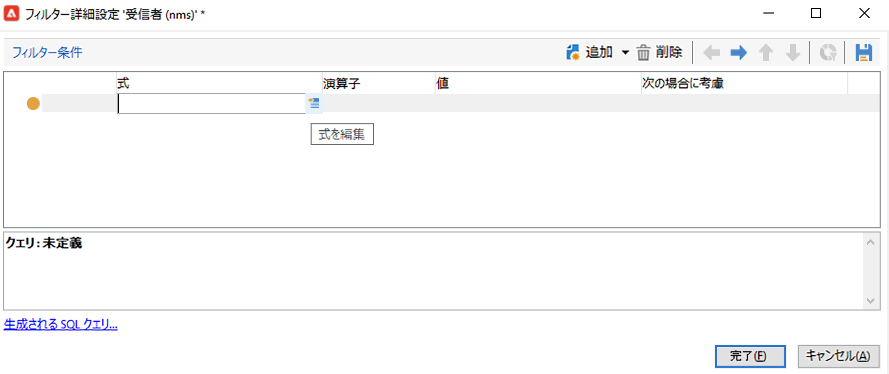

1. フィルターするフィールドを選択します。
1. 適用するオペレーターをドロップダウンリストから選択します。

   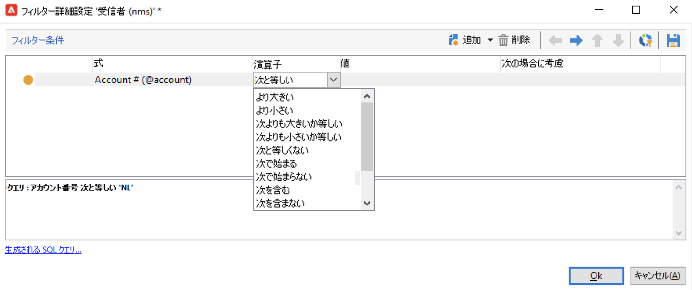

1. 期待される値を「**[!UICONTROL 値]**」列から選択します。複数のフィルターを組み合わせてクエリを絞り込むことができます。フィルター条件を追加するには、「**[!UICONTROL 追加]**」をクリックします。

   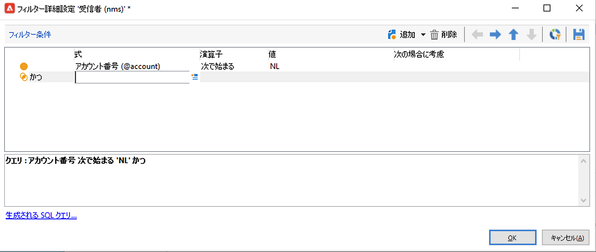

   >[!NOTE]
   >
   >式に階層を割り当てたり、ツールバーの矢印を使用してクエリ式の順序を変更したりすることができます。

1. 式を組み合わせる際に使用できる演算子は、**And**、**Or**、**Except** です。矢印をクリックして「**Or**」に切り替えます。

   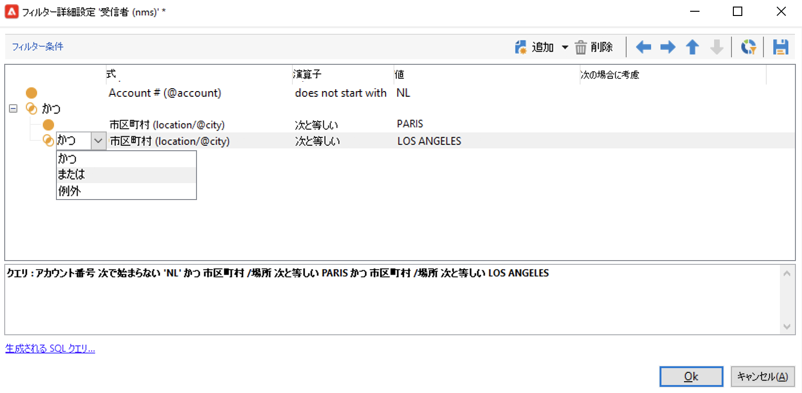

1. 「**[!UICONTROL OK]**」をクリックしてフィルターを作成し、現在のリストに適用します。

適用されるフィルターがリストの上に表示されます。

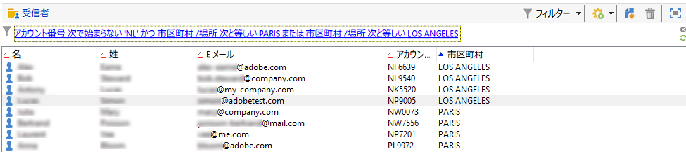

このフィルターを編集または変更するには、リストの上にある青色の説明リンクをクリックします。

### 詳細フィルターの保存{#save-adv-filters}

詳細フィルターを[定義済みフィルター](#predefined-filters)として保存し、他の Campaign ユーザーと再利用および共有できるようにします。

詳細フィルターを保存するには、次の手順に従います。

1. 編集するフィルターの説明をクリックします。
1. ウィンドウの右上のセクションにある「**[!UICONTROL フィルターとして保存]**」アイコンをクリックします。

   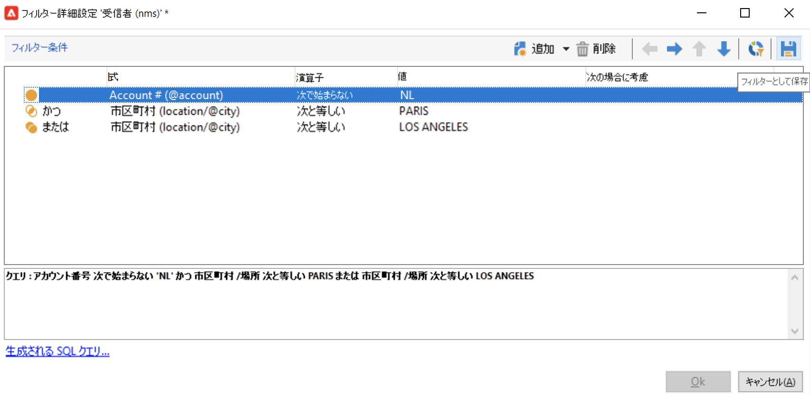

1. このフィルターの名前を入力して保存します。

   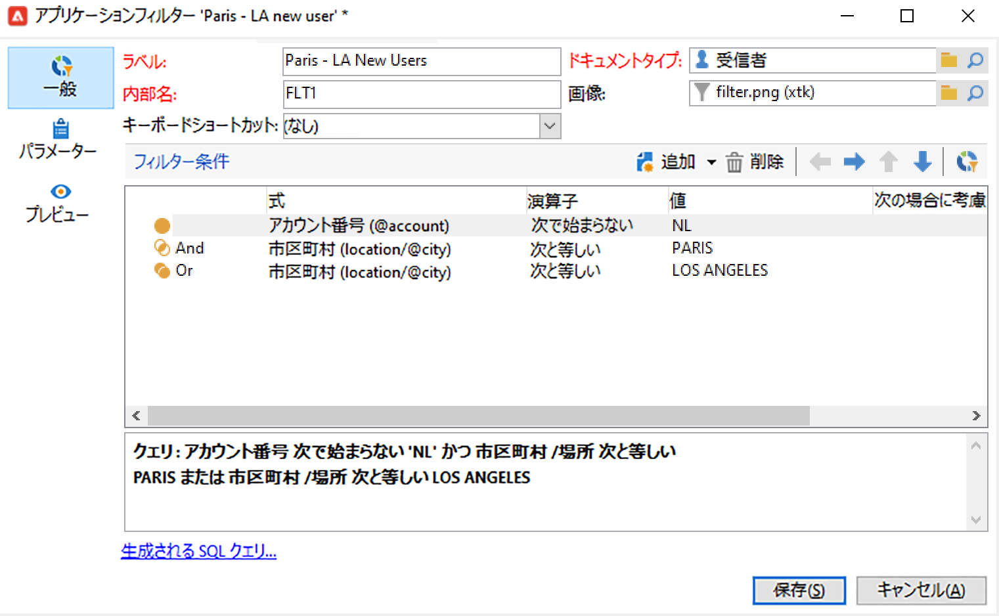

フィルターが[定義済みフィルター](#predefined-filters)に追加されます。このノードから更新できます。

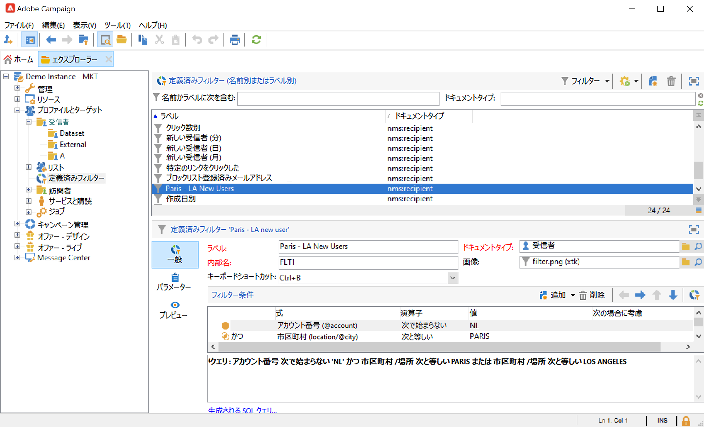

>[!NOTE]
>
>フィルターのショートカットを追加して、キーボードからアクティブにすることができます。

このフィルターは、受信者リストの定義済みフィルターからも使用できます。

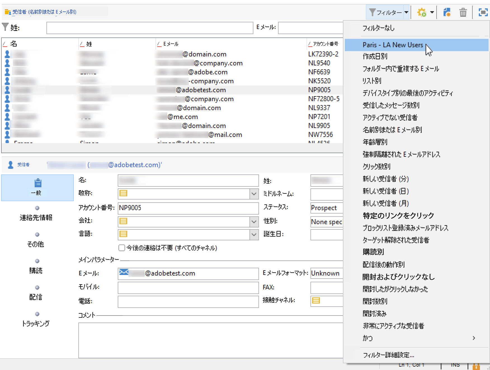

### フィルターを使用したセグメントの定義 {#filter-as-segment}

フィルターを使用したり、組み合わせてターゲット母集団セグメントを作成したりできます。

保存すると、「**[!UICONTROL ユーザーフィルター]**」セクションでメッセージのターゲット母集団を選択するときに詳細フィルターを使用できます。

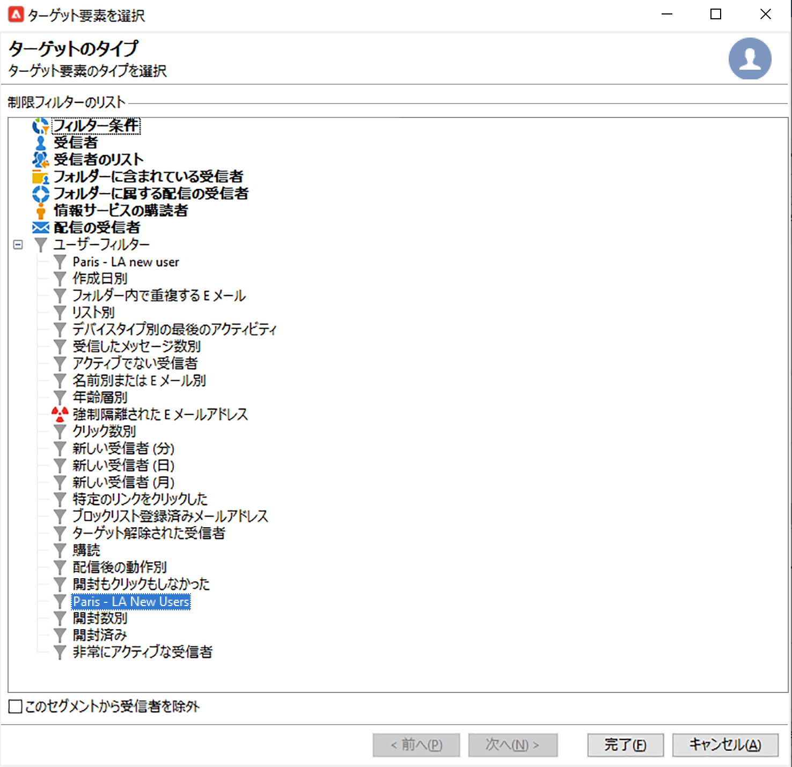

>[!NOTE]
>
>「**[!UICONTROL このセグメントから受信者を除外]**」を使用して、フィルター条件に一致しない連絡先のみをターゲットに設定します。

### 関数を使用した詳細フィルターの作成{#use-functions-adv-filters}

詳細フィルター機能を実行するには、関数を使用してフィルターのコンテンツを定義します。詳細フィルターエディターは、Campaign クエリエディターのすべての機能を利用します。

エンドツーエンドのサンプルで高度なクエリを作成する方法を説明します。

* で単純な受信者属性をターゲットにする方法を説明します。 [このページ](https://experienceleague.adobe.com/docs/campaign/automation/workflows/wf-activities/targeting-activities/query.html).
* 過去 7 日間に連絡されていない受信者を次の期間でフィルタリングする方法を説明します： [このページ](https://experienceleague.adobe.com/docs/campaign/automation/workflows/use-cases/designing-queries/query-many-to-many-relationship.html).
* オペレーターのリストを復元する方法を、「アクティブなアカウント」でフィルタリングする方法について説明します。 [このページ](https://experienceleague.adobe.com/docs/campaign/automation/workflows/use-cases/designing-queries/create-a-filter.html).
* で誕生日の E メールオーディエンスを作成する方法を説明します。  [このページ](https://experienceleague.adobe.com/docs/campaign/automation/workflows/use-cases/deliveries/send-a-birthday-email.html).

### 定義済みフィルターの詳細設定パラメーター {#param-for-data-filters}

定義済みフィルターには、詳細設定パラメーターを使用できます。 これらにアクセスするには、フィルターの「**[!UICONTROL パラメーター]**」タブを参照します。

* このドキュメントタイプに基づくすべてのリストに対してデフォルトでフィルターを表示するには、「**[!UICONTROL 関連付けられたドキュメントタイプのデフォルトのフィルター]**」オプションを選択します。

   例えば、**[!UICONTROL 名前またはログイン別]**&#x200B;フィルターがオペレーターに適用されます。このオプションが選択されているため、フィルターは常にすべてのオペレーターリストに表示されます。

* すべての Campaign オペレーターがフィルターを使用できるようにするには、「**[!UICONTROL 他のオペレーターと共有するフィルター]**」オプションを選択します。

* フィルター条件を選択するフォームを定義するには、「**[!UICONTROL パラメーター入力フォームを使用する]**」オプションを選択します。 このフォームは、「**[!UICONTROL フォーム]**」タブに XML フォーマットで入力する必要があります。例えば、受信者リストから使用可能な組み込みの定義済みフィルター「**[!UICONTROL 開封済み]**」では、フィルターの適用の配信を選択できるフィルターフィールドが表示されます。

* 「**[!UICONTROL 詳細設定パラメーター]**」リンクを使用すると、追加設定を定義できます。

   * SQL テーブルをフィルターに関連付けて、そのテーブルを共有するすべてのエディターでそのフィルターを共通にすることができます。
   * ユーザーがフィルターを上書きしないようにするには、「**[!UICONTROL フィルターを制限しない]**」オプションを選択します。例えば、配信ウィザードで使用できる「配信の受信者」フィルターと「フォルダーに属する配信の受信者」フィルターに対して、このオプションがアクティブになります。 これらのフィルターはオーバーロードできません。
