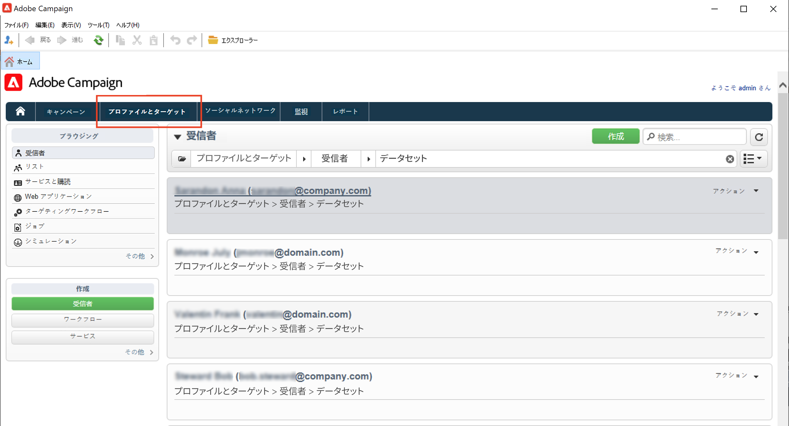
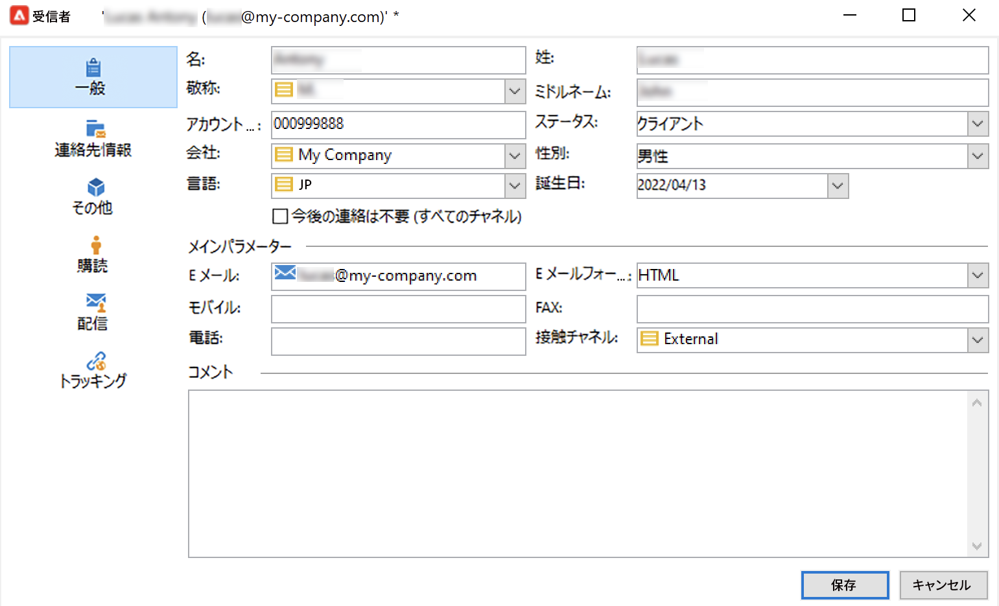

# プロファイルの手動作成{#create-profiles-manual}

Campaign データベースにデータを入力するには、[プロファイルのインポート](import-profiles.md)を行うか、以下に説明するように手動で追加します。

受信者を手動で作成するには、次の手順に従います。

1. 「**[!UICONTROL プロファイルとターゲット]**」タブを参照し、「**[!UICONTROL 受信者]**」カテゴリを選択します。

   

   デフォルトでは、受信者はツリーの&#x200B;**[!UICONTROL プロファイルとターゲット／受信者]**&#x200B;ノードに保存されています。また、このビューから受信者を作成することもできます。

1. 「**[!UICONTROL 作成]**」ボタンをクリックします。
1. プロファイルのデータを入力します。

   

   受信者の組み込みフォームについて詳しくは、[このページ](view-profiles.md#edit-a-profiles)を参照してください。

1. 「**[!UICONTROL 保存]**」をクリックします。プロファイルが Campaign のデフォルトの受信者フォルダーに追加されます。
