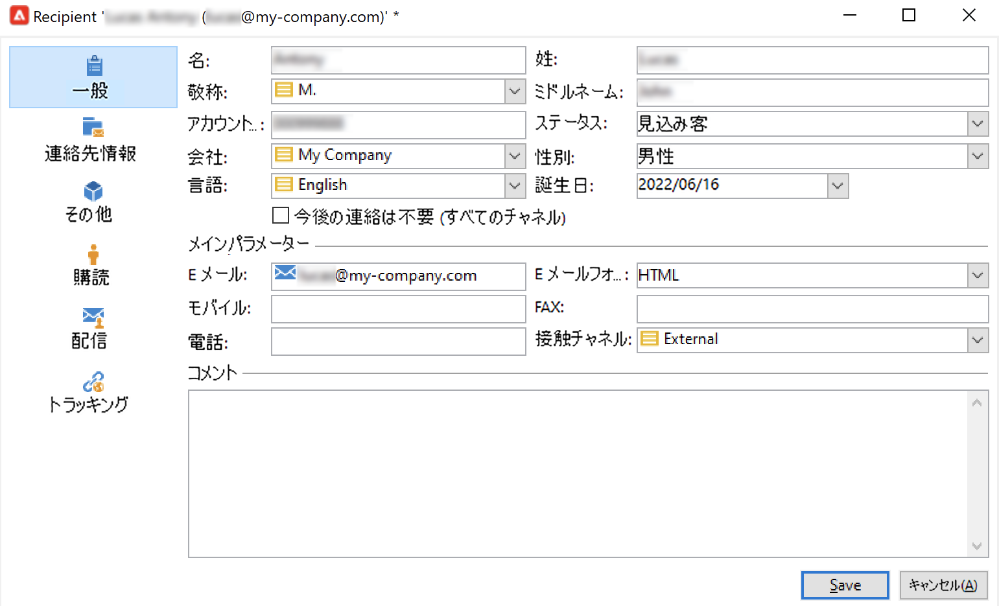

# 手動でのプロファイルの作成{#create-profiles-manual}

Campaign データベースにデータを入力するには、 [プロファイルをインポート](import-profiles.md) または、以下に説明するように、手動で追加します。

受信者を手動で作成するには、次の手順に従います。

1. 参照先 **[!UICONTROL プロファイルとターゲット]** 」タブで「 **[!UICONTROL 受信者]** カテゴリ。

   

   デフォルトでは、受信者はツリーの&#x200B;**[!UICONTROL プロファイルとターゲット／受信者]**&#x200B;ノードに保存されています。また、このビューから受信者を作成することもできます。

1. 次をクリック： **[!UICONTROL 「作成」ボタン]**.
1. プロファイルのデータを入力します。

   

   受信者の組み込みフォームについて詳しくは、 [このページ](view-profiles.md#edit-a-profiles).

1. クリック **[!UICONTROL 保存]**:プロファイルが Campaign のデフォルトの受信者フォルダーに追加されます。
