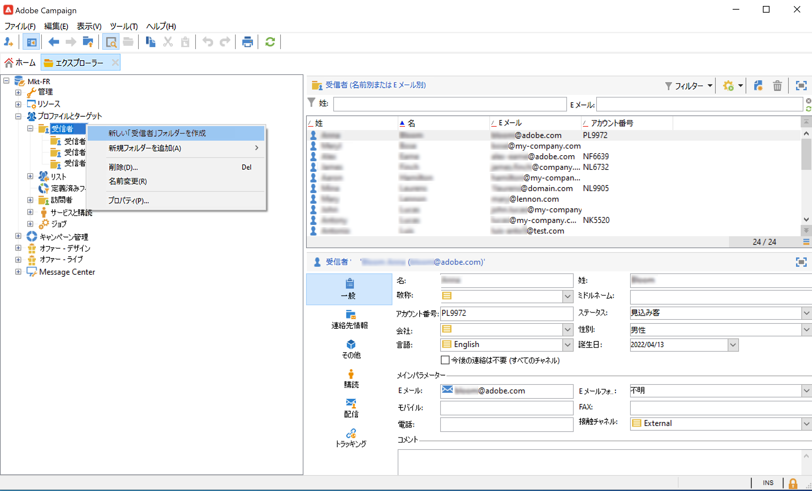
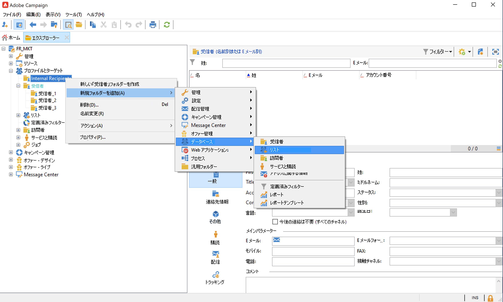
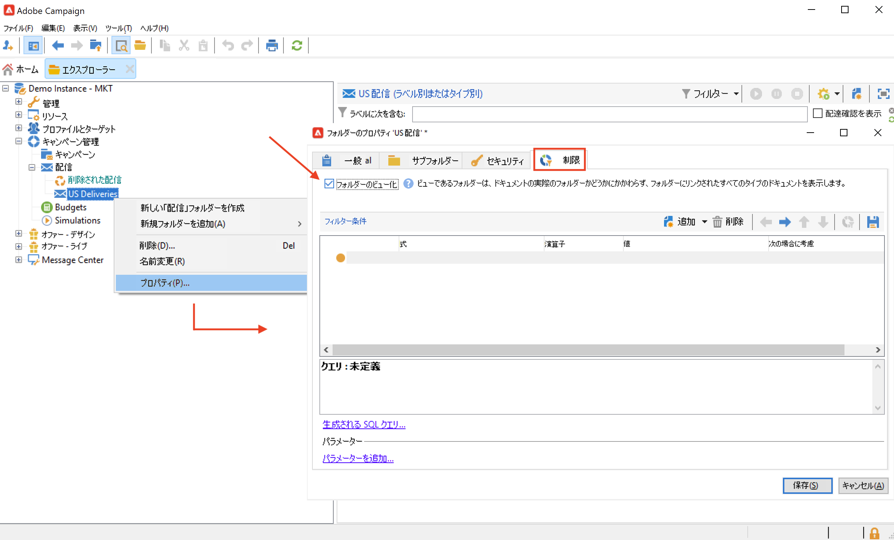
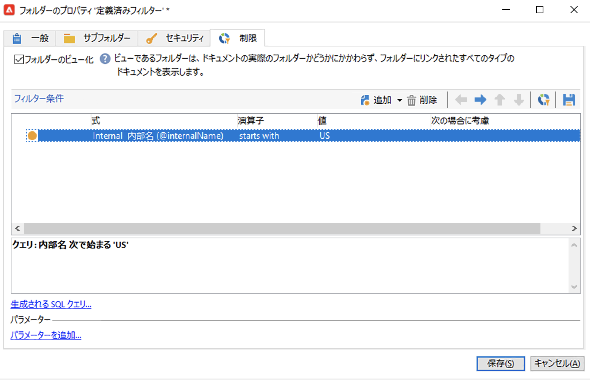
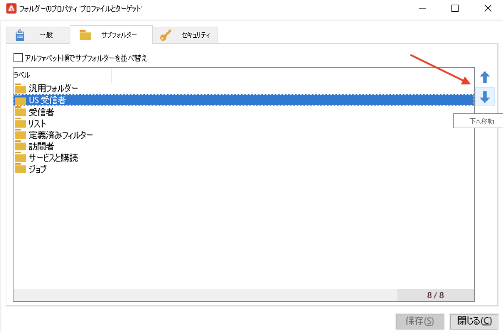
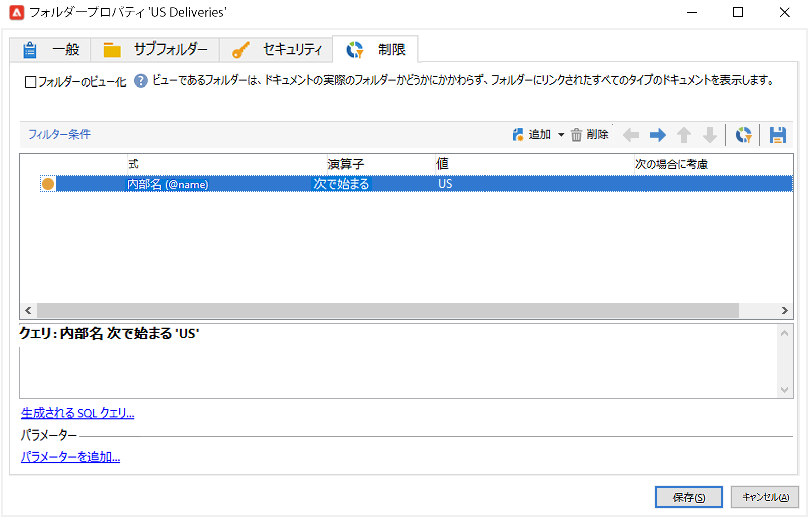
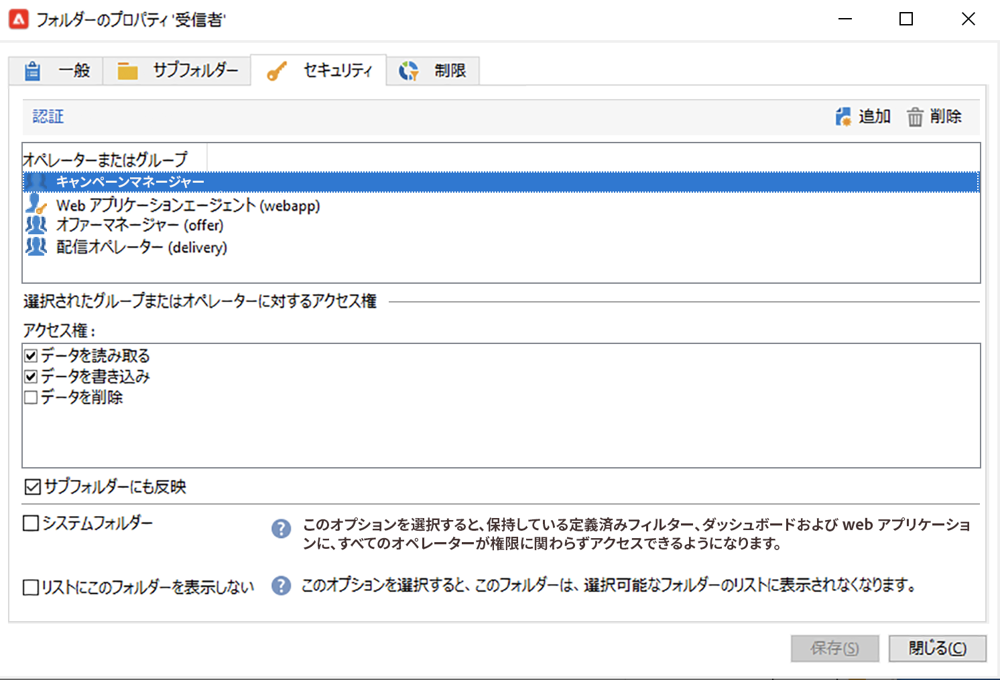

# フォルダーとビューの管理 {#folders-and-views}

Campaign フォルダーは、エクスプローラーツリー内のノードです。タイプに基づいて、特定のタイプのデータが含まれます。

ビューとは、データを含まない特定のフォルダーですが、同じタイプの別のフォルダーに物理的に格納されているデータが表示されます。例えば、配信フォルダーをビューに切り替えた場合、このフォルダーにはすべての配信が表示されます。そのデータにはフィルターを適用することができます。

>[!NOTE]
>ビューと標準フォルダーを区別するために、ビュー名は黒ではなく明るい青で表示されます。

フォルダーに権限を割り当てて、特定のデータへのアクセスを制限できます。[詳細情報](#restrict-access-to-a-folder)

## フォルダーを操作する際のベストプラクティス

* **ビルトインフォルダーを使用**&#x200B;すると、プロジェクトに関与しているすべてのユーザーがアプリケーションを簡単に使用、保守、トラブルシューティングできるようになります。受信者、リスト、配信などのカスタムフォルダー構造を作成するのではなく、**管理**、**プロファイルとターゲット**、**キャンペーン管理**&#x200B;などの標準フォルダーを使用してください。

* **サブフォルダーの作成**&#x200B;を行います。例えば、テクニカルワークフローを組み込みフォルダーの&#x200B;**[!UICONTROL 管理／プロダクション／テクニカルワークフロー]**&#x200B;の下に保存し、ワークフロータイプごとにサブフォルダーを作成します。

* **命名規則の定義と適用**&#x200B;を行います。例えば、ワークフローにアルファベット順に名前を付け、次のように実行順に並べ替えて表示することができます。

   A1 - 受信者のインポート。10:00 から開始します。
A2 - チケットのインポート。11:00 から開始します。

## フォルダーを作成{#create-a-folder}

フォルダーを作成するには、既存のフォルダーを右クリックし、コンテキストメニューを使用します。

選択したフォルダーと同じタイプのフォルダーを作成するには、コンテキストメニューの最初のオプションを選択します。例えば、受信者フォルダーから、「**[!UICONTROL 新しい「受信者」フォルダーを作成]**」を選択します。

新しいフォルダーをドラッグ＆ドロップして、必要に応じて Campaign エクスプローラーツリーを整理できます。

別のタイプのフォルダーを作成するには、既存のフォルダーを右クリックし、「**[!UICONTROL 新しいフォルダーを追加]**」を選択します。格納するデータに応じて、すべてのタイプのフォルダーを作成できます。

>[!CAUTION]
>これらの変更は、すべての Campaign ユーザーに適用されます。

## フォルダーをビューに切り替える{#turn-a-folder-to-a-view}

ビューとは、データを含まない特定のフォルダーですが、同じタイプの別のフォルダーに物理的に格納されているデータが表示されます。

任意のフォルダーをビューに切り替えることはできますが、フォルダーは空にする必要があります。フォルダーをビューに切り替えると、フォルダーに格納されていたデータはすべて削除されます。

>[!CAUTION]
>
>ビューにはデータが表示され、データがビューフォルダーに物理的に格納されていない場合でも、そのデータにアクセスできます。コンテンツにアクセスするには、オペレーターがソースフォルダー内の適切な権限（少なくとも読み取りアクセス権）を持っている必要があります。
>
>ソースフォルダーへのアクセスを許可せずにビューへのアクセスを許可する場合は、ソースフォルダーの親ノードへの読み取りアクセス権を付与しないでください。

以下の例では、米国の配信のみを表示する新しいフォルダーを、内部名に基づいて作成します。

1. **[!UICONTROL 配信]**&#x200B;フォルダーを作成し、「**US 配信**」という名前を付けます。
1. このフォルダーを右クリックし、「**[!UICONTROL プロパティ]**」を選択します。
1. 「**[!UICONTROL 制限]**」タブで、「**[!UICONTROL フォルダーのビュー化]**」を選択します。データベース内にあるすべての配信データが表示されます。

   

1. ウィンドウ中央部のセクションにあるクエリエディターで、フィルター条件を定義します。フィルターに対応する配信のみがフォルダーに表示されます。

   

   >[!NOTE]
   >
   >クエリをデザインする方法については、[このページ](create-filters.md#advanced-filters)を参照してください

>[!CAUTION]
>
>[トランザクションメッセージ](../send/transactional.md)イベントを管理する場合、**[!UICONTROL リアルタイムイベント]**&#x200B;または&#x200B;**[!UICONTROL バッチイベント]**&#x200B;フォルダーを実行インスタンス上の表示として設定しないでください。アクセス許可の問題が発生する可能性があります。

## フォルダーを整理{#organize-your-folders}

デフォルトでは、新しいフォルダーが階層の上部に追加されます。

フォルダープロパティの「**サブフォルダー**」タブを参照し、そのサブフォルダーを整理します。

右側の矢印を使用してフォルダーを移動するか、「**[!UICONTROL サブフォルダーをアルファベット順に並べ替える]**」オプションを使用して自動的に並べ替えることができます。

## フォルダー内のデータのフィルタリング{#filter-data-in-a-folder}

フォルダーに格納されているデータをフィルターするには、フォルダーのプロパティにアクセスし、「制限」タブを選択します。

例えば、以下のフォルダーには、メールアドレスを持ち、接触チャネルが「外部」としてフラグされていない、または空の連絡先のみが含まれます。

## フォルダーへのアクセスを制限する{#restrict-access-to-a-folder}

フォルダーに対する権限を使用して、Campaign データへのアクセスを整理および制御します。

特定の Campaign フォルダーに対する権限を編集するには、次の手順に従います。

1. フォルダーを右クリックし、「**[!UICONTROL プロパティ]**」を選択します。
1. 「**[!UICONTROL セキュリティ]**」タブを参照すると、そのフォルダーに設定されている権限が表示されます。

   

* **グループまたはオペレーターのアクセスを許可する**&#x200B;には、「**[!UICONTROL 追加]**」ボタンをクリックし、このフォルダーに対する権限を割り当てるグループまたはオペレーターを選択します。
* **グループまたはオペレーターのアクセスを禁止する**&#x200B;には、「**[!UICONTROL 削除]**」をクリックし、このフォルダーの認証を削除するグループまたはオペレーターを選択します。
* **グループまたはオペレーターに付与する権利を選択する**&#x200B;には、グループまたはオペレーターを選択し、付与するアクセス権を選択し、その他のアクセス権の選択を解除します。

### 権限の反映 {#propagate-permissions}

権限およびアクセス権を反映させるには、フォルダープロパティの「**[!UICONTROL サブフォルダーにも反映]**」オプションを選択します。

このウィンドウで定義された権限が、現在のノードに属するすべてのサブフォルダーに反映されます。したがって、個々のサブフォルダーに設定された権限は常に無視できます。

>[!NOTE]
>
>フォルダーの「**[!UICONTROL サブフォルダーにも反映]**」オプションのチェックを外しても、サブフォルダーではクリアされません。個々のサブフォルダーに対して明示的にクリアする必要があります。

### すべてのオペレーターへのアクセス権の付与 {#grant-access-to-all-operators}

「**[!UICONTROL セキュリティ]**」タブで、「**[!UICONTROL システムフォルダー]**」を選択すると、権限に関係なく、すべてのオペレーターに対するアクセスが許可されます。

このオプションが選択されていない場合、オペレーターにデータへのアクセスを許可するには、該当するオペレーターまたはグループを認証リストに明示的に追加し直す必要があります。
