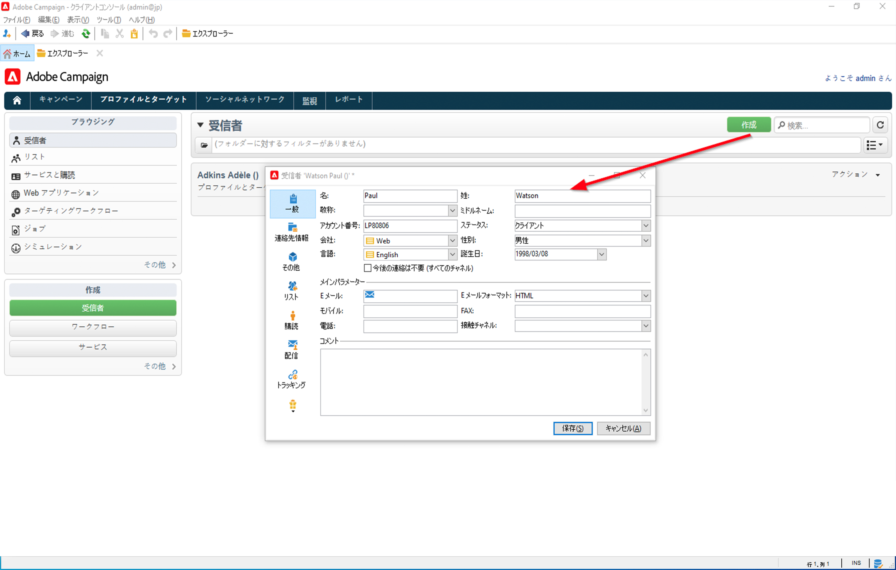

# プロファイルとオーディエンスの基本を学ぶ{#gs-profiles-and-audiences}

プロファイルは、Campaign データベースに格納される連絡先です。顧客、サービスの購読者、見込み客などが含まれます。プロファイルを取得して、このようなデータベースを構築するメカニズムとして、web フォームによるオンライン収集、テキストファイルの手動または自動インポート、会社のデータベースまたは他の情報システムを使用したレプリケーションなどがあります。Adobe Campaign を利用すると、マーケティング履歴、購入情報、好み、CRM データ、関連する個人情報などを統合されたビューに組み込んで分析し、アクションを起こすことができまプロファイルには、個人のターゲティング、選定、トラッキングなどに必要な情報がすべて含まれています。

プロファイルは、**nmsRecipient** テーブルまたは外部テーブル内のレコードで、すべてのプロファイル属性（名、姓、メールアドレス、Cookie ID、顧客 ID、モバイル識別情報、特定のチャネルに関連するその他の情報など）が保存されます。受信者テーブルにリンクされるその他のテーブルには、プロファイルに関連付けられたデータが含まれます。例えば、受信者に送信されたすべての配信記録を含む、配信ログテーブルなどです。ビルトインのプロファイルと受信者テーブルについての詳細は、[この節](../dev/datamodel.md#ootb-profiles)を参照してください。

Adobe Campaign では、**受信者**&#x200B;とは、配信（メール、SMS など）の送信対象となるデフォルトのプロファイルのことです。データベースに保存された受信者データを使用すると、特定の配信を受け取るターゲットをフィルタリングしたり、配信コンテンツにパーソナライズデータを追加したりできます。 データベースには、他のタイプのプロファイルも含まれています。それらのプロファイルは用途が異なります。例えば、シードプロファイルは、配信を最終的なターゲットに送信する前のテスト用に作成されます。

Adobe Campaign にプロファイルデータを入力するには、次の方法を使用できます。

* CRM システムなどの外部データソースから[データファイルを読み込む](../start/import.md)
* 顧客が自分で情報を入力し、自分自身のプロファイルを作成できる [web フォームの作成](../dev/webapps.md)
* プロファイルが格納されている[外部データベースへのマッピング](../connect/fda.md)
* 次のように、クライアントコンソールにプロファイルを手動で入力します。

<!--You can also select your message audience in an external file: recipients are stored not in the database, but in files. These are known as “external” deliveries. These contacts can be imported or not in Adobe Campaign. [Learn more](external-profiles.md).-->
