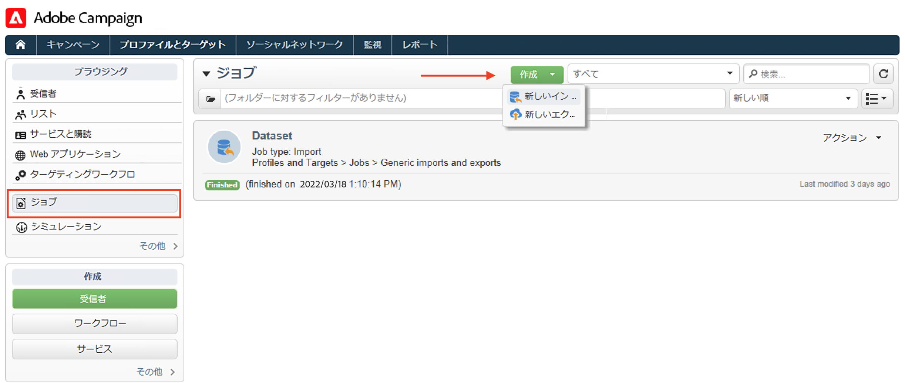

# ファイルからのプロファイルのインポート{#create-profiles}

Campaign データベースにデータを入力するには、 [プロファイルを手動で追加](create-profiles.md) または以下に詳しく説明するようにプロファイルをインポートします。 インポートしたファイルを使用して連絡先データを更新することもできます。

## ワークフローでのプロファイルの読み込み {#import-profiles-with-a-wf}

ワークフローは、一部のインポート処理を自動化する有効な手段になります。データをローカルファイルからインポートするか、SFTP からインポートするかに関係なく、ワークフローを使用してデータ管理手順を標準化することができます。

### リストからのデータの使用：リスト読み込み {#data-from-read-list}

データをファイルに準備および構造化して、ワークフローでインポートします。

ワークフローでのリスト読み込みアクティビティの使用について詳しくは、 [Campaign Classicv7 ドキュメント](https://experienceleague.adobe.com/docs/campaign-classic/using/automating-with-workflows/targeting-activities/read-list.html){target=&quot;_blank&quot;}。

### ファイルからのデータの読み込み {#data-from-a-file}

ワークフロー内で処理されるデータは、Adobe Campaign にインポートできるように、構造化ファイルから抽出することができます。

データの読み込みアクティビティの説明は、 [Campaign Classicv7 ドキュメント](https://experienceleague.adobe.com/docs/campaign-classic/using/automating-with-workflows/action-activities/data-loading--file-.html){target=&quot;_blank&quot;}。

データを収集したら、ワークフローで配信の拡充やデータベースの更新などに使用できます。詳しくは、 [Campaign Classicv7 ドキュメント]https://experienceleague.adobe.com/docs/campaign-classic/using/automating-with-workflows/introduction/how-to-use-workflow-data.htmll){target=&quot;_blank&quot;} を参照してください。

## 1 回限りのインポート{#import-jobs}

Adobe Campaignには、汎用のインポート機能が用意されています。例えば、ターゲット母集団に含まれる顧客や見込み客のリストを抽出したり、外部ファイルからデータベースにデータを提供したりできます。

一般的なインポートは、 **[!UICONTROL プロファイルとターゲット/ジョブ]** メニューを使用します。Adobe Campaignホームページの

一般的なインポートを実行する手順について詳しくは、 [Campaign Classicv7 ドキュメント](https://experienceleague.adobe.com/docs/campaign-classic/using/getting-started/importing-and-exporting-data/generic-imports-exports/about-generic-imports-exports.html?lang=ja){target=&quot;_blank&quot;}。
