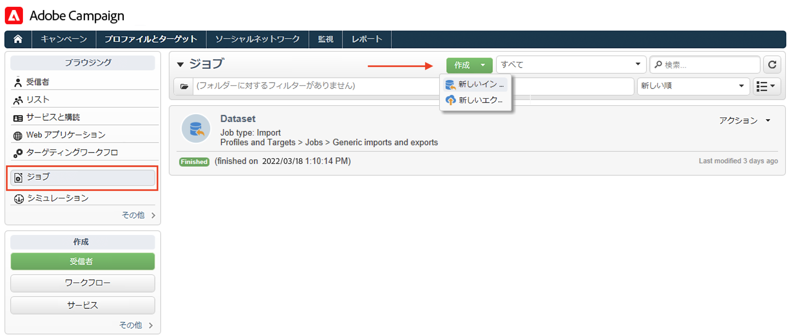

# ファイルからのプロファイルのインポート{#create-profiles}

Campaign データベースにデータを入力するには、[プロファイルを手動で追加](create-profiles.md)を行うか、以下に説明するようにプロファイルをインポートします。 インポートしたファイルを使用して連絡先データを更新することもできます。

## ワークフローでのプロファイルの読み込み {#import-profiles-with-a-wf}

ワークフローは、一部のインポート処理を自動化する有効な手段になります。 データをローカルファイルからインポートするか、SFTP からインポートするかに関係なく、ワークフローを使用してデータ管理手順を標準化することができます。

### リストからのデータの使用：リスト読み込み {#data-from-read-list}

データをファイルに準備および構造化して、ワークフローでインポートします。 [詳細情報](https://experienceleague.adobe.com/docs/campaign/automation/workflows/wf-activities/targeting-activities/read-list.html?lang=ja){target="_blank"}。

### ファイルからのデータの読み込み {#data-from-a-file}

ワークフロー内で処理されるデータは、Adobe Campaign にインポートできるように、構造化ファイルから抽出することができます。 [詳細情報](https://experienceleague.adobe.com/docs/campaign/automation/workflows/wf-activities/action-activities/data-loading--file-.html?lang=ja){target="_blank"}。

データを収集したら、ワークフローで配信の拡充やデータベースの更新などに使用できます。 詳しくは、[この節](https://experienceleague.adobe.com/docs/campaign/automation/workflows/introduction/use-workflow-data.html?lang=ja){target="_blank"}を参照してください。

## 1 回限りのインポート{#import-jobs}

Adobe Campaign には、一般的なインポート機能が用意されています。これにより、例えば、ターゲット母集団の一部になる顧客や見込み客のリストを抽出したり、外部ファイルからデータをデータベースに入力したりすることができます。

一般的なインポートは、Adobe Campaign ホームページの&#x200B;**[!UICONTROL プロファイルとターゲット／ジョブ]**&#x200B;メニューから管理されます。

汎用インポートを実行する手順については、[Campaign Classic v7 ドキュメント &#x200B;](https://experienceleague.adobe.com/docs/campaign-classic/using/getting-started/importing-and-exporting-data/generic-imports-exports/about-generic-imports-exports.html?lang=ja){target="_blank"}を参照してください。
