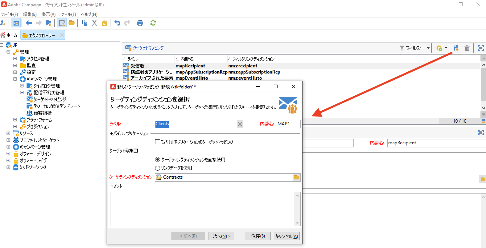
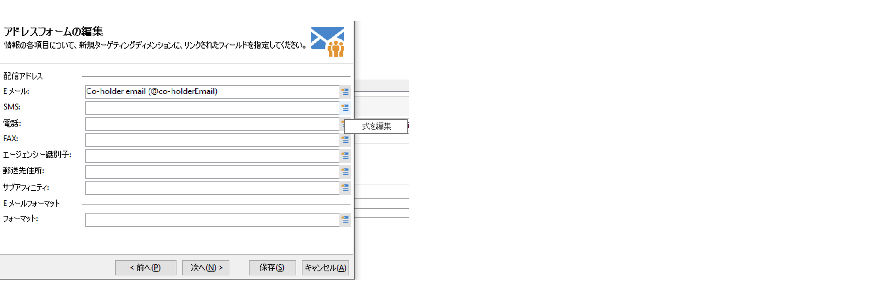
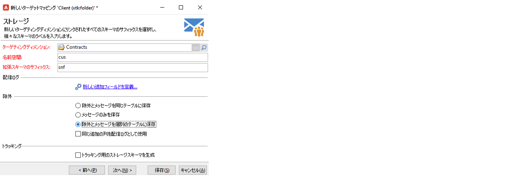
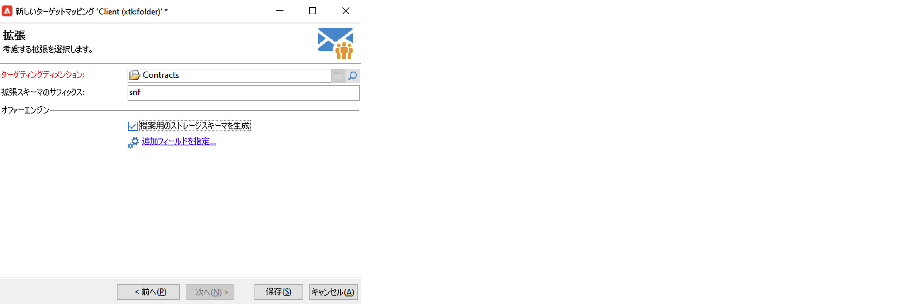

# ターゲットマッピングの操作{#gs-target-mappings}

配信テンプレートのデフォルトのターゲットは「**[!UICONTROL 受信者]**」です。したがって、ターゲットマッピングには **nms:recipient** テーブルのフィールドが使用されます。

他のターゲットマッピングを配信に使用したり、新しいターゲットマッピングを作成したりできます。

## 組み込みのターゲットマッピング {#ootb-mappings}

Adobe Campaign には、次の組み込みのターゲットマッピングが用意されています。

| 名前 | 用途から | スキーマ |
|---|---|---|
| 受信者 | 受信者への配信（組み込みの受信者テーブル） | nms:recipient |
| 訪問者 | 紹介（バイラルマーケティング）などの方法でプロファイルを収集した訪問者への配信 | mns:visitor |
| 購読 | ニュースレターなどの情報サービスを購読している受信者に対する配信 | nms:subscription |
| 訪問者の購読 | 情報サービスを購読している訪問者に対する配信 | nms:visitorSub |
| オペレーター | Adobe Campaign オペレーターに対する配信 | nms:operator |
| 外部ファイル | 配信に必要な情報をすべて含んだファイルを経由しての配信 | リンクされるスキーマなし、入力されるターゲットなし |

## ターゲットマッピングの作成 {#new-mapping}

ターゲットマッピングを作成することもできます。次の場合には、カスタムターゲットマッピングの追加が必要になる場合があります。

* カスタム受信者テーブルの使用
* ターゲットマッピング画面での組み込みのターゲティングディメンションとは異なるフィルタリングディメンションの設定

カスタム受信者テーブルについて詳しくは、[このページ](../dev/custom-recipient.md)を参照してください。

Adobe Campaign ターゲットマッピング作成ウィザードを使用すると、カスタムターゲットマッピングを使用するために必要なすべてのスキーマを作成できます。

1. Adobe Campaign エクスプローラーから、**[!UICONTROL 管理]** `>` **[!UICONTROL キャンペーン管理]** `>` **[!UICONTROL ターゲットマッピング]**&#x200B;を参照します。

1. 新しいターゲットマッピングを作成し、カスタムスキーマをターゲティングディメンションとして選択します。

   

1. プロファイル情報が格納されるフィールド（姓、名、メール、住所など）を指定します。

   

1. 拡張スキーマを識別しやすくするためのサフィックスなど、情報ストレージのパラメーターを指定します。

   

   除外（**excludelog**）をメッセージ付き（**broadlog**）で格納するか、個々のテーブルに格納するかを選択できます。

   この配信マッピングのトラッキングを管理するかどうかを選択することもできます（**trackinglog**）。

1. 次に、考慮する拡張を選択します。拡張機能のタイプは、Campaign の設定とアドオンに応じて異なります。

   

   「**[!UICONTROL 保存]**」ボタンをクリックし、配信マッピングの作成を開始します。リンクされているすべてのテーブルは、選択したパラメーターに基づいて自動的に作成されます。

