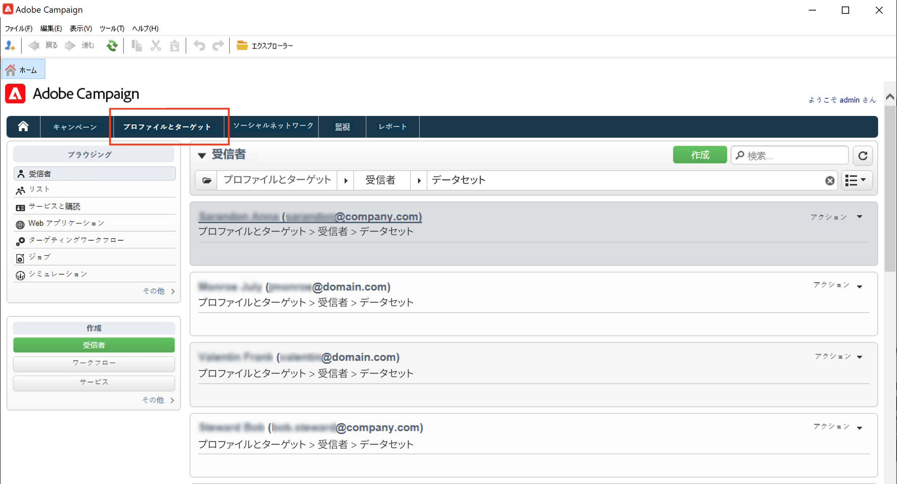

# 既存のプロファイルの表示{#view-profiles}

参照先 **[!UICONTROL プロファイルとターゲット]** Adobe Campaignデータベースに保存されている受信者にアクセスする

このページから、次の操作を実行できます。 [新しい受信者を作成](create-profiles.md)、既存の受信者を編集し、そのプロファイルの詳細にアクセスします。

より高度なプロファイル操作については、 **[!UICONTROL エクスプローラ]** リンクをAdobe Campaignホームページに追加します。

>[!CAUTION]
>
>組み込みの受信者画面は、XML スキーマと、それに関連するフォームを使用して定義されます。 XML スキーマは、 **[!UICONTROL 管理/設定/データスキーマ]** Adobe Campaignエクスプローラーツリーのノード。 これらのスキーマを変更できるのは、エキスパートユーザーのみです。

## プロファイルの編集{#edit-a-profiles}

プロファイルを選択して、新しいタブに詳細を表示します。

プロファイルに関するデータはタブにグループ化されています。これらのタブとその内容は、特定の設定とインストールされているパッケージに応じて異なります。

一般的な組み込みの受信者の場合、次のタブにアクセスできます。

* **[!UICONTROL 一般]**（すべての一般的なプロファイルデータ用） 特に、姓、名、E メールアドレス、E メールフォーマットなどが含まれます。

   このタブには、 **オプトアウト** プロファイルのフラグ：( **[!UICONTROL 今後の連絡は不要（すべてのチャネル）]** 「 」オプションが選択されている場合、プロファイルは「 」オブロックリストンになります。 例えば、受信者がニュースレターの購読解除リンクをクリックした場合、この情報が連絡先データに追加されます。 このような受信者は、どのチャネル（E メール、ダイレクトメールなど）のターゲットにもならなくなりました。 詳しくは、[このページ](../send/quarantines.md)を参照してください。

* **連絡先情報**：選択したプロファイルのダイレクトメールアドレスが含まれます。

   この画面で、住所の品質指標と住所に含まれるエラーの数を確認できます。 この情報は、以前の配信で見つかったエラーの数に基づいて、ダイレクトメールプロバイダーが直接使用します。手動で変更することはできません。

* **その他**&#x200B;必要に応じてパーソナライズし、設定できる特定のフィールド用。

   以下を使用： **[!UICONTROL フィールドのプロパティ…]** コンテキストメニューを使用して、フィールドの名前を変更し、その形式を定義できます。

   

   以下のように新しい設定を入力します。

   

   UI で更新を確認します。

   

   >[!CAUTION]
   >変更はすべての受信者に適用されます。

* **購読**（サービスに対するすべてのアクティブな購読） 以下を使用： **履歴** タブをクリックして、この連絡先の購読と購読解除の詳細にアクセスします。

   

   購読の詳細情報 [この節](../start/subscriptions.md).

* **配信**（選択したプロファイルのすべての配信ログ） 連絡先のマーケティング履歴にアクセスするには、このタブを使用します。すべてのチャネルを通じてプロファイル宛てになる、すべての配信アクションのラベル、日付およびステータス。

* **トラッキング**（選択したプロファイルのすべてのトラッキングログ） この情報は、配信後のプロファイルの行動をトラッキングする場合に使用します。このタブには、配信でトラッキングされたすべての URL の累積合計が表示されます。このリストは設定可能で、通常は次のものが含まれます。クリックされた URL、クリックの日時、および URL を含むドキュメント

   トラッキングの詳細 [この節](../start/tracking.md).

## アクティブなプロファイル {#active-profiles}

アクティブなプロファイルは、請求の対象として考慮されるプロファイルです。

請求に関係するのは、**アクティブ**&#x200B;なプロファイルのみです。過去 12 か月以内にいずれかのチャネルでターゲットになるか通信がおこなわれたプロファイルは、アクティブとみなされます。

複数の配信のターゲットになっているプロファイルは 1 回だけカウントされます。

アクティブなプロファイルの数は、**マーケティングインスタンス**&#x200B;にのみ使用できます。実行インスタンス、すなわち MID（ミッドソーシング）インスタンスおよび RT（Message Center／リアルタイムメッセージング）インスタンスには使用できません。

>[!NOTE]
>
>インスタンスで使用されているアクティブなプロファイル数は、Campaign コントロールパネルから直接監視できます。詳しくは、[Campaign コントロールパネルのドキュメント](https://experienceleague.adobe.com/docs/control-panel/using/performance-monitoring/active-profiles-monitoring.html?lang=ja)を参照してください。
