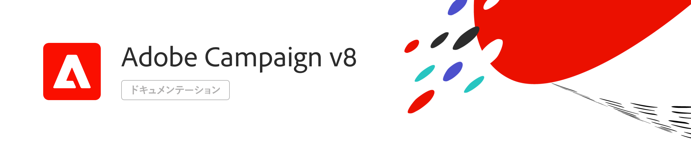

# Adobe Campaign v8 ドキュメント {#campaign-documentation}

## 新機能

* **[[!DNL Adobe Campaign] 自動化ガイド](https://experienceleague.adobe.com/docs/campaign/automation/home.html?lang=ja){target=&quot;_blank&quot;}** - ワークフローとキャンペーンの作成方法を説明します

* **[ [!DNL Adobe Campaign]](start/get-started.md)**&#x200B;とは - 主な機能とユースケース

* **[v8 の新機能](start/whats-new.md)** - Campaing v8 の機能を確認します

* **[実装ガイド](start/implement.md)** - 実装方法を説明します

* **[v7 から v8 へ](start/v7-to-v8.md)** - Campaign Classic を v7 から v8 へ移行します主な違いを学ぶ

* **[Campaign v8 のコントロールパネル](https://experienceleague.adobe.com/docs/control-panel/using/discover-control-panel/key-features.html?lang=ja){target=&quot;_blank&quot;}** - Campaign コントロールパネルを使用して、自分で主要な管理者タスクを実行できます

* **[リリースノート](start/release-notes.md)** - 最新の機能と改善点を確認できます

## 基本を学ぶ

<table>
<tr>
  <td valign="bottom">
    
    

    <a href="start/connect.md">Campaign への接続</a>
    

     
  </td>

<td valign="bottom">
      
    
<a href="start/import.md">プロファイルの読み込み</a>
    

     
  </td>
  <td valign="bottom">
    
    

    <a href="start/create-message.md">メールの作成</a>
    

     
  </td>
</tr>
</table>

## その他のリソース

* [ガードレールと制限](start/ac-guardrails.md)
* [アーキテクチャ](architecture/architecture.md)
* [測定とトラッキング](start/reporting.md)
* [他のソリューションとの連携](connect/integration.md)
* [Campaign v8 に関する FAQ](start/campaign-faq.md)
* [Adobe Campaign v8 製品説明](https://helpx.adobe.com/jp/legal/product-descriptions/adobe-campaign-managed-cloud-services.html){target=&quot;_blank&quot;}
