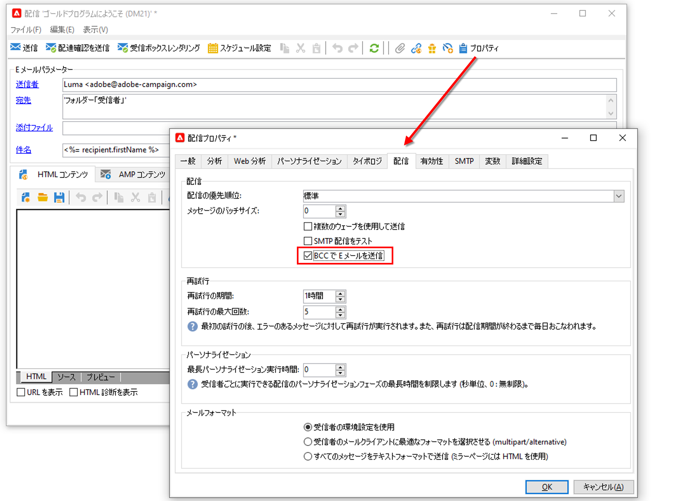

# Campaign メールチャネルの設定

## BCC でメールを送信 {#email-bcc}

<!--
>[!NOTE]
>
>This capability is available starting Campaign v8.3. To check your version, refer to [this section](../start/compatibility-matrix.md#how-to-check-your-campaign-version-and-buildversion)-->

プラットフォームから送信された電子メールのコピーを保持するように Adobe Campaign を設定できます。

Adobe Campaign 自体はアーカイブされたファイルを管理しません。これにより、選択したメッセージを専用の BCC（ブラインドカーボンコピー）アドレスに送信し、外部システムを使用して処理およびアーカイブできます。送信された電子メールに対応する .eml ファイルは、SMTP 電子メールサーバーなどのリモートサーバーに転送できます。

>[!CAUTION]
>
>プライバシー上の理由から、BCC 電子メールは、個人の身元を特定できる情報（PII）を安全に保存できるアーカイブシステムで処理する必要があります。

アーカイブ先は選択した BCC メールアドレスです。配信の受信者には表示されません。

 Managed Cloud Services ユーザーは、[アドビに問い合わせて](../start/campaign-faq.md#support){target=&quot;_blank&quot;}アーカイブに使用する BCC メールアドレスを確認します。

BCC メールアドレスを定義したら、配信レベルで専用オプションを有効にする必要があります。

>[!CAUTION]
>
>新しい配信または配信テンプレートを作成する場合、**[!UICONTROL BCC でメールを送信]**&#x200B;はデフォルトで有効になっていません。メール配信または配信テンプレートで手動で有効にする必要があります。

これを行うには、次の手順に従います。

1. **[!UICONTROL キャンペーン管理]**／**[!UICONTROL 配信]**&#x200B;または&#x200B;**[!UICONTROL リソース]**／**[!UICONTROL テンプレート]**／**[!UICONTROL 配信テンプレート]**&#x200B;に移動します。
1. 目的の配信を選択します。または、標準の **[!UICONTROL E メール配信]**&#x200B;テンプレートを複製して、複製されたテンプレートを選択します。
1. 「**[!UICONTROL プロパティ]**」ボタンをクリックします。
1. 「**[!UICONTROL 配信]**」タブを選択します。
1. 「**[!UICONTROL BCC でメールを送信]**」オプションを選択します。

   

1. 「**[!UICONTROL OK]**」を選択します。

このテンプレートに基づく各配信に対するすべての送信済みメッセージのコピーが、設定された「BCC でメールを送信」アドレスに送信されます。

次の特性と推奨事項に注意してください。

* BCC に設定できるメールアドレスは 1 つだけです。

* BCC アドレスに、送信されるすべてのメールをアーカイブするだけの受信容量があることを確認します。

* BCC でメールを送信<!--with Enhanced MTA-->は、受信者に配信する前に BCC メールアドレスに配信することで、元の配信がバウンスした場合でも BCC メッセージが送信される可能性があります。バウンスについて詳しくは、[配信エラーについて](../send/delivery-failures.md)を参照してください。

* BCC アドレスに送信されたメールが開封され、クリックされた場合は、送信分析の&#x200B;**[!UICONTROL 合計開封数]**&#x200B;と&#x200B;**[!UICONTROL クリック数]**&#x200B;に含められるため、計算の誤りの原因となる可能性があります。

<!--Only successfully sent emails are taken in account, bounces are not.-->

詳しくは、**Campaign Classic v7 ドキュメント**&#x200B;を参照してください

* [ミラーページの生成](https://experienceleague.adobe.com/docs/campaign-classic/using/sending-messages/sending-emails/sending-an-email/email-parameters.html?lang=ja#generating-mirror-page){target=&quot;_blank&quot;}

* [メールフォーマットの選択](https://experienceleague.adobe.com/docs/campaign-classic/using/sending-messages/sending-emails/sending-an-email/email-parameters.html?lang=ja#selecting-message-formats){target=&quot;_blank&quot;}

* [文字エンコーディングの選択](https://experienceleague.adobe.com/docs/campaign-classic/using/sending-messages/sending-emails/sending-an-email/email-parameters.html?lang=ja#character-encoding){target=&quot;_blank&quot;}

* [バウンスメールアドレスの設定](https://experienceleague.adobe.com/docs/campaign-classic/using/sending-messages/sending-emails/sending-an-email/email-parameters.html?lang=ja#managing-bounce-emails){target=&quot;_blank&quot;}

* [メール配信テンプレートの使用](https://experienceleague.adobe.com/docs/campaign-classic/using/sending-messages/using-delivery-templates/about-templates.html?lang=ja){target=&quot;_blank&quot;}

* [配信エラーについて](https://experienceleague.adobe.com/docs/campaign-classic/using/sending-messages/monitoring-deliveries/understanding-delivery-failures.html?lang=ja){target=&quot;_blank&quot;}
