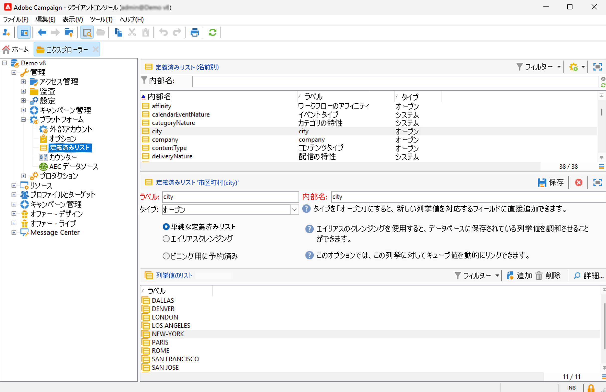
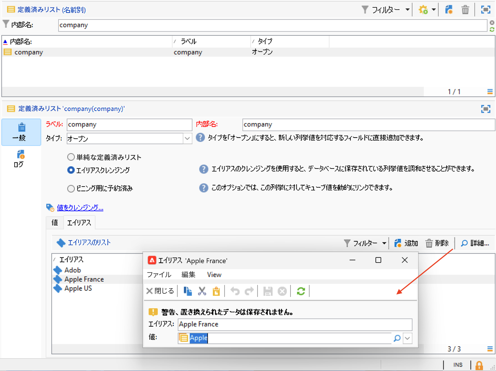

# 列挙の操作 {#enumerations}

定義済みリスト（定義済みリストとも呼ばれます）とは、特定のフィールドに入力するために使用できる値の事前定義済みリストです。 列挙はフィールド値の標準化に役立ち、データ入力の一貫性を高め、クエリを簡素化します。

定義すると、値がドロップダウンリストに表示されます。 値は、直接選択することも、予測入力を使用して入力することもできます。予測入力では、一致するエントリを提案して完了します。 一部のフィールドには定義済みの列挙が含まれており、必要に応じて追加の列挙を作成できます。

## 列挙のタイプ {#types-of-enum}

列挙は、エクスプローラーの&#x200B;**[!UICONTROL 管理／プラットフォーム／列挙]**&#x200B;フォルダーに格納されています。

定義済みリストには、**Open**、**System**、**Emoticon** または **Closed** があります。

* **オープン**&#x200B;列挙を使用すると、ユーザーはこの列挙に基づいてフィールドに新しい値を直接追加できます。
* **クローズド**&#x200B;列挙には、エクスプローラーの&#x200B;**[!UICONTROL 管理／プラットフォーム／列挙]**&#x200B;フォルダーからのみ変更できる値の固定リストがあります。
* **顔文字**&#x200B;列挙を使用すると、顔文字リストを更新できます。詳細情報
* **システム**&#x200B;列挙は、システムフィールドに関連付けられており、内部名が付いています。

**オープン**&#x200B;および&#x200B;**クローズド**&#x200B;の列挙では、次の特定のオプションを使用できます。

* **単純な列挙**&#x200B;は、デフォルトの標準タイプです。
* **エイリアスのクレンジング**&#x200B;列挙を使用すると、データベースに保存されている列挙値を調和させることができます。[詳細情報](#alias-cleansing)
* **ビニング用に予約済み**&#x200B;は、この列挙にキューブ値をリンクできるオプションです。[詳細情報](../reporting/gs-cubes.md)

## エイリアスクレンジング {#alias-cleansing}

列挙フィールドでは、値はドロップダウンリストから選択することも、リストに存在しない場合は手動で入力することもできます。 「**[!UICONTROL 開く]** オプションが有効な場合、カスタム値を列挙に追加できます。 これらの値は、後でエイリアスクレンジングを通じて標準化できます。このクレンジングでは、バリエーションを正しい用語に自動的に置き換えます（例えば、`Adob` を `Adobe` に変換するなど）。

>[!CAUTION]
>
>データクレンジングは、データベース値に影響を与える重要な操作です。 Adobe Campaignはデータの一括更新を実行するので、特定の値が削除される可能性があります。 この操作は、エキスパートユーザーのみを対象としています。

列挙にデータクレンジング機能を使用するには、「**[!UICONTROL エイリアスクレンジング]**」オプションを有効にします。このオプションを選択すると、ウィンドウの下部に「**[!UICONTROL エイリアス]**」タブが表示されます。

ユーザーがエイリアスクレンジングの列挙に存在しない値を入力すると、**値**&#x200B;リストに追加されます。[これらの値からエイリアスを作成](#convert-to-alias)するか、[ゼロから新しいエイリアスを作成](#create-alias)することができます。

### エイリアスの作成{#create-alias}

エイリアスを作成するには、次の手順に従います。

1. 「**[!UICONTROL エイリアス]**」タブの「**[!UICONTROL 追加]**」ボタンをクリックします。
1. 変換元となるエイリアスを入力し、ドロップダウンリストで適用する値を選択します。

   

1. 「**[!UICONTROL OK]**」をクリックして確定します。

1. 変更内容を保存します。値の置換は、毎晩実行される&#x200B;**エイリアスクレンジング**&#x200B;ワークフローによって実行されます。[データクレンジングの実行](#running-data-cleansing)を参照してください。

この列挙に基づくすべてのフィールドについて、ユーザーが（Adobe Campaign クライアントコンソールの web フォームの）「会社」フィールドに「**Adob**」と入力すると、**Adobe** という値に自動置換されます。

### 誤った値をエイリアスに変換{#convert-to-alias}

また、既存の列挙値をエイリアスに変換することもできます。次の手順を実行します。

1. 列挙の値のリストで、右クリックし、**[!UICONTROL アクション…／値をエイリアスに変換…]** を参照します。

   

1. エイリアスに変換する値を選択し、「**[!UICONTROL 次へ]**」をクリックします。
1. 「**[!UICONTROL 開始]**」をクリックして変換を実行します。

   実行が完了すると、エイリアスが「**エイリアス**」タブのリストに追加されます。正しい値を関連付けて、誤ったエントリを置き換えることができます。次の手順を実行します。

1. 削除する値を選択します。
1. 「**詳細...**」ボタンをクリックします。
1. ドロップダウンリストで新しい値を選択します。

   

>[!NOTE]
>
>「**[!UICONTROL エイリアス]**」サブタブの&#x200B;**[!UICONTROL ヒット]**&#x200B;列でエイリアスの発生を追跡できます。この値が入力された回数を表示できます。[詳細情報](#calculate-entry-occurrences)。

### データクレンジングの実行 {#running-data-cleansing}

データクレンジングは&#x200B;**[!UICONTROL エイリアスクレンジング]**&#x200B;ワークフローによって実行されます。デフォルトでは毎日実行されます。

また、「**[!UICONTROL 値をクレンジング]**」リンクでは、クレンジングの実行をトリガーすることもできます。

「**[!UICONTROL 詳細設定パラメーター]**」リンクでは、収集される値を処理対象にし始める日付を設定できます。

「**[!UICONTROL 開始]**」ボタンをクリックすると、データクレンジングが実行されます。

### 発生件数の監視 {#calculate-entry-occurrences}

列挙の「**[!UICONTROL エイリアス]**」サブタブでは、入力されたすべての値の中に特定のエイリアスが含まれていた回数を表示できます。この情報は推定値であり、「**[!UICONTROL ヒット数]**」列に表示されます。

>[!CAUTION]
>
>エイリアスの入力回数を計算するには、長い時間が必要となる場合があります。
>

「**[!UICONTROL 値をクレンジング]**」リンクを使用すると、ヒット数の計算を手動で実行することもできます。これを行うには、「**[!UICONTROL 詳細設定パラメーター...]**」リンクをクリックし、オプションを選択します。

* 「**[!UICONTROL エイリアスヒット数を更新]**」：入力された日付に基づいて、既に計算済みのヒット数を更新する場合に選択します。
* 「**[!UICONTROL 開始からのエイリアスのヒット数を再計算]**」：Adobe Campaign プラットフォーム全体に対して計算処理を実行する場合に選択します。

指定した期間について計算を自動実行する（例：週に 1 回）ための専用ワークフローを作成することもできます。

そのためには、**[!UICONTROL エイリアスクレンジング]**&#x200B;ワークフローのコピーを作成し、スケジューラーを変更して、**[!UICONTROL 列挙値のクレンジング]**&#x200B;で次の設定を使用します。

* **-updateHits**：エイリアスのヒット数を更新する場合
* **-updateHits:full**：すべてのエイリアスヒットを再計算します。
