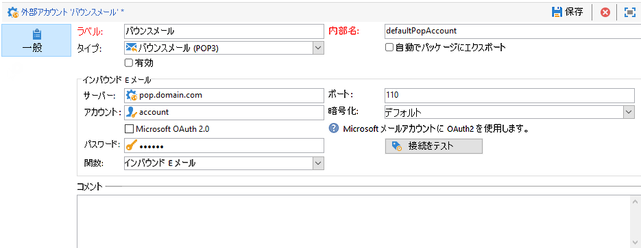
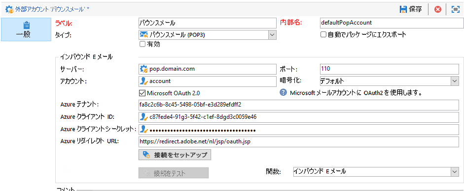

# 外部アカウントの設定

Adobe Campaign には、事前に定義された一連の外部アカウントが付属しています。外部システムとの接続を設定する場合は、新しい外部アカウントを作成します。

外部アカウントは、テクニカルワークフローやキャンペーンワークフローなどの技術プロセスで使用されます。例えば、ワークフローにおけるファイル転送や、他のアプリケーション（Adobe Target、Experience Manager など）とのデータ交換などをセットアップする場合、外部アカウントを選択する必要がありす。

Adobe Campaign **[!UICONTROL エクスプローラー]**&#x200B;から外部アカウントにアクセスできます。**[!UICONTROL 管理]** `>` **[!UICONTROL Platform]** `>` **[!UICONTROL 外部アカウント]**&#x200B;を参照します。


>[!CAUTION]
>
>[エンタープライズ（FFDA）デプロイメント](../architecture/enterprise-deployment.md)のコンテキストでは、特定の&#x200B;**[!UICONTROL フル FDA]**（ffda）外部アカウントは、Campaign ローカルデータベースと Cloud データベース（[!DNL Snowflake]）との接続を管理します。
></br>Managed Cloud Services のユーザー場合、この外部アカウントは、お使いのインスタンス用にアドビが設定します。これは変更できません。

## Campaign 固有の外部アカウント

次の技術アカウントは、Adobe Campaign で特定のプロセスを有効にして実行するために使用されます。

 Managed Cloud Services ユーザーの場合、アドビは、Campaign 固有の外部アカウントすべてを設定します。

### バウンスメール {#bounce-mails-external-account}

>[!NOTE]
>
>POP3 機能の Microsoft Exchange Online OAuth 2.0 認証は、Campaign v8.3 以降で使用できます。お使いのバージョンを確認するには、[この節](../start/compatibility-matrix.md#how-to-check-your-campaign-version-and-buildversion)を参照してください。

**バウンスメール**&#x200B;外部アカウントで、メールサービスの接続に使用する外部 POP3 アカウントを指定します。POP3 アクセス用に設定されたすべてのサーバーは、返信メールの受信に使用できます。

インバウンド電子メールについて詳しくは、 [Campaign Classic v7 ドキュメント](https://experienceleague.adobe.com/docs/campaign-classic/using/automating-with-workflows/event-activities/inbound-emails.html?lang=ja)を参照してください。{target=&quot;_blank&quot;}



**[!UICONTROL バウンスメール（defaultPopAccount）]**&#x200B;外部アカウントを設定するには、次の手順を実行します。

* **[!UICONTROL サーバー]**

   POP3 サーバーの URL。

* **[!UICONTROL ポート]**

   POP3 接続のポート番号デフォルトのポート番号は 110 です。

* **[!UICONTROL アカウント]**

   ユーザーの名前。

* **[!UICONTROL パスワード]**

   アカウントのパスワード

* **[!UICONTROL 暗号化]**

   **[!UICONTROL デフォルト]**、**[!UICONTROL POP3 + STARTTLS]**、**[!UICONTROL POP3]** または **[!UICONTROL POP3S]** から選択した暗号化のタイプ。**バウンスメール**&#x200B;外部アカウントで、メールサービスの接続に使用する外部 POP3 アカウントを指定します。POP3 アクセス用に設定されたすべてのサーバーは、返信メールの受信に使用できます。

* **[!UICONTROL 関数]**

   インバウンドメールまたは SOAP ルーター



>[!IMPORTANT]
>
>Microsoft OAuth 2.0 を使用して POP3 外部アカウントを設定する前に、まず Azure portal にアプリケーションを登録する必要があります。詳しくは、この[ページ](https://docs.microsoft.com/ja-jp/azure/active-directory/develop/quickstart-register-app)を参照してください。

Microsoft OAuth 2.0 を使用して POP3 外部を設定するには、「**[!UICONTROL Microsoft OAuth 2.0]**」オプションをチェックし、次のフィールドに入力します。

* **[!UICONTROL Azure テナント]**

   Azure ID（またはディレクトリ（テナント）ID）は、Azure portal のアプリケーションの概要の「**初期設定**」ドロップダウンで確認できます。

* **[!UICONTROL Azure クライアント ID]**

   クライアント ID（またはアプリケーション（クライアント）ID）は、Azure portal のアプリケーションの概要の「**初期設定**」ドロップダウンで確認できます。

* **[!UICONTROL Azure クライアントシークレット]**：

   クライアントシークレット ID は、Azure portal のアプリケーションの&#x200B;**証明書と秘密鍵**&#x200B;メニューから、「**クライアントシークレット**」列で確認することができます。

* **[!UICONTROL Azure リダイレクト URL]**：

   リダイレクト URL は Azure portal のアプリケーションの&#x200B;**認証**&#x200B;メニューで確認することができます。次の構文で `nl/jsp/oauth.jsp` 終わる必要があります。例：`https://redirect.adobe.net/nl/jsp/oauth.jsp`。

別の資格情報を入力した後、**[!UICONTROL 接続の設定]**&#x200B;をクリックして、外部アカウントの設定を完了できます。

### ルーティング {#routing}

**[!UICONTROL ルーティング]**&#x200B;外部アカウントを使用すると、インストールしているパッケージに応じて、Adobe Campaign で利用可能な各チャネルを設定できます。

>[!CAUTION]
>
>Adobe Campaign v8 では&#x200B;**[!UICONTROL 内部電子メール配信ルーティング]**（defaultEmailBulk）外部アカウントを、有効に&#x200B;**しないでください**。

### 実行インスタンス {#execution-instance}

トランザクションメッセージのコンテキストでは、実行インスタンスはコントロールインスタンスにリンクされ、接続されます。トランザクションメッセージテンプレートは、実行インスタンスにデプロイされます。

 Message Center のアーキテクチャについて詳しくは、[このページ](../architecture/architecture.md#transac-msg-archi)を参照してください。

## 外部システムの外部アカウントへのアクセス

* **外部データベース（FDA）**

   **外部データベース**&#x200B;タイプの外部アカウントを使用して、FDA 経由で外部データベースに接続します。

   Adobe Campaign v8 と互換性のある外部データベースは、[互換性マトリックス](../start/compatibility-matrix.md)に記載されています。

   Federated Data Access（FDA）オプションについて詳しくは、[この節](../connect/fda.md)を参照してください。

## Adobe ソリューション統合外部アカウント

* **Adobe Experience Cloud**

   **[!UICONTROL Adobe Experience Cloud]** 外部アカウントは、Adobe IMS を実装して Adobe ID で Adobe Campaign コンソールに接続するために使用されます。

    Adobe Identity Management Service（IMS）について詳しくは、[この節](../start/connect.md#connect-ims)を参照してください。

* **Web 分析**

   Adobe Analytics から Adobe Campaign へのデータ転送を設定するには、**[!UICONTROL Web 分析（Adobe Analytics）]**&#x200B;外部アカウントを使用します。

   Adobe Campaign と Adobe Analytics の統合について詳しくは、[このページ](../connect/ac-aa.md)を参照してください。

    Managed Cloud Services のユーザーとして Adobe Analytics を Campaign と統合する場合は、[アドビにお問い合わせ](../start/campaign-faq.md#support)ください。

   * **Adobe Experience Manager**
   **[!UICONTROL AEM]** 外部アカウントを使用すれば、メール配信とフォームのコンテンツを Adobe Experience Manager で直接管理できます。

   Adobe Campaign と Adobe Analytics の統合について詳しくは、[このペ ージ](../connect/ac-aem.md)を参照してください。

    Managed Cloud Services ユーザーとして Adobe Experience Manager を Adobe Campaign と統合する場合は、[アドビにお問い合わせ](../start/campaign-faq.md#support)ください。


## CRM コネクタの外部アカウント

* **Microsoft Dynamics CRM**

   **[!UICONTROL Microsoft Dynamics CRM]** 外部アカウントを使用すると、Microsoft Dynamics データを Adobe Campaign に読み込みおよび書き出しできます。

   Adobe Campaign と Microsoft Dynamics CRM の統合について詳しくは、[このページ](../connect/ac-ms-dyn.md)を参照してください。

* **Salesforce.com**

   **[!UICONTROL Salesforce CRM]** 外部アカウントを使用すれば、Adobe Campaign から Salesforce データをインポートおよびエクスポートできます。

   Adobe Campaign と Salesforce.com CRM の統合について詳しくは、[このページ](../connect/ac-sfdc.md)を参照してください。

## データ転送外部アカウント

これらの外部アカウントは、**[!UICONTROL ファイル転送]**&#x200B;ワークフローアクティビティを使用した、Adobe Campaign へのデータの読み込みまたは書き出しに使用できます。

ワークフローでのファイル転送について詳しくは、 [Campaign Classic v7 ドキュメント](https://experienceleague.adobe.com/docs/campaign-classic/using/automating-with-workflows/event-activities/file-transfer.html?lang=ja)を参照してください{target=&quot;_blank&quot;}

* **FTP と SFTP**

   **FTP** 外部アカウントを使用すれば、Adobe Campaign 外でサーバーへのアクセスを設定およびテストできます。外部システム（ファイル転送に使用される SFTP サーバーや FTP サーバー 898 など）との接続をセットアップするために、独自の外部アカウントを作成できます。これをおこなうには、SFTP サーバーまたは FTP サーバーへの接続を確立するために使用するアドレスと資格情報を、この外部アカウントで指定します。

* **Amazon Simple Storage Service（S3）**

   **AWS S3** コネクタは、**[!UICONTROL ファイル転送]**&#x200B;ワークフローアクティビティを使用して、Adobe Campaign へのデータの読み込みまたは書き出しをおこなうために使用できます。この新規外部アカウントを設定する際には、次の情報を提供する必要があります。

   * **[!UICONTROL AWS S3 アカウントサーバー]**：サーバーの URL は、次のように入力する必要があります。   ```<S3bucket name>.s3.amazonaws.com/<s3object path>```

   * **[!UICONTROL AWS アクセスキー ID]**：AWS アクセスキー ID を見つける方法については、[Amazon ドキュメント](https://docs.aws.amazon.com/ja_jp/general/latest/gr/aws-sec-cred-types.html#access-keys-and-secret-access-keys)を参照してください。

   * **[!UICONTROL AWS への秘密アクセスキー]**：AWS への秘密アクセスキーを見つける方法については、[Amazon ドキュメント](https://aws.amazon.com/jp/blogs/security/wheres-my-secret-access-key/)を参照してください。

   * **[!UICONTROL AWS リージョン]**：AWS リージョンについて詳しくは、 [Amazon ドキュメント](https://aws.amazon.com/about-aws/global-infrastructure/regions_az/)を参照してください。

   * 「**[!UICONTROL サーバー側の暗号化を使用]**」チェックボックスをオンにすると、ファイルを S3 暗号モードで保存できます。アクセスキー ID と秘密アクセスキーを見つける方法については、[Amazon ドキュメント](https://docs.aws.amazon.com/general/latest/gr/aws-sec-cred-types.html#access-keys-and-secret-access-keys)を参照してください。

* **Azure Blob ストレージ**

   **Azure** 外部アカウントを使用すると、**[!UICONTROL ファイル転送]**&#x200B;ワークフローアクティビティで Adobe Campaign との間でデータをインポートまたはエクスポートできます。**Azure** 外部アカウントを Adobe Campaign で使用できるように設定するには、次の情報が必要です。

   * **[!UICONTROL サーバー]**：Azure BLOB ストレージサーバーの URL。

   * **[!UICONTROL 暗号化]**：暗号化のタイプ。**[!UICONTROL なし]** または **[!UICONTROL SSL]**。

   * **[!UICONTROL アクセスキー]**：ご利用の&#x200B;**[!UICONTROL アクセスキー]**&#x200B;を確認する方法については、[Microsoft ドキュメント](https://docs.microsoft.com/ja-JP/azure/storage/common/storage-account-keys-manage?tabs=azure-portal)を参照してください。
