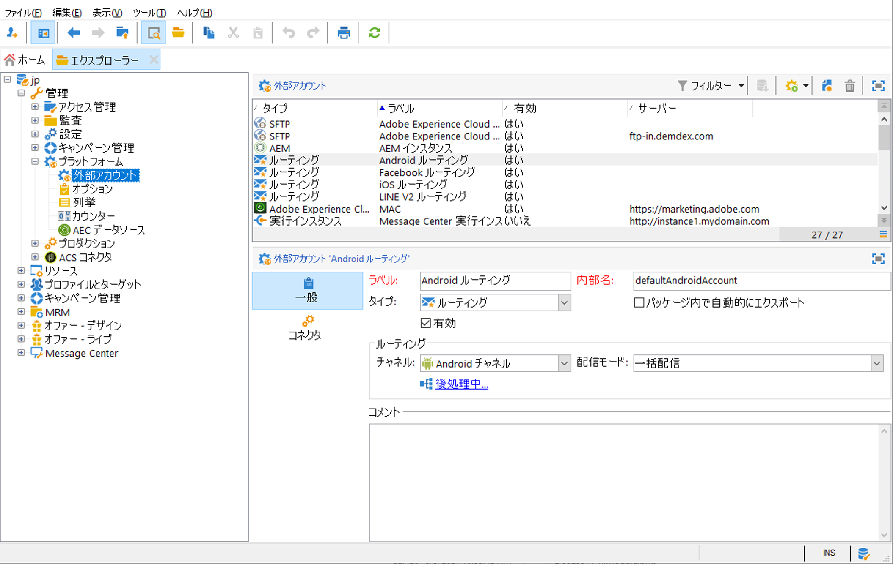

# 外部アカウントの設定

Adobe Campaign には、事前に定義された一連の外部アカウントが付属しています。外部システムとの接続を設定する場合は、新しい外部アカウントを作成します。

外部アカウントは、テクニカルワークフローやキャンペーンワークフローなどの技術プロセスで使用されます。例えば、ワークフローにおけるファイル転送や、他のアプリケーション（Adobe Target、Experience Manager など）とのデータ交換などをセットアップする場合、外部アカウントを選択する必要がありす。

Adobe Campaign **[!UICONTROL エクスプローラー]**&#x200B;から外部アカウントにアクセスできます。**[!UICONTROL 管理]** `>` **[!UICONTROL Platform]** `>` **[!UICONTROL 外部アカウント]**&#x200B;を参照します。




>[!CAUTION]
>
>Campaign のローカルデータベースとクラウドのデータベース（[!DNL Snowflake]）の間の接続は、特定の&#x200B;**[!UICONTROL フル FDA]**（ffda）外部アカウントで管理されます。
>
>Managed Cloud Services のユーザー場合、この外部アカウントは、お使いのインスタンス用にアドビが設定します。これは変更できません。


## Campaign 固有の外部アカウント

次の技術アカウントは、Adobe Campaign で特定のプロセスを有効にして実行するために使用されます。

??管理対象Cloud Servicesユーザーとして、Adobeは、Campaign固有のすべての外部アカウントを設定します。

* **バウンスメール（POP3）**

   **バウンスメール**&#x200B;外部アカウントで、メールサービスの接続に使用する外部 POP3 アカウントを指定します。POP3 アクセス用に設定されたすべてのサーバーは、返信メールの受信に使用できます。

   ↗️[Campaign Classicv7のドキュメント](https://experienceleague.adobe.com/docs/campaign-classic/using/automating-with-workflows/event-activities/inbound-emails.html?lang=ja){target=&quot;_blank&quot;}での受信Eメールの詳細

* **ルーティング**

   **[!UICONTROL ルーティング]**&#x200B;外部アカウントを使用すると、インストールしているパッケージに応じて、Adobe Campaign で利用可能な各チャネルを設定できます。

   >[!CAUTION]
   >
   >Adobe Campaign v8 では&#x200B;**[!UICONTROL 内部電子メール配信ルーティング]**（defaultEmailBulk）外部アカウントを、有効に&#x200B;**しないでください**。

* **実行インスタンス**

   トランザクションメッセージのコンテキストでは、実行インスタンスはコントロールインスタンスにリンクされ、接続されます。 トランザクションメッセージテンプレートは、実行インスタンスにデプロイされます。

   ??[このページ](../dev/architecture.md#transac-msg-archi)でのMessage Centerのアーキテクチャの詳細

## 外部システムの外部アカウントへのアクセス

* **外部データベース（FDA）**

   **外部データベース**&#x200B;タイプの外部アカウントを使用して、FDA 経由で外部データベースに接続します。

   Adobe Campaign v8 と互換性のある外部データベースは、[互換性マトリックス](../start/compatibility-matrix.md)に記載されています。

   ??Federated Data Access(FDA)オプションの詳細については、[この節](../connect/fda.md)を参照してください。

## Adobe ソリューション統合外部アカウント

* **Adobe Experience Cloud**

   **[!UICONTROL Adobe Experience Cloud]**&#x200B;外部アカウントは、AdobeIMSを実装し、Adobe IDを使用してAdobe Campaignコンソールに接続するために使用されます。

   ??AdobeIdentity Managementサービス(IMS)について詳しくは、[この節](../start/connect.md#connect-ims)を参照してください。

* **Web 分析**

   Adobe Analytics から Adobe Campaign へのデータ転送を設定するには、**[!UICONTROL Web 分析（Adobe Analytics）]**&#x200B;外部アカウントを使用します。

   ??Adobe CampaignとAdobe Analyticsの統合について詳しくは、[このページ](../connect/ac-aa.md)を参照してください。

   ??管理対象Cloud Servicesユーザーの場合は、[Adobe](../start/campaign-faq.md#support)に連絡して、Adobe AnalyticsをCampaignと統合します。

   * **Adobe Experience Manager**
   **[!UICONTROL AEM]** 外部アカウントを使用すれば、メール配信とフォームのコンテンツを Adobe Experience Manager で直接管理できます。

   ??Adobe CampaignとAdobe Analyticsの統合について詳しくは、[このページ](../connect/ac-aem.md)を参照してください。

   ??管理対象Cloud Servicesのユーザーとして、[Adobe](../start/campaign-faq.md#support)に連絡し、Adobe Experience ManagerとAdobe Campaignを統合します。


## CRM コネクタの外部アカウント

* **Microsoft Dynamics CRM**

   **[!UICONTROL Microsoft Dynamics CRM]** 外部アカウントを使用すると、Microsoft Dynamics データを Adobe Campaign に読み込みおよび書き出しできます。

   ??Adobe CampaignとMicrosoft Dynamics CRMの統合について詳しくは、[このページ](../connect/crm.md)を参照してください。

   **[!UICONTROL Web API]** デプロイメントタイプと&#x200B;**[!UICONTROL パスワード資格情報]**&#x200B;認証を使用する場合、以下の詳細を指定する必要があります。

   * **[!UICONTROL アカウント]** Microsoft CRM へのログインに使用するアカウント。

   * **[!UICONTROL サーバー]**：Microsoft CRM サーバーの URL。

   * **[!UICONTROL クライアント識別子]**：**[!UICONTROL コードを更新]**&#x200B;カテゴリ、**[!UICONTROL クライアント ID]** フィールドの Microsoft Azure 管理ポータルにあるクライアント ID。

   * **[!UICONTROL CRM バージョン]**：**[!UICONTROL Dynamics CRM 2007]**、**[!UICONTROL Dynamics CRM 2015]** または **[!UICONTROL Dynamics CRM 2016]** の CRM バージョン。
   **[!UICONTROL Web API]** デプロイメントタイプと&#x200B;**[!UICONTROL 証明書]**&#x200B;認証を使用する場合、以下の詳細を指定する必要があります。

   * **[!UICONTROL サーバー]**：Microsoft CRM サーバーの URL。

   * **[!UICONTROL 秘密鍵（Base64 エンコード）]**:Base64 にエンコードされた秘密鍵

   * **[!UICONTROL カスタムキー識別子]**

   * **[!UICONTROL キー ID]**

   * **[!UICONTROL クライアント識別子]**：**[!UICONTROL コードを更新]**&#x200B;カテゴリ、**[!UICONTROL クライアント ID]** フィールドの Microsoft Azure 管理ポータルにあるクライアント ID。

   * **[!UICONTROL CRM バージョン]**：**[!UICONTROL Dynamics CRM 2007]**、**[!UICONTROL Dynamics CRM 2015]** または **[!UICONTROL Dynamics CRM 2016]** の CRM バージョン。


* **Salesforce.com**

   **[!UICONTROL Salesforce CRM]** 外部アカウントを使用すれば、Adobe Campaign から Salesforce データをインポートおよびエクスポートできます。

   Salesforce CRM 外部アカウントを Adobe Campaign で使用できるように設定するには、次の情報を提供する必要があります。

   * **[!UICONTROL アカウント]**：Salesforce CRM へのログインに使用するアカウント。

   * **[!UICONTROL パスワード]**：Salesforce CRM へのログインに使用するパスワード。

   * **[!UICONTROL クライアント識別情報]**：クライアント識別情報の見つけ方については、[このページ](https://help.salesforce.com/articleView?id=000205876&amp;type=1)を参照してください。

   * **[!UICONTROL セキュリティトークン]**：セキュリティトークンの見つけ方については、[このペ ージ](https://help.salesforce.com/articleView?id=000205876&amp;type=1)を参照してください。

   * **[!UICONTROL API バージョン]**：API のバージョンを選択します。この外部アカウントの場合、設定ウィザードで Salesforce CRM を設定する必要があります。

## データ転送外部アカウント

これらの外部アカウントは、**[!UICONTROL ファイル転送]**&#x200B;ワークフローアクティビティを使用した、Adobe Campaign へのデータの読み込みまたは書き出しに使用できます。

↗️ [Campaign Classicv7ドキュメント](https://experienceleague.adobe.com/docs/campaign-classic/using/automating-with-workflows/event-activities/file-transfer.html?lang=ja){target=&quot;_blank&quot;}のワークフローでのファイル転送に関する詳細

* **FTP と SFTP**

   **FTP** 外部アカウントを使用すれば、Adobe Campaign 外でサーバーへのアクセスを設定およびテストできます。外部システム（ファイル転送に使用される SFTP サーバーや FTP サーバー 898 など）との接続をセットアップするために、独自の外部アカウントを作成できます。これをおこなうには、SFTP サーバーまたは FTP サーバーへの接続を確立するために使用するアドレスと資格情報を、この外部アカウントで指定します。

* **Amazon Simple Storage Service（S3）**

   **AWS S3** コネクタは、**[!UICONTROL ファイル転送]**&#x200B;ワークフローアクティビティを使用して、Adobe Campaign へのデータの読み込みまたは書き出しをおこなうために使用できます。この新規外部アカウントを設定する際には、次の情報を提供する必要があります。

   * **[!UICONTROL AWS S3 アカウントサーバー]**：サーバーの URL は、次のように入力する必要があります。   ```<S3bucket name>.s3.amazonaws.com/<s3object path>```

   * **[!UICONTROL AWS アクセスキー ID]**：AWS アクセスキー ID を見つける方法については、[Amazon ドキュメント](https://docs.aws.amazon.com/ja_jp/general/latest/gr/aws-sec-cred-types.html#access-keys-and-secret-access-keys)を参照してください。

   * **[!UICONTROL AWS への秘密アクセスキー]**：AWS への秘密アクセスキーを見つける方法については、[Amazon ドキュメント](https://aws.amazon.com/jp/blogs/security/wheres-my-secret-access-key/)を参照してください。

   * **[!UICONTROL AWS リージョン]**：AWS リージョンについて詳しくは、 [Amazon ドキュメント](https://aws.amazon.com/about-aws/global-infrastructure/regions_az/)を参照してください。

   * 「**[!UICONTROL サーバー側の暗号化を使用]**」チェックボックスをオンにすると、ファイルを S3 暗号モードで保存できます。アクセスキー ID と秘密アクセスキーを見つける方法については、[Amazon ドキュメント](https://docs.aws.amazon.com/general/latest/gr/aws-sec-cred-types.html#access-keys-and-secret-access-keys)を参照してください。

* **Azure Blob ストレージ**

   **Azure** 外部アカウントを使用すると、**[!UICONTROL ファイル転送]**&#x200B;ワークフローアクティビティで Adobe Campaign との間でデータをインポートまたはエクスポートできます。**Azure** 外部アカウントを Adobe Campaign で使用できるように設定するには、次の情報が必要です。

   * **[!UICONTROL サーバー]**：Azure BLOB ストレージサーバーの URL。

   * **[!UICONTROL 暗号化]**：暗号化のタイプ。**[!UICONTROL なし]** または **[!UICONTROL SSL]**。

   * **[!UICONTROL アクセスキー]**：ご利用の&#x200B;**[!UICONTROL アクセスキー]**&#x200B;を確認する方法については、[Microsoft ドキュメント](https://docs.microsoft.com/ja-JP/azure/storage/common/storage-account-keys-manage?tabs=azure-portal)を参照してください。

