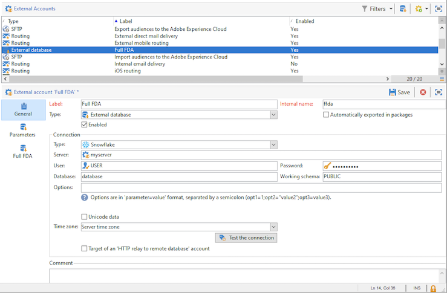
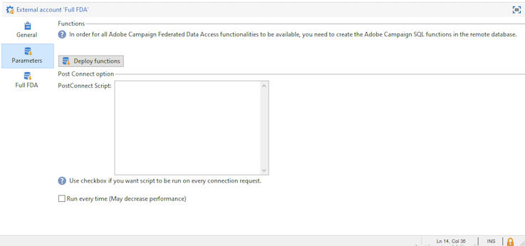
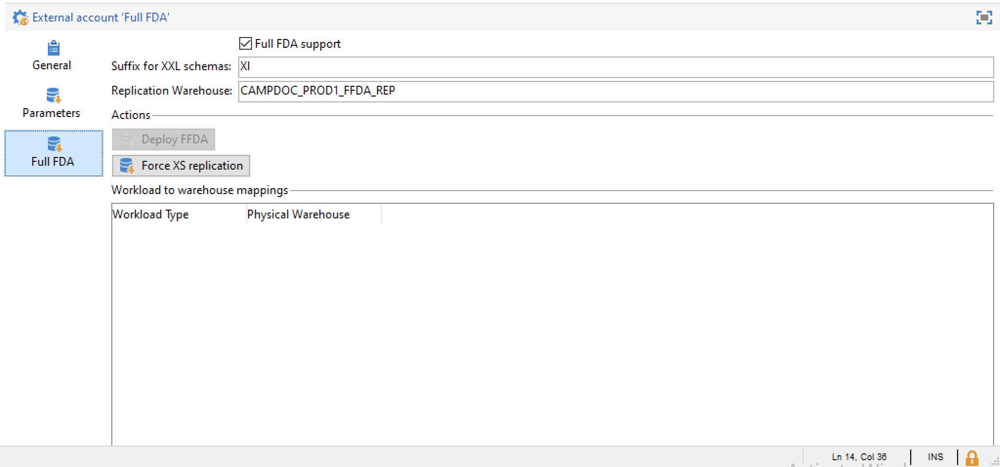

# 外部アカウントの設定

Adobe Campaign には、事前定義済みの外部アカウントのセットが付属します。外部システムとの接続を設定するために、新しい外部アカウントを作成できます。

外部アカウントは、テクニカルワークフローやキャンペーンワークフロー等の技術プロセスで使用されます。例えば、ワークフローでのファイル転送、または他のアプリケーション(Adobe Target、Experience Managerなど)とのデータ交換を設定する場合は、外部アカウントを選択する必要があります。

:arrow_upper_right:[Campaign Classicドキュメント](https://experienceleague.adobe.com/docs/campaign-classic/using/installing-campaign-classic/accessing-external-database/external-accounts.html)で外部アカウントの作成と設定の方法を説明します。

特定の外部アカウントは、キャンペーンのローカルデータベースとクラウドデータベース([!DNL Snowflake])の間の接続を管理します。

:speech_balloon:管理対象Cloud Servicesユーザーとして、[!DNL Snowflake]外部アカウントはAdobeによってインスタンス用に設定されます。

この外部アカウントにアクセスして、設定を確認し、レプリケーションワークフローを実行できます。 これを実行するには、次の手順に従います。

1. キャンペーン&#x200B;**[!UICONTROL エクスプローラー]**&#x200B;から、**[!UICONTROL 管理/プラットフォーム/外部アカウント]**&#x200B;をクリックします。

1. **[!UICONTROL 完全なFDA]**&#x200B;外部アカウントを選択します。

グローバル設定は、**[!UICONTROL 「一般」タブ]**&#x200B;に表示されます。

「**[!UICONTROL パラメーター]**」タブを使用し、「**[!UICONTROL 関数をデプロイ]**」ボタンを使用して関数を作成します。

**追加パラメータDESC**

[**[!UICONTROL 完全なFDA]**]タブを使用して、レプリケーションワークフローを強制的に実行します。

**追加詳細はこちら**

