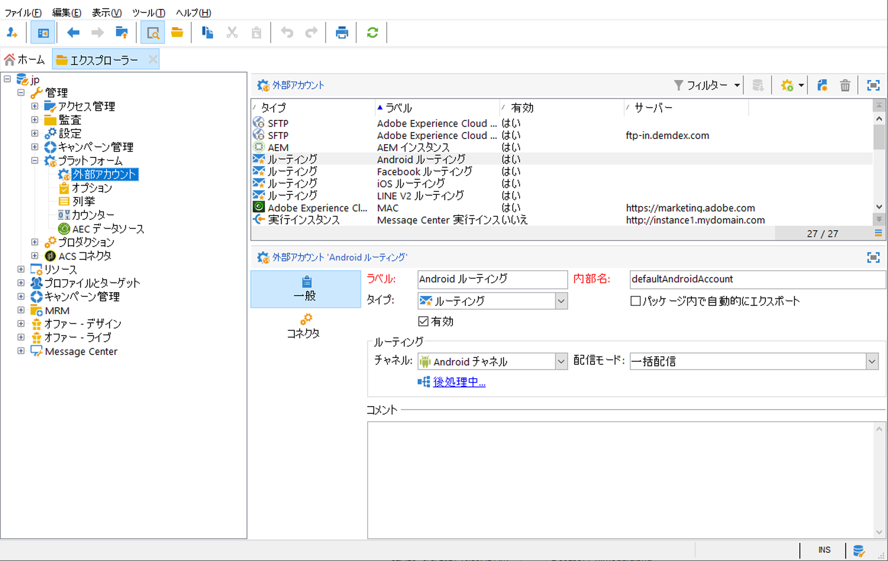
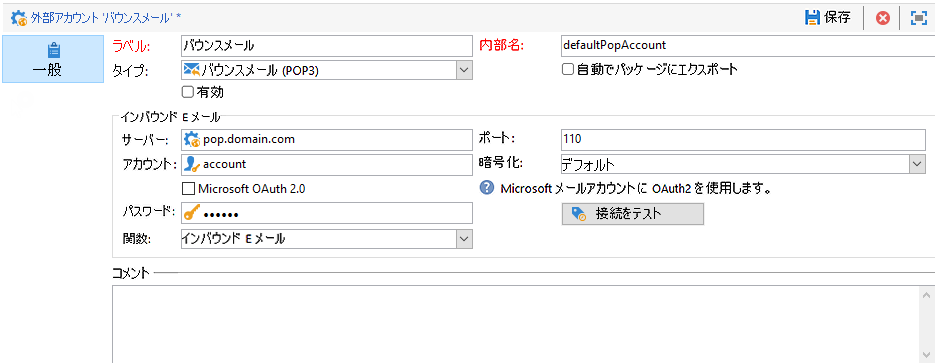
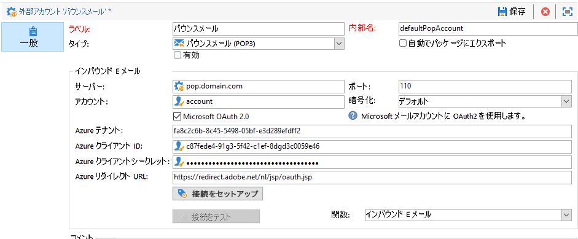

# 外部アカウントの設定 {#config-external-accounts}

Adobe Campaignには、事前に定義された一連の外部アカウントが付属しています。 外部システムとの接続を設定するには、新しい外部アカウントを作成します。

外部アカウントは、テクニカルワークフローやキャンペーンワークフローなどの技術プロセスで使用されます。例えば、ワークフローにおけるファイル転送や、他のアプリケーション（Adobe Target、Experience Manager など）とのデータ交換などをセットアップする場合、外部アカウントを選択する必要がありす。

Adobe Campaign **[!UICONTROL エクスプローラー]**&#x200B;から外部アカウントにアクセスできます。**[!UICONTROL 管理]** `>` **[!UICONTROL Platform]** `>` **[!UICONTROL 外部アカウント]**&#x200B;を参照します。




>[!CAUTION]
>
>* Managed Cloud Services ユーザーの場合、外部アカウントは、お使いのインスタンス用にアドビが設定するので、変更してはなりません。
>
>* [Enterprise （FFDA） デプロイメント ](../architecture/enterprise-deployment.md)のコンテキストでは、特定の&#x200B;**[!UICONTROL フル FDA]** （ffda）外部アカウントが、Campaign ローカルデータベースとCloud データベース （[!DNL Snowflake]）の間の接続を管理します。
>

## Campaign 固有の外部アカウント {#ac-external-accounts}

次の技術アカウントは、Adobe Campaign で特定のプロセスを有効にして実行するために使用されます。

### バウンスメール {#bounce-mails-external-account}

>[!NOTE]
>
>POP3 機能の Microsoft Exchange Online OAuth 2.0 認証は、Campaign v8.3 以降で使用できます。お使いのバージョンを確認する方法について詳しくは、[この節](../start/compatibility-matrix.md#how-to-check-your-campaign-version-and-buildversion)を参照してください。
>

**バウンスメール**&#x200B;外部アカウントで、メールサービスの接続に使用する外部 POP3 アカウントを指定します。POP3 アクセス用に設定されたすべてのサーバーは、返信メールの受信に使用できます。

インバウンドメールについて詳しくは、[このページ](https://experienceleague.adobe.com/docs/campaign/automation/workflows/wf-activities/event-activities/inbound-emails.html?lang=ja){target="_blank"}を参照してください。



**[!UICONTROL バウンスメール（defaultPopAccount）]**&#x200B;外部アカウントを設定するには、次の手順を実行します。

* **[!UICONTROL サーバー]** - POP3 サーバーの URL。

* **[!UICONTROL ポート]** - POP3 接続のポート番号。デフォルトのポート番号は 110 です。

* **[!UICONTROL アカウント]** - ユーザーの名前。

* **[!UICONTROL パスワード]**：ユーザーアカウントのパスワード。

* **[!UICONTROL 暗号化]** - **[!UICONTROL デフォルト]**、**[!UICONTROL POP3 + STARTTLS]**、**[!UICONTROL POP3]** または **[!UICONTROL POP3S]** から選択した暗号化のタイプ。

* **[!UICONTROL Function]** - インバウンドメールまたはSOAP ルーター。



>[!CAUTION]
>
>Microsoft OAuth 2.0 を使用して POP3 外部アカウントを設定する前に、まず Azure portal にアプリケーションを登録する必要があります。詳しくは、この[ページ](https://docs.microsoft.com/ja-jp/azure/active-directory/develop/quickstart-register-app){target="_blank"}を参照してください。
>

Microsoft OAuth 2.0を使用してPOP3外部アカウントを設定するには、**[!UICONTROL Microsoft OAuth 2.0]** オプションを確認し、次のフィールドに入力します。

* **[!UICONTROL Azure テナント]** - Azure ID（またはディレクトリ（テナント）ID）は、Azure Portal のアプリケーションの概要の&#x200B;**初期設定**&#x200B;ドロップダウンで確認できます。

* **[!UICONTROL Azure クライアント ID]** - クライアント ID（またはアプリケーション（クライアント）ID）は、Azure portal のアプリケーションの概要の&#x200B;**初期設定**&#x200B;ドロップダウンで確認できます。

* **[!UICONTROL Azure クライアントシークレット]** - クライアントシークレット ID は、Azure portal のアプリケーションの&#x200B;**証明書と秘密鍵**&#x200B;メニューから、「**クライアントシークレット**」列で確認できます。

* **[!UICONTROL Azure リダイレクト URL]** - リダイレクト URL は Azure portal のアプリケーションの&#x200B;**認証**&#x200B;メニューで確認できます。次の構文で `nl/jsp/oauth.jsp` 終わる必要があります。例：`https://redirect.adobe.net/nl/jsp/oauth.jsp`。

資格情報を入力したら、**[!UICONTROL 接続を設定]**&#x200B;をクリックして、外部アカウントの設定を完了します。

### ルーティング {#routing}

**[!UICONTROL ルーティング]**&#x200B;外部アカウントを使用すると、インストールしているパッケージに応じて、Adobe Campaign で利用可能な各チャネルを設定できます。

外部アカウントの管理と配信の実行について詳しくは、[この節](../architecture/architecture.md#split)を参照してください。

### 実行インスタンス {#execution-instance}

トランザクションメッセージのコンテキストでは、実行インスタンスはコントロールインスタンスにリンクされ、それらを接続します。 トランザクションメッセージテンプレートは、実行インスタンスにデプロイされます。 Message Center のアーキテクチャについて詳しくは、[このページ](../architecture/architecture.md#transac-msg-archi)を参照してください。

## 外部システムの外部アカウントへのアクセス {#external-syst-external-accounts}

### Federated Data Access（FDA） {#fda-external-accounts}

**外部データベース**&#x200B;型の外部アカウントは、Federated Data Access （FDA）を介して外部データベースに接続するために使用されます。 Federated Data Access（FDA）オプションについて詳しくは、[この節](../connect/fda.md)を参照してください。

>[!NOTE]
>
>Adobe Campaign v8と互換性のある外部データベースは、[互換性マトリックス ](../start/compatibility-matrix.md)に記載されています。 FDA接続では、ODBC ドライバーを使用します。Adobe Campaign Managed Cloud Servicesでは、ODBC ドライバーと外部アカウント設定はAdobeによって設定されます。

外部アカウント設定は、データベースエンジンによって異なります。 Adobe Campaign Managed Cloud Servicesでは、外部アカウントの設定はAdobeによって実行されます。

Campaign Web ユーザーインターフェイス（v8）については、次を参照してください。

* [外部アカウントの作成](https://experienceleague.adobe.com/en/docs/campaign-web/v8/administration/create-external-account){target="_blank"}
* [外部データベースアカウント ](https://experienceleague.adobe.com/en/docs/campaign-web/v8/administration/external-account-database){target="_blank"}

Campaign Web UI ページには、**外部データベース** プロバイダータイプのより包括的なリストが表示されます。次の項目を含みます。

* **[Amazon Redshift](https://experienceleague.adobe.com/en/docs/campaign-web/v8/administration/external-account-database#amazon-redshift){target="_blank"}** / **[Amazon Redshift （レガシー） ](https://experienceleague.adobe.com/en/docs/campaign-web/v8/administration/external-account-database#amazon-redshift-legacy){target="_blank"}** - CampaignをAWS Redshift Cloud Data Warehouse環境に接続します。
* **[Azure Synapse Analytics](https://experienceleague.adobe.com/en/docs/campaign-web/v8/administration/external-account-database#azure-synapse-analytics){target="_blank"}** - CampaignをMicrosoft Azure Synapse専用のSQL プールに接続します。
* **[Databricks](https://experienceleague.adobe.com/en/docs/campaign-web/v8/administration/external-account-database#databricks){target="_blank"}** - CampaignをDatabricks SQLおよびレイクハウスのワークロードに接続します。
* **[Google BigQuery](https://experienceleague.adobe.com/en/docs/campaign-web/v8/administration/external-account-database#google-bigquery){target="_blank"}** - CampaignをGoogle Cloud BigQuery分析データセットに接続します。
* **[Microsoft SQL Server](https://experienceleague.adobe.com/en/docs/campaign-web/v8/administration/external-account-database#microsoft-sql-server){target="_blank"}** - CampaignをオンプレミスまたはホストされているSQL Server データベースに接続します。
* **[MySQL](https://experienceleague.adobe.com/en/docs/campaign-web/v8/administration/external-account-database#mysql){target="_blank"}** - フェデレーションクエリとワークフロー用にCampaignをMySQL データベースに接続します。
* **[Netezza](https://experienceleague.adobe.com/en/docs/campaign-web/v8/administration/external-account-database#netezza){target="_blank"}** - CampaignをIBM Netezza / Performance Server システムに接続します。
* **[ODBC （Sybase ASE、Sybase IQ） ](https://experienceleague.adobe.com/en/docs/campaign-web/v8/administration/external-account-database#odbc-sybase-ase-sybase-iq){target="_blank"}** - CampaignをODBC経由でSybase データベース エンジンに接続します。
* **[リモートデータベースへのHTTP リレー](https://experienceleague.adobe.com/en/docs/campaign-web/v8/administration/external-account-database#http-relay-to-remote-database){target="_blank"}** - HTTP リレーエンドポイントを介してリモートデータベースに接続します。
* **[Oracle](https://experienceleague.adobe.com/en/docs/campaign-web/v8/administration/external-account-database#oracle){target="_blank"}** - CampaignをOracle データベースに接続して、フェデレーションアクセスのユースケースを実現します。
* **[PostgreSQL](https://experienceleague.adobe.com/en/docs/campaign-web/v8/administration/external-account-database#postgresql){target="_blank"}** - FDA外部アカウントを使用してCampaignをPostgreSQL データベースに接続します。
* **[SAP HANA](https://experienceleague.adobe.com/en/docs/campaign-web/v8/administration/external-account-database#sap-hana){target="_blank"}** - CampaignをSAP HANAのインメモリデータベース環境に接続します。
* **[Snowflake](https://experienceleague.adobe.com/en/docs/campaign-web/v8/administration/external-account-database#snowflake){target="_blank"}** - CampaignをSnowflake Cloud Data Platform環境に接続します。
* **[Teradata](https://experienceleague.adobe.com/en/docs/campaign-web/v8/administration/external-account-database#teradata){target="_blank"}** - CampaignをTeradata Enterprise Data Warehouse システムに接続します。
* **[Vertica Analytics](https://experienceleague.adobe.com/en/docs/campaign-web/v8/administration/external-account-database#vertica-analytics){target="_blank"}** - CampaignをOpenText Vertica Analytics データベースに接続します。
* **[Microsoft Fabric](https://experienceleague.adobe.com/en/docs/campaign-web/v8/administration/external-account-database#fabric){target="_blank"}** - CampaignをMicrosoft Fabric SQLおよびストレージサービスに接続します。

従来のクライアントコンソールの詳細とその他の参照については、[Adobe Campaign Classic v7 ドキュメント ](https://experienceleague.adobe.com/en/docs/campaign-classic/using/installing-campaign-classic/accessing-external-database/external-accounts){target="_blank"}を参照してください。

#### Databricks外部アカウント {#databricks-external-accounts}

Databricks FDA接続では、Databricks ODBC ドライバーが使用されます。 Campaign v8.9.1以降、Databricks外部アカウントは、サービスプリンシパル（非インタラクティブなクライアント資格情報フロー）を介したOAuth2認証をサポートし、フェデレーションデータアクセスに対する安全な認証を提供します。

サービスプリンシパルについて詳しくは、[Microsoft ドキュメント ](https://learn.microsoft.com/en-us/azure/databricks/admin/users-groups/service-principals){target="_blank"}を参照してください。

Campaignのサービスプリンシパルを使用してOAuth2認証を設定するには：

1. Databricks ワークスペース管理者は、Databricks ワークスペースでサービスプリンシパルを有効にし、資格情報を生成します。 OAuthを使用してAzure Databricks リソースへのアクセスを認証するには、OAuth秘密鍵（認証用のOAuth アクセストークンの生成に使用）を作成します。
2. Adobe Campaignで、Databricks外部アカウントを作成または編集し、**OAuth** タブを開きます。
3. 資格情報をDatabricks外部アカウントの「OAuth」タブのフィールドに貼り付けます。
4. **[!UICONTROL 接続のテスト]**&#x200B;を使用して、設定を検証します。

#### Snowflake外部アカウント {#snowflake-external-accounts}

Snowflake FDA接続では、Snowflake ODBC ドライバーが使用されます。 Campaign v8.9.1以降、Snowflakeの外部アカウントはOAuth2認証をサポートし、フェデレーションデータアクセスに対する安全な認証を提供します。

SnowflakeのOAuthについて詳しくは、[Snowflake ドキュメント ](https://docs.snowflake.com/en/user-guide/oauth-intro){target="_blank"}を参照してください。

まず、Snowflakeで次の手順を実行する必要があります。

1. OAuth 2.0を使用してSnowflake外部アカウントを設定する前に、まずSnowflakeでOAuth Security Integrationを作成する必要があります。 セキュリティ統合を作成するには、**ACCOUNTADMIN**&#x200B;の役割が必要です。

   OAuth セキュリティ統合の作成について詳しくは、[Snowflake ドキュメント ](https://docs.snowflake.com/en/sql-reference/sql/create-security-integration-oauth-snowflake){target="_blank"}を参照してください。

1. 次に、次を使用してクライアント IDとクライアントシークレットをクエリできます。

   ```
   select system$show_oauth_client_secrets('OAUTH_INTEGRATION_ABC'); // use uppercase letters
   ```

CampaignでOAuth2認証を設定するには、次の手順に従います。

1. Adobe Campaignで、Snowflake外部アカウントを作成または編集し、**[!UICONTROL OAuth 2.0]**&#x200B;を使用オプションをオンにします。

1. サーバー、データベース、スキーマを設定し、**[!UICONTROL OAuth]** タブを開きます。

1. **[!UICONTROL クライアント ID]**、**[!UICONTROL クライアントシークレット]**&#x200B;および&#x200B;**[!UICONTROL リダイレクト URL]**&#x200B;のセキュリティ統合パラメーターを設定します。 これらのパラメーターは、Snowflake OAuth Security Integrationから取得されます。 [Snowflake ドキュメント ](https://docs.snowflake.com/en/user-guide/oauth-custom){target="_blank"}を参照してください。

1. 「**[!UICONTROL ログインに進む]**」をクリックして、手動ログインを実行します。 新しいブラウザーウィンドウが開き、Snowflake ユーザーの資格情報を入力するよう求められます。

1. 認証プロセスが完了すると、Snowflake OAuth Security Integrationで定義された日数（`OAUTH_REFRESH_TOKEN_VALIDITY` パラメーターを使用）でアカウントが認証されます。 更新トークンは外部アカウントに保存されます。

>[!CAUTION]
>
>リダイレクト URLは、常にCampaign アプリケーションサーバーコンピューターの`oauth.jsp`をHTTPS （ポート 443）経由でターゲットにする必要があります。 また、OAuthを使用する場合、アンダースコアを持つサーバードメインはサポートされません。 OAuthを使用する場合は、アンダースコアなしでサーバードメインを使用します。

### X（旧 Twitter） {#twitter-external-account}

**Twitter** タイプの外部アカウントは、CampaignをX アカウントに接続し、ユーザーに代わってメッセージを投稿するために使用されます。 X 統合について詳しくは、[このセクション](../connect/ac-tw.md)を参照してください。

## Adobeソリューションとの統合の外部アカウント {#adobe-integration-external-accounts}

* **Adobe Experience Cloud** - **[!UICONTROL Adobe Experience Cloud]**&#x200B;外部アカウントは、Adobe Identity Management サービス（IMS）を実装してAdobe Campaignに接続するために使用されます。 Adobe Identity Management Service（IMS）について詳しくは、[この節](../start/connect.md#logon-to-ac)を参照してください。

* **Web 分析** - **[!UICONTROL Web 分析（Adobe Analytics）]**&#x200B;外部アカウントは、Adobe Analytics から Adobe Campaign へのデータ転送を設定するために使用します。Adobe Campaign と Adobe Analytics の統合について詳しくは、[このページ](../connect/ac-aa.md)を参照してください。

* **Adobe Experience Manager** - **[!UICONTROL AEM]** 外部アカウントを使用すれば、メール配信とフォームのコンテンツを Adobe Experience Manager で直接管理できます。Adobe CampaignとAdobe Experience Managerの連携について詳しくは、[このページ ](../connect/ac-aem.md)を参照してください。


## CRM コネクタの外部アカウント {#crm-external-accounts}

* **Microsoft Dynamics CRM** - **[!UICONTROL Microsoft Dynamics CRM]** 外部アカウントを使用すれば、Adobe Campaign との間で Microsoft Dynamics データをインポートおよびエクスポートできます。Adobe Campaign と Microsoft Dynamics CRM の統合について詳しくは、[このページ](../connect/ac-ms-dyn.md)を参照してください。

* **Salesforce.com** - **[!UICONTROL Salesforce CRM]** 外部アカウントを使用すれば、Adobe Campaign との間で Salesforce データをインポートおよびエクスポートできます。Adobe Campaign と Salesforce.com CRM の統合について詳しくは、[このページ](../connect/ac-sfdc.md)を参照してください。

## データ外部アカウントの転送 {#transfer-data-external-accounts}

これらの外部アカウントは、**[!UICONTROL ファイル転送]**&#x200B;ワークフローアクティビティを使用した、Adobe Campaign へのデータのインポートまたはエクスポートに使用できます。ワークフローでの&#x200B;**ファイル転送**&#x200B;について詳しくは、[このページ](https://experienceleague.adobe.com/docs/campaign/automation/workflows/wf-activities/event-activities/file-transfer.html?lang=ja){target="_blank"}を参照してください。

* **FTP および SFTP** - **FTP** 外部アカウントを使用すれば、Adobe Campaign 外でサーバーへのアクセスを設定およびテストできます。ファイル転送に使用するSFTP サーバーやFTP サーバーなどの外部システムとの接続を設定するには、独自の外部アカウントを作成できます。

  これを行うには、SFTP サーバーまたは FTP サーバーへの接続を確立するために使用するアドレスと資格情報を、この外部アカウントで指定します。

  >[!NOTE]
  >
  >リリース 8.5 以降、SFTP 外部アカウントを設定する際に、秘密鍵を使用して安全に認証できるようになりました。[鍵の管理の詳細情報](https://experienceleague.adobe.com/docs/control-panel/using/sftp-management/key-management.html?lang=ja){target="_blank"}

* **Amazon Simple Storage Service（S3）** - **AWS S3** コネクタは、**[!UICONTROL ファイル転送]**&#x200B;ワークフローアクティビティを使用して、Adobe Campaign へのデータのインポートまたはエクスポートに使用できます。この外部アカウントを設定する場合は、次の詳細を指定する必要があります。

   * **[!UICONTROL AWS S3 Account Server]**：フォーム `<S3bucket name>.s3.amazonaws.com/<s3object path>`のサーバーのURL。

   * **[!UICONTROL AWS アクセスキー ID]**：AWS アクセスキー ID の見つけ方については、[Amazon ドキュメント](https://docs.aws.amazon.com/ja_jp/general/latest/gr/aws-sec-cred-types.html#access-keys-and-secret-access-keys){target="_blank"}を参照してください。

   * **[!UICONTROL AWS への秘密アクセスキー]**：AWS への秘密アクセスキーを見つける方法については、[Amazon ドキュメント](https://aws.amazon.com/jp/blogs/security/wheres-my-secret-access-key/){target="_blank"}を参照してください。

   * **[!UICONTROL AWS リージョン]**：AWS リージョンについて詳しくは、 [Amazon ドキュメント](https://aws.amazon.com/about-aws/global-infrastructure/regions_az/){target="_blank"}を参照してください。

   * 「**[!UICONTROL サーバーサイド暗号化を使用]**」チェックボックスを使用すると、ファイルをS3暗号化モードで保存できます。 アクセスキー ID と秘密アクセスキーを見つける方法については、[Amazon ドキュメント](https://docs.aws.amazon.com/ja_jp/general/latest/gr/aws-sec-cred-types.html#access-keys-and-secret-access-keys){target="_blank"}を参照してください。

* **Azure BLOB ストレージ** - **Azure** 外部アカウントを使用すると、**[!UICONTROL ファイル転送]**&#x200B;ワークフローアクティビティで Adobe Campaign との間でデータをインポートまたはエクスポートできます。**Azure** 外部アカウントを Adobe Campaign で使用できるように設定するには、次の情報が必要です。

   * **[!UICONTROL サーバー]**: Azure Blob ストレージサーバーのURL。

   * **[!UICONTROL 暗号化]**：暗号化の種類：**[!UICONTROL なし]**&#x200B;または&#x200B;**[!UICONTROL SSL]**。

   * **[!UICONTROL アクセスキー]**：ご利用の&#x200B;**[!UICONTROL アクセスキー]**&#x200B;を確認する方法については、[Microsoft ドキュメント](https://docs.microsoft.com/ja-JP/azure/storage/common/storage-account-keys-manage?tabs=azure-portal){target="_blank"}を参照してください。

* **Microsoft Fabric** - **Microsoft Fabric**&#x200B;外部アカウントを使用すると、**[!UICONTROL ファイルの転送]** ワークフローアクティビティを使用して、Microsoft FabricとAdobe Campaign間でデータをインポートおよびエクスポートできます。 この統合を設定するには、次の詳細を指定します。

   * **[!UICONTROL Server]**: Microsoft Fabric Storage ServerのURL。

   * **[!UICONTROL アプリケーション ID]**: Microsoft Fabric リソースの認証とアクセスに使用されるアプリケーションの一意のID。

   * **[!UICONTROL クライアントシークレット]**: Microsoft Fabricに安全に接続するために必要な、アプリケーションに関連付けられた認証キーまたはパスワード。
