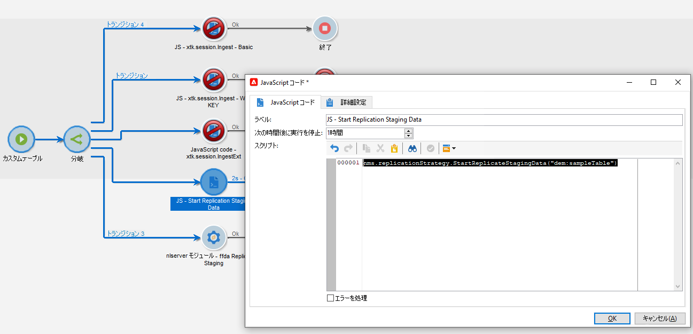
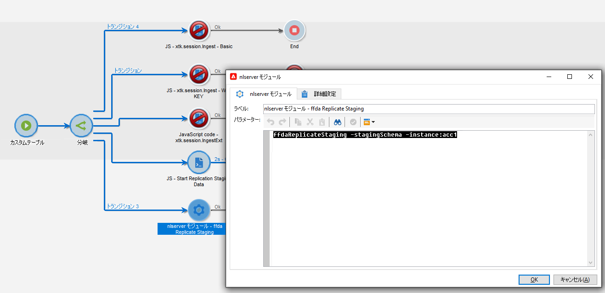

# テクニカルワークフローとデータレプリケーション

## テクニカルワークフロー{#tech-wf}

Adobe Campaign には、一連のビルトインテクニカルワークフローが付属しています。 テクニカルワークフローは、サーバーで定期的にスケジュールされたプロセスやジョブを実行します。

これらのワークフローでは、データベースに対する保守操作の実行、配信ログのトラッキング情報の利用、繰り返しキャンペーンの作成などを行います。

 テクニカルワークフローの完全なリストについては、[Campaign Classic v7 ドキュメント](https://experienceleague.adobe.com/docs/campaign-classic/using/automating-with-workflows/advanced-management/about-technical-workflows.html?lang=ja)を参照してください{target=&quot;_blank&quot;}


これらのテクニカルワークフローに加えて、キャンペーン v8 では、[データレプリケーション](#data-replication)を管理するための特定のテクニカルワークフローも利用します。

* **[!UICONTROL 参照テーブルをレプリケート]**
このワークフローは、Campaign のローカルデータベース（Postgres）とクラウドデータベース（[!DNL Snowflake]）に不可欠なビルトインテーブルの自動レプリケーションを実行します。
毎日 1 時間ごとに実行するようにスケジュールされます。 **lastModified** フィールドが存在する場合、レプリケーションは増分的に行われます。存在しない場合はテーブル全体がレプリケートされます。 次の配列内のテーブルの順序は、レプリケーションワークフローで使用される順序です。
* **[!UICONTROL ステージングデータをレプリケート]**
このワークフローは、単一の呼び出し用にステージングデータを複製します。毎日 1 時間ごとに実行するようにスケジュールされます。
* **[!UICONTROL 直ちに FFDA をデプロイ]**\
   このワークフローは、Cloud データベースへの即時デプロイメントを実行します。
* **[!UICONTROL 直ちに FFDA データをレプリケート]**
このワークフローは、指定の外部アカウントの XS データをレプリケートします。

これらのテクニカルワークフローは、キャンペーンエクスプローラーの&#x200B;**[!UICONTROL 管理／本番環境／テクニカルワークフロー／完全な FFDA レプリケーション]**&#x200B;ノードから利用できます。 **これらは変更できません。**

必要に応じて、データの同期を手動で開始できます。これを実行するには、「**スケジューラー**」アクティビティを右クリックし、「**保留中のタスクを今すぐ実行**」を選択します。

## データのレプリケーション{#data-replication}

一部のビルトインテーブルは、上述の専用ワークフローを介して、Campaign のローカルデータベースから [!DNL Snowflake] クラウドデータベースにレプリケートされます。


Adobe Campaign v8 が使用するデータベース、データがレプリケートされる理由、レプリケートされるデータおよびレプリケーションプロセスの仕組みについて説明します。

>[!VIDEO](https://video.tv.adobe.com/v/334460?quality=12)


### データレプリケーションポリシー

レプリケーションポリシーはテーブルのサイズに基づいています。 リアルタイムでレプリケートされるテーブルもあれば、時間単位でレプリケートされるテーブルもあります。 増分的に更新されるテーブルもあれば、全体が置き換えられるテーブルもあります。

ビルトインの&#x200B;**参照テーブルのレプリケート**テクニカルワークフローに加えて、独自のワークフローでデータレプリケーションを強制することもできます。


次をおこなうことができます。

* 次のコードを使用して特定の **JavaScript コード**&#x200B;アクティビティを追加する：

```
nms.replicationStrategy.StartReplicateStagingData("dem:sampleTable")
```




* 次のコマンドを使用して、特定の **nlmodule** アクティビティを追加する：

```
nlserver ffdaReplicateStaging -stagingSchema -instance:acc1
```




**関連トピック**

 ワークフローの概要については、[Campaign Classic v7 ドキュメント](https://experienceleague.adobe.com/docs/campaign-classic/using/automating-with-workflows/introduction/about-workflows.html?lang=ja#automating-with-workflows){target=&quot;_blank&quot;}を参照してください

 データ保持期間については、[この節](../dev/datamodel-best-practices.md#data-retention)を参照してください
