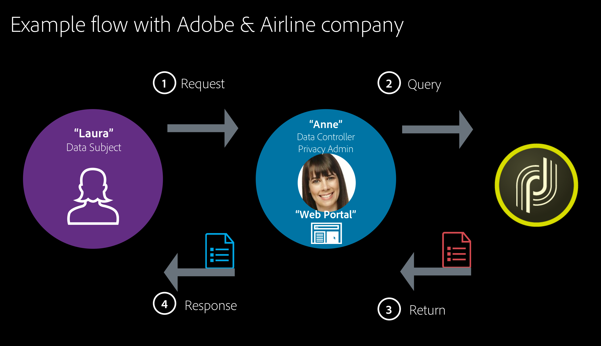

# Campaign セキュリティのベストプラクティス {#ac-security}

アドビでは、デジタルエクスペリエンスのセキュリティを非常に重要視しています。 セキュリティ対策は、社内のソフトウェア開発と運用プロセスおよびツールに深く根付いており、インシデントを適切な方法で防止、検出、対応するために、部門の枠を超えたチームが厳しくフォローしています。

さらに、パートナー、主要な研究者、セキュリティ研究機関、その他の業界団体との共同作業により、最新の脅威や脆弱性を常に把握し、オファーする製品やサービスに高度なセキュリティ技術を定期的に取り入れています。

>[!NOTE]
>
>**Campaign v8 Managed Cloud Services:** インフラストラクチャ（ネットワーク、サーバー、TLS、パッチ適用）は、Adobeによって管理されます。 このページでは、制御するテナントレベルおよびアプリケーションレベルの設定（アクセス管理、認証、インスタンス設定、データ保護、コーディングおよび運用手法）に焦点を当てています。

## セキュリティチェックリスト {#security-checklist}

このチェックリストを使用して、設定を推奨される安全なデフォルトに合わせます。

* [&#x200B; アクセス管理 &#x200B;](#access-management)：セキュリティグループを作成し、適切な権限を割り当て、管理者による使用を制限し、ユーザーごとに 1 人のオペレーターを配置し、定期的に確認します
* [&#x200B; 認証とセッション &#x200B;](#authentication-and-session):Adobe IMS、強力な ID ポリシー、セッションタイムアウトを使用します
* [&#x200B; インスタンスとネットワークセキュリティ &#x200B;](#instance-and-network-security):IP許可リスト、URL 権限、Campaign コントロールパネルを使用した GPG キー
* [&#x200B; データと PII の保護 &#x200B;](#data-and-pii-protection):HTTPS、PII 表示制限、パスワードの制限、機密ページの保護
* [&#x200B; コーディングのガイドライン &#x200B;](#coding-guidelines)：ハードコーディングされた秘密鍵なし、入力の検証、パラメーター化された SQL、Captcha
* [&#x200B; データ制限 &#x200B;](#data-restriction)：外部アカウントのパスワードおよびシークレットフィールドへのアクセスを制限します
* [&#x200B; 運用とコンプライアンス &#x200B;](#operational-and-compliance)：このベースラインと定期的に比較し、監査記録を使用します

## プライバシー

プライバシーを正しく取り扱い、個人データを管理するには、事業を行う地域に適用される法律の範囲内で作業してください。Adobe Campaign の機能は、[このページ](../start/privacy.md)に記載されている規制の遵守に役立ちます。

### Adobe Experience Cloud プライバシー {#experience-cloud-privacy}

Adobe Campaign は、Adobe Experience Cloud ソリューションの一部です。Campaign でのプライバシーの扱い方は、次のような Experience Cloud の一般原則に従います。

* **Adobe Experience Cloud を使用する際に収集される情報**

  Adobe Experience Cloud ソリューションを使用する会社は、収集して Adobe Experience Cloud アカウントに送信する情報を選択します。収集される情報のタイプの例としては、web 閲覧アクティビティ、IP アドレス、モバイルデバイスからの位置情報、キャンペーン成功率、購入品目、買い物かごに入れた品目などがあります。

  >[!NOTE]
  >
  >すべてのアドビ製品について、Campaign はアプリと web サイトのユーザーに関する情報を収集します。詳しくは、[アドビのプライバシーポリシー](https://www.adobe.com/jp/privacy/policy.html)を参照してください。

* **Adobe Experience Cloud を使用した情報収集の仕組み**

   * Adobe Experience Cloud ソリューションでは、情報を収集できるように、web ビーコン（タグやピクセルとも呼ばれます）などの Cookie および同様のテクノロジーを使用します。Cookie および Adobe Campaign を使用した追跡機能について詳しくは、[この節](#tracking-capabilities)を参照してください。
   * モバイルアプリで Adobe Experience Cloud テクノロジーを使用することもできます。Campaign を使用してモバイル配信を送信する方法について詳しくは、[SMS チャネル](../send/sms/sms-channel.md)とモバイルアプリのチャネルを参照してください。

* **Adobe Experience Cloud の使用に関するユーザーのプライバシー選択**

  アドビから、次の内容を説明するプライバシーポリシーをお客様に提供するように求められます。

   * Adobe Experience Cloud に関連するプライバシー方針
   * Adobe Experience Cloud に関連して、ユーザーが情報の収集や使用に関する環境設定をおこなう方法

  >[!NOTE]
  >
  >すべてのアドビ製品と同様に、Campaign のユーザーは、アプリや Web サイトを通じて収集した情報の共有をオプトアウトできます。詳しくは、[Adobe Experience Cloud の使用に関する FAQ](https://www.adobe.com/jp/privacy/experience-cloud-usage-info-faq.html) を参照してください。

Adobe Experience Cloud のプライバシーについて詳しくは、[このページ](https://www.adobe.com/jp/privacy/marketing-cloud.html)を参照してください。

## 個人データとペルソナ {#personal-data}

プライバシーを管理する場合、どのデータを誰がどのように扱うかを定義することが重要です。
* **個人データ**&#x200B;は、生存する個人を直接または間接的に識別できる情報です。
* **個人の機密データ**&#x200B;は、個人の人種、政治観、宗教的信念、犯罪歴、遺伝情報、健康データ、性的嗜好、生体認証情報、および労働組合の組合員に関する情報です。

Campaign を、[Adobe Analytics](../connect/ac-aa.md)、[Experience Cloud オーディエンス](../start/shared-audiences.md)、Campaign Standard などのシステム間でオーディエンスを転送できる他の Experience Cloud ソリューションと統合する場合、または [CRM コネクタ](../../automation/workflow/crm-connector.md)を介して他のソリューションと統合する場合は、個人データの保護に特別な注意を払う必要があります。

[主な規制](#privacy-regulations)では、データを管理する様々なエンティティを以下のように定義しています。

* **データ管理者**&#x200B;は、個人データの収集、使用、共有の方法と目的を決定する権限を有する関係者です。

* **データ処理者**&#x200B;は、データ管理者の指示に従って個人データを収集、使用、または共有する個人または関係者です。

* **データ主体**&#x200B;は、個人データが収集、使用、共有され、その個人データを参照して直接または間接的に識別できる、生存する個人のことです。

したがって、個人データを収集し共有する会社はデータ管理者で、そのクライアントはデータ主体です。Adobe Campaign は、お客様の指示に従って個人データを処理する際に、データ処理者として機能します。[プライバシーリクエスト](#privacy-requests)を管理する場合など、データ主体との関係を処理するのはデータ管理者側の責任となるため注意が必要です。

### ユースケースシナリオ {#use-case-scenario}

さまざまなペルソナがどのように関わり合っているかを説明するため、GDPR の顧客体験の高レベルの使用例を以下に示します。

この例では、航空会社が Adobe Campaign の顧客です。 この会社が&#x200B;**データ管理者**&#x200B;で、この航空会社のすべての利用者が&#x200B;**データ主体**&#x200B;です。ここで、Laura はこの航空会社の利用者です。

この例のペルソナは以下の通りです。

* **Laura** は&#x200B;**データ主体**&#x200B;で、航空会社からメッセージを受け取る受信者です。Laura はリピーターですが、ある時点で、航空会社からのパーソナライズされた広告やマーケティングメッセージの受信を希望しないことにしました。そのため、航空会社に（所定のプロセスに基づいて）リピーター番号を削除するよう要求します。

* **Anne** は航空会社の&#x200B;**データ管理者**&#x200B;です。Laura のリクエストを受け取り、このデータ主体を識別するための有意な ID を取得して、リクエストを Adobe Campaign に送信します。

* **Adobe Campaign** は&#x200B;**データ処理者**&#x200B;です。



この例での一般的なフローを以下に示します。

1. **データ主体**（Laura）は GDPR リクエストを&#x200B;**データ管理者**&#x200B;にメール、カスタマーケア、Web ポータルのいずれかを利用して送付します。

1. **データ管理者**（Anne）はこの GDPR リクエストをインターフェイスまたは API を使用して Campaign に登録します。

1. **データ処理者**（Adobe Campaign）が情報を受け取ると、GDPR リクエストに対するアクションを実行し、応答または確認通知を&#x200B;**データ管理者**（Anne）に送信します。

1. **データ管理者**（Anne）は情報を受け取り、それを&#x200B;**データ主体**（Laura）に返します。

## データの取得 {#data-acquisition}

Adobe Campaign を使用すると、個人情報や機密情報などのデータを収集できます。したがって、受信者の同意を得てこれを監視することが重要になります。

* 受信者は常に通信の受信に同意するようにします。これをおこなうには、できるだけ早くオプトアウトリクエストを守り、二重のオプトインプロセスを通じて同意を確認します。詳しくは、[二重のオプトインを備えた購読フォームの作成](https://experienceleague.adobe.com/ja/docs/campaign-classic/using/designing-content/web-forms/use-cases-web-forms){target=_blank}を参照してください。
* 不正なリストを読み込まず、シードアドレスを使用して、クライアントファイルが不正に使用されていないことを確認してください。詳しくは、[シードアドレスについて](https://experienceleague.adobe.com/ja/docs/campaign-classic/using/sending-messages/using-seed-addresses/about-seed-addresses){target=_blank}を参照してください。
* 同意と権限の管理を通じて、受信者の好みを追跡し、組織内の誰がどのデータにアクセスできるかを管理できます。詳しくは、[この節](#consent)を参照してください。
* 受信者からのプライバシーリクエストを円滑に処理して管理します。詳しくは、[この節](#privacy-requests)を参照してください。

## プライバシー管理 {#privacy-management}

プライバシー管理とは、プライバシー規制（GDPR、CCPA など）の遵守に役立つすべてのプロセスとツールを指します。

Adobe Campaign では、プライバシー管理に関する様々な機能を提供しています。
* 同意の管理、データ保持、ユーザーの役割：詳しくは、[この節](#consent)を参照してください。
* プライバシーリクエスト（アクセスする権利と忘れられる権利）：詳しくは、[この節](#privacy-requests)を参照してください。
* 個人情報の販売のオプトアウト（CCPA 固有）：

Campaign の主なプライバシー機能と関与するペルソナの例を[この節](https://helpx.adobe.com/jp/campaign/kb/campaign-privacy-more.html#gdprpersonasandflow)に示します。

### 同意、保持、役割 {#consent}

Adobe Campaign には、プライバシーに不可欠な重要な機能が最初から用意されています。

* **同意の管理**：購読管理プロセスを通じて、受信者の環境設定を管理し、どの受信者がどの購読タイプにオプトインしたかを追跡できます。詳しくは、[購読について](../../automation/workflow/subscription-services.md)を参照してください。
* **データ保持**：すべてのビルトインの標準ログテーブルには事前に設定された保存期間があり、通常、データのストレージは 6 か月以下に制限されます。その他の保存期間は、ワークフローで設定できます。詳しくは、アドビのコンサルタントまたは技術管理者にお問い合わせください。
* **権限管理**：Adobe Campaign では、事前作成された役割またはカスタムの役割を使用して、様々な Campaign オペレーターに割り当てられている権限を管理できます。これにより、会社内で様々なタイプのデータにアクセス、変更、エクスポートできるユーザーを管理できます。詳しくは、[アクセス管理について](https://experienceleague.adobe.com/ja/docs/campaign-classic/using/installing-campaign-classic/security-privacy/access-management){target=_blank}を参照してください。

### プライバシーリクエスト {#privacy-requests}

Adobe Campaign には、特定のプライバシーリクエストに対するデータ管理者としての準備を容易にするためのその他の機能が用意されています。

* **アクセスする権利**&#x200B;とは、データ主体がデータ管理者に、自分に関する個人データが処理されているかどうか、また処理されている場合はその場所と目的について確認できることを指します。

* 「**忘れられる権利**」（削除要求）により、データ主体はデータコントローラーに個人データを消去させることができます。

**アクセス**&#x200B;要求と&#x200B;**削除**&#x200B;要求が、[この節](../start/privacy.md)に示されています。

これらのリクエストを作成するための実装手順については、[この節](../start/privacy.md)で詳しく説明します。

## トラッキング機能 {#tracking-capabilities}

### Cookie {#cookies}

Adobe Campaign では、トラッキング機能により 3 種類の Cookie（セッション Cookie と 2 つの永続的な Cookie）を使用して配信の受信者による閲覧を追跡できます。

* **セッション** Cookie：**nlid** Cookie には、連絡先に送信されるメールの識別子（**broadlogId**）およびメッセージテンプレートの識別子（**deliveryId**）が含まれています。Adobe Campaign が送信したメールに含まれている URL を連絡先のユーザーがクリックすると追加され、この連絡先での web 上の行動をトラッキングできるようになります。このセッション Cookie は、ブラウザーが閉じられると自動的に消去されます。連絡先のユーザーは、Cookie を拒否するようにブラウザーを設定できます。

* 2 つの&#x200B;**永続的な Cookie**：
   * **UUID**（Universal Unique IDentifier）Cookie は、Adobe Experience Cloud のソリューション間で共有されます。設定は 1 回で、新しい値が生成されると、クライアントブラウザーから消滅します。この Cookie により、web サイトの訪問時に Experience Cloud ソリューションとやり取りするユーザーを識別できます。ランディングページ（不明な顧客アクティビティを受信者に関連付けるため）または配信によって預けることができます。この Cookie の説明は[このページ](https://experienceleague.adobe.com/docs/core-services/interface/ec-cookies/cookies-mc.html?lang=ja#ec-cookies)で参照できます。
   * **nllastdelid** Cookie（Campaign Classic 20.3 で導入）は、ユーザーがリンクをクリックした最後の配信の **deliveryId** を含む永続的な Cookie です。この Cookie は、使用されるトラッキングテーブルを識別するために、セッション Cookie がない場合に使用されます。

GDPR（一般データ保護規則）などの規制では、企業は Cookie をインストールする前に web サイトのユーザーから同意を得ることが規定されています。

* ポップアップウィンドウはブラウザーでブロックされていることが多いので、避ける必要があります。

### メッセージトラッキング {#message-tracking}

Adobe Campaign では、送信されたメールと配信受信者の動作（開封、リンクのクリック、購読解除など）をトラッキングできます。詳しくは、[メッセージについて](../start/gs-message.md)を参照してください。

これを行うには、配信ダッシュボードの「トラッキング」タブで配信と受信者の動作の影響を測定できるよう、トラッキング用リンクをメッセージに追加します。トラッキングデータは、トラッキングインジケーターレポートで解釈されます。トラッキングについて詳しくは、[このページ](../send/tracking.md)を参照してください。

### Web トラッキング {#web-tracking}

>[!AVAILABILITY]
>
>Web トラッキングは、Campaign v8 では使用できません。 使用できない機能について詳しくは、[&#x200B; このページ &#x200B;](../start/v7-to-v8.md#gs-unavailable-features) を参照してください。

## データと PII の保護 {#data-and-pii-protection}

プライバシー設定と強化は、セキュリティを最適化するうえで重要な要素です。 次のベストプラクティスに従います。

* **すべてのエンドポイントに HTTPS を使用** - Campaign で使用されるすべてのエンドポイント（トラッキング、ミラーページ、web アプリケーション、API）が HTTPS で提供されるようにします。
* **PII ビューの制限** - [PII ビューの制限 &#x200B;](../dev/restrict-pi-view.md) を使用して、許可されたオペレーターのみがスキーマや画面の機密フィールド（メール、電話など）を表示できるようにします。
* **暗号化されたパスワードへのアクセスを制限** – 外部アカウントおよびその他のスキーマのパスワードおよび秘密鍵フィールドへのアクセスを制限して、管理者または最小限のオペレーターセットのみが表示できるようにします。 以下の [&#x200B; データの制限 &#x200B;](#data-restriction) を参照してください。
* **機密ページの保護** - PII を表示または収集するミラーページ、web アプリケーション、ランディングページへのアクセスを制限します。オペレーターおよびフォルダーの権限を使用し、必要に応じてキャプチャと同意を行います。

>[!NOTE]
>
>Managed Cloud Services ユーザーの場合は、アドビはお客様と協力して、これらの設定をお客様の環境に実装します。

## アクセス管理 {#access-management}

アクセス管理は、セキュリティ強化の重要な部分です。 主なベストプラクティスを次に示します。

* **十分なセキュリティグループの作成** – 役割に一致するオペレーターグループを定義し、各役割に必要な権限のみを割り当てます。
* **各オペレーターに適切なアクセス権があることを確認します** – 最小権限の原則を適用します。デフォルトでは、管理などの幅広い権限を付与しないでください。
* **管理者オペレーターの使用を避け、管理グループのオペレーターが多くなりすぎないようにします** – 組み込みの管理者アカウントを共有しないでください。説明責任と監査のために、物理ユーザーごとに 1 つのオペレーターを作成します。
* **物理ユーザーごとに 1 つのオペレーター** - アカウントを共有しません。 監査記録とログに責任を持たせるために、1 人につき 1 つの Campaign オペレーター（Adobe ID）を作成します。
* **高い権限のネームド権限の制限** – 少数の信頼されるオペレーターにのみ **ADMINISTRATION**、**PROGRAM EXECUTION** （createProcess）、**SQL** を付与します。権限を持つオペレーターとその理由を記載します。
* **アクセス権限を定期的に確認** - オペレーター、オペレーターグループおよびフォルダー権限を定期的に確認します。役割が変更されたり、ユーザーが退出したりしたときにアクセスを削除または削減します。
* **製品プロファイルを一貫して使用** - Admin Consoleの製品プロファイル（オペレーターグループ）にユーザーを割り当てることを推奨します。名前の一貫性を維持します（例：`campaign - <instance> - <group>`）。 [&#x200B; 権限の基本を学ぶ &#x200B;](../start/gs-permissions.md) を参照してください。
* **Campaign コントロールパネルアクセス** - Campaign v8 では、製品プロファイルまたは名前に「admin」が含まれるネームド権限により、Campaign Campaign コントロールパネルへのアクセス権を付与できます。 プロファイル名やグループ名には、これらのユーザーにCampaign コントロールパネルアクセス権を付与する必要がない限り、「admin」を使用しないでください。

権限について詳しくは、[この節](../start/gs-permissions.md)を参照してください。

## 認証とセッション {#authentication-and-session}

* **Adobe IMSを使用** – すべてのユーザーは、Adobe ID（IMS）でログインする必要があります。従来のログイン/パスワードを日々のオペレーターに使用することはありません。
* **強力な ID とパスワードポリシーに依存** - MFA とパスワードポリシーには、Admin Consoleまたは ID プロバイダーを使用します。許可されたユーザーのみが Campaign の製品プロファイルに割り当てられるようにします。
* **セッションタイムアウトの設定** – 設定可能な場合（クライアントコンソールなど）、適切なセッションタイムアウトを設定し、ワークステーションから離れるときに画面をロックします。

## インスタンスとネットワークセキュリティ {#instance-and-network-security}

Campaign v8 製品管理者は、[Campaign Campaign コントロールパネル](https://experienceleague.adobe.com/docs/control-panel/using/control-panel-home.html?lang=ja){target="_blank"} を使用してインスタンスレベルのセキュリティを管理します。

* **IP^許可リスト** - インスタンスアクセス用の IP^ネットワークを管理し、既知の許可リスト（例：オフィス、VPN）に限定し、可能な限り過度に広い範囲を避けます。
* **URL 権限** - サーバーサイドリクエストの不正使用のリスクを軽減するために、インスタンスが呼び出す必要があるドメイン（API、トラッキング、外部サービス）に URL 権限を制限します。
* **GPG キー** - ファイル転送やその他のユースケースに暗号化を使用している場合は、Campaign コントロールパネルで GPG キーを管理し、セキュリティポリシーに従ってローテーションします。

## コーディングのガイドライン {#coding-guidelines}

Adobe Campaign（ワークフロー、JavaScript、JSSP など）で開発する場合、常に次のガイドラインに従います。

* **スクリプト** – 生の SQL を避けます。文字列連結の代わりに、パラメーター化された関数を使用します。 必要な SQL 関数のみを許可リストに追加して、SQL 挿入を避けます。
* **データモデルの保護** – ネームド権限を使用してオペレーターのアクションを制限し、システムフィルター（sysFilter）を追加します。
* **Web アプリケーションへの captcha の追加** - パブリックのランディングページと購読ページに captcha を追加します
* **秘密鍵をハードコードしない** - ワークフロー、JavaScriptまたは JSSP でパスワード、API キーまたはトークンをハードコードしないでください。外部アカウントまたは安全な設定を使用します。
* **入力の検証と不要部分を削除** - web アプリケーションやワークフローパラメーターでのユーザー入力を検証および不要部分を削除して、インジェクションや XSS のリスクを軽減します。
* **SQL に許可リストを使用** - SQL またはスクリプトの実行が必要な場合は、許可された SQL 関数に許可リストを使用し、文字列連結を使用してユーザー入力からクエリを作成するのを避けます。

詳しくは、[Adobe Campaign Classic v7 ドキュメント](https://experienceleague.adobe.com/docs/campaign-classic/using/installing-campaign-classic/security-privacy/scripting-coding-guidelines.html?lang=ja#installing-campaign-classic){target="_blank"}を参照してください。


## パーソナライゼーション

コンテンツにパーソナライズされたリンクを追加する場合、潜在的なセキュリティギャップを回避するために、URL のホスト名部分にパーソナライゼーションを含めないようにしてください。 次の例は、すべての URL 属性 &lt;`a href="">` または `` で使用しないでください。

* `<%= url >`
* `https://<%= url >`
* `https://<%= domain >/path`
* `https://<%= sub-domain >.domain.tld/path`
* `https://sub.domain<%= main domain %>/path`

## データの制限 {#data-restriction}

権限レベルの低い認証ユーザーは暗号化されたパスワードにアクセスできないようにする必要があります。これには、主に 2 つの方法があります。パスワードフィールドのみへのアクセスを制限する方法と、エンティティ全体へのアクセスを制限する方法です。

この制限をおこなうと、パスワードフィールドを削除できますが、すべてのユーザーがインターフェイスから外部アカウントにアクセスできるようになります。 詳しくは、[このページ](../dev/restrict-pi-view.md)を参照してください。

1. **[!UICONTROL 管理]**／**[!UICONTROL 設定]**／**[!UICONTROL データスキーマ]**&#x200B;に移動します。

1. 新しい&#x200B;**[!UICONTROL スキーマの拡張]**&#x200B;を作成します。

1. **[!UICONTROL 外部アカウント]**（extAccount）を選択します。

1. 最後の画面で、新しい srcSchema を編集して、すべてのパスワードフィールドへのアクセスを制限できます。

   メイン要素（`<element name="extAccount" ... >`）は、次の方法で置き換えることができます。

   ```
   <element name="extAccount">
       <attribute accessibleIf="$(loginId) = 0 or $(login) = 'admin'" name="password"/>
       <attribute accessibleIf="$(loginId) = 0 or $(login) = 'admin'" name="clientSecret"/>
   
       <element name="s3Account">
           <attribute accessibleIf="$(loginId) = 0 or $(login) = 'admin'" name="awsSecret"/>
       </element>
       <element name="wapPush">
           <attribute accessibleIf="$(loginId) = 0 or $(login) = 'admin'" name="password"/>
           <attribute accessibleIf="$(loginId) = 0 or $(login) = 'admin'" name="clientSecret"/>
       </element>
       <element name="mms">
           <attribute accessibleIf="$(loginId) = 0 or $(login) = 'admin'" name="password"/>
           <attribute accessibleIf="$(loginId) = 0 or $(login) = 'admin'" name="clientSecret"/>
       </element>
   </element>
   ```

   したがって、拡張された srcSchema は次のようになります。

   ```
   <...>
       <element name="extAccount">
           <attribute accessibleIf="$(loginId) = 0 or $(login) = 'admin'" name="password"/>
           <attribute accessibleIf="$(loginId) = 0 or $(login) = 'admin'" name="clientSecret"/>
   
           <element name="s3Account">
               <attribute accessibleIf="$(loginId) = 0 or $(login) = 'admin'" name="awsSecret"/>
           </element>
           <element name="wapPush">
               <attribute accessibleIf="$(loginId) = 0 or $(login) = 'admin'" name="password"/>
               <attribute accessibleIf="$(loginId) = 0 or $(login) = 'admin'" name="clientSecret"/>
           </element>
           <element name="mms">
               <attribute accessibleIf="$(loginId) = 0 or $(login) = 'admin'" name="password"/>
               <attribute accessibleIf="$(loginId) = 0 or $(login) = 'admin'" name="clientSecret"/>
           </element>
       </element>
   <...> 
   ```

   >[!NOTE]
   >
   >`$(loginId) = 0 or $(login) = 'admin'` を `hasNamedRight('admin')` に置き換えて、管理者権限を持つすべてのユーザーにこれらのパスワードを表示させることができます。

## 運用とコンプライアンス {#operational-and-compliance}

* **セキュアベースラインとの比較** - オペレーターグループ、ネームド権限およびフォルダー権限を、このページの推奨事項（および該当する場合は [&#x200B; セキュリティの強化アドオン &#x200B;](enhanced-security.md)）と定期的に比較して、推奨されるセキュリティで保護されたデフォルトに合わせます。
* **監査記録の使用** – 重要な変更（ワークフロー、配信、キー設定など）については、Campaign の監査記録を使用します。コンプライアンスおよび保持ポリシーの必要に応じて、ログを保持および確認します。
