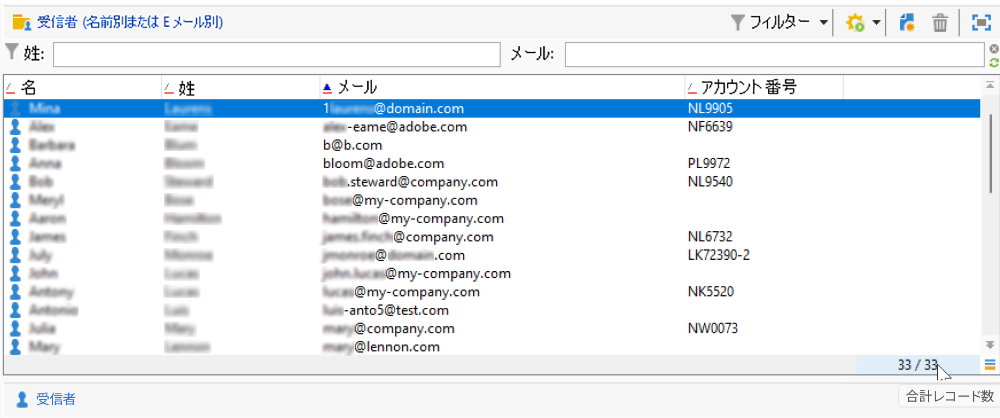
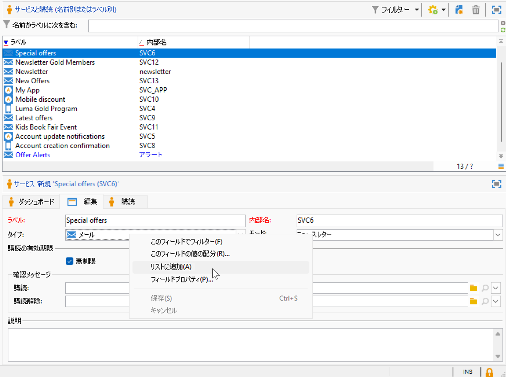
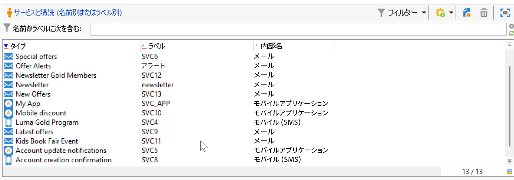
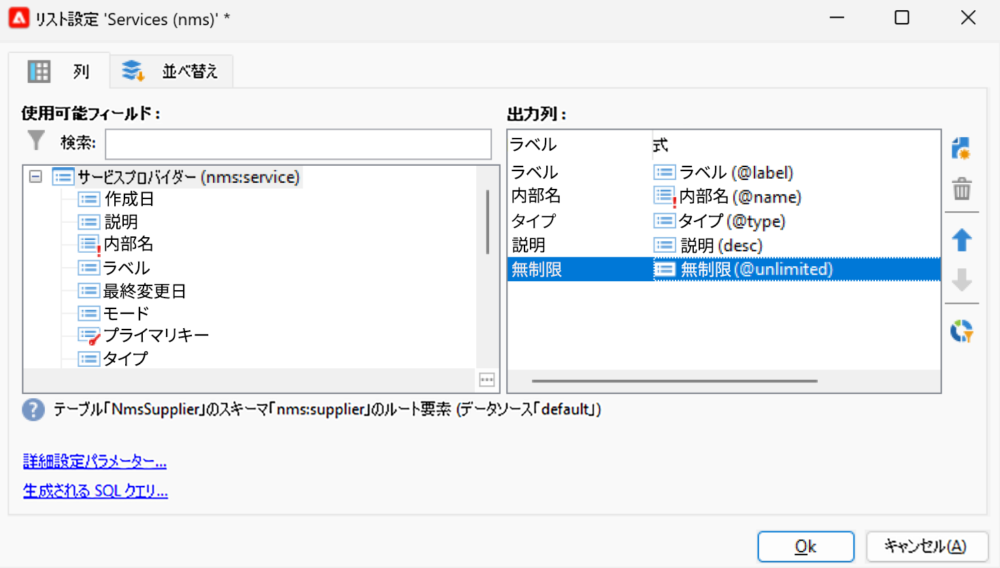
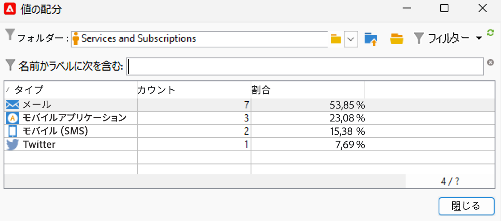

# Campaign ユーザーインターフェイスの設定 {#ui-settings}

## デフォルトの単位 {#default-units}

Adobe Campaignでは、有効期間（リソースの有効期間、タスクの承認期限など）を表すフィールドの場合、値は次のように表すことができます **単位**:

* **[!UICONTROL s]** 秒
* **[!UICONTROL mn]** 分
* **[!UICONTROL h]** 時間
* **[!UICONTROL d]** 日

## Campaign エクスプローラーのカスタマイズ{#customize-explorer}

Campaign エクスプローラーにフォルダーを追加したり、ビューを作成したり、権限を割り当てたりできます。

フォルダーとビューを管理する方法については、[このページ](../audiences/folders-and-views.md)を参照してください

## リストの管理とカスタマイズ{#customize-lists}

Campaign クライアントコンソールでは、データはリストに表示されます。 これらのリストは、必要に応じて変更できます。 例えば、列の追加、データのフィルタリング、レコードのカウント、設定の保存、共有をおこなうことができます。

また、フィルターを作成して保存できます。  フィルターの詳細については、 [このページ](../audiences/create-filters.md).

### レコード数 {#number-of-records}

Adobe Campaign には、デフォルトで、リストの最初の 200 件のレコードが読み込まれます。つまり、表示しているテーブルのすべてのレコードが表示されるわけではありません。リスト内のレコード数のカウントを実行して、レコードをさらに読み込むことができます。

リスト画面の右下の部分にある&#x200B;**カウンター**&#x200B;を使用すると、読み込まれているレコード数とデータベース内の合計レコード数（フィルターの適用後）が示されます。

右側の数字の代わりに疑問符（例： ）が表示される場合 `240/?`をクリックし、カウンターをクリックして計算を開始します。

追加のレコードを読み込んで表示するには、 **[!UICONTROL 読み込みを続行]**. デフォルトでは、200 件のレコードが読み込まれます。 読み込むデフォルトのレコード数を変更するには、 **[!UICONTROL リストを設定]** アイコンが表示されます。 リスト設定ウィンドウで、「**[!UICONTROL 詳細設定パラメーター]**」（左下）をクリックして、取得する行数を変更します。

すべてのレコードを読み込むには、リストを右クリックして&#x200B;**[!UICONTROL すべて読み込む]**&#x200B;を選択します。

>[!CAUTION]
>
>リストに大量のレコードが含まれている場合、完全な読み込みには時間がかかる場合があります。

### 列の追加と削除 {#add-columns}

各リストに対して、組み込みの列設定を適合して、詳細情報の表示や、未使用の列の非表示を設定できます。

レコードの詳細にデータが表示されている場合は、フィールドを右クリックし、 **[!UICONTROL リストに追加]**.

既存の列の右側に列が追加されます。

また、リスト設定画面を使用して、列を追加および削除することもできます。

1. レコードのリストで、 **[!UICONTROL リストを設定]** アイコンをクリックします。
1. 次に追加するフィールドをダブルクリックします。 **[!UICONTROL 使用可能フィールド]** リスト：これらは、 **[!UICONTROL 出力列]** リスト。

   

   >[!NOTE]
   >
   >デフォルトでは、詳細フィールドは表示されません。表示するには、 **詳細フィールドを表示** アイコンを使用します。
   >
   >フィールドは、SQL フィールド、リンクテーブル、集計フィールドなどの特定のアイコンで識別されます。選択した各フィールドの説明が、使用可能フィールドのリストの下に表示されます。

1. 上下の矢印を使用して、 **表示順**.

1. 「**[!UICONTROL OK]**」をクリックして設定を確定し、結果を表示します。

列を削除する必要がある場合は、列を選択し、 **ごみ箱** アイコン

以下を使用して、 **[!UICONTROL 値の配分]** アイコン：現在のフォルダーの選択されたフィールドの値の再区分を表示します。

### 新しい列の作成 {#create-a-new-column}

新しい列を作成して、リストに表示するフィールドを増やすことができます。

列を作成するには、次の手順に従います。

1. レコードのリストで、 **[!UICONTROL リストを設定]** アイコンをクリックします。
1. 次をクリック： **[!UICONTROL 追加]** アイコンをクリックして、リストに新しいフィールドを表示します。
1. 列に追加するフィールドを設定します。

### サブフォルダー内のデータの表示 {#display-sub-folders-records}

リストには、次の内容を表示できます。

* 選択したフォルダーに含まれるすべてのレコード（デフォルト）
* 選択したフォルダーとそのサブフォルダーに含まれるすべてのレコード

表示モードを切り替えるには、 **[!UICONTROL サブレベルを表示]** 」と入力します。

### リスト設定の保存 {#saving-a-list-configuration}

リスト設定は、各ユーザーに対してローカルに定義されます。 ローカルキャッシュがクリアされると、ローカルの設定が無効になります。

デフォルトでは、設定パラメーターは、対応するフォルダータイプを持つすべてのリストに適用されます。 受信者のリストがフォルダーからどのように表示されるかを変更すると、この設定は他のすべての受信者フォルダーに適用されます。

複数の設定を保存して、同じタイプの異なるフォルダーに適用できます。 設定は、データが含まれるフォルダーのプロパティとともに保存され、再適用できます。

リストの設定を保存して再利用するには、次の手順に従います。

1. エクスプローラーで、表示されたデータを含むフォルダーを右クリックします。
1. 「**[!UICONTROL プロパティ]**」を選択します。
1. 「**[!UICONTROL 詳細設定]**」をクリックし、「**[!UICONTROL 設定]**」フィールドで名前を指定します。
1. 「**[!UICONTROL OK]**」をクリックし、「**[!UICONTROL 保存]**」をクリックします。

この設定は、同じタイプの別のフォルダーに適用できます。 のフォルダーの詳細を説明します [このページ](../audiences/folders-and-views.md).

### リストのエクスポート {#exporting-a-list}

リストからデータをエクスポートするには、エクスポートウィザードを使用する必要があります。これにアクセスするには、リストからエクスポートする要素を選択し、右クリックして「**[!UICONTROL エクスポート...]**」を選択します。

<!--The use of the import and export functions is explained in [Generic imports and exports](../../platform/using/about-generic-imports-exports.md).-->

>[!CAUTION]
>
>リストの要素をコピーまたは貼り付け機能を使用してエクスポートしないでください。

### リストの並べ替え {#sorting-a-list}

リストに大量のデータが含まれている場合があります。これらのデータを並べ替えたり、標準フィルターまたは詳細フィルターを適用したりすることができます。並べ替えでは、データを昇順または降順で表示できます。フィルターでは、基準を定義または組み合わせて、選択したデータのみを表示できます。

列ヘッダーをクリックして、昇順または降順ソートを適用するか、データの並べ替えをキャンセルできます。アクティブな並べ替えステータスおよび並べ替え順は、列ラベルの前の青色の矢印で示されます。列ラベルの前の赤色のダッシュは、データベースからインデックス付けされたデータに並べ替えが適用されていることを意味します。この並べ替え方法は、並べ替えジョブを最適化するために使用されます。

並べ替えの設定をおこなったり、並べ替え基準を組み合わせることもできます。これをおこなうには、以下の手順に従います。

1. リストの右下にある「**[!UICONTROL リストを設定]**」をクリックします。
1. リスト設定ウィンドウで、「**[!UICONTROL 並べ替え]**」タブをクリックします。
1. 並べ替えるフィールドと、並べ替えの順番（昇順または降順）を選択します。
1. 並べ替えの優先度は、並べ替え列の順序を使用して定義されます。
優先度を変更するには、適切なアイコンを使用して列の順序を変更します。

   並べ替えの優先度は、リスト内の列の表示には影響しません。

1. 「**[!UICONTROL OK]**」をクリックしてこの設定を確定し、リストで結果を表示します。

## 列挙の操作 {#enumerations}

列挙（「定義済みリスト」とも呼ばれます）とは、フィールドへの入力候補としてシステムによって提示される値のリストです。 列挙を使用してこれらのフィールドの値を標準化し、データ入力の際やクエリ内での使用に役立ちます。

値のリストはドロップダウンリストとして表示され、値を選択すると、その値がフィールドに入力されます。また、このドロップダウンリストでは、予測入力も可能です。最初の文字を入力すると、残りの文字がアプリケーションで補完されます。

この種のフィールドに関する、入力値の定義や全般的な管理作業（値の追加や削除）は、ツリーの&#x200B;**[!UICONTROL 管理／プラットフォーム／列挙]**&#x200B;ノードでおこなわれます。

### 列挙のタイプ {#types-of-enum}

列挙は、 **[!UICONTROL 管理/プラットフォーム/列挙]** エクスプローラーのフォルダー。

次のことが可能です。「開く」、「システム」、「顔文字」または「閉じる」。

* An **開く** 列挙を使用すると、ユーザーはこの列挙に基づいて新しい値を直接フィールドに追加できます。
* A **クローズ** 列挙には、 **[!UICONTROL 管理/プラットフォーム/列挙]** エクスプローラーのフォルダー。
* An **顔文字** 列挙は、顔文字のリストを更新するために使用されます。 詳細情報
* A **システム** 列挙はシステムフィールドに関連付けられており、内部名を持ちます。

の場合 **開く** および **クローズ** 列挙には、次の特定のオプションを使用できます。

* **単純な列挙** はデフォルトの標準タイプです。
* **エイリアスクレンジング** 列挙は、データベースに保存されている列挙値を調和させるために使用されます。 [詳細情報](#alias-cleansing)
* **ビニング用に予約** は、この列挙にキューブ値をリンクできるオプションです。 [詳細情報](../reporting/gs-cubes.md)

### エイリアスクレンジング {#alias-cleansing}

列挙フィールドでは、値を選択するか、ドロップダウンリストに表示されないカスタム値を入力できます。 カスタム値は、新しい列挙値として既存の列挙値に追加できます。この場合、 **[!UICONTROL 開く]** オプションを選択する必要があります。 これらのカスタム値は、エイリアスクレンジング機能を使用してクリーンアップできます。 例えば、ユーザーが `Adob` の代わりに `Adobe`エイリアスクレンジングプロセスでは、エイリアスを自動的に正しい用語に置き換えることができます。

>[!CAUTION]
>
>データクレンジングは、データベース内のデータに大きな影響を及ぼす重大なプロセスです。Adobe Campaign の大規模なデータ更新が実行され、場合によっては一部の値が削除される結果になることもあります。したがって、この操作はエキスパートユーザー向け機能として予約されています。

を有効にします。 **[!UICONTROL エイリアスクレンジング]** オプションを使用して列挙にデータクレンジング機能を使用することもできます。 このオプションを選択すると、ウィンドウの下部に「**[!UICONTROL エイリアス]**」タブが表示されます。

エイリアスクレンジングの列挙に存在しない値がユーザーによって入力されると、その値が **値** リスト。 以下が可能です。 [これらの値からエイリアスを作成](#convert-to-alias)または [新規エイリアスを最初から作成](#create-alias).

#### エイリアスの作成{#create-alias}

エイリアスを作成するには、次の手順に従います。

1. クリック **[!UICONTROL 追加]** ボタン **[!UICONTROL エイリアス]** タブをクリックします。
1. 変換するエイリアスを入力し、適用する値をドロップダウンリストから選択します。

   

1. クリック **[!UICONTROL Ok]** をクリックし、確認します。

1. 変更内容を保存します。値の置換は **エイリアスクレンジング** 毎晩実行されるワークフロー。 [データクレンジングの実行](#running-data-cleansing)を参照してください。

この列挙に基づくすべてのフィールドに対して、ユーザーが値を入力したとき **アドビ** (Adobe Campaignコンソールの web フォームの )「会社」フィールドでは、値で自動的に置き換えられます **Adobe**.

#### 誤った値をエイリアスに変換{#convert-to-alias}

また、既存の列挙値をエイリアスに変換することもできます。 次の手順を実行します。

1. 列挙の値のリストで、右クリックし、 **[!UICONTROL アクション… /値をエイリアスに変換…]**.

   

1. エイリアスに変換する値を選択し、 **[!UICONTROL 次へ]**.
1. 「**[!UICONTROL 開始]**」をクリックして変換を実行します。

   実行が完了すると、エイリアスがリストの **エイリアス** タブをクリックします。 正しい値を関連付けて、誤ったエントリを置き換えることができます。 次の手順を実行します。

1. クリーンアップする値を選択します。
1. 次をクリック： **詳細…** 」ボタンをクリックします。
1. ドロップダウンリストで新しい値を選択します。

   

>[!NOTE]
>
>別名が **[!UICONTROL ヒット数]** 列 **[!UICONTROL エイリアス]** サブタブを使用します。 この値が入力された回数を表示できます。  [詳細情報](#calculate-entry-occurrences)

#### データクレンジングの実行 {#running-data-cleansing}

データクレンジングは&#x200B;**[!UICONTROL エイリアスクレンジング]**&#x200B;ワークフローによって実行されます。デフォルトでは毎日実行されます。

クレンジングは **[!UICONTROL 値をクレンジング…]** リンク。

「**[!UICONTROL 詳細設定パラメーター]**」リンクでは、収集される値を処理対象にし始める日付を設定できます。

「**[!UICONTROL 開始]**」ボタンをクリックすると、データクレンジングが実行されます。

##### 発生件数の監視 {#calculate-entry-occurrences}

列挙の「**[!UICONTROL エイリアス]**」サブタブでは、入力されたすべての値の中に特定のエイリアスが含まれていた回数を表示できます。この情報は推定値であり、「**[!UICONTROL ヒット数]**」列に表示されます。

>[!CAUTION]
>
>エイリアスの入力回数を計算するには、長い時間が必要となる場合があります。

「**[!UICONTROL 値をクレンジング]**」リンクを使用すると、ヒット数の計算を手動で実行することもできます。これをおこなうには、 **[!UICONTROL 詳細設定パラメーター…]** リンクをクリックし、オプションを選択します。

* 「**[!UICONTROL エイリアスヒット数を更新]**」：入力された日付に基づいて、既に計算済みのヒット数を更新する場合に選択します。
* 「**[!UICONTROL 開始からのエイリアスのヒット数を再計算]**」：Adobe Campaign プラットフォーム全体に対して計算処理を実行する場合に選択します。

指定した期間について計算を自動実行する（例：週に 1 回）ための専用ワークフローを作成することもできます。

そのためには、**[!UICONTROL エイリアスクレンジング]**&#x200B;ワークフローのコピーを作成し、スケジューラーを変更して、**[!UICONTROL 列挙値のクレンジング]**&#x200B;で次の設定を使用します。

* **-updateHits**：エイリアスのヒット数を更新する場合
* **-updateHits:full**：エイリアスのヒット数をすべて再計算する場合
