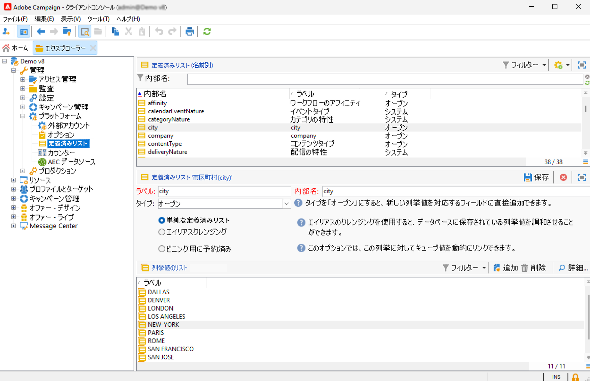
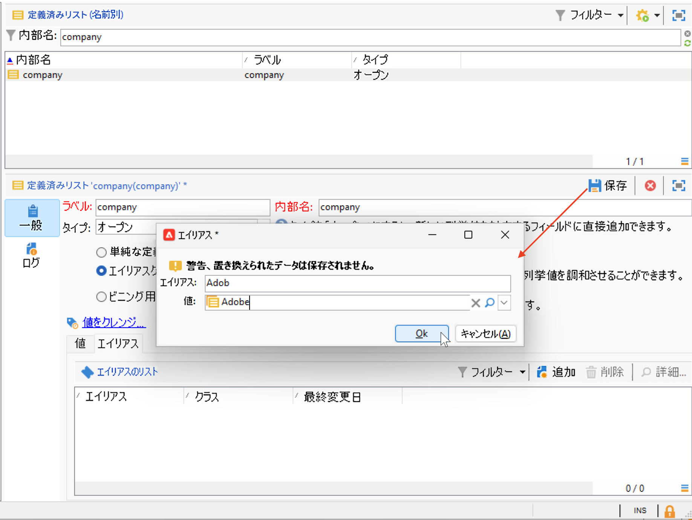
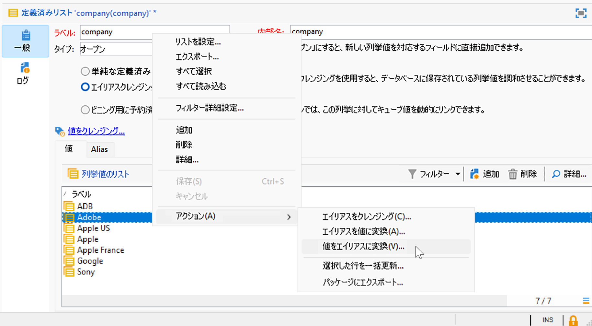
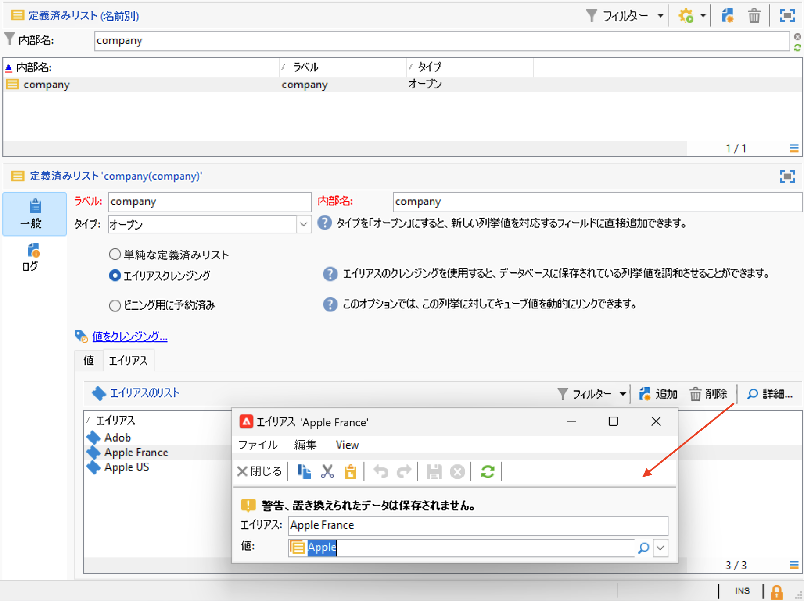

# Campaign ユーザーインターフェイスの設定 {#ui-settings}

## 列挙 {#enumerations}

列挙（「定義済みリスト」とも呼ばれます）とは、フィールドへの入力候補としてシステムによって提示される値のリストです。 列挙を使用してこれらのフィールドの値を標準化し、データ入力の際やクエリ内での使用に役立ちます。

値のリストはドロップダウンリストとして表示され、値を選択すると、その値がフィールドに入力されます。また、このドロップダウンリストでは、予測入力も可能です。最初の文字を入力すると、残りの文字がアプリケーションで補完されます。

この種のフィールドに関する、入力値の定義や全般的な管理作業（値の追加や削除）は、ツリーの&#x200B;**[!UICONTROL 管理／プラットフォーム／列挙]**&#x200B;ノードでおこなわれます。

### 列挙のタイプ {#types-of-enum}

列挙は、 **[!UICONTROL 管理/プラットフォーム/列挙]** エクスプローラーのフォルダー。

次のことが可能です。「開く」、「システム」、「顔文字」または「閉じる」。

* An **開く** 列挙を使用すると、ユーザーはこの列挙に基づいて新しい値を直接フィールドに追加できます。
* A **クローズ** 列挙には、 **[!UICONTROL 管理/プラットフォーム/列挙]** エクスプローラーのフォルダー。
* An **顔文字** 列挙は、顔文字のリストを更新するために使用されます。 詳細情報
* A **システム** 列挙はシステムフィールドに関連付けられており、内部名を持ちます。

の場合 **開く** および **クローズ** 列挙には、次の特定のオプションを使用できます。

* **単純な列挙** はデフォルトの標準タイプです。
* **エイリアスクレンジング** 列挙は、データベースに保存されている列挙値を調和させるために使用されます。 [詳細情報](#alias-cleansing)
* **ビニング用に予約** は、この列挙にキューブ値をリンクできるオプションです。 [詳細情報](../reporting/gs-cubes.md)

### エイリアスクレンジング {#alias-cleansing}

列挙フィールドでは、値を選択するか、ドロップダウンリストに表示されないカスタム値を入力できます。 カスタム値は、新しい列挙値として既存の列挙値に追加できます。この場合、 **[!UICONTROL 開く]** オプションを選択する必要があります。 これらのカスタム値は、エイリアスクレンジング機能を使用してクリーンアップできます。 例えば、ユーザーが `Adob` の代わりに `Adobe`エイリアスクレンジングプロセスでは、エイリアスを自動的に正しい用語に置き換えることができます。

>[!CAUTION]
>
>データクレンジングは、データベース内のデータに大きな影響を及ぼす重大なプロセスです。Adobe Campaign の大規模なデータ更新が実行され、場合によっては一部の値が削除される結果になることもあります。したがって、この操作はエキスパートユーザー向け機能として予約されています。

を有効にします。 **[!UICONTROL エイリアスクレンジング]** オプションを使用して列挙にデータクレンジング機能を使用することもできます。 このオプションを選択すると、ウィンドウの下部に「**[!UICONTROL エイリアス]**」タブが表示されます。

エイリアスクレンジングの列挙に存在しない値がユーザーによって入力されると、その値が **値** リスト。 以下が可能です。 [これらの値からエイリアスを作成](#convert-to-alias)または [新規エイリアスを最初から作成](#create-alias).

#### エイリアスの作成{#create-alias}

エイリアスを作成するには、次の手順に従います。

1. クリック **[!UICONTROL 追加]** ボタン **[!UICONTROL エイリアス]** タブをクリックします。
1. 変換するエイリアスを入力し、適用する値をドロップダウンリストから選択します。

   

1. クリック **[!UICONTROL Ok]** をクリックし、確認します。

1. 変更内容を保存します。値の置換は **エイリアスクレンジング** 毎晩実行されるワークフロー。 [データクレンジングの実行](#running-data-cleansing)を参照してください。

この列挙に基づくすべてのフィールドに対して、ユーザーが値を入力したとき **アドビ** (Adobe Campaignコンソールの web フォームの )「会社」フィールドでは、値で自動的に置き換えられます **Adobe**.

#### 誤った値をエイリアスに変換{#convert-to-alias}

また、既存の列挙値をエイリアスに変換することもできます。 次の手順を実行します。

1. 列挙の値のリストで、右クリックし、 **[!UICONTROL アクション… /値をエイリアスに変換…]**.

   

1. エイリアスに変換する値を選択し、 **[!UICONTROL 次へ]**.
1. 「**[!UICONTROL 開始]**」をクリックして変換を実行します。

   実行が完了すると、エイリアスがリストの **エイリアス** タブをクリックします。 正しい値を関連付けて、誤ったエントリを置き換えることができます。 次の手順を実行します。

1. クリーンアップする値を選択します。
1. 次をクリック： **詳細…** 」ボタンをクリックします。
1. ドロップダウンリストで新しい値を選択します。

   

>[!NOTE]
>
>別名が **[!UICONTROL ヒット数]** 列 **[!UICONTROL エイリアス]** サブタブを使用します。 この値が入力された回数を表示できます。  [詳細情報](#calculate-entry-occurrences)

#### データクレンジングの実行 {#running-data-cleansing}

データクレンジングは&#x200B;**[!UICONTROL エイリアスクレンジング]**&#x200B;ワークフローによって実行されます。デフォルトでは毎日実行されます。

クレンジングは **[!UICONTROL 値をクレンジング…]** リンク。

「**[!UICONTROL 詳細設定パラメーター]**」リンクでは、収集される値を処理対象にし始める日付を設定できます。

「**[!UICONTROL 開始]**」ボタンをクリックすると、データクレンジングが実行されます。

##### 発生件数の監視 {#calculate-entry-occurrences}

列挙の「**[!UICONTROL エイリアス]**」サブタブでは、入力されたすべての値の中に特定のエイリアスが含まれていた回数を表示できます。この情報は推定値であり、「**[!UICONTROL ヒット数]**」列に表示されます。

>[!CAUTION]
>
>エイリアスの入力回数を計算するには、長い時間が必要となる場合があります。

「**[!UICONTROL 値をクレンジング]**」リンクを使用すると、ヒット数の計算を手動で実行することもできます。これをおこなうには、 **[!UICONTROL 詳細設定パラメーター…]** リンクをクリックし、オプションを選択します。

* 「**[!UICONTROL エイリアスヒット数を更新]**」：入力された日付に基づいて、既に計算済みのヒット数を更新する場合に選択します。
* 「**[!UICONTROL 開始からのエイリアスのヒット数を再計算]**」：Adobe Campaign プラットフォーム全体に対して計算処理を実行する場合に選択します。

指定した期間について計算を自動実行する（例：週に 1 回）ための専用ワークフローを作成することもできます。

そのためには、**[!UICONTROL エイリアスクレンジング]**&#x200B;ワークフローのコピーを作成し、スケジューラーを変更して、**[!UICONTROL 列挙値のクレンジング]**&#x200B;で次の設定を使用します。

* **-updateHits**：エイリアスのヒット数を更新する場合
* **-updateHits:full**：エイリアスのヒット数をすべて再計算する場合
