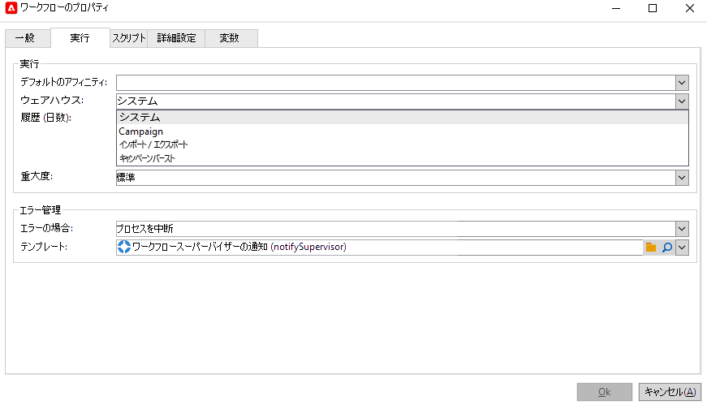
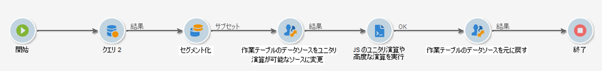

# プロセスの管理と自動化

Campaign を設定して、マーケティングキャンペーンの強力な自動処理機能を活用します。

次の設定をおこなうことができます。

* ワークフロー
* 繰り返しキャンペーン
* エンドツーエンドの検証サイクル
* アラート
* レポートの自動送信
* トリガーされるイベント

## ワークフローのデザインと使用{#gs-ac-wf}

Adobe Campaign ワークフローを使用すると、セグメントの作成やメッセージの準備から配信に至るまでの、マーケティングキャンペーンのあらゆる側面でスピードと規模を改善できます。

これらの[エンドツーエンドのユースケース](#end-to-end-uc)でワークフローをデザインする方法を説明します。

ワークフローのユーザーインターフェイスと実行について詳しくは、Campaign Classic v7 のドキュメントを参照してください。

* [ワークフローの概要](https://experienceleague.adobe.com/docs/campaign-classic/using/automating-with-workflows/introduction/about-workflows.html?lang=ja#automating-with-workflows){target=&quot;_blank&quot;}

* [ワークフローのベストプラクティス](https://experienceleague.adobe.com/docs/campaign-classic/using/automating-with-workflows/introduction/workflow-best-practices.html?lang=ja){target=&quot;_blank&quot;}

* [ビルトインのテクニカルワークフロー](https://experienceleague.adobe.com/docs/campaign-classic/using/automating-with-workflows/advanced-management/about-technical-workflows.html?lang=ja){target=&quot;_blank&quot;}

* [ワークフロー実行の監視](https://experienceleague.adobe.com/docs/campaign-classic/using/automating-with-workflows/monitoring-workflows/monitoring-workflow-execution.html?lang=ja){target=&quot;_blank&quot;}

* [マーケティングキャンペーンワークフローでのオーディエンスの作成](https://experienceleague.adobe.com/docs/campaign-classic/using/orchestrating-campaigns/orchestrate-campaigns/marketing-campaign-target.html?lang=ja#building-the-main-target-in-a-workflow){target=&quot;_blank&quot;}

## ワークフローアクティビティ {#wf-activities}

 使用可能なワークフローアクティビティについて詳しくは、[Campaign Classic v7 ドキュメント](https://experienceleague.adobe.com/docs/campaign-classic/using/automating-with-workflows/introduction/about-activities.html?lang=ja){target=&quot;_blank&quot;}を参照してください

ワークフローアクティビティはカテゴリ別にグループ分けされます。次の 4 つのアクティビティカテゴリを使用できます。

* [ターゲティングアクティビティ](https://experienceleague.adobe.com/docs/campaign-classic/using/automating-with-workflows/targeting-activities/about-targeting-activities.html?lang=ja){target=&quot;_blank&quot;}：クエリー、リスト読み込み、エンリッチメント、和集合など
* [フロー制御アクティビティ](https://experienceleague.adobe.com/docs/campaign-classic/using/automating-with-workflows/flow-control-activities/about-flow-control-activities.html?lang=ja){target=&quot;_blank&quot;}：スケジューラー、分岐、アラート、外部シグナルなど
* [アクションアクティビティ](https://experienceleague.adobe.com/docs/campaign-classic/using/automating-with-workflows/action-activities/about-action-activities.html?lang=ja){target=&quot;_blank&quot;}：クロスチャネル配信、JavaScript コード、CRM アクティビティ、集計の更新など
* [イベントアクティビティ](https://experienceleague.adobe.com/docs/campaign-classic/using/automating-with-workflows/action-activities/about-action-activities.html?lang=ja){target=&quot;_blank&quot;}：ファイル転送、web ダウンロードなど

### 「データソースを変更」アクティビティ {#change-data-source-activity}

「**[!UICONTROL データソースを変更]**」アクティビティを使用すると、ワークフロー&#x200B;**[!UICONTROL 作業用テーブル]**&#x200B;のデータソースを変更できます。これにより、FDA、FFDA、ローカルデータベースなど、様々なデータソースにわたって、より柔軟にデータを管理できます。

**[!UICONTROL ワークテーブル]**を使用すると、Adobe Campaign ワークフローでデータを処理し、ワークフローアクティビティとデータを共有できます。
デフォルトでは、**[!UICONTROL ワークテーブル]**&#x200B;は、クエリ対象のデータのソースと同じデータベースに作成されます。

例えば、クラウドデータベースに格納された&#x200B;**[!UICONTROL プロファイル]**&#x200B;テーブルに対してクエリを実行する場合、同じクラウドデータベースに&#x200B;**[!UICONTROL 作業用テーブル]**を作成します。
これを変更するには、「**[!UICONTROL データソースを変更]**」アクティビティを追加して、**[!UICONTROL 作業用テーブル]**&#x200B;に別のデータソースを選択します。

なお、「**[!UICONTROL データソースを変更]**」アクティビティを使用する場合、ワークフローの実行を続行するには、クラウドデータベースに戻す必要があります。

「**[!UICONTROL データソースを変更]**」アクティビティを使用するには：

1. ワークフローを作成します。

1. 「**[!UICONTROL クエリ]**」アクティビティでターゲット受信者にクエリを実行します。

   「**[!UICONTROL クエリ]**」アクティビティの詳細については、Campaign Classic v7 ドキュメントの[クエリ](https://experienceleague.adobe.com/docs/campaign-classic/using/automating-with-workflows/targeting-activities/query.html?lang=ja#creating-a-query)のページを参照してください。

1. 「**[!UICONTROL ターゲティング]**」タブから、「**[!UICONTROL データソースを変更]**」アクティビティを追加し、ダブルクリックして「**[!UICONTROL デフォルトデータソース]**」を選択します。

   クエリの結果を含んだワークテーブルが、デフォルトの PostgreSQL データベースに移動されます。

1. 「**[!UICONTROL アクション]**」タブから、「**[!UICONTROL JavaScript コード]**」アクティビティをドラッグ＆ドロップして、作業用テーブルに対して単一の操作を実行します。

   「**[!UICONTROL JavaScript コード]**」アクティビティの詳細については、Campaign Classic v7 ドキュメントの [JavaScript コードと高度な JavaScript コード](https://experienceleague.adobe.com/docs/campaign-classic/using/automating-with-workflows/action-activities/sql-code-and-javascript-code.html?lang=ja#javascript-code)の節を参照してください。

1. 別の「**[!UICONTROL データソースを変更]**」アクティビティを追加して、クラウドデータベースに戻します。

   アクティビティをダブルクリックし、「**[!UICONTROL アクティブな FDA 外部アカウント]**」を選択してから、対応する外部アカウントを選択します。

1. これで、ワークフローを開始できます。

## 仮想ウェアハウスの管理 {#warehouse}

ワークフローを作成した後、「**[!UICONTROL プロパティ]**」ボタンを使用して追加のオプションにアクセスし、さらに詳細な設定を行うことができます。

 **ワークフロープロパティ**&#x200B;について詳しくは、[Campaign Classic v7 ドキュメント](https://experienceleague.adobe.com/docs/campaign-classic/using/automating-with-workflows/advanced-management/workflow-properties.html?lang=ja){target=&quot;_blank&quot;}を参照してください。

ワークフローの&#x200B;**[!UICONTROL プロパティ]**&#x200B;の「**[!UICONTROL 実行]**」タブで、ワークフローを様々なウェアハウスにリンクし、ワークロード管理を最適化することができます。**ウェアハウス**&#x200B;について詳しくは、[Snowflake ドキュメント](https://docs.snowflake.com/ja/user-guide/warehouses-overview.html)を参照してください。

ワークフローの目的に応じて、「**[!UICONTROL ウェアハウス]**」ドロップダウンから次の 3 つのウェアハウスを選択できます。

* **[!UICONTROL デフォルト]**／**[!UICONTROL キャンペーン]**：ワークフローの新規作成時にデフォルトで設定されます。

* **[!UICONTROL インポート／エクスポート]**：アクティビティのパフォーマンスを最適化するために、インポートワークフローまたはエクスポートワークフローで設定する必要があります。

* **[!UICONTROL キャンペーンバースト]**：配信の処理時間を最適化するために、キャンペーンワークフローまたは配信ワークフローで設定する必要があります。

>[!NOTE]
>
>**[!UICONTROL システム]**&#x200B;ウェアハウスは組み込みワークフローの場合にのみ設定されます。

## 繰り返しキャンペーンの設定

繰り返しワークフローをデザインし、ワークフローを実行するたびに新しい配信インスタンスを作成します。 たとえば、ワークフローが週に 1 回実行されるよう設計されている場合、1 年後には 52 件の配信が存在することになります。つまり、ログは各配信インスタンスで区切られます。

 繰り返しキャンペーンの作成方法については、[Campaign Classic v7 ドキュメント](https://experienceleague.adobe.com/docs/campaign-classic/using/orchestrating-campaigns/orchestrate-campaigns/setting-up-marketing-campaigns.html?lang=ja#recurring-and-periodic-campaigns){target=&quot;_blank&quot;}を参照してください。

## トリガーイベントの活用

Campaign トランザクションメッセージを使用すると、情報システムからトリガーされるイベントに基づいて、メッセージを自動的に生成できます。 トランザクションメッセージの例としては、請求書送付、注文確認、配送確認、パスワード変更、商品の在庫切れ通知、取引明細書送付、Web サイトのアカウント作成などがあります。 これらのメッセージは、個別に送信することも、メール、SMS、またはプッシュ通知を介してバッチで送信することもできます。

トランザクションメッセージ機能について詳しくは、[この節](../send/transactional.md)を参照してください。

Adobe Campaign と Adobe Analytics を接続して、ユーザーのアクションを把握し、パーソナライズされたメッセージをほぼリアルタイムで送信できます。

Campaign を他のソリューションと統合する方法については、[この節](../start/connect.md)を参照してください

## ワークフローのエンドツーエンドのユースケース{#end-to-end-uc}

この節では、Campaign ワークフロー機能を活用する様々なユースケースを示します。これらのユースケースは、Adobe Campaign Classic v7 で作成され、Adobe Campaign v8 にも適用されます。

### 配信 {#deliveries}

* [A/B テスト](https://experienceleague.adobe.com/docs/campaign-classic/using/sending-messages/a-b-testing/use-case/a-b-testing-use-case.html?lang=ja){target=&quot;_blank&quot;}

   ターゲティングワークフローを使用して、2 つのメール配信コンテンツを比較する方法を説明します。 メッセージとテキストは両方の配信で同じものを使用し、レイアウトだけを変更します。ターゲットの母集団は、2 つのテストグループと、その他の母集団の 3 つに分割します。各テストグループに別々のバージョンを配信します。

* [誕生日メールの送信](https://experienceleague.adobe.com/docs/campaign-classic/using/automating-with-workflows/use-cases/deliveries/sending-a-birthday-email.html?lang=ja){target=&quot;_blank&quot;}

   この使用例では、受信者のリストに対して、受信者の誕生日に、定期メールを送信する計画の策定方法を示します。

* [配信コンテンツの読み込み](https://experienceleague.adobe.com/docs/campaign-classic/using/automating-with-workflows/use-cases/deliveries/loading-delivery-content.html?lang=ja){target=&quot;_blank&quot;}
リモートサーバー上の HTML ファイルに配信コンテンツが格納されている場合、このコンテンツを Adobe Campaign 配信に容易に読み込むことができます。

* [クロスチャネル配信ワークフロー](https://experienceleague.adobe.com/docs/campaign-classic/using/automating-with-workflows/use-cases/deliveries/cross-channel-delivery-workflow.html?lang=ja){target=&quot;_blank&quot;}

   クロスチャネル配信ワークフローの作成方法を説明します。 目的は、データベースの受信者から、オーディエンスを別のグループへとセグメント化し、最初のグループはメール、もう 1 つのグループに SMS を送信することです。

* [カスタム日付フィールドを使用したメールのエンリッチメント](https://experienceleague.adobe.com/docs/campaign-classic/using/automating-with-workflows/use-cases/deliveries/email-enrichment-with-custom-date-fields.html?lang=ja){target=&quot;_blank&quot;}

   今月が誕生日のプロファイルに、カスタムデータフィールドを含む電子メールを送信する方法を説明します。 メールには、誕生日の前後 1 週間有効なクーポンが含まれます。

* [コンテンツの作成、編集、公開の自動化](https://experienceleague.adobe.com/docs/campaign-classic/using/sending-messages/content-management/automating-via-workflows.html?lang=ja){target=&quot;_blank&quot;}

   Campaign コンテンツ管理アドオンを使用して、コンテンツブロックの作成と配信を自動化する方法を説明します。

### 監視 {#monitoring}

* [リストへのレポートの送信](https://experienceleague.adobe.com/docs/campaign-classic/using/automating-with-workflows/use-cases/monitoring/sending-a-report-to-a-list.html?lang=ja){target=&quot;_blank&quot;}

   月次のビルトイントラッキング指標レポートを PDF 形式で生成し、Campaign オペレーターのリストに送信する方法を説明します。

* [ワークフローの監視](https://experienceleague.adobe.com/docs/campaign-classic/using/automating-with-workflows/use-cases/monitoring/supervising-workflows.html?lang=ja){target=&quot;_blank&quot;}

   ワークフローの一連のステータス（「一時停止」、「停止」、「エラーあり」）を監視できる、ワークフローの作成方法を説明します。

* [オペレーターへのパーソナライズされたアラートの送信](https://experienceleague.adobe.com/docs/campaign-classic/using/automating-with-workflows/use-cases/monitoring/sending-personalized-alerts-to-operators.html?lang=ja){target=&quot;_blank&quot;}

   ニュースレターを開封したが、そこに含まれるリンクはクリックしなかったプロファイルの名前を記載したアラートをオペレーターに送信する方法について説明します。

### データ管理 {#management}

* [データ更新の調整](https://experienceleague.adobe.com/docs/campaign-classic/using/automating-with-workflows/use-cases/data-management/coordinating-data-updates.html?lang=ja){target=&quot;_blank&quot;}

   別の更新操作を実行する前に、更新プロセスが終了していることを確認する方法について説明します。そのためには、インスタンス変数を設定し、ワークフローの実行を継続して更新を行うべきかを判断するため、インスタンスが実行中かどうかをワークフローでテストします。

* [概要リストの作成](https://experienceleague.adobe.com/docs/campaign-classic/using/automating-with-workflows/use-cases/data-management/creating-a-summary-list.html?lang=ja){target=&quot;_blank&quot;}

   ファイルを収集していくつかのエンリッチメントを加えてから概要リストを作成できる、ワークフローの作成方法を説明します。 この例では、店舗で購入をおこなった顧客の連絡先のリストをベースにします。

* [データのエンリッチメント](https://experienceleague.adobe.com/docs/campaign-classic/using/automating-with-workflows/use-cases/data-management/enriching-data.html?lang=ja){target=&quot;_blank&quot;}

   最近競争に参加したプロファイルに、スコアに応じてパーソナライズされた配信を送信する方法を説明します。

* [集計の使用](https://experienceleague.adobe.com/docs/campaign-classic/using/automating-with-workflows/use-cases/data-management/using-aggregates.html?lang=ja){target=&quot;_blank&quot;}

   データベースに最後に追加された受信者を特定する方法を説明します。

* [増分クエリを使用した四半期ごとのリスト更新](https://experienceleague.adobe.com/docs/campaign-classic/using/automating-with-workflows/use-cases/designing-queries/quarterly-list-update.html?lang=ja){target=&quot;_blank&quot;}

   増分クエリを使用して受信者リストを自動更新する方法を説明します。

* [繰り返し読み込みワークフローの設定](https://experienceleague.adobe.com/docs/campaign-classic/using/automating-with-workflows/use-cases/data-management/recurring-import-workflow.html?lang=ja){target=&quot;_blank&quot;}

   Adobe Campaign データベースの CRM からプロファイルを読み込むために再利用できる、ワークフローの設計方法を説明します。

### ターゲティング {#designing-queries}

* [受信者テーブルのクエリー](https://experienceleague.adobe.com/docs/campaign-classic/using/automating-with-workflows/use-cases/designing-queries/querying-recipient-table.html?lang=ja){target=&quot;_blank&quot;}

   メールドメインが「orange.co.uk」で、かつロンドンに居住していない受信者について、名前とメールを復元する方法を説明します。

* [配信情報のクエリ](https://experienceleague.adobe.com/docs/campaign-classic/using/automating-with-workflows/use-cases/designing-queries/querying-delivery-information.html?lang=ja){target=&quot;_blank&quot;}

   配信情報に関するクエリを定義して、プロファイルの動作を取得する方法について説明します。

* [集計の計算](https://experienceleague.adobe.com/docs/campaign-classic/using/automating-with-workflows/use-cases/designing-queries/performing-aggregate-computing.html?lang=ja){target=&quot;_blank&quot;}

   ロンドン在住のプロファイルの数を、性別に基づいてカウントする方法を説明します。

* [多対多関係を使用したクエリ](https://experienceleague.adobe.com/docs/campaign-classic/using/automating-with-workflows/use-cases/designing-queries/querying-using-many-to-many-relationship.html?lang=ja){target=&quot;_blank&quot;}

   過去 7 日間連絡していないプロファイルを見つける方法を説明します。

* [クエリでのインスタンス変数の呼び出し](https://experienceleague.adobe.com/docs/campaign-classic/using/automating-with-workflows/advanced-management/javascript-scripts-and-templates.html?lang=ja#example){target=&quot;_blank&quot;}

   インスタンス変数を使用して、母集団に適用する分割率を動的に計算する方法について説明します。

<!--
### Change data source activity {#data-source-uc}

The **[!UICONTROL Change data source]** activity allows you to change the data source of a workflow **[!UICONTROL Working table]**. 

In this use case, learn how to use the **[!UICONTROL Change data source]** activity to perform unitary operations to insert or update information to the recipient table.

1. Create a workflow and add a **[!UICONTROL Start]** activity.

1. Query your targeted recipients from the NmsRecipient table with a **[!UICONTROL Query]** activity. 

    For more information on the **[!UICONTROL Query]** activity, refer to the [Query](https://experienceleague.adobe.com/docs/campaign-classic/using/automating-with-workflows/targeting-activities/query.html#creating-a-query) page in Campaign Classic V7 documentation.

1. 

1. From the **[!UICONTROL Targeting]** tab, add a **[!UICONTROL Change data source]** activity and double-click it to select **[!UICONTROL Default data source]**.
    
    The working table, which contains the result of your query, is then moved to the default PostgreSQL database.

1. From the **[!UICONTROL Actions]** tab, drag and drop a **[!UICONTROL JavaScript code]** activity to perform unitary operations on the working table.

1. Add another **[!UICONTROL Change data source]** activity to revert back to the Cloud database. 
    
    Double-click your activity and select **[!UICONTROL Active FDA external account]** then the corresponding external account.

1. Add an **[!UICONTROL End]** activity and start your workflow.
-->

