# Adobe Campaign と Adobe Analytics の連携

Adobe Analyticsを設定して、CampaignとAnalyticsを統合できます。

この統合により、Adobe CampaignとAdobe Analyticsは、**Web分析コネクタ**&#x200B;アドオンを介してやり取りできます。 この統合は、Adobe CampaignからAdobe Analyticsに配信されたEメールキャンペーンの指標と属性を送信します。

Adobe Campaignでは、Adobe Analyticsコネクタを使用してインターネットオーディエンスを測定できます（Web分析）。 Web分析ツールを使用すると、Adobe Campaignは指標とキャンペーン属性をAnalyticsに転送できます。

各ツールの動作の周長は次のとおりです。

* **Adobe Analytics**

   * Adobe Campaign で開始された E メールキャンペーンにマークを付けます。
   * 受信者がキャンペーンメールのクリック後に参照したサイトでの行動をセグメントの形式で保存します。セグメントは、離脱した製品（閲覧されたが、カートへの追加や購入は行われなかった）、購入またはカート放棄を対象とします。

* **Adobe Campaign**

   * 指標およびキャンペーン属性をコネクタに送信します。コネクタはそれを web 分析ツールに転送します。
   * セグメントを復元し分析します。
   * リマーケティングキャンペーンをトリガーします。

[!DNL :speech_balloon:]  管理対象Cloud Servicesのユーザーは、アドビに [連絡](../start/campaign-faq.md#support) して、Adobe AnalyticsコネクタをCampaignと統合してください。Web分析コネクタアドオンは、専用パッケージを使用して、お使いの環境にインストールする必要があります。

>[!CAUTION]
>
>Adobe Analytics Connector には、トランザクションメッセージ（Message Center）との互換性はありません。

CampaignとAnalyticsの接続を設定するには、次の操作を実行する必要があります。

1. [Adobe Analyticsでのレポートスイートの作成](#report-suite-analytics)
1. [コンバージョン変数と成功イベントの設定](#configure-conversion-success)
1. [Adobe Campaignでの外部アカウントの設定](#external-account-ac)

## Adobe Analytics {#report-suite-analytics}でのレポートスイートの作成

**[!UICONTROL [!DNL Adobe Analytics]にレポートスイート]**&#x200B;を作成するには、次の手順に従います。

1. [!DNL Adobe Analytics]から、「**[!UICONTROL 管理」タブ]**&#x200B;を選択し、「**[!UICONTROL すべての管理者]**」をクリックします。

   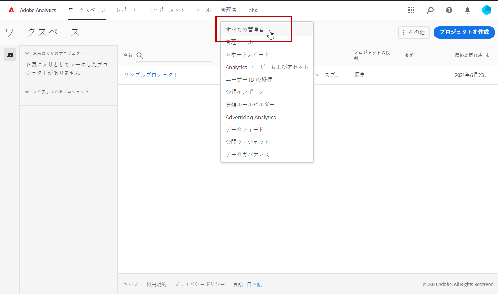

1. 「**[!UICONTROL レポートスイート]**」をクリックします。

   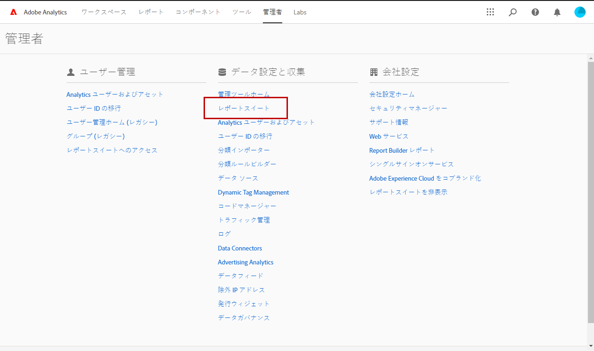

1. **[!UICONTROL Report suite manager]**&#x200B;ページで、「**[!UICONTROL 新しい&lt;a3/を作成」、「**[!UICONTROL &#x200B;レポートスイート&#x200B;]**」の順にクリックします。]**

   **[!UICONTROL レポートスイート]**&#x200B;の作成に関する詳細な手順については、この[節](https://experienceleague.adobe.com/docs/analytics/admin/manage-report-suites/new-report-suite/t-create-a-report-suite.html?lang=en#prerequisites)を参照してください。

   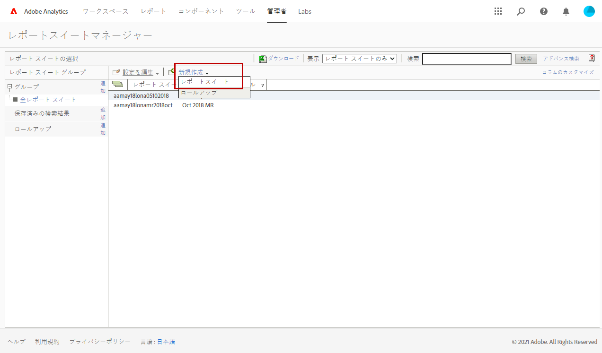

1. テンプレートを選択します.

1. 次の情報を使用して、新しいレポートスイートを設定します。

   * **[!UICONTROL レポートスイート ID]**
   * **[!UICONTROL サイトのタイトル]**
   * **[!UICONTROL タイムゾーン]**
   * **[!UICONTROL Go Live日]**
   * **[!UICONTROL 予想日別ページビュー数]**

   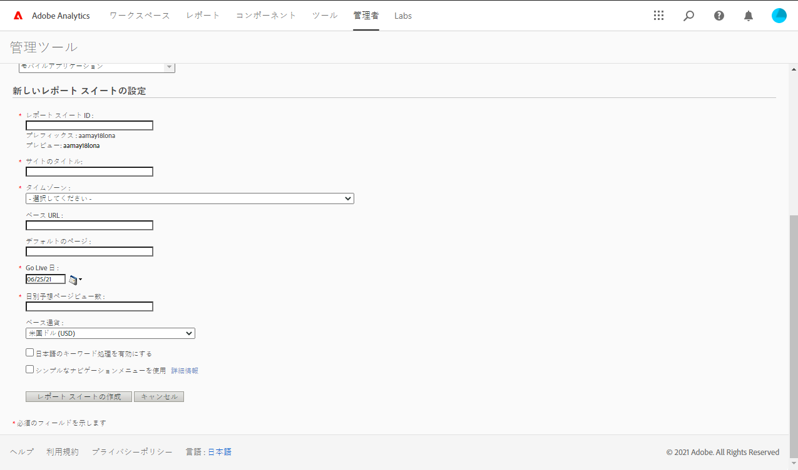

1. 設定が完了したら、「**[!UICONTROL レポートスイートを作成]**」をクリックします。

## コンバージョン変数と成功イベントの設定{#configure-conversion-success}

**[!UICONTROL レポートスイート]**&#x200B;を作成した後、次のように&#x200B;**[!UICONTROL コンバージョン変数]**&#x200B;と&#x200B;**[!UICONTROL 成功イベント]**&#x200B;を設定する必要があります。

1. 以前に設定した&#x200B;**[!UICONTROL レポートスイート]**&#x200B;を選択します。

1. 「**[!UICONTROL 設定を編集]**」ボタンから、**[!UICONTROL コンバージョン]**/**[!UICONTROL コンバージョン変数]**&#x200B;を選択します。

   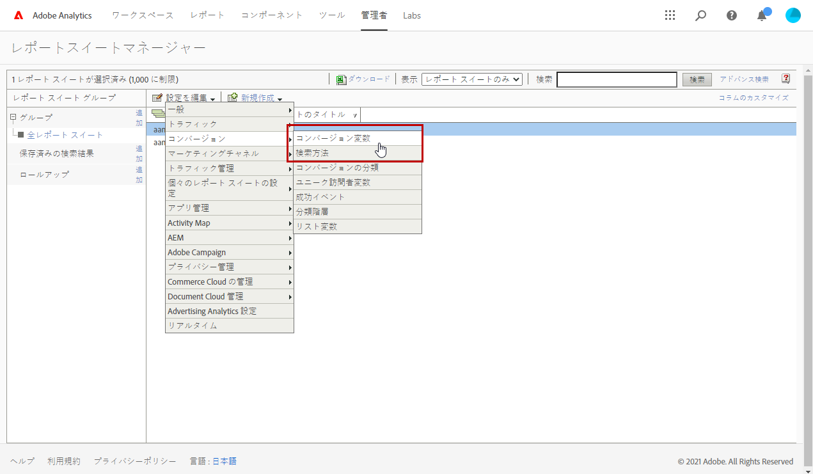

1. 「**[!UICONTROL 新しい]**&#x200B;を追加」をクリックして、電子メールキャンペーンの影響を測定するために必要なID(内部キャンペーン名(cid)とiNmsBroadlog(bid)テーブルID)を作成します。

   **[!UICONTROL コンバージョン変数]**&#x200B;の編集方法については、の節を参照してください。

   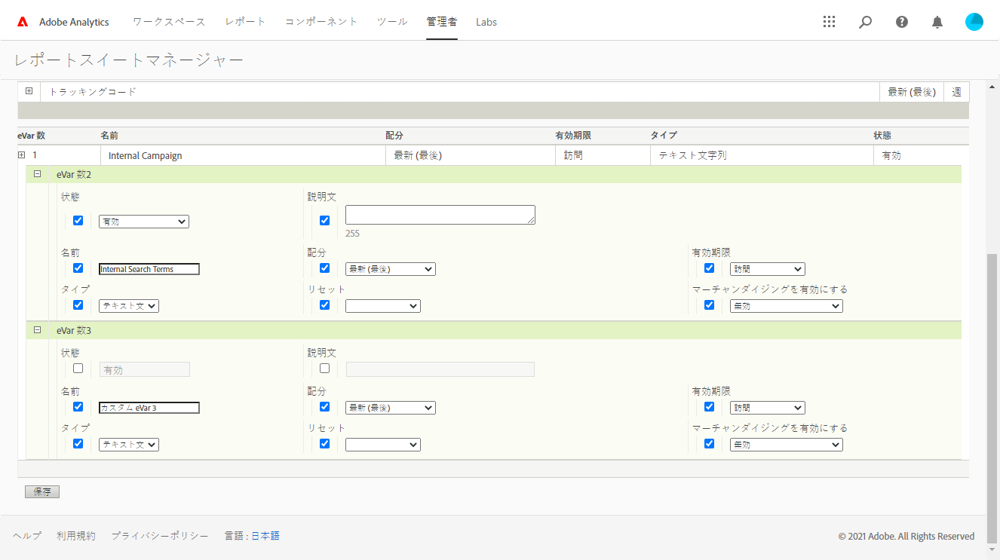

1. 終了したら「**[!UICONTROL 保存]**」をクリックします。

1. 次に、**[!UICONTROL 成功イベント]**&#x200B;を作成するには、**[!UICONTROL 「設定を編集]**」ボタンから&#x200B;**[!UICONTROL コンバージョン]**/**[!UICONTROL 成功イベント]**&#x200B;を選択します。

   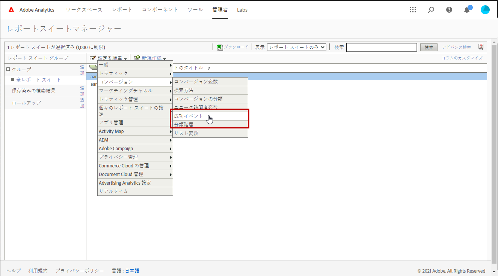

1. **[!UICONTROL 新しい]**&#x200B;を追加をクリックして、次の&#x200B;**[!UICONTROL 成功イベント]**&#x200B;を設定します。

   * **[!UICONTROL クリック済み]**
   * **[!UICONTROL 開封済み]**
   * **[!UICONTROL ユーザーがクリック]**
   * **[!UICONTROL 処理済み]**
   * **[!UICONTROL スケジュール済み]**
   * **[!UICONTROL 送信済み]**
   * **[!UICONTROL バウンス数合計]**
   * **[!UICONTROL ユニーククリック数]**
   * **[!UICONTROL ユニーク開封数]**
   * **[!UICONTROL 購読解除済み]**

   **[!UICONTROL 成功イベント]**&#x200B;の設定方法については、を参照してください。

   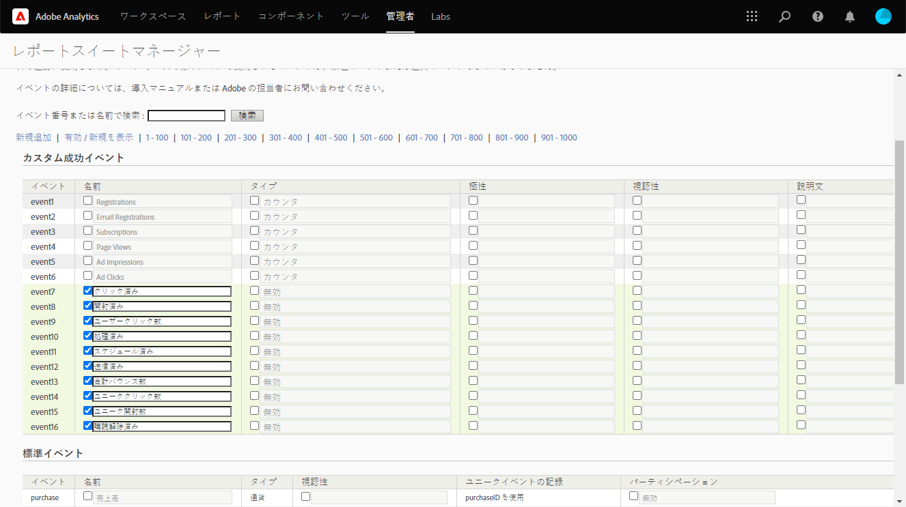

1. 終了したら「**[!UICONTROL 保存]**」をクリックします。

レポートスイートを設定する際に、Adobe Campaignで&#x200B;**[!UICONTROL 外部アカウント]**&#x200B;を設定する必要があります。

## Adobe Campaign {#external-account-ac}での外部アカウントの設定

次に、Adobe Campaignで&#x200B;**[!UICONTROL Web Analytics]**&#x200B;外部アカウントを設定して、2つのソリューション間の同期を有効にする必要があります。

外部アカウントの設定時に&#x200B;**[!UICONTROL レポートスイート]**、**[!UICONTROL コンバージョン変数]**&#x200B;または&#x200B;**[!UICONTROL 成功イベント]**&#x200B;のいずれかが表示されない場合は、ユーザーに関連付けられた&#x200B;**[!UICONTROL 製品プロファイル]**&#x200B;に権限がありません。

詳しくは、 Adobe Analytics](https://experienceleague.adobe.com/docs/analytics/admin/admin-console/permissions/product-profile.html?lang=en#product-profile-admins)の製品プロファイルの[ページを参照してください。

1. Adobe Campaignツリーの&#x200B;**[!UICONTROL 管理]** / **[!UICONTROL プラットフォーム]** / **[!UICONTROL 外部アカウント]**&#x200B;フォルダーに移動し、「**[!UICONTROL 新規]**」をクリックします。

   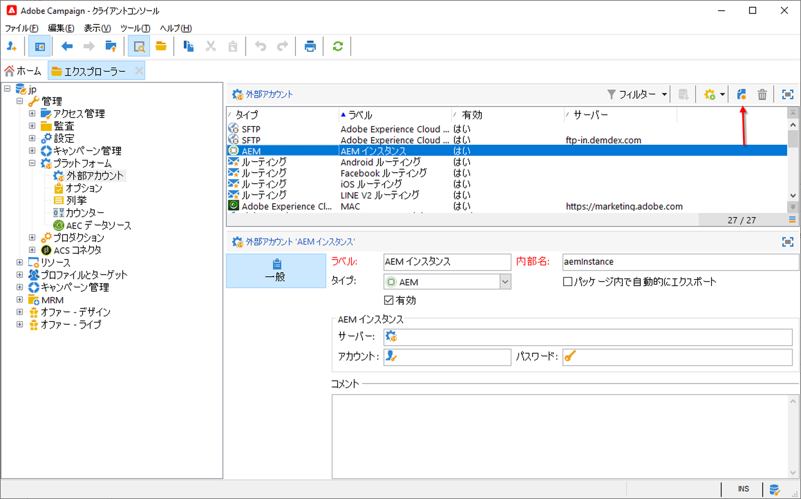

1. ドロップダウンリストを使用して、**[!UICONTROL 統合]**&#x200B;ドロップダウンから&#x200B;**[!UICONTROL Web分析]**&#x200B;タイプと&#x200B;**[!UICONTROL Adobe Analytics]**&#x200B;タイプを選択します。

   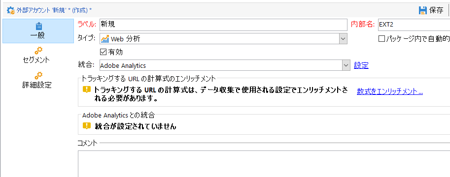

1. **[!UICONTROL 統合]**&#x200B;ドロップダウンの横にある&#x200B;**[!UICONTROL 設定]**&#x200B;をクリックします。

1. **[!UICONTROL Analytics統合の設定]**&#x200B;ウィンドウで、以前に作成したレポートスイートに外部アカウントをマッピングし、次の情報を提供します。

   * **[!UICONTROL E メール]**
   * **[!UICONTROL IMS Org]**
   * **[!UICONTROL Analytics の会社]**
   * **[!UICONTROL レポートスイート]**

1. **[!UICONTROL eVars]**&#x200B;カテゴリから、[!DNL Adobe Analytics]で設定した2つの&#x200B;**[!UICONTROL コンバージョン変数]**&#x200B;をマッピングします。

   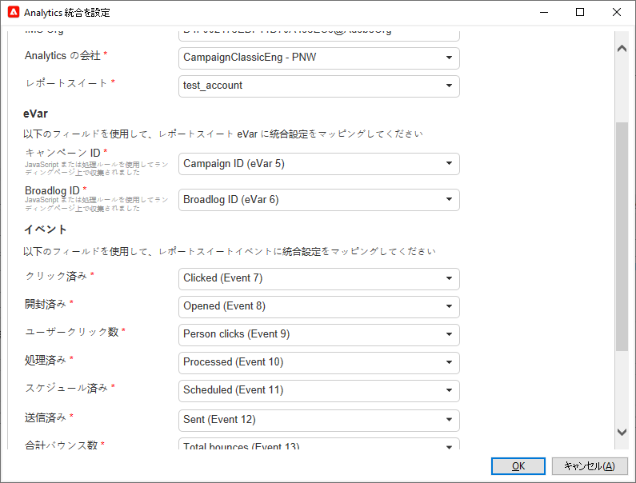

1. **[!UICONTROL イベント]**&#x200B;カテゴリから、[!DNL Adobe Analytics]で設定された10個の&#x200B;**[!UICONTROL 成功イベント]**&#x200B;をマッピングします。

1. 終了したら「**[!UICONTROL 送信]**」をクリックします。 Adobe Campaignは、マッピングされたAnalyticsの&#x200B;**[!UICONTROL レポートスイート]**&#x200B;に、**[!UICONTROL データソース]**、**[!UICONTROL 計算指標]**、**[!UICONTROL リマーケティングセグメント]**&#x200B;および&#x200B;**[!UICONTROL 分類]**&#x200B;を作成します。

   [!DNL Adobe Analytics]とAdobe Campaignの同期が完了したら、ウィンドウを閉じることができます。

1. 設定は、**[!UICONTROL Analytics統合の設定]**&#x200B;ウィンドウの「**[!UICONTROL データ設定]**」タブで確認できます。

   **[!UICONTROL 「]**&#x200B;を同期」ボタンを使用して、[!DNL Adobe Campaign]は[!DNL Adobe Analytics]で行った名前の変更を同期します。 [!DNL Adobe Analytics]内でコンポーネントを削除すると、[!DNL Adobe Campaign]内で取り消し線が引かれるか、**not found**&#x200B;メッセージと共に表示されます。

   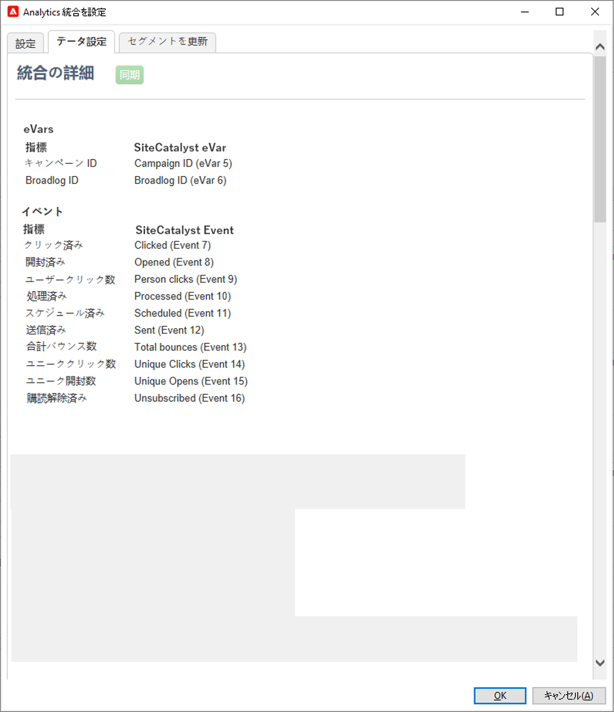

1. 必要に応じて、「**[!UICONTROL セグメントを更新]**」タブでセグメントを追加または削除できます。

1. **[!UICONTROL 外部アカウント]**&#x200B;から、「**[!UICONTROL 数式をエンリッチメント…」をクリックします。]**&#x200B;リンクをクリックして、Web分析ツールの統合情報（キャンペーンID）と、アクティビティを追跡する必要があるサイトのドメインを指定する、URLの計算式を変更します。

   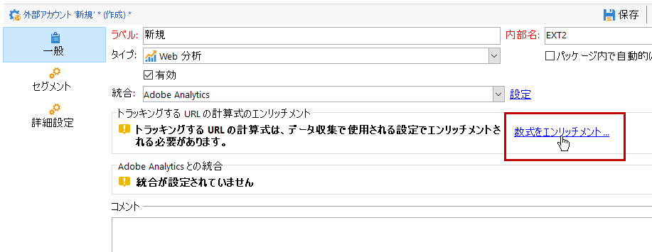

1. サイトのドメイン名を指定します。

   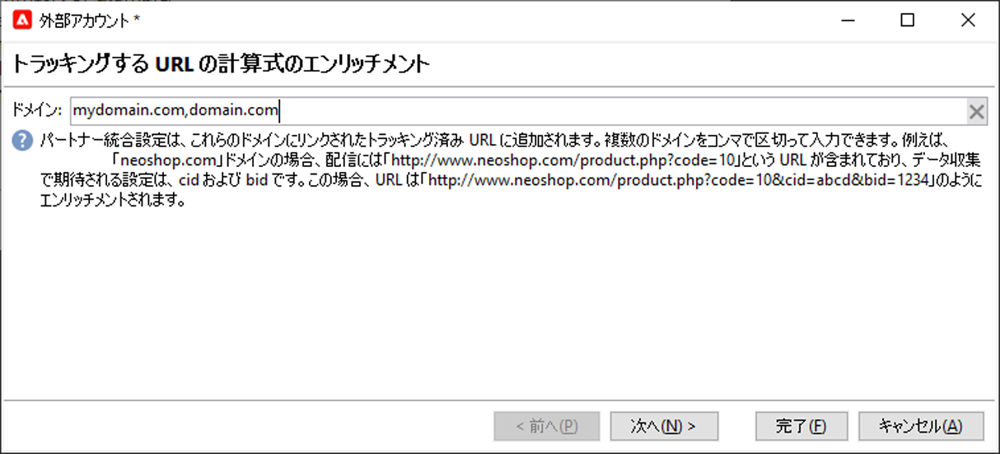

1. 「**[!UICONTROL 次へ]**」をクリックし、ドメイン名が保存されていることを確認します。

   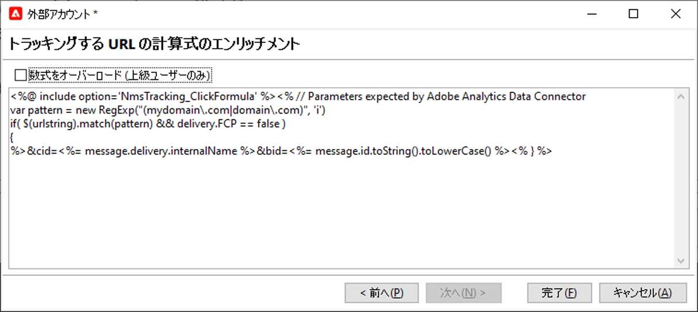

1. 必要に応じて、計算式をオーバーロードできます。 そのためには、ボックスをオンにして、ウィンドウで式を直接編集します。

   >[!IMPORTANT]
   >
   >この設定モードは、エキスパートユーザー向けに用意されています。この式にエラーがあると、eメール配信が停止する場合があります。

1. 「**[!UICONTROL 詳細設定]**」タブでは、より技術的な設定を設定または変更できます。

   * **[!UICONTROL 存続期間]**：Adobe Campaign でテクニカルワークフローで Web イベントを収集するまでの期間（日数）を指定できます。デフォルト：180 日。
   * **[!UICONTROL 持続]**：すべての Web イベント（購入など）をリマーケティングキャンペーンの属性にできる期間を指定できます。デフォルト：7 日。

>[!NOTE]
>
>複数のオーディエンス測定ツールを使用する場合は、外部アカウントの作成時に&#x200B;**[!UICONTROL パートナー]**&#x200B;ドロップダウンリストで「**[!UICONTROL その他]**」を選択できます。配信プロパティの 1 つの外部アカウントのみを参照できます。そのため、トラッキングされる URL の式を調整する必要があります。調整するには、Adobe および使用される他のすべての測定ツールで想定されているパラメーターを追加します。

## Web 分析プロセスのテクニカルワークフロー {#technical-workflows-of-web-analytics-processes}

Adobe CampaignとAdobe Analytics間のデータ交換は、バックグラウンドタスクとして実行されるテクニカルワークフローで処理されます。

このワークフローは、Campaignエクスプローラーツリーの&#x200B;**[!UICONTROL 管理]** / **[!UICONTROL プロダクション]** / **[!UICONTROL テクニカルワークフロー]** / **[!UICONTROL Web分析プロセス]**&#x200B;フォルダーで使用できます。

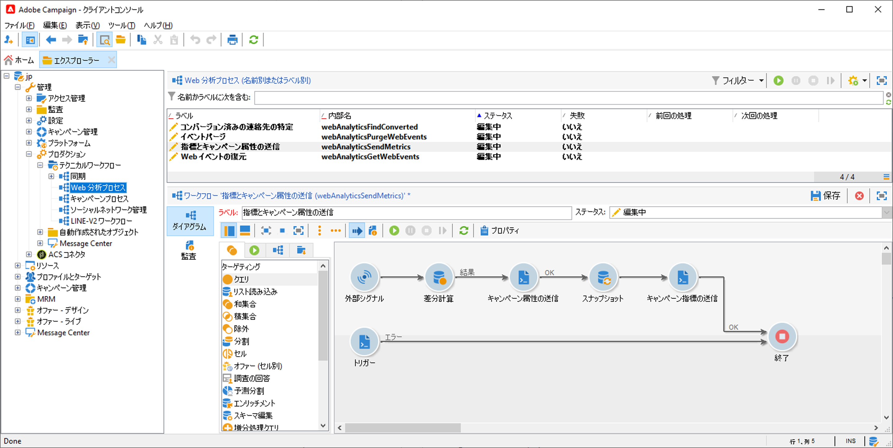

**[!UICONTROL 指標とキャンペーン属性の送信]**&#x200B;ワークフローを使用すると、Adobe Analyticsコネクタを使用してAdobe Campaign経由でAdobe Experience Cloudに電子メールキャンペーン指標を送信できます。 このワークフローは毎日午前 4 時にトリガーされ、データを Analysis に送信するには 24 時間かかります。

ワークフローは再起動しないでください。再起動すると、以前のデータがすべて再送され、Analytics の結果に歪みが生じる可能性があります。

含まれる指標は次のとおりです。

* **[!UICONTROL 配信するメッセージ]**（@toDeliver）
* **[!UICONTROL 処理済み]**（@processed）
* **[!UICONTROL 成功]**（@success）
* **[!UICONTROL オープン数合計]**（@totalRecipientOpen）
* **[!UICONTROL 開封した受信者]**（@recipientOpen）
* **[!UICONTROL クリックした受信者の合計数]**（@totalRecipientClick）
* **[!UICONTROL クリックした人]**（@personClick）
* **[!UICONTROL ユニーククリック数]**（@recipientClick）
* **[!UICONTROL オプトアウト]**（@optOut）
* **[!UICONTROL エラー]**（@error）

>[!NOTE]
>
>送信されたデータは最後のスナップショットに基づいたデルタであり、指標データの値がマイナスになる可能性があります。

送信される属性は次のとおりです。

* **[!UICONTROL 内部名]**（@internalName）
* **[!UICONTROL ラベル]**（@label）
* **[!UICONTROL ラベル]** (operation/@label)：**キャンペーン**&#x200B;パッケージがインストールされている場合のみ
* **[!UICONTROL 特性]** (operation/@nature)：**キャンペーン**&#x200B;パッケージがインストールされている場合のみ
* **[!UICONTROL タグ 1]** (webAnalytics/@tag1)
* **[!UICONTROL タグ 2]** (webAnalytics/@tag2)
* **[!UICONTROL タグ 3]** (webAnalytics/@tag3)
* **[!UICONTROL コンタクト日]** (scheduling/@contactDate)

## Adobe Campaign での配信のトラッキング {#tracking-deliveries-in-adobe-campaign}

Adobe Campaign で配信を送信した後、Adobe Experience Cloud でサイト上のアクティビティをトラッキングできるようにするには、配信プロパティで対応するコネクタを参照する必要があります。それには、次の手順に従います。

1. トラッキングするキャンペーンの配信を開きます。

   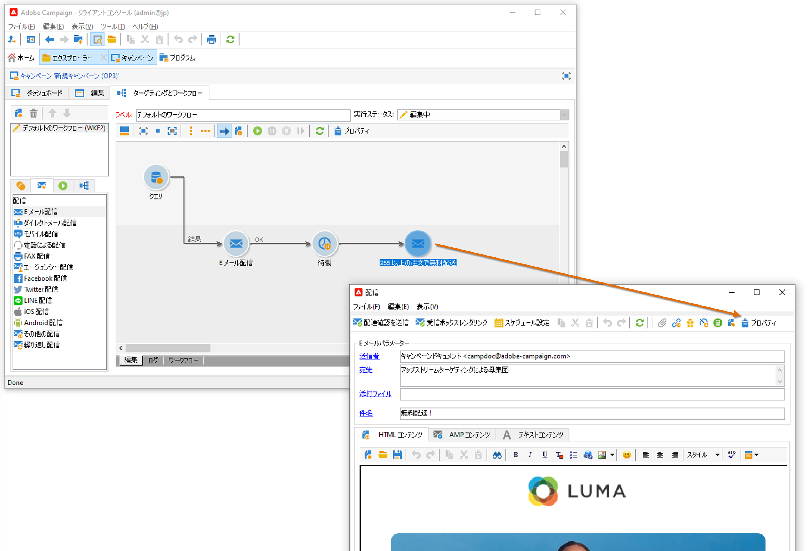

1. 配信プロパティを開きます。
1. 「**[!UICONTROL Web 分析]**」タブに移動し、前に作成した外部アカウントを選択します。[Adobe Campaign](#external-account-ac)での外部アカウントの設定を参照してください。

   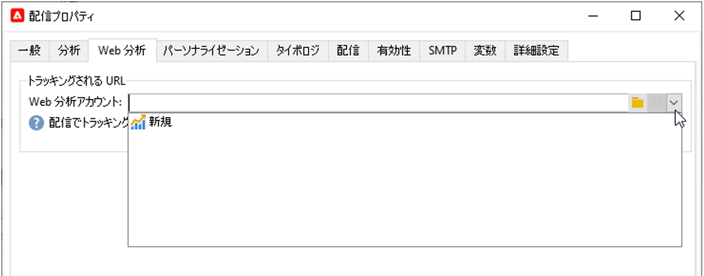

1. 配信を送信し、Adobe Analytics でそのレポートにアクセスできるようになりました。

## リマーケティングキャンペーンの作成 {#creating-a-re-marketing-campaign}

リマーケティングキャンペーンを準備するには、リマーケティングタイプのキャンペーンに使用する配信テンプレートを作成します。次に、リマーケティングキャンペーンを設定し、セグメントにリンクします。セグメントごとに異なるリマーケティングキャンペーンが必要です。

Adobe Campaign で最初のキャンペーンでターゲットとした受信者の行動を分析し、セグメントの収集が終了すると、リマーケティングキャンペーンが自動的に開始されます。カートが放棄されたか、製品を表示しても購入に至らなかった場合、サイトのブラウジングが購入につながるように、対象の受信者に配信が送信されます。

Adobe Campaign にはパーソナライズされた配信テンプレートが用意されており、これを使用するか、またはこれをベースとして使用することによってキャンペーンを準備することができます。

1. **[!UICONTROL エクスプローラー]**&#x200B;から、Adobe Campaignツリーの&#x200B;**[!UICONTROL リソース]** / **[!UICONTROL テンプレート]** / **[!UICONTROL 配信テンプレート]**&#x200B;フォルダーに移動します。

1. 「**[!UICONTROL E メール配信（リマーケティング）]**」テンプレートまたは Adobe Campaign に用意されているリマーケティングテンプレートのサンプルを複製します。

   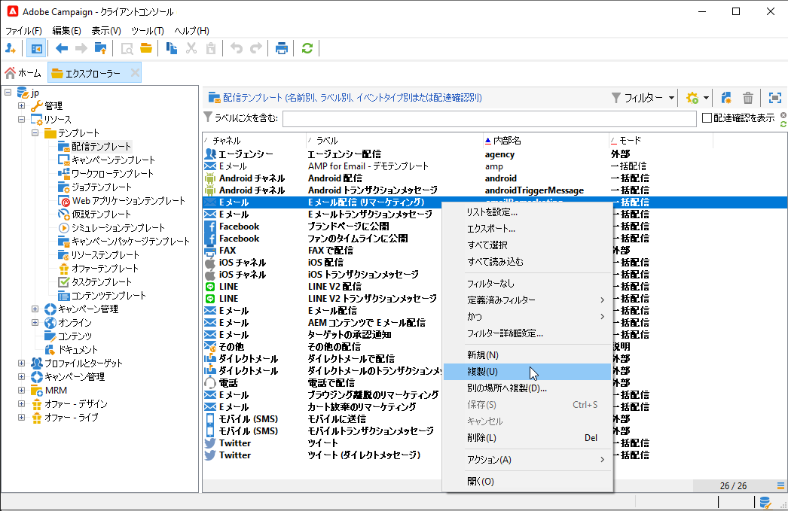

1. ニーズに合わせてテンプレートをパーソナライズし、保存します。

1. 新しいキャンペーンを作成し、ドロップダウンリストから「**[!UICONTROL リマーケティングキャンペーン]**」テンプレートを選択します。

   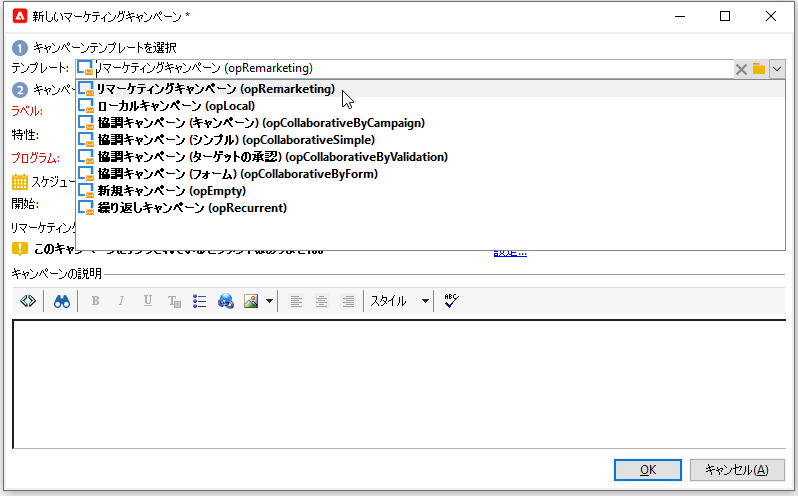

1. **[!UICONTROL 設定...]** リンクをクリックして、キャンペーンにリンクされたセグメントおよび配信テンプレートを指定します。

1. 前に設定した外部アカウントを選択します。

   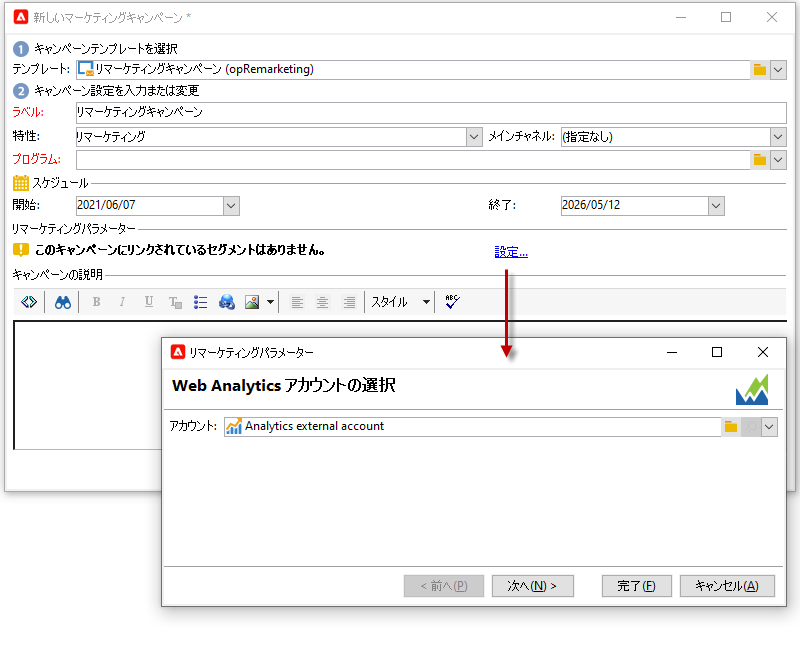

1. 対象のセグメントを選択します。

   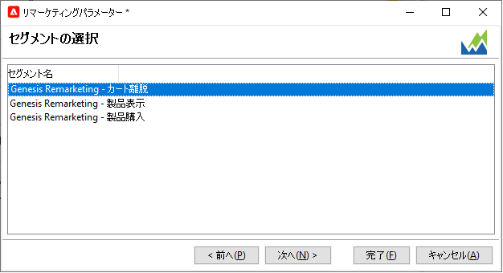

1. このリマーケティングキャンペーンに使用する配信テンプレートを選択し、「**[!UICONTROL 完了]**」をクリックしてウィンドウを閉じます。

   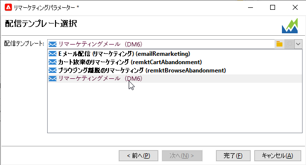

1. 「**[!UICONTROL OK]**」をクリックしてキャンペーンウィンドウを閉じます。

**[!UICONTROL リマーケティングの効率]**&#x200B;レポートは、グローバルレポートページからアクセスします。このレポートでは、Adobe Campaign のリマーケティングキャンペーン後における、カート放棄数に対するコンバージョンされた連絡先（何かを購入したなど）数を表示できます。週ごと、月ごとまたは Adobe Campaign と Web 分析ツール間の同期開始以降のコンバージョン率が計算されます。

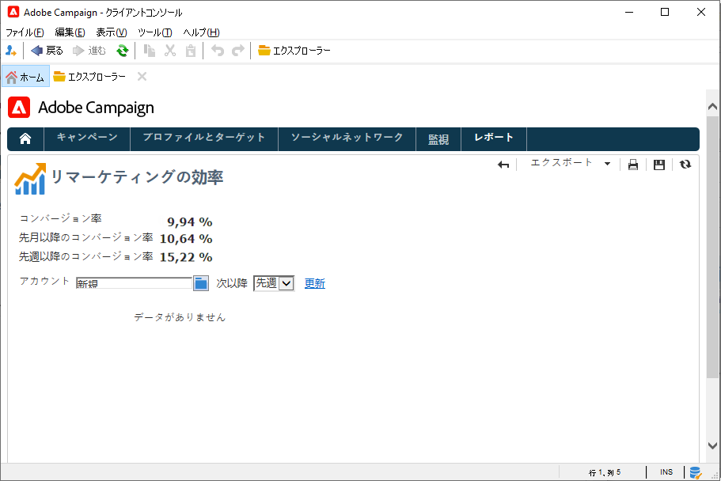

**関連トピック**

* [Campaign -Experience Cloudトリガーの統合](ac-triggers.md)
