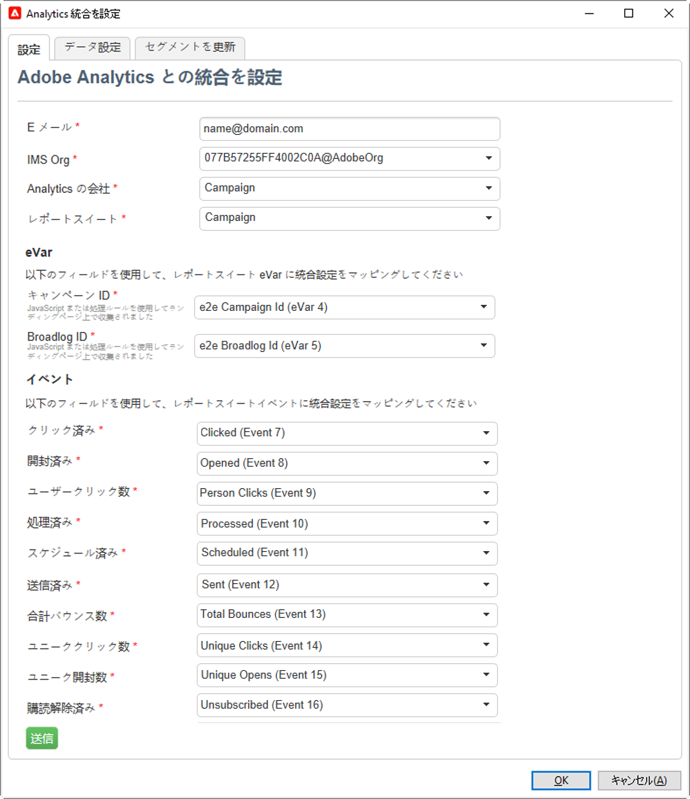

# Campaign と Adobe Analytics の使用

Adobe Analytics を設定して、Campaign と Analytics を統合できます。

この統合により、Adobe Campaign と Adobe Analytics は、**Web 分析コネクタ**&#x200B;アドオンを介してやり取りできるようになります。この統合では、Adobe Campaign から配信された メールキャンペーンの指標と属性を Adobe Analytics に送信します。

 Managed Cloud Services ユーザーとして Campaign を Adobe Experience Cloud のサービスやソリューションと接続する場合は、[アドビにお問い合わせ](../start/campaign-faq.md#support)ください。専用パッケージを使用して、Web 分析コネクタアドオンをお使いの環境にインストールする必要があります。

Adobe Analytics Connector を使用すると、Adobe Campaign はインターネットのオーディエンスを測定できます（Web 分析）。Web 分析ツールを使用すると、Adobe Campaign は指標とキャンペーン属性を Analytics に転送できます。

各ツールの動作の概略は次のとおりです。

* **Adobe Analytics** は、Adobe Campaign で開始されたメールキャンペーンにマークを付けます。

* **Adobe Campaign** は、指標とキャンペーン属性をコネクタに送信します。コネクタは、それを web 分析ツールに転送します。

>[!CAUTION]
>
>Adobe Analytics Connector には、トランザクションメッセージ（Message Center）との互換性はありません。

Campaign と Analytics の接続を設定するには、次の操作を実行する必要があります。

1. [Adobe Analytics でのレポートスイートの作成](#report-suite-analytics)
1. [コンバージョン変数と成功イベントの設定](#configure-conversion-success)
1. [Adobe Campaign での外部アカウントの設定](#external-account-ac)

## Analytics レポートスイートの作成 {#report-suite-analytics}

[!DNL Adobe Analytics] で **[!UICONTROL レポートスイート]**&#x200B;を作成するには、次の手順に従います。

1. [!DNL Adobe Analytics] から&#x200B;**[!UICONTROL 「管理」タブ]**&#x200B;を選択し、「**[!UICONTROL すべての管理者]**」をクリックします。

   

1. 「**[!UICONTROL レポートスイート]**」をクリックします。

   

1. **[!UICONTROL レポートスイートマネージャー]**&#x200B;ページで、「**[!UICONTROL 新規作成]**」、「**[!UICONTROL レポートスイート]**」の順にクリックします。

   **[!UICONTROL レポートスイート]**&#x200B;の作成に関する詳細な手順については、[この節](https://experienceleague.adobe.com/docs/analytics/admin/manage-report-suites/new-report-suite/t-create-a-report-suite.html?lang=ja#prerequisites)を参照してください。

   

1. テンプレートを選択します。

1. 次の情報を使用して、新しいレポートスイートを設定します。

   * **[!UICONTROL レポートスイート ID]**
   * **[!UICONTROL サイトのタイトル]**
   * **[!UICONTROL タイムゾーン]**
   * **[!UICONTROL ライブ化の日付]**
   * **[!UICONTROL 予想日別ページビュー数]**

   

1. 設定が完了したら、「**[!UICONTROL レポートスイートを作成]**」をクリックします。

## コンバージョン変数と成功イベントの設定 {#configure-conversion-success}

**[!UICONTROL レポートスイート]**&#x200B;を作成した後、次のように&#x200B;**[!UICONTROL コンバージョン変数]**&#x200B;と&#x200B;**[!UICONTROL 成功イベント]**&#x200B;を設定する必要があります。

1. 以前に設定した&#x200B;**[!UICONTROL レポートスイート]**&#x200B;を選択します。

1. 「**[!UICONTROL 設定を編集]**」ボタンから、**[!UICONTROL コンバージョン]**／**[!UICONTROL コンバージョン変数]**&#x200B;を選択します。

   

1. 「**[!UICONTROL 新規追加]**」をクリックし、メールキャンペーンの効果測定に必要な ID として、内部キャンペーン名（cid）および iNmsBroadlog（bid）テーブル ID を作成します。

   **[!UICONTROL コンバージョン変数]**&#x200B;の編集方法については、[この節](https://experienceleague.adobe.com/docs/analytics/admin/admin-tools/conversion-variables/t-conversion-variables-admin.html?lang=ja#admin-tools)を参照してください。

   

1. 終了したら「**[!UICONTROL 保存]**」をクリックします。

1. 次に、**[!UICONTROL 成功イベント]**&#x200B;を作成するには、「**[!UICONTROL 設定を編集]**」ボタンから&#x200B;**[!UICONTROL コンバージョン]**／**[!UICONTROL 成功イベント]**&#x200B;を選択します。

   

1. 「**[!UICONTROL 新規追加]**」をクリックして、次の&#x200B;**[!UICONTROL 成功イベント]**&#x200B;を設定します。

   * **[!UICONTROL クリック済み]**
   * **[!UICONTROL 開封済み]**
   * **[!UICONTROL ユーザーがクリック]**
   * **[!UICONTROL 処理済み]**
   * **[!UICONTROL スケジュール済み]**
   * **[!UICONTROL 送信済み]**
   * **[!UICONTROL バウンス数合計]**
   * **[!UICONTROL ユニーククリック数]**
   * **[!UICONTROL ユニーク開封数]**
   * **[!UICONTROL 購読解除済み]**

   **[!UICONTROL 成功イベント]**&#x200B;の設定方法については、[この節](https://experienceleague.adobe.com/docs/analytics/admin/admin-tools/success-events/t-success-events.html?lang=ja#admin-tools)を参照してください。

   

1. 終了したら「**[!UICONTROL 保存]**」をクリックします。

レポートスイートを設定する場合は、Adobe Campaign で&#x200B;**[!UICONTROL 外部アカウント]**&#x200B;を設定する必要があります。

## Campaign 外部アカウントの設定 {#external-account-ac}

次に、Adobe Campaign で **[!UICONTROL Web 分析]**&#x200B;外部アカウントを設定して、2 つのソリューション間の同期を有効にしてください。

外部アカウントの設定時に&#x200B;**[!UICONTROL レポートスイート]**、**[!UICONTROL コンバージョン変数]**、**[!UICONTROL 成功イベント]**&#x200B;のいずれかが表示されない場合は、新しく作成したコンポーネントに対する権限が、ユーザーに関連付けられた&#x200B;**[!UICONTROL 製品プロファイル]**&#x200B;にないことをい意味します。

詳しくは、 ](https://experienceleague.adobe.com/docs/analytics/admin/admin-console/permissions/product-profile.html?lang=ja#product-profile-admins)Adobe Analytics の製品プロファイル[のページを参照してください。

1. Adobe Campaign ツリーの&#x200B;**[!UICONTROL 管理]**／**[!UICONTROL プラットフォーム]**／**[!UICONTROL 外部アカウント]**&#x200B;フォルダーで、「**[!UICONTROL 新規]**」をクリックします。

   

1. ドロップダウンリストを使用して、**[!UICONTROL 統合]**&#x200B;ドロップダウンから「**[!UICONTROL Web 分析]**」タイプと「**[!UICONTROL Adobe Analytics]**」を選択します。

   

1. **[!UICONTROL 統合]**&#x200B;ドロップダウンの横にある「**[!UICONTROL 設定]**」をクリックします。

1. 「**[!UICONTROL Analytics 統合の設定]**」ウィンドウで、次の情報を提供し以前に作成したレポートスイートと外部アカウントをマッピングします。

   * **[!UICONTROL メール]**
   * **[!UICONTROL IMS Org]**
   * **[!UICONTROL Analytics の会社]**
   * **[!UICONTROL レポートスイート]**

1. 「**[!UICONTROL eVars]**」カテゴリから、[!DNL Adobe Analytics] で設定した 2 つの&#x200B;**[!UICONTROL コンバージョン変数]**&#x200B;をマッピングします。

   

1. 「**[!UICONTROL イベント]**」カテゴリから、[!DNL Adobe Analytics] で設定した 10 個の&#x200B;**[!UICONTROL 成功イベント]**&#x200B;をマッピングします。

1. 終了したら「**[!UICONTROL 送信]**」をクリックします。 Adobe Campaign は、マッピングされた Analytics の&#x200B;**[!UICONTROL レポートスイート]**&#x200B;に、**[!UICONTROL データソース]**、**[!UICONTROL 計算指標]**、**[!UICONTROL リマーケティングセグメント]**&#x200B;および&#x200B;**[!UICONTROL 分類]**&#x200B;を作成します。

   [!DNL Adobe Analytics] とAdobe Campaign の同期が完了したら、ウィンドウを閉じます。

1. 設定は、「**[!UICONTROL Analytics 統合の設定]**」ウィンドウの「**[!UICONTROL データ設定]**」タブで確認できます。

   「**[!UICONTROL 同期]**」ボタンを使用すると、[!DNL Adobe Campaign] は [!DNL Adobe Analytics] で行った名前の変更を同期します。[!DNL Adobe Analytics] でコンポーネントを削除すると、そのコンポーネントは [!DNL Adobe Campaign] で取り消し線が引かれるか、「**見つかりません**」というメッセージと共に表示されます。

   

   >[!NOTE]
   >
   > このバージョンの Campaign v8 では、セグメントの追加や削除はできません。

1. 「**[!UICONTROL 外部アカウント]**」で、「**[!UICONTROL 式をエンリッチメントする...]**」リンクをクリックして URL 計算式を変更し、Web 分析ツールの統合情報（キャンペーン ID）とアクティビティをトラッキングする必要があるサイトのドメインを指定します。

   

1. サイトのドメイン名を指定します。

   

1. 「**[!UICONTROL 次へ]**」をクリックし、ドメイン名が保存されていることを確認します。

   

1. 必要に応じて、計算式をオーバーロードします。これをおこなうには、チェックボックスをオンにして、ウィンドウ内で式を直接編集します。

   >[!IMPORTANT]
   >
   >この設定モードは、エキスパートユーザー向けに用意されているものです。この式にエラーがあった場合、メール配信が停止する可能性があります。

1. 「**[!UICONTROL 詳細設定]**」タブでは、より技術的な設定を設定または変更できます。

   * **[!UICONTROL 存続期間]**：Adobe Campaign でテクニカルワークフローで Web イベントを収集するまでの期間（日数）を指定できます。デフォルト：180 日。
   * **[!UICONTROL 持続]**：すべての Web イベント（購入など）をリマーケティングキャンペーンの属性にできる期間を指定できます。デフォルト：7 日。

>[!NOTE]
>
>複数のオーディエンス測定ツールを使用する場合は、外部アカウントの作成時に&#x200B;**[!UICONTROL パートナー]**&#x200B;ドロップダウンリストで「**[!UICONTROL その他]**」を選択できます。配信プロパティの 1 つの外部アカウントのみを参照できます。そのため、トラッキングされる URL の式を調整する必要があります。調整するには、Adobe および使用される他のすべての測定ツールで想定されているパラメーターを追加します。

## Web 分析プロセスのテクニカルワークフロー {#technical-workflows-of-web-analytics-processes}

Adobe Campaign と Adobe Analytics 間のデータ交換は、バックグラウンドタスクとして実行されるテクニカルワークフローで処理されます。

このワークフローは、Campaign エクスプローラーツリーの&#x200B;**[!UICONTROL 管理]**／**[!UICONTROL プロダクション]**／**[!UICONTROL テクニカルワークフロー]**／**[!UICONTROL web 分析プロセス]**&#x200B;フォルダーにあります。

**[!UICONTROL 指標とキャンペーン属性の送信]**&#x200B;ワークフローを使用すると、Adobe Campaign から Adobe Experience Cloud に Adobe Analytics Connector で メールキャンペーンの指標を送信できます。このワークフローは毎日午前 4 時にトリガーされ、データを Analysis に送信するには 24 時間かかります。

ワークフローは再起動しないでください。再起動すると、以前のデータがすべて再送され、Analytics の結果に歪みが生じる可能性があります。

含まれる指標は次のとおりです。

* **[!UICONTROL 配信するメッセージ]**（@toDeliver）
* **[!UICONTROL 処理済み]**（@processed）
* **[!UICONTROL 成功]**（@success）
* **[!UICONTROL オープン数合計]**（@totalRecipientOpen）
* **[!UICONTROL 開封した受信者]**（@recipientOpen）
* **[!UICONTROL クリックした受信者の合計数]**（@totalRecipientClick）
* **[!UICONTROL クリックした人]**（@personClick）
* **[!UICONTROL ユニーククリック数]**（@recipientClick）
* **[!UICONTROL オプトアウト]**（@optOut）
* **[!UICONTROL エラー]**（@error）

>[!NOTE]
>
>送信されたデータは最後のスナップショットに基づいたデルタであり、指標データの値がマイナスになる可能性があります。

送信される属性は次のとおりです。

* **[!UICONTROL 内部名]**（@internalName）
* **[!UICONTROL ラベル]**（@label）
* **[!UICONTROL ラベル]** (operation/@label)：**キャンペーン**&#x200B;パッケージがインストールされている場合のみ
* **[!UICONTROL 特性]** (operation/@nature)：**キャンペーン**&#x200B;パッケージがインストールされている場合のみ
* **[!UICONTROL タグ 1]** (webAnalytics/@tag1)
* **[!UICONTROL タグ 2]** (webAnalytics/@tag2)
* **[!UICONTROL タグ 3]** (webAnalytics/@tag3)
* **[!UICONTROL コンタクト日]** (scheduling/@contactDate)

## 配信のトラッキング {#tracking-deliveries-in-adobe-campaign}

Adobe Campaign で配信を送信した後、Adobe Experience Cloud でサイト上のアクティビティをトラッキングできるようにするには、配信プロパティで対応するコネクタを参照する必要があります。それには、次の手順に従います。

1. トラッキングするキャンペーンの配信を開きます。

   

1. 配信プロパティを開きます。
1. 「**[!UICONTROL Web 分析]**」タブに移動し、前に作成した外部アカウントを選択します。「[Adobe Campaign での外部アカウントの設定](#external-account-ac)」を参照してください。

   

1. 配信を送信し、Adobe Analytics でレポートにアクセスできるようになりました。

**関連トピック**

* [Campaign - Experience Cloud トリガーの統合](ac-triggers.md)
