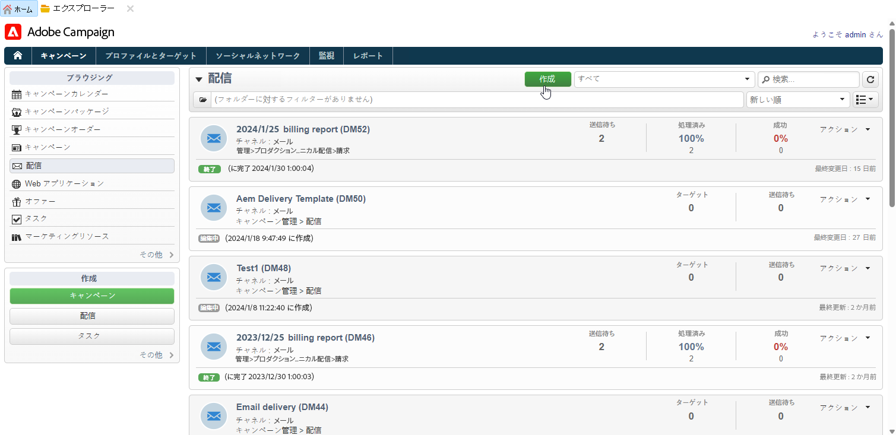

# Campaign と Adobe Experience Manager の操作 {#ac-aem}

Adobe Campaign と Adobe Experience Manager を統合すると、メール配信のコンテンツとフォームを Adobe Experience Manager で直接管理できます。**Adobe Experience Manager** コンテンツを Campaign にインポートするか、**Adobe Experience Manager as a Cloud Service** アカウントに接続して、web インターフェイス内でコンテンツを直接編集することができます。

[Campaign Web インターフェイス内でAdobe Experience ManagerをCloud Serviceコンテンツとして編集する方法を理解する](https://experienceleague.adobe.com/docs/campaign-web/v8/integrations/aem-content.html){target="_blank"}.

[Adobe Experience Managerの詳細については、このドキュメントを参照してください](https://experienceleague.adobe.com/docs/experience-manager-65/administering/integration/campaignonpremise.html?lang=ja#aem-and-adobe-campaign-integration-workflow){target="_blank"}.

>[!NOTE]
>
>管理対象Cloud Serviceユーザーとして、 [連絡先Adobe](../start/campaign-faq.md#support) Adobe Experience Managerを Campaign と統合する場合。

## Adobe Experience Manager からのコンテンツのインポート {#integrating-with-aem}

この統合を利用して、例えば、Adobe Experience Manager で作成したニュースレターを Adobe Campaign でメールキャンペーンの一部として使用できます。

**Adobe Experience Manager から：**

1. [!DNL Adobe Experience Manager] オーサーインスタンスに移動し、ページの左上隅にある「Adobe Experience」をクリックします。メニューから「**[!UICONTROL Sites]**」を選択します。

   

1. **[!UICONTROL キャンペーン／ブランド名（ここでは we.Shopping）／メインエリア／メール]**&#x200B;にアクセスします。

1. 「**[!UICONTROL 作成]**」をクリックし、ドロップダウンメニューから「**[!UICONTROL ページ]**」を選択します。

   

1. 「**[!UICONTROL Adobe Campaign メール]**」テンプレートを選択し、ニュースレターに名前を付けます。

1. ページが作成されたら、**[!UICONTROL ページ情報]**&#x200B;メニューにアクセスし、「**[!UICONTROL プロパティを開く]**」をクリックします。

   

1. Adobe Campaign のパーソナライゼーションフィールドなどのコンポーネントを追加してメールコンテンツをカスタマイズします。詳しくは、 [Adobe Experience Managerドキュメント](https://experienceleague.adobe.com/docs/experience-manager-65/content/sites/authoring/aem-adobe-campaign/campaign.html#editing-email-content){target="_blank"}.

1. メールの準備が整ったら、**[!UICONTROL ページ情報]**&#x200B;メニューに移動し、「**[!UICONTROL ワークフローを開始]**」をクリックします。

   

1. 最初のドロップダウンから、ワークフローモデルとして「**[!UICONTROL Adobe Campaign を承認]**」を選択し、「**[!UICONTROL ワークフローを開始]**」をクリックします。

   

1. ページの上部に `This page is subject to the workflow Approve for Adobe Campaign` という免責事項が表示されます。免責事項の横にある「**[!UICONTROL 完了]**」をクリックしてレビューを確認し、「**[!UICONTROL OK]**」をクリックします。

1. もう一度「**[!UICONTROL 完了]**」をクリックし、**[!UICONTROL 次のステップ]**&#x200B;ドロップダウンで「**[!UICONTROL ニュースレターの承認]**」を選択します。

   

これでニュースレターが準備でき、Adobe Campaign で同期されました。

**Adobe Campaign から：**

1. 「**[!UICONTROL キャンペーン]**」タブで、「**[!UICONTROL 配信]**」、「**[!UICONTROL 作成]**」の順にクリックします。

1. **[!UICONTROL 配信テンプレート]**&#x200B;ドロップダウンメニューから「**[!UICONTROL AEM コンテンツでメール配信（mailAEMContent）]**」テンプレートを選択します。

   

1. 配信に&#x200B;**[!UICONTROL ラベル]**&#x200B;を追加し、「**[!UICONTROL 続行]**」をクリックします。

1. 「**[!UICONTROL 同期]**」をクリックして、AEM 配信にアクセスします。

   このボタンがインターフェイスに表示されない場合は、「**[!UICONTROL プロパティ]**」ボタンに移動し、「**[!UICONTROL 詳細設定]**」タブにアクセスします。「**[!UICONTROL コンテンツ編集モード]**」フィールドが **[!UICONTROL AEM]** に設定されていることを確認し、「**[!UICONTROL AEM アカウント]**」フィールドに AEM インスタンスの詳細を入力します。

   

1. [!DNL Adobe Experience Manager] で以前に作成した AEM 配信を選択し、「**[!UICONTROL OK]**」をクリックして確認します。

   

1. AEM 配信に変更を行った場合は、「**[!UICONTROL コンテンツを更新]**」ボタンをクリックします。

   

1. Experience Manager と Campaign の間のリンクを削除するには、「**[!UICONTROL 非同期]**」をクリックします。

これでメールをオーディエンスに送信する準備が整いました。

## Adobe Experience Manager Assets ライブラリからのアセットのインポート {#assets-library}

Adobe Campaign でメールまたはランディングページを編集中に、[!DNL Adobe Experience Manager Assets Library] からアセットを直接挿入することもできます。この機能について詳しくは、 [Adobe Experience Manager Assetsドキュメント](https://experienceleague.adobe.com/docs/experience-manager-65/content/assets/managing/manage-assets.html){target="_blank"}.

**Adobe Experience Manager から：**

1. [!DNL Adobe Experience Manager] オーサーインスタンスに移動し、ページの左上隅にある「Adobe Experience」をクリックします。メニューから&#x200B;**[!UICONTROL アセット]** `>` **[!UICONTROL ファイル]**&#x200B;を選択します。

   

1. 「**作成**」、「**ファイル**」の順にクリックして、アセットを **Adobe Experience Manager Assets ライブラリ**&#x200B;にインポートします。詳しくは、 [AdobeExperience Manager のドキュメント](https://experienceleague.adobe.com/docs/experience-manager-65/content/assets/managing/manage-assets.html#uploading-assets){target="_blank"}.

   

1. 必要に応じてアセットの名前を変更し、「**アップロード**」を選択します。

アセットが **Adobe Experience Manager Assets ライブラリ**&#x200B;にアップロードされました。

**Adobe Campaign から：**

1. Adobe Campaign で、「**Campaign**」タブを参照し、「**配信**」をクリックし、既存の配信のリストの上にある「**作成**」ボタンをクリックして、新しい配信を作成します。

   

1. **配信テンプレート**&#x200B;を選択して、配信に名前を付けます。

1. メッセージコンテンツを定義してパーソナライズします。[詳細情報](../send/email.md)

1. **Adobe Experience Manager Assets ライブラリ**&#x200B;を使用するには、AEM 配信の&#x200B;**[!UICONTROL プロパティ]**&#x200B;にアクセスし、「**[!UICONTROL 詳細]**」タブを選択します。

   **AEM アカウント**&#x200B;を選択し、「**[!UICONTROL 上記の AEM インスタンスを共有アセットライブラリとして使用する]**」オプションを有効にします。

   

1. **画像**&#x200B;アイコンから、**[!UICONTROL 共有アセットを選択]**&#x200B;メニューにアクセスします。

   

1. 選択ウィンドウで、**Adobe xperience Manager Assets ライブラリ**&#x200B;から画像を選択し、「**選択**」をクリックします。

   

アセットがメール配信にアップロードされました。これで、ターゲットオーディエンスを指定し、配信を確認して、送信を続行できるようになります。
