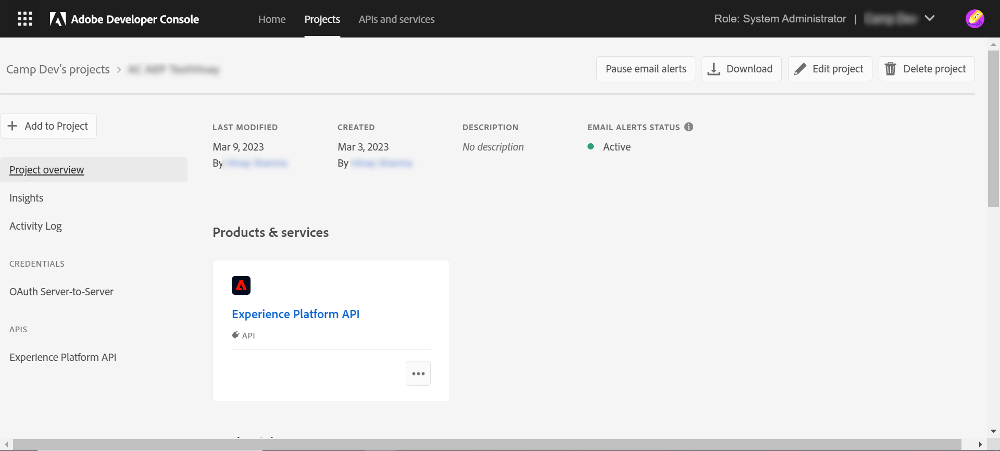
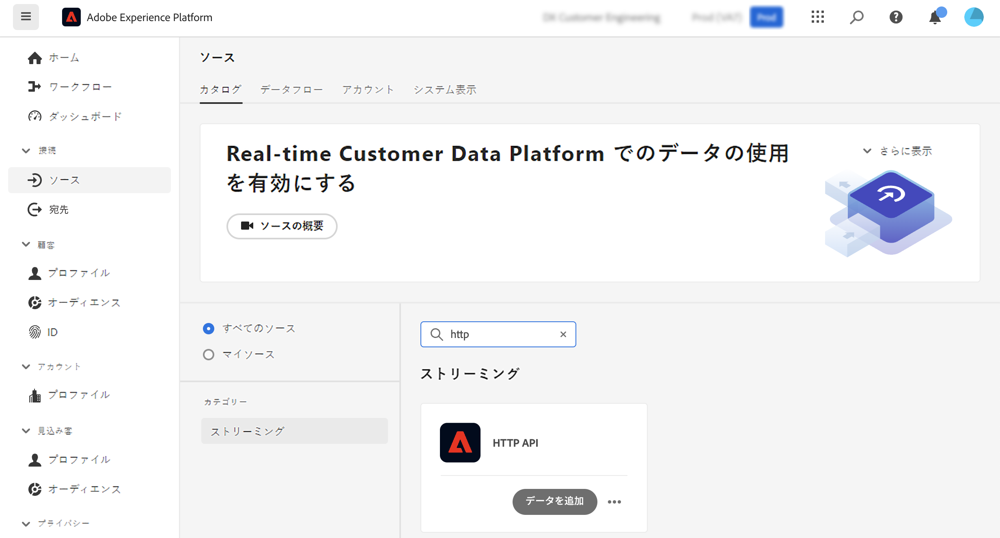
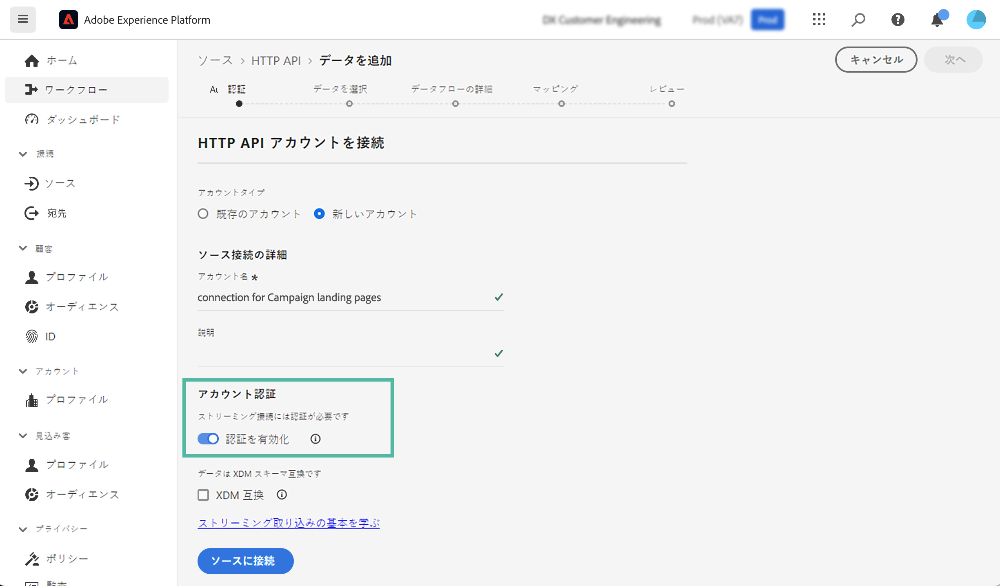
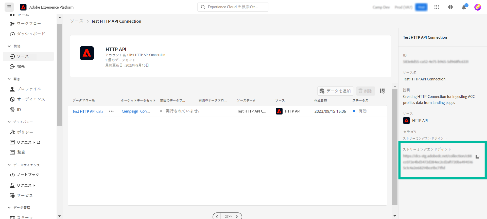
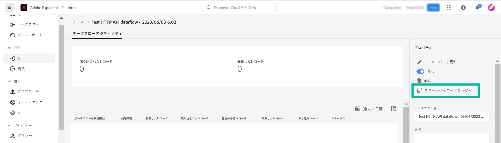
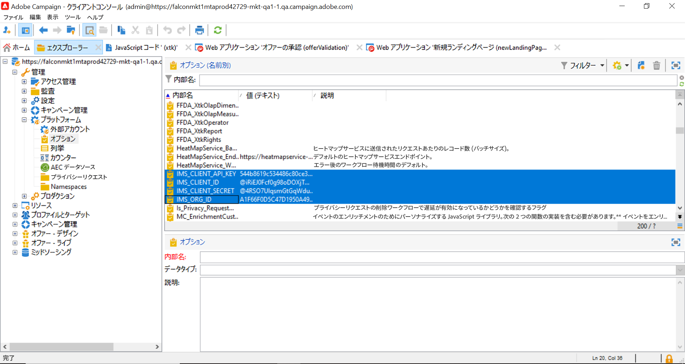
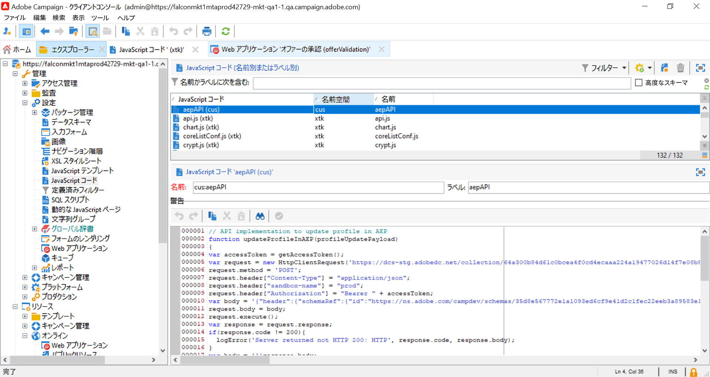
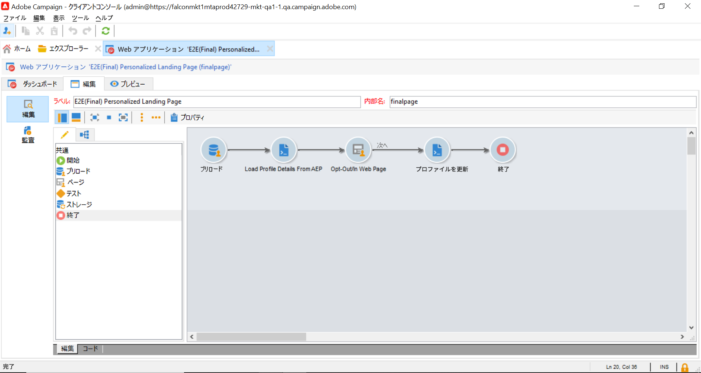
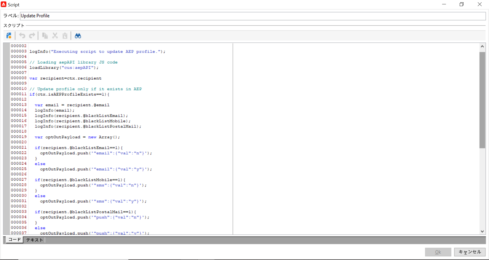

# Adobe Campaign ランディングページからの Adobe Experience Platform プロファイルの更新{#ac-aep-lp}

Adobe Campaign と Adobe Experience Platform の統合により、Adobe Campaign ランディングページと Adobe Experience Platform の間でシームレスにプロファイルデータを同期できます。この統合により、次のことができます。

* Adobe Experience Platform プロファイル属性を取得して、Adobe Campaign ランディングページに更新された情報を表示する
* 更新されたプロファイル属性を Adobe Experience Platform に返し、ランディングページで入力および送信された内容に基づいて、対応する属性を更新する

この統合を設定する主な手順を以下に示します。

<table>
<tr>
<td><p><a href="#oauth">OAuth 接続を設定</a></p></td>
<td><p><a href="#source">HTTP API ソース接続を作成</a></p></td>
<td><p><a href="#xtk">Campaign で認証オプションを追加</a></p></td>
<td><p><a href="#javascript">Campaign で JavaScript コードを追加</a></p></td>
<td><p><a href="#script">ランディングページワークフローを設定</a></p></td>
</table>

## OAuth 接続を設定 {#oauth}

Adobe Cloud Platform API では、認証と承認に OAuth 2.0 プロトコルを使用します。API 呼び出しを使用して Adobe Experience Platform を Adobe Campaign に接続するには、Adobe Developer Console で作成した OAuth 統合を使用してアクセストークンを生成する必要があります。

これを行うには、次の手順に従います。

1. Adobe Developer Console にアクセスします。
1. Adobe Experience Platform API 製品を使用して、新しい API 接続を作成します。OAuth 2.0 アクセストークンの取得方法に関する詳細な手順については、[Adobe Developer Console ドキュメント](https://developer.adobe.com/developer-console/docs/guides/authentication/Tools/OAuthPlayground/)を参照してください。
1. 接続を作成したら、**[!UICONTROL OAuth サーバー間]**&#x200B;メニューに移動し、Campaign で認証に必要な以下の詳細をコピーします。

   * `CLIENT ID`
   * `CLIENT SECRET`
   * `ORGANIZATION ID`

   {width="70%"}

Oauth 接続を設定したら、新しい **[!UICONTROL HTTP API]** ソース接続を作成して設定し、Adobe Campaign を Adobe Experience Platform にリンクします。

## HTTP API ソース接続を作成 {#source}

OAuth 接続を設定したら、次の手順では Adobe Experience Platform で **[!UICONTROL HTTP API]** ソース接続を作成します。この接続により、API を使用して Adobe Experience Platform にデータをストリーミングできます。次の手順に従います。

1. Adobe Experience Platform **[!UICONTROL ソース]**&#x200B;に移動し、**[!UICONTROL HTTP API]** ソースを検索して、「**[!UICONTROL データを追加]**」をクリックします。

   {width="70%"}

1. 必要に応じて、接続を設定します。HTTP API 接続の設定方法について詳しくは、こちらを参照してください [Adobe Experience Platform ソースのドキュメント](https://experienceleague.adobe.com/docs/experience-platform/sources/ui-tutorials/create/streaming/http.html?lang=ja){target="_blank"}.

   **[!UICONTROL 認証]**&#x200B;手順で、「**[!UICONTROL 認証を有効にする]**」オプションの切替スイッチをオンにして、OAuth 統合を通じて事前に生成されたアクセストークンを使用して認証します。

   {width="70%"}

1. ソース接続を設定すると、ストリーミングエンドポイントが表示されます。このエンドポイントは、Adobe Experience Platform にデータを取り込むために必要です。

   {width="70%"}

   また、「**[!UICONTROL データフロー]**」タブから新しく作成したデータフローを開いて、Adobe Experience Platform に取り込まれたデータ形式のサンプルにアクセスすることもできます。

   {width="70%"}

HTTP API ソース接続を設定したら、Adobe Campaign に特定のオプションを追加して、Adobe Experience Platform への接続を有効にする必要があります。

## Adobe Campaign で認証オプションを追加 {#xtk}

HTTP API ソース接続を設定したら、Adobe Campaign に特定のオプションを追加して、Adobe Experience Platform との接続を有効にする必要があります。これは、Campaign 管理メニューで行うことも、特定の **[!UICONTROL JavaScript コード]**&#x200B;アクティビティを追加してランディングページワークフローを実行する際に行うこともできます。

以下のタブを参照して、2 つの方法を確認します。

>[!BEGINTABS]

>[!TAB 管理メニューからオプションを追加します]

1. **[!UICONTROL 管理]**／**[!UICONTROL プラットフォーム]**／**[!UICONTROL オプション]**&#x200B;メニューに移動します。
1. Adobe Developer Console から、次のオプションと対応する値を追加します。

   * IMS_CLIENT_ID = cryptString(CLIENT ID)
   * IMS_CLIENT_SECRET = cryptString(CLIENT SECRET)
   * IMS_ORG_ID = ORGANIZATION ID
   * IMS_CLIENT_API_KEY = cryptString(CLIENT ID)

   {width="70%"}

   >[!NOTE]
   >
   >cryptString() 関数は、認証データを暗号化するために使用します。

>[!TAB JavaScript コードアクティビティを使用してオプションを追加]

ランディングページワークフローの実行時にこれらのオプションを自動的に設定するには、以下のコードを使用して、**[!UICONTROL JavaScript コード]**&#x200B;アクティビティをワークフローに追加します。[JavaScript コード アクティビティの設定方法を学ぶ](https://experienceleague.adobe.com/docs/campaign/automation/workflows/wf-activities/action-activities/sql-code-and-JavaScript-code.html?lang=ja#JavaScript-code){target="_blank"}.

ワークフローの実行時に、指定された値を使用してオプションが Campaign コンソールに自動的に作成されます。

    ```javascript
    loadLibrary(&quot;xtk:shared/nl.js&quot;);
    loadLibrary(&quot;xtk:shared/xtk.js&quot;);
    loadLibrary(&quot;xtk:shared/json2.js&quot;);
    loadLibrary(&quot;xtk:common.js&quot;);
    
    function setAuthCredentials()
    {
    setOption(&quot;IMS_CLIENT_ID&quot;, cryptString(&#39;CLIENT ID&#39;));
    setOption(&quot;IMS_CLIENT_SECRET&quot;, cryptString(&#39;CLIENT SECRET&#39;));
    setOption(&quot;IMS_ORG_ID&quot;, cryptString(&#39;ORGANIZATION ID&#39;));
    setOption(&quot;IMS_CLIENT_API_KEY&quot;, cryptString(&#39;CLIENT ID&#39;));
    }
    ```

>[!ENDTABS]

認証オプションを Campaign に設定したら、ランディングページから Campaign と Adobe Experience Platform の間でデータを同期できるようにするカスタム JavaScript コードを作成する必要があります。

## ワークフロー実行時のオプションを追加 {#javacript}

ランディングページと Adobe Experience Platform の間でデータを同期できるようにするには、カスタム JavaScript コードを Adobe Campaign に追加する必要があります。次の手順に従います。

1. **[!UICONTROL 管理]**／**[!UICONTROL 設定]**／**[!UICONTROL JavaScript コード]**&#x200B;メニューに移動します。
1. 新しい JavaScript コードを作成し、以下のスニペットをコピー＆ペーストします。

   >[!NOTE]
   >
   >アクセストークンと認証データは、以前に設定したオプションから自動的に取得されます。

   {width="70%"}

+++  スクリプト 1 - Experience Platform からプロファイル属性を読み込む

   このコードでは、ランディングページを読み込む前に、Adobe Experience Platform にプロファイルが存在するかどうかを確認します。プロファイル属性を取得し、ランディングページの対応するフィールドに表示します。

   ```javascript
   // API implementation to read profile from AEP
   function getProfileInfo(email)
   {
   var accessToken = getAccessToken();
   var request = new HttpClientRequest(('https://platform-stage.adobe.io/data/core/ups/access/entities?schema.name=_xdm.context.profile&entityId=' + email + '&entityIdNS=email&fields=identities,consents.marketing'));
   request.method = 'GET';
   request.header["Content-Type"] = "application/json";
   request.header["sandbox-name"] = "prod";
   request.header["x-gw-ims-org-id"] = getOption('IMS_ORG_ID');
   request.header["x-api-key"] = getOption('IMS_CLIENT_API_KEY');
   request.header["Authorization"] = "Bearer " + accessToken;
   request.execute();
   return request.response;
   }
   ```

+++

+++ スクリプト 2 - Experience Platform プロファイル属性を更新

   このコードでは、ランディングページで送信した値で Adobe Experience Platform のプロファイル属性を更新します。

   ```javascript
   // API implementation to update profile in AEP
   loadLibrary("xtk:shared/nl.js");
   loadLibrary("xtk:shared/xtk.js");
   loadLibrary("xtk:shared/json2.js");
   loadLibrary("xtk:common.js");
   
   function updateProfileInAEP(profileUpdatePayload)
   {
   var accessToken = getAccessToken();
   var request = new HttpClientRequest('https://dcs-stg.adobedc.net/collection/64a300b84d61c0bcea4f0cd4ecaaa224a19477026d14f7e08b5408ffaf5e6162?syncValidation=false');
   request.method = 'POST';
   request.header["Content-Type"] = "application/json";
   request.header["sandbox-name"] = "prod";
   request.header["Authorization"] = "Bearer " + accessToken;
   var body = '{"header":{"schemaRef":{"id":"https://ns.adobe.com/campdev/schemas/35d8e567772e1a1093ed6cf9e41d2c1fec22eeb3a89583e1","contentType":"application/vnd.adobe.xed-full+json;version=1.0"},"imsOrgId":"A1F66F0D5C47D1950A494133@AdobeOrg","datasetId":"63c7fa2a20cce11b98cccb41","source":{"name":"testHTTPSourcesVinay - 03/06/2023 5:43 PM"}},"body":{"xdmMeta":{"schemaRef":{"id":"https://ns.adobe.com/campdev/schemas/35d8e567772e1a1093ed6cf9e41d2c1fec22eeb3a89583e1","contentType":"application/vnd.adobe.xed-full+json;version=1.0"}},"xdmEntity":' + profileUpdatePayload +'}}';
   request.body = body;
   request.execute();
   return request.response;
   }
   
   
   // Get Access token from OAuth-Server-to-server API call
   function getAccessToken() {
   var clientId = decryptString(getOption('IMS_CLIENT_ID'));
   var clientSecret = decryptString(getOption('IMS_CLIENT_SECRET'));
   var request = new HttpClientRequest(('https://ims-na1-stg1.adobelogin.com/ims/token/v2?grant_type=client_credentials' + '&client_id=' + clientId + '&client_secret=' + clientSecret + '&scope=openid,session,AdobeID,read_organizations,additional_info.projectedProductContext'));
   request.method = 'POST';
   request.execute();
   var response = request.response;
   if(response.code != 200){
   logError('GetAccessToken failed,', response.code, response.body);
   return;
   }
   var body = ''+response.body;
   var parsedResponse = JSON.parse(body);
   var accessToken = parsedResponse.access_token;
   logInfo("Access token generated successfully");
   return accessToken;
   }
   ```

+++

カスタム JavaScript コードを Adobe Campaign に作成したので、データ同期にこれらの JavaScript コードを使用するようにランディングページを含むワークフローを設定できます。

## ランディングページワークフローを設定 {#script}

Adobe Campaign に追加した JavaScript コードを、**[!UICONTROL JavaScript コード]**&#x200B;アクティビティを使用してランディングページのワークフローに活用できます。

* ランディングページを読み込む前に Experience Platform からデータを読み込むには、ランディングページアクティビティの前に **[!UICONTROL JavaScript コード]**&#x200B;アクティビティを追加し、スクリプト 1 をコピー＆ペーストします。

+++ スクリプト 1 - Experience Platform からプロファイル属性を読み込む

  ```javascript
  // Script code to read profile from AEP.
  
  logInfo("Loading profile from AEP");
  loadLibrary("cus:aepAPI");
  var recipient=ctx.recipient;
  var email = recipient.@email;
  var response = getProfileInfo(email);
  ctx.isAEPProfileExists = 1;
  
  if(response.code == 404){
  ctx.isAEPProfileExists = 0
  logInfo("Profile with email" + email + " not found in AEP, ignoring the update activity");
  }
  else if(response.code == 200){
  var body = ''+response.body;
  var parsedResponse = JSON.parse(body);
  for (var key in parsedResponse) {
      var value =  parsedResponse[key];
      var marketing = value.entity.consents.marketing;
      logInfo("User Consent Details : " + JSON.stringify(marketing));   
      if(marketing.hasOwnProperty('email')&&marketing.email.hasOwnProperty('val')&&marketing.email.val=='n'){
      ctx.recipient.@blackListEmail = 1;
      }
      if(marketing.hasOwnProperty('sms')&&marketing.sms.hasOwnProperty('val')&&marketing.sms.val=='n'){
      ctx.recipient.@blackListMobile = 1;
      }
      if(marketing.hasOwnProperty('push')&&marketing.push.hasOwnProperty('val')&&marketing.push.val=='n'){
      ctx.recipient.@blackListPostalMail = 1;
      }
  } 
  }
  ```

+++

* ランディングページで送信したデータで Experience Platform プロファイル属性を更新するには、ランディングページアクティビティの後に **[!UICONTROL JavaScript コード]**&#x200B;アクティビティを追加し、スクリプト 2 をコピー＆ペーストします。

+++ スクリプト 2 - Experience Platform プロファイル属性を更新

  ```javascript
  // Script code to update profile in AEP and ACC.
  
  logInfo("Executing script to update AEP profile.");
  
  // Loading aepAPI library JS code
  loadLibrary("cus:aepAPI");
  
  var recipient=ctx.recipient
  
  // Update profile only if it exists in AEP
  if(ctx.isAEPProfileExists==1){
  
  var email = recipient.@email
  logInfo(email);
  logInfo(recipient.@blackListEmail);
  logInfo(recipient.@blackListMobile);
  logInfo(recipient.@blackListPostalMail);
  
  var optOutPayload = new Array();
  
  if(recipient.@blackListEmail==1){
      optOutPayload.push('"email":{"val":"n"}');
  }
  else
      optOutPayload.push('"email":{"val":"y"}');
  
  if(recipient.@blackListMobile==1){
      optOutPayload.push('"sms":{"val":"n"}');
  }
  else
      optOutPayload.push('"sms":{"val":"y"}');
  
  if(recipient.@blackListPostalMail==1){
      optOutPayload.push('"push":{"val":"n"}');
  }
  else
      optOutPayload.push('"push":{"val":"y"}');
  
  var profileUpdatePayload = '{'+ '"personalEmail":{"address":' + '\"' + email + '\"' + '},' +'"consents":{"marketing":{' + optOutPayload.toString() + '}}}';
  
  var response = updateProfileInAEP(profileUpdatePayload);
  if(response.code == 200){
  var body = '' + response.body;
  logInfo("AEP Profile Updated successfully, Response " + body);
  // Update ACC profile 
  recipient.@xtkschema = "nms:recipient";
  recipient.@_operation = "update";
  recipient.@_key="@id";
  xtk.session.Write(recipient);
  logInfo("ACC Profile Updated successfully");
  }
  else{
      logError('Server Error: ', response.code, response.body);
  } 
  }
  else {
  logInfo("Ignoring AEP profile update as profile doesn't exists.");
  
  // Update ACC profile   
  recipient.@xtkschema = "nms:recipient";
  recipient.@_operation = "update";
  recipient.@_key="@id";  
  xtk.session.Write(recipient);
  logInfo("ACC Profile Updated successfully");
  }
  ```

+++

>[!CAUTION]
>
>特定のニーズに基づいて、各スクリプトのペイロードをカスタマイズする必要があります。
>
>ランディングページアクティビティの前にスクリプトを追加しない場合、Adobe Experience Platform ではプロファイルの存在チェックは実行されません。ランディングページが送信され、プロファイルが存在しない場合、ランディングページの属性を使用して Adobe Experience Platform でプロファイルが作成されます。

ランディングページの前後で JavaScript コードアクティビティを使用するサンプルワークフローを以下に示します。

{width="70%"}

Adobe Experience Platform でプロファイル属性を更新するように設定したランディングページと JavaScript コードアクティビティの例を以下に示します。

{width="70%"}

{width="70%" zoomable="yes"}

### 詳細情報

* [JavaScript コードアクティビティの設定](../../automation/workflow/sql-code-and-javascript-code.md#javascript-code)
* [ランディングページの作成](https://experienceleague.adobe.com/docs/campaign-classic/using/designing-content/editing-html-content/creating-a-landing-page.html?lang=ja){target="_blank"}
* [購読と購読解除を管理](../start/subscriptions.md)
