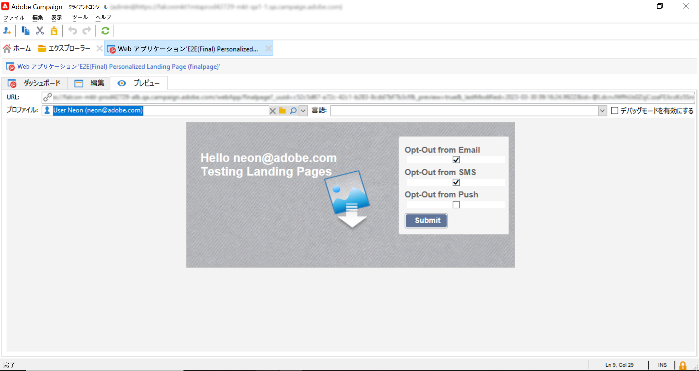

# Adobe CampaignランディングページからのAdobe Experience Platformプロファイルの更新

Adobe CampaignとAdobe Experience Platformの統合により、Adobe CampaignのランディングページとAdobe Experience Platformの間でデータをシームレスに同期できます。 この統合により、次のことができます。

* Adobe Experience Platformのプロファイル属性を取得して、Adobe Campaignのランディングページに更新された情報を表示する
* 更新されたプロファイル属性をAdobe Experience Platformに送り返し、ランディングページで入力および送信された内容に基づいて、対応する属性を更新します。

この統合を設定する主な手順は次のとおりです。

<table>
<tr>
<td><p><a href="#oauth">OAuth 接続を設定する</a></p></td>
<td><p><a href="#source">HTTP API ソース接続の作成</a></p></td>
<td><p><a href="#xtk">Campaign での認証オプションの追加</a></p></td>
<td><p><a href="#javascript">Campaign での JavaScript コードの追加</a></p></td>
<td><p><a href="#script">ランディングページワークフローの設定</a></p></td>
</table>

## OAuth 接続の設定 {#oauth}

Adobe Cloud Platform API は、認証と承認に OAuth 2.0 プロトコルを使用します。 API 呼び出しを使用してAdobe Experience PlatformをAdobe Campaignに接続するには、Adobe Developerコンソールで作成した OAuth 統合を使用してアクセストークンを生成する必要があります。

これを行うには、次の手順に従います。

1. Adobe Developerコンソールにアクセスします。
1. Adobe Experience Platform API 製品を使用して新しい API 接続を作成します。 OAuth 2.0 アクセストークンの取得方法に関する詳細な手順については、 [Adobe Developer Console ドキュメント](https://developer.adobe.com/developer-console/docs/guides/authentication/Tools/OAuthPlayground/).
1. 接続が作成されたら、 **[!UICONTROL OAuth サーバー間通信]** メニューを開き、次の詳細をコピーします。詳細は、Campaign で認証に必要です。

   * クライアント ID
   * クライアント秘密鍵
   * 組織 ID

   {width="70%"}

OAuth 接続が設定されたので、新しい **[!UICONTROL HTTP API]** Adobe CampaignとAdobe Experience Platformをリンクするソース接続。

## HTTP API ソース接続の作成 {#source}

OAuth 接続が確立された状態で、次の手順は **[!UICONTROL HTTP API]** Adobe Experience Platformでのソース接続。 この接続を使用すると、API を使用してAdobe Experience Platformにデータをストリーミングできます。 次の手順に従います。

1. Adobe Experience Platformに移動 **[!UICONTROL ソース]**、を検索します。 **[!UICONTROL HTTP API]** ソース、次にクリック **[!UICONTROL データを追加]**.

   {width="70%"}

1. 必要に応じて、接続を設定します。 HTTP API 接続の設定方法に関する詳細は、 [Adobe Experience Platformソースドキュメント](https://experienceleague.adobe.com/docs/experience-platform/sources/ui-tutorials/create/streaming/http.html).

   次の場合： **[!UICONTROL 認証]** ステップ、オンに切り替え **[!UICONTROL 認証を有効にする]** OAuth 統合を通じて事前に生成されたアクセストークンを使用して認証するオプション。

   {width="70%"}

1. ソース接続が設定されると、ストリーミングエンドポイントが表示されます。 このエンドポイントは、データをAdobe Experience Platformに取り込むために必要です。

   {width="70%"}

   また、Adobe Experience Platformに取り込むデータ形式のサンプルにアクセスするには、 **[!UICONTROL データフロー]** タブをクリックします。

   {width="70%"}

HTTP API ソース接続が設定されたら、Adobe Campaignに特定のオプションを追加して、Adobe Experience Platformへの接続を有効にする必要があります。

## Adobe Campaignでの認証オプションの追加 {#xtk}

HTTP API ソース接続を設定したら、Adobe Campaignに特定のオプションを追加して、Adobe Experience Platformとの接続を有効にする必要があります。 これは、キャンペーン管理メニューで実行するか、特定の **[!UICONTROL JavaScript コード]** アクティビティ。

以下のタブを参照して、2 つの方法を確認します。

>[!BEGINTABS]

>[!TAB 管理メニューからオプションを追加します。]

1. 次に移動： **[!UICONTROL 管理]** > **[!UICONTROL Platform]** > **[!UICONTROL オプション]**  メニュー。
1. 次のオプションをAdobe Developerコンソールの対応する値に追加します。

   * IMS_CLIENT_ID = cryptString(CLIENT ID)
   * IMS_CLIENT_SECRET = cryptString(CLIENT SECRET)
   * IMS_ORG_ID =組織 ID
   * IMS_CLIENT_API_KEY = cryptString(CLIENT ID)

   {width="70%"}

   >[!NOTE]
   >
   >cryptString() 関数は、認証データを暗号化するために使用します。

>[!TAB JavaScript コードアクティビティを使用したオプションの追加]

ランディングページワークフローの実行時にこれらのオプションを自動的に設定するには、 **[!UICONTROL JavaScript コード]** アクティビティをワークフローに追加します。 [JavaScript コードアクティビティの設定方法を説明します](https://experienceleague.adobe.com/docs/campaign/automation/workflows/wf-activities/action-activities/sql-code-and-JavaScript-code.html#JavaScript-code).

ワークフローの実行時に、オプションは指定された値で Campaign コンソールに自動的に作成されます。

    &quot;&#39;
    loadLibrary(&quot;xtk:shared/nl.js&quot;);
    loadLibrary(&quot;xtk:shared/xtk.js&quot;);
    loadLibrary(&quot;xtk:shared/json2.js&quot;);
    loadLibrary(&quot;xtk:common.js&quot;);
    
    function setAuthCredentials()
    {
    setOption(&quot;IMS_CLIENT_ID&quot;, cryptString(&#39;CLIENT ID&#39;));
    setOption(&quot;IMS_CLIENT_SECRET&quot;, cryptString(&#39;CLIENT SECRET&#39;));
    setOption(&quot;IMS_ORG_ID&quot;, cryptString(&#39;ORGANIZATION ID&#39;));
    setOption(&quot;IMS_CLIENT_API_KEY&quot;, cryptString(&#39;CLIENT ID&#39;));
    }
    &quot;&#39;

>[!ENDTABS]

認証オプションを Campaign に設定したら、カスタム JavaScript コードを作成して、ランディングページから Campaign とAdobe Experience Platform間のデータ同期を許可する必要があります。

## ワークフロー実行時のオプションの追加 {#javacript}

ランディングページとAdobe Experience Platform間のデータ同期を可能にするには、カスタム JavaScript コードをAdobe Campaignに追加する必要があります。 次の手順に従います。

1. 次に移動： **[!UICONTROL 管理]** > **[!UICONTROL 設定]** > **[!UICONTROL JavaScript コード]** メニュー。
1. 新しい JavaScript コードを作成し、以下のスニペットをコピーして貼り付けます。

   >[!NOTE]
   >
   >アクセストークンと認証データは、以前に設定したオプションから自動的に取得されます。

   {width="70%"}

+++  スクリプト 1 -Experience Platformからプロファイル属性を読み込む

   このコードは、ランディングページを読み込む前に、プロファイルがAdobe Experience Platformに存在するかどうかを確認します。 プロファイル属性を取得し、ランディングページの対応するフィールドに表示します。

   ```
   // API implementation to read profile from AEP
   function getProfileInfo(email)
   {
   var accessToken = getAccessToken();
   var request = new HttpClientRequest(('https://platform-stage.adobe.io/data/core/ups/access/entities?schema.name=_xdm.context.profile&entityId=' + email + '&entityIdNS=email&fields=identities,consents.marketing'));
   request.method = 'GET';
   request.header["Content-Type"] = "application/json";
   request.header["sandbox-name"] = "prod";
   request.header["x-gw-ims-org-id"] = getOption('IMS_ORG_ID');
   request.header["x-api-key"] = getOption('IMS_CLIENT_API_KEY');
   request.header["Authorization"] = "Bearer " + accessToken;
   request.execute();
   return request.response;
   }
   ```

+++

+++ スクリプト 2 -Experience Platformプロファイル属性を更新

   このコードは、Adobe Experience Platformのプロファイル属性を、ランディングページで送信された値に更新します。

   ```
   // API implementation to update profile in AEP
   loadLibrary("xtk:shared/nl.js");
   loadLibrary("xtk:shared/xtk.js");
   loadLibrary("xtk:shared/json2.js");
   loadLibrary("xtk:common.js");
   
   function updateProfileInAEP(profileUpdatePayload)
   {
   var accessToken = getAccessToken();
   var request = new HttpClientRequest('https://dcs-stg.adobedc.net/collection/64a300b84d61c0bcea4f0cd4ecaaa224a19477026d14f7e08b5408ffaf5e6162?syncValidation=false');
   request.method = 'POST';
   request.header["Content-Type"] = "application/json";
   request.header["sandbox-name"] = "prod";
   request.header["Authorization"] = "Bearer " + accessToken;
   var body = '{"header":{"schemaRef":{"id":"https://ns.adobe.com/campdev/schemas/35d8e567772e1a1093ed6cf9e41d2c1fec22eeb3a89583e1","contentType":"application/vnd.adobe.xed-full+json;version=1.0"},"imsOrgId":"A1F66F0D5C47D1950A494133@AdobeOrg","datasetId":"63c7fa2a20cce11b98cccb41","source":{"name":"testHTTPSourcesVinay - 03/06/2023 5:43 PM"}},"body":{"xdmMeta":{"schemaRef":{"id":"https://ns.adobe.com/campdev/schemas/35d8e567772e1a1093ed6cf9e41d2c1fec22eeb3a89583e1","contentType":"application/vnd.adobe.xed-full+json;version=1.0"}},"xdmEntity":' + profileUpdatePayload +'}}';
   request.body = body;
   request.execute();
   return request.response;
   }
   
   
   // Get Access token from OAuth-Server-to-server API call
   function getAccessToken() {
   var clientId = decryptString(getOption('IMS_CLIENT_ID'));
   var clientSecret = decryptString(getOption('IMS_CLIENT_SECRET'));
   var request = new HttpClientRequest(('https://ims-na1-stg1.adobelogin.com/ims/token/v2?grant_type=client_credentials' + '&client_id=' + clientId + '&client_secret=' + clientSecret + '&scope=openid,session,AdobeID,read_organizations,additional_info.projectedProductContext'));
   request.method = 'POST';
   request.execute();
   var response = request.response;
   if(response.code != 200){
   logError('GetAccessToken failed,', response.code, response.body);
   return;
   }
   var body = ''+response.body;
   var parsedResponse = JSON.parse(body);
   var accessToken = parsedResponse.access_token;
   logInfo("Access token generated successfully");
   return accessToken;
   }
   ```

+++

Adobe Campaignでカスタム JavaScript コードが作成されたので、ランディングページを含むワークフローを設定して、データの同期にこれらの JavaScript コードを使用できます。

## ランディングページワークフローの設定 {#script}

Adobe Campaignに追加された JavaScript コードを使用すると、 **[!UICONTROL JavaScript コード]** アクティビティ：

* ランディングページを読み込む前にExperience Platformからデータを読み込むには、 **[!UICONTROL JavaScript コード]** 「 」アクティビティをコピーして、「スクリプト 1 を貼り付け」をコピーします。

+++ スクリプト 1 -Experience Platformからプロファイル属性を読み込む

  ```
  // Script code to read profile from AEP.
  
  logInfo("Loading profile from AEP");
  loadLibrary("cus:aepAPI");
  var recipient=ctx.recipient;
  var email = recipient.@email;
  var response = getProfileInfo(email);
  ctx.isAEPProfileExists = 1;
  
  if(response.code == 404){
  ctx.isAEPProfileExists = 0
  logInfo("Profile with email" + email + " not found in AEP, ignoring the update activity");
  }
  else if(response.code == 200){
  var body = ''+response.body;
  var parsedResponse = JSON.parse(body);
  for (var key in parsedResponse) {
      var value =  parsedResponse[key];
      var marketing = value.entity.consents.marketing;
      logInfo("User Consent Details : " + JSON.stringify(marketing));   
      if(marketing.hasOwnProperty('email')&&marketing.email.hasOwnProperty('val')&&marketing.email.val=='n'){
      ctx.recipient.@blackListEmail = 1;
      }
      if(marketing.hasOwnProperty('sms')&&marketing.sms.hasOwnProperty('val')&&marketing.sms.val=='n'){
      ctx.recipient.@blackListMobile = 1;
      }
      if(marketing.hasOwnProperty('push')&&marketing.push.hasOwnProperty('val')&&marketing.push.val=='n'){
      ctx.recipient.@blackListPostalMail = 1;
      }
  } 
  }
  ```

+++

* Experience Platformプロファイル属性をランディングページで送信したデータで更新するには、 **[!UICONTROL JavaScript コード]** 「 」アクティビティをクリックし、「スクリプト 2 を貼り付け」をコピーします。

+++ スクリプト 2 -Experience Platformプロファイル属性を更新

  ```
  // Script code to update profile in AEP and ACC.
  
  logInfo("Executing script to update AEP profile.");
  
  // Loading aepAPI library JS code
  loadLibrary("cus:aepAPI");
  
  var recipient=ctx.recipient
  
  // Update profile only if it exists in AEP
  if(ctx.isAEPProfileExists==1){
  
  var email = recipient.@email
  logInfo(email);
  logInfo(recipient.@blackListEmail);
  logInfo(recipient.@blackListMobile);
  logInfo(recipient.@blackListPostalMail);
  
  var optOutPayload = new Array();
  
  if(recipient.@blackListEmail==1){
      optOutPayload.push('"email":{"val":"n"}');
  }
  else
      optOutPayload.push('"email":{"val":"y"}');
  
  if(recipient.@blackListMobile==1){
      optOutPayload.push('"sms":{"val":"n"}');
  }
  else
      optOutPayload.push('"sms":{"val":"y"}');
  
  if(recipient.@blackListPostalMail==1){
      optOutPayload.push('"push":{"val":"n"}');
  }
  else
      optOutPayload.push('"push":{"val":"y"}');
  
  var profileUpdatePayload = '{'+ '"personalEmail":{"address":' + '\"' + email + '\"' + '},' +'"consents":{"marketing":{' + optOutPayload.toString() + '}}}';
  
  var response = updateProfileInAEP(profileUpdatePayload);
  if(response.code == 200){
  var body = '' + response.body;
  logInfo("AEP Profile Updated successfully, Response " + body);
  // Update ACC profile 
  recipient.@xtkschema = "nms:recipient";
  recipient.@_operation = "update";
  recipient.@_key="@id";
  xtk.session.Write(recipient);
  logInfo("ACC Profile Updated successfully");
  }
  else{
      logError('Server Error: ', response.code, response.body);
  } 
  }
  else {
  logInfo("Ignoring AEP profile update as profile doesn't exists.");
  
  // Update ACC profile   
  recipient.@xtkschema = "nms:recipient";
  recipient.@_operation = "update";
  recipient.@_key="@id";  
  xtk.session.Write(recipient);
  logInfo("ACC Profile Updated successfully");
  }
  ```

+++

>[!CAUTION]
>
>特定のニーズに基づいて、各スクリプトでペイロードをカスタマイズしてください。
>
>ランディングページアクティビティの前にスクリプトを追加しない場合、Adobe Experience Platformではプロファイルの有無の確認は実行されません。 ランディングページが送信され、プロファイルが存在しない場合、Adobe Experience Platformで、ランディングページの属性と共に作成されます。

ランディングページの前後に JavaScript コードアクティビティを使用したワークフロー例を以下に示します。

{width="70%"}

Adobe Experience Platformのプロファイル属性を更新するように設定されたランディングページと JavaScript コードアクティビティの例を次に示します。

{width="70%"}

{width="70%" zoomable="yes"}

### 詳細情報

* [「 JavaScript コード」アクティビティの設定](../../automation/workflow/sql-code-and-javascript-code.md#javascript-code)
* [ランディングページの作成](https://experienceleague.adobe.com/docs/campaign-classic/using/designing-content/editing-html-content/creating-a-landing-page.html)
* [購読と購読解除の管理](../start/subscriptions.md)
