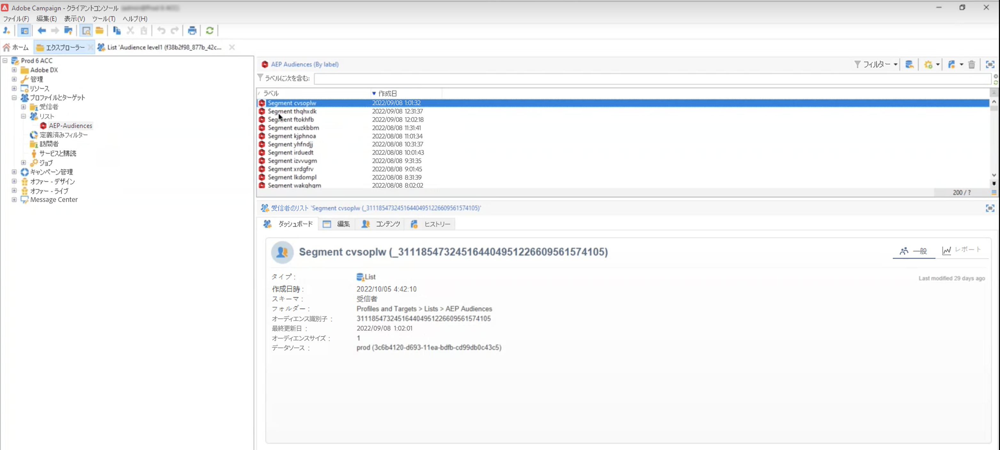
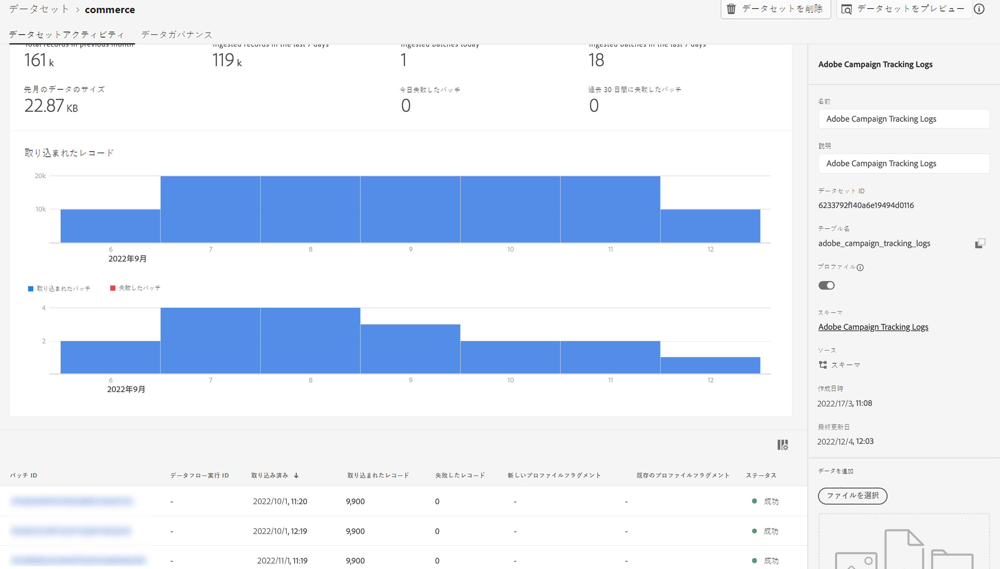

# Campaign と Adobe Experience Platform の連携

Adobe Campaign Managed Cloud Service の宛先とソースコネクタを使用すると、Adobe Campaign と Adobe Experience Platform をシームレスに統合できます。

* 用途 **Adobe Campaign Managed Cloud Services** アクティベーション用にAdobe CampaignにExperience Platformセグメントを送信するための宛先接続

   

* 用途 **Adobe Campaign Managed Cloud Services** Adobe Experience PlatformにAdobe Campaignの配信およびトラッキングログを送信するためのソース接続。

   

Adobe Experience Platform でこの統合を設定する手順は、次のとおりです。

1. 新しい Adobe Campaign Managed Cloud Services 宛先接続を設定して、セグメント／オーディエンスをアクティブ化し、そのデータを Adobe Campaign に送信します。

   使用する Campaign インスタンスの詳細を指定し、宛先に対してアクティブ化するセグメントを選択してから、Campaign にエクスポートする属性を設定します。

   [Adobe Campaign Managed Cloud Services 宛先接続の作成方法についてはこちらから](https://www.adobe.com/go/destinations-adobe-campaign-managed-cloud-services-en)

1. 新しい Adobe Campaign Managed Cloud Services ソース接続を設定して、Campaign イベントを Adobe Experience Platform に取り込みます。

   Campaign インスタンスと使用するスキーマの詳細を指定し、データを取り込むデータセットを選択してから、取得するフィールドを設定します。

   [Adobe Campaign Managed Cloud Services ソース接続の作成方法についてはこちらから](https://www.adobe.com/go/sources-campaign-ui-en)
