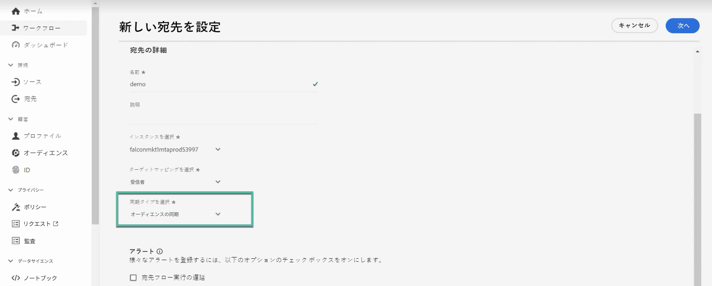

# Adobe Experience Platform でのオーディエンスの共有と同期{#gs-ac-aep}

Adobe Campaign Managed Cloud Service の宛先とソースコネクターを使用すると、Adobe Campaign と Adobe Experience Platform をシームレスに統合できます。この統合により、次のことができます。

* Adobe Experience Platform オーディエンスを Adobe Campaign に送信し、分析目的で配信ログとトラッキングログを Adobe Experience Platform に返す
* Adobe Experience Platform プロファイル属性を Adobe Campaign に取り込み、定期的に更新できるように同期プロセスを導入する

## Campaign への Adobe Experience Platform オーディエンスの送信{#audiences}

Adobe Experience Platform オーディエンスを Adobe Campaign に送信し、配信ログとトラッキングログを返す主な手順を以下に示します。

* Adobe Campaign Managed Cloud Services **宛先接続**&#x200B;を使用すると、Experience Platform セグメントを Adobe Campaign に送信することができます。

   1. Adobe Experience Platform 宛先カタログにアクセスし、新しい **[!UICONTROL Adobe Campaign Managed Cloud Services]** 接続を作成します。
   1. 使用する Campaign インスタンスの詳細を指定し、同期タイプとして「**[!UICONTROL オーディエンスの同期]**」を選択します。

      {width="800" align="center"}

   1. Adobe Campaign に送信するセグメントを選択します。
   1. オーディエンスにエクスポートする属性を設定します。
   1. フローが設定されると、選択したオーディエンスを Adobe Campaign でのアクティベーションに使用できるようになります。

      {width="800" align="center"}

  宛先の設定方法について詳しくは、[Adobe Campaign Managed Cloud Services 接続ドキュメント](https://www.adobe.com/go/destinations-adobe-campaign-managed-cloud-services-en){target="_blank"}を参照してください。

* Adobe Campaign Managed Cloud Services **ソース接続**&#x200B;を使用すると、Adobe Campaign の配信ログとトラッキングログを Adobe Experience Platform に送信できます。

  これを行うには、新しい Adobe Campaign Managed Cloud Services **ソース接続**&#x200B;を設定して、Campaign イベントを Adobe Experience Platform に取り込みます。Campaign インスタンスと使用するスキーマの詳細を指定し、データを取り込むデータセットを選択してから、取得するフィールドを設定します。[Adobe Campaign Managed Cloud Services ソース接続の作成方法についてはこちらから](https://www.adobe.com/go/sources-campaign-ui-en)

  {width="800" align="center"}

## Adobe Experience Platform と Adobe Campaign の間でのプロファイル属性の同期 {#profile}

Adobe Campaign と Adobe Experience Platform を接続すると、Adobe Experience Platform 上のプロファイルに関連付けられた追加のプロファイル属性を取り込み、Adobe Campaign データベース内で更新されるように同期プロセスを導入できます。

例えば、Adobe Experience Platform でオプトインとオプトアウトの値を取り込んでいるとします。この接続を使用すると、これらの値を Adobe Campaign に取り込み、定期的に更新されるように同期プロセスを導入できます。

>[!NOTE]
>
>プロファイル属性の同期は、Adobe Campaign データベースに既に存在するプロファイルで使用できます。

Adobe Experience Platform プロファイル属性を Adobe Campaign と同期する主な手順を以下に示します。

1. Adobe Experience Platform 宛先カタログにアクセスし、新しい **[!UICONTROL Adobe Campaign Managed Cloud Services]** 接続を作成します。
1. 使用する Campaign インスタンスの詳細を指定し、同期タイプとして「**[!UICONTROL プロファイルの同期（更新のみ）]**」を選択します。

   {width="800" align="center"}

1. Adobe Campaign データベースに更新するプロファイルをターゲットとするセグメントを選択します。
1. Adobe Campaign に更新するプロファイル属性を設定します。
1. フローが設定されると、選択したプロファイル属性が Adobe Campaign と同期され、宛先に設定されたセグメントのターゲットとなるすべてのプロファイルに対して更新されます。

宛先の設定方法について詳しくは、[Adobe Campaign Managed Cloud Services 接続ドキュメント](https://www.adobe.com/go/destinations-adobe-campaign-managed-cloud-services-en){target="_blank"}を参照してください。