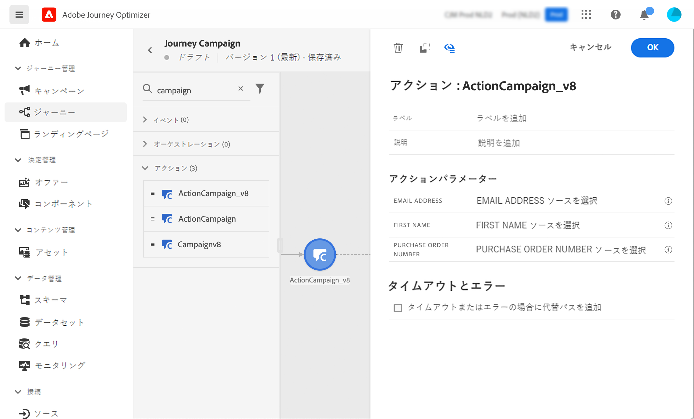

# Campaign とAdobe Journey Optimizerの使用

Adobe CampaignとAdobe Journey Optimizerの統合により、Adobe Journey Optimizerでカスタマージャーニーを調整し、Adobe Campaignトランザクションメッセージング機能を使用して E メール、プッシュ通知、SMS を送信できます。

基本的な手順は、Campaign でトランザクションメッセージテンプレートを作成し、Adobe Journey Optimizerでイベント、アクション、ジャーニーのデザインを作成することです。

 [この統合については、このエンドツーエンドのサンプルを参照してください。](https://experienceleague.adobe.com/docs/journey-optimizer/using/orchestrate-journeys/about-journey-building/using-adobe-campaign-classic.html){target=&quot;_blank&quot;}。

 [詳しくは、 Journey Optimizerのドキュメントを参照してください。](https://experienceleague.adobe.com/docs/journey-optimizer/using/orchestrate-journeys/about-journey-building/using-adobe-campaign-classic.html?lang=en){target=&quot;_blank&quot;}。

