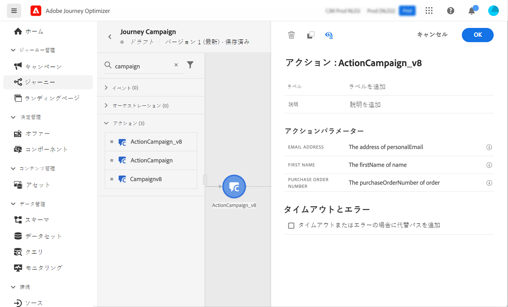

# Campaign とAdobe Journey Optimizer の連携

Adobe Campaign と Adobe Journey Optimizer の統合により、Adobe Journey Optimizer でカスタマージャーニーを調整し、Adobe Campaign トランザクションメッセージ機能を使用して電子メール、プッシュ通知、SMS を送信できます。

基本的な手順は、Campaign でトランザクションメッセージテンプレートを作成してから、Adobe Journey Optimizer でイベントとアクションを作成し、ジャーニーをデザインします。

[この統合について詳しくは、エンドツーエンドのサンプルを参照してください](https://experienceleague.adobe.com/ja/docs/journey-optimizer/using/orchestrate-journeys/journey-use-cases/business-use-cases/ajo-ac){target="_blank"}。

[詳しくは、Journey Optimizer のドキュメントを参照してください](https://experienceleague.adobe.com/ja/docs/journey-optimizer/using/orchestrate-journeys/about-journey-building/using-adobe-campaign-v7-v8){target="_blank"}。
