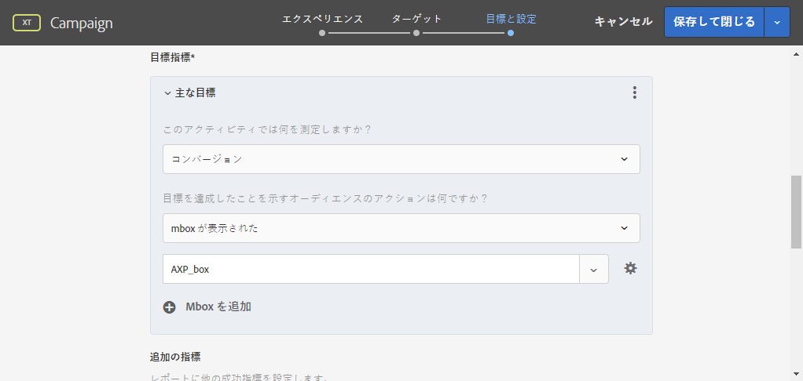

# Campaign と Adobe Target の連携

Campaign と Target を接続すると、Adobe Target からのオファーを Adobe Campaign の E メール配信に組み込むことができます。

この統合により、Adobe Campaign で送信したメールを受信者が開くと、Adobe Target を呼び出して動的なバージョンのコンテンツを表示する、というようなユースケースを実装することもできます。この動的バージョンは、E メールの作成時に事前に指定したルールに応じて自動生成されます。

>[!NOTE]
>この統合では、静的画像のみをサポートします。その他のタイプのコンテンツはパーソナライズできません。

Managed Cloud Services ユーザーの場合、Experience Cloudトリガーを Campaign に実装するには、[アドビにお問い合わせ](../start/campaign-faq.md#support)ください。

Adobe Target では、次の種類のデータを使用できます。

* Adobe Campaign データベースからのデータ
* Adobe Target で訪問者 ID にリンクされたセグメント。ただし、使用するデータが法的制限の対象とならない場合に限ります。
* Adobe Target のデータ。ユーザーエージェント、IP アドレス、位置情報データなど

## 動的コンテンツの挿入

次の例では、Adobe Target からの&#x200B;**動的なオファー**&#x200B;を Adobe Campaign のメールに統合する方法を説明します。

メッセージに含まれる画像が、受信者の国に応じて動的に変化するようなメッセージを作成します。データは、各 mbox リクエストごとに、訪問者の IP アドレスに基づいて送信されます。

この E メールでは、画像の 1 つが次のユーザーエクスペリエンスに従って動的に変化します。

* E メールがフランスで開かれている。
* E メールが米国で開かれている。
* どちらの条件にも該当しない場合、デフォルトの画像が表示される。

以下の手順は、Adobe Campaign と Adobe Target で実行する必要があります。

1. [メールへの動的なオファーの挿入](#inserting-dynamic-offer)
1. [リダイレクトオファーの作成](#create-redirect-offers)
1. [オーディエンスの作成](#audiences-target)
1. [「エクスペリエンスのターゲット設定」アクティビティの作成 ](#creating-targeting-activity)
1. [メッセージのプレビューと送信](#preview-send-email)

### メールへの動的なオファーの挿入 {#inserting-dynamic-offer}

Adobe Campaign で、E メールのターゲットとコンテンツを定義します。Adobe Target からの動的な画像を挿入できます。

それには、デフォルト画像の URL、場所名、Adobe Target に転送するフィールドを指定します。

Adobe Campaign では、2 通りの方法で Target から E メールに動的イメージを挿入できます。

* デジタルコンテンツエディターを使用している場合は、既存の画像を選択して、ツールバーで&#x200B;**[!UICONTROL 挿入]**／**[!UICONTROL Adobe Target からの動的画像]**&#x200B;を選択します。

   

* 標準のエディターを使用している場合は、画像を挿入する場所にカーソルを移動し、パーソナライゼーションドロップダウンメニューから&#x200B;**[!UICONTROL 含める]**／**[!UICONTROL Adobe Target からの動的画像]**&#x200B;を選択します。

   

次に、画像のパラメーターを定義します。

* **[!UICONTROL デフォルト画像]**&#x200B;の URL は、条件を満たすものがない場合に表示される画像です。アセットライブラリから画像を選択することもできます。
* **[!UICONTROL ターゲットの場所]**&#x200B;は、動的なオファーの場所の名前です。 この場所は、Adobe Target のアクティビティで選択する必要があります。
* **[!UICONTROL ランディングページ]**&#x200B;は、デフォルト画像からリダイレクトされて開くデフォルトのページです。この URL は、デフォルト画像が最終的な E メールに表示される場合にのみ適用されます。 これはオプションです。
* **[!UICONTROL 追加の決定パラメーター]**&#x200B;は、Adobe Target セグメントで定義されたフィールドと Adobe Campaign のフィールドとのマッピングを指定します。使用する Adobe Campaign フィールドは、rawbox で指定されている必要があります。この例では、「国」フィールドを追加しています。

Adobe Target の設定で Enterprise 権限を使用している場合は、対応するプロパティをこのフィールドに追加します。Target の Enterprise 権限について詳しくは、[このページ](https://experienceleague.adobe.com/docs/target/using/administer/manage-users/enterprise/properties-overview.html?lang=ja#administer)を参照してください。

### リダイレクトオファーの作成 {#create-redirect-offers}

Adobe Target では、オファーのさまざまなバージョンを作成できます。各ユーザーエクスペリエンスに応じて、リダイレクトオファーを作成し、表示される画像を指定できます。

ここでは、2 つのリダイレクトオファーが必要です。3 番目（デフォルト）のものは、Adobe Campaign で定義します。

1. Target Standard で新しいリダイレクトオファーを作成するには、「**[!UICONTROL コンテンツ]**」タブで「**[!UICONTROL コードオファー]**」をクリックします。

1. 「**[!UICONTROL 作成]**」、「**[!UICONTROL リダイレクトオファー]**」の順にクリックします。

   

1. オファーの名前と画像の URL を入力します。

   

1. 残りのリダイレクトオファーについても同じ手順を繰り返します。詳しくは、この[ページ](https://experienceleague.adobe.com/docs/target/using/experiences/offers/offer-redirect.html?lang=ja#experiences)を参照してください。

### オーディエンスの作成 {#audiences-target}

Adobe Target では、2 つのオーディエンスを作成する必要があります。オファーに訪問する人はそれらのオーディエンスに分類され、この分類ごとに、異なるコンテンツが配信されます。オーディエンスごとに、オファーを表示できる人を定義するルールを追加します。

1. Target で新しいオーディエンスを作成するには、「**[!UICONTROL オーディエンス]**」タブで「**[!UICONTROL オーディエンスを作成]**」をクリックします。

   

1. オーディエンスに名前を追加します。

   

1. 「**[!UICONTROL ルールを追加]**」をクリックして、カテゴリを選択します。このルールでは、特定の条件を使用して訪問者をターゲティングしています。条件を追加したり、他のカテゴリに新しいルールを作成したりしてルールを調整できます。

1. 残りのオーディエンスについても同じ手順を繰り返します。

### 「エクスペリエンスのターゲット設定」アクティビティの作成  {#creating-targeting-activity}

Adobe Target では、「エクスペリエンスのターゲット設定」アクティビティを作成し、様々なエクスペリエンスを定義して、対応するオファーに関連付ける必要があります。

まず、オーディエンスを定義する必要があります。

1. エクスペリエンスのターゲット設定アクティビティを作成するには、「**[!UICONTROL アクティビティ]**」タブで、「**[!UICONTROL アクティビティを作成]**」をクリックし、「**[!UICONTROL エクスペリエンスのターゲット設定]**」をクリックします。

   

1. **[!UICONTROL Experience Composer]** として「**[!UICONTROL フォーム]**」を選択します。

1. 「**[!UICONTROL オーディエンスを変更]**」ボタンをクリックして、オーディエンスを選択します。

   

1. 前の手順で作成したオーディエンスを選択します。

   

1. 「**[!UICONTROL エクスペリエンスのターゲット設定を追加]**」をクリックして、別のエクスペリエンスを作成します。

次に、オーディエンスごとにコンテンツを追加します。

1. Adobe Campaign でダイナミックオファーを挿入する際に選択した場所名を選択します。

   

1. ドロップダウンボタンをクリックして、「**[!UICONTROL リダイレクトオファーを変更]**」を選択します。

   

1. 前の手順で作成したリダイレクトオファーを選択します。

   

1. 2 番目のエクスペリエンスについても同じ手順を繰り返します。

**[!UICONTROL ターゲット]**&#x200B;ウィンドウに、アクティビティの概要が表示されます。必要に応じて、他のエクスペリエンスを追加できます。

**[!UICONTROL 目標と設定]**&#x200B;ウィンドウでは、優先度、目標、期間を設定して、アクティビティをパーソナライズできます。

「**[!UICONTROL レポート設定]**」セクションでは、アクションを選択し、目標達成を判別するためのパラメーターを編集できます。

## メッセージのプレビューと送信 {#preview-send-email}

Adobe Campaign では、E メールをプレビューして、様々な受信者でのレンダリングをテストできます。

作成される様々なエクスペリエンスに従って画像が変化することがわかります。

これで、Target からの動的なオファーを含んだ E メールを送信する準備が整いました。

