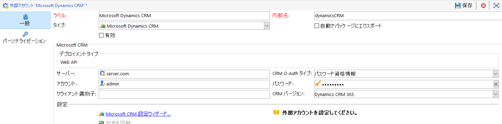

# Campaign と Microsoft Dynamics 365 の連携{#crm-ms-dynamics}

クロスチャネル通信で CRM データをアクティブ化します。**Microsoft Dynamics 365** から Adobe Campaign に連絡先を渡し、キャンペーンパフォーマンスデータ（送信、開封、クリックおよびバウンス）を Adobe Campaign に戻り Microsoft Dynamics 365 に共有する方法を学びます。

設定が完了したら、専用のワークフローアクティビティでシステム間のデータ同期を実行します。[詳細情報](crm-data-sync.md)。

>[!NOTE]
>
>サポートされている Microsoft Dynamics のバージョンについて詳しくは、Campaign の[互換性マトリックス](../start/compatibility-matrix.md)を参照してください。

次の手順に従って、Microsoft Dynamics 365 データを Adobe Campaign にインポートおよびエクスポートするための、専用の外部アカウントを設定します。

システムごとに、管理者がこれらの手順を実行する必要があります。

>[!CAUTION]
> このドキュメントの手順では、権限の割り当てや管理者アクセスに関連する統合／登録の作成手順を説明します。お客様の責任として、事前に会社のポリシーに従って手順を確認し、慎重に実行する必要があります。

## Microsoft Dynamics 365 の設定 {#config-crm-microsoft}

**Web API** 経由で Microsoft Dynamics 365 を Adobe Campaign と連携させるには、**グローバル管理者**&#x200B;資格情報を使用して、[Microsoft Azure Directory](https://portal.azure.com) にログオンし、次の手順に従います。

1. Dynamics 365 アプリケーション（クライアント）ID を取得します。[詳細情報](#get-client-id-microsoft)
1. Microsoft Dynamics 証明書キー識別子およびキー ID を生成します。[詳細情報](#config-certificate-key-id)
1. 権限を設定します。[詳細情報](#config-permissions-microsoft)
1. アプリユーザーを作成します。[詳細情報](#create-app-user-microsoft)
1. 秘密鍵をエンコードします。[詳細情報](#configure-acc-for-microsoftt)


### Dynamics 365 クライアント ID の取得 {#get-client-id-microsoft}

アプリケーション（クライアント）ID を取得するには、Azure Active Directory にアプリを登録する必要があります。

1. **Azure Active Directory／アプリ登録**&#x200B;に移動し、「**新規登録**」を選択します。
1. **adobecampaign`<instance identifier>`** など、インスタンスの識別に役立つ一意の名前を入力します。

保存すると、Microsoft Azure Directory は一意の&#x200B;**アプリケーション（クライアント）ID** をアプリに割り当てます。この ID は、後で Adobe Campaign で Dynamics 365 を設定する際に必要になります。

詳しくは、[Microsoft Dynamics 365 ドキュメント](https://docs.microsoft.com/powerapps/developer/common-data-service/walkthrough-register-app-azure-active-directory){target=&quot;_blank&quot;}を参照してください。

### Microsoft Dynamics 証明書キー識別子およびキー ID の生成 {#config-certificate-key-id}

**証明書キー識別子（customKeyIdentifier）**&#x200B;および&#x200B;**キー ID（keyId）**&#x200B;を取得するには、証明書をアップロードする必要があります。証明書は、トークンのリクエスト時にアプリケーションの ID を証明するための暗号鍵として使用できます。公開鍵とも呼ばれます。

以下の手順に従います。

1. **Azure Active Directory／アプリ登録**&#x200B;に移動し、以前に作成されたアプリケーションを選択します。
1. **証明書と暗号鍵**&#x200B;を選択します。
1. 「**証明書**」タブで、「**証明書をアップロード**」をクリックします。
1. 公開証明書をアップロードします。
1. **マニフェスト**&#x200B;リンクを参照し、**証明書キー識別子（customKeyIdentifier）**&#x200B;と&#x200B;**キー ID（keyId）**&#x200B;を取得します。

**証明書キー識別子（customKeyIdentifier）**&#x200B;と&#x200B;**キー ID（keyId）**&#x200B;は、**[!UICONTROL CRM O-Auth タイプ]**&#x200B;の証明書を使用して Microsoft Dynamics 365 CRM 外部アカウントを設定する際に Campaign で必要になります。

+++ 公開証明書の生成方法

証明書を生成するには、OpenSSL を使用します。

例：

```
- openssl req -x509 -sha256 -nodes -days 365 -newkey rsa:2048 -keyout '<'private key name'>' -out '<'public certificate name'>
```

>[!NOTE]
>
>コードサンプルの `-days 365` で日数を変更することで、証明書の有効期間を延長することができます。

次に、Base64 で証明書をエンコードする必要があります。それには、Base64 エンコーダーを利用するか、Linux の場合はコマンドライン `base64 -w0 private.key` を使用します。

+++

### 権限の設定 {#config-permissions-microsoft}

**手順 1**：作成したアプリに&#x200B;**必要な権限**&#x200B;を設定する

1. **Azure Active Directory／アプリ登録**&#x200B;に移動し、以前に作成されたアプリケーションを選択します。
1. 左上の「**設定**」をクリックします。
1. 「**必要な権限**」で、「**追加**」と **API／Dynamics CRM オンライン**&#x200B;をクリックします。
1. 「 **選択**」をクリックし、「**組織ユーザーとして Dynamics 365 にアクセス**」チェックボックスを有効にして、「**選択**」をクリックします。
1. 次に、アプリから&#x200B;**管理**&#x200B;メニューの下の&#x200B;**マニフェスト**&#x200B;を選択します。
1. **マニフェスト**&#x200B;エディターで、`allowPublicClient` プロパティを `null` から `true` に設定し、「**保存**」をクリックします。

**手順 2**：管理者の同意を付与する

1. **Azure Active Directory／エンタープライズアプリケーション**&#x200B;に移動します。
1. テナント全体での管理者の同意を付与するアプリケーションを選択します。
1. 左側のペインメニューから、「**セキュリティ**」の下の「**権限**」を選択します。
1. 「**管理者の同意の付与**」をクリックします。

詳しくは、[Azure のドキュメント](https://docs.microsoft.com/azure/active-directory/manage-apps/grant-admin-consent#grant-admin-consent-from-the-azure-portal)を参照してください。

### アプリユーザーの作成 {#create-app-user-microsoft}

>[!NOTE]
>
> この手順は、**[!UICONTROL パスワード資格情報]**&#x200B;認証ではオプションです。

アプリユーザーとは、上で登録したアプリケーションで使用するユーザーです。上記の登録済みのアプリを使用して Microsoft Dynamics に対して行った変更は、このユーザーを通じて行われます。

**手順 1**：Azure Active Directory に非インタラクティブユーザーを作成する

1. **Azure Active Directory／ユーザー**&#x200B;をクリックし、「**新しいユーザー**」をクリックします。
1. 使用する適切な名前を指定し、ユーザー名は電子メールフォーマットにする必要があります。
1. **ディレクトリロール**&#x200B;の **Dynamics 365 管理者**&#x200B;を選択します。

**手順 2**：作成したユーザーに適切なライセンスを割り当てる

1. [Microsoft Azure](https://portal.azure.com) から、「**管理者アプリ**」をクリックします。
1. **ユーザー／アクティブなユーザー**&#x200B;に移動し、新しく作成したユーザーをクリックします。
1. 「**製品ライセンスを編集**」をクリックし、**Dynamics 365 顧客エンゲージメントプラン**&#x200B;を選択します。
1. 「**閉じる**」をクリックします。

**手順 3**：Dynamics CRM でアプリケーションユーザーを作成する

1. [Microsoft Azure](https://portal.azure.com) から、**設定／セキュリティ／ユーザー**&#x200B;に移動します。
1. ドロップダウンをクリックし、**アプリケーションユーザー**&#x200B;を選択して「**新規**」をクリックします。
1. 上の Active Directory に作成されたユーザーと同じユーザー名を使用します.
1. **アプリケーション ID** を[以前に作成したアプリケーション](#get-client-id-microsoft)に割り当てます。
1. 「**ロールの管理**」をクリックし、ユーザーに対して&#x200B;**システム管理者**&#x200B;ロールを選択します。

## Campaign の設定 {#configure-acc-for-microsoft}

### 接続の作成{#new-ms-dyn-external-account}

まず、Microsoft Dynamics 365 外部アカウントを作成する必要があります。

1. Campaign エクスプローラーの&#x200B;**[!UICONTROL 管理／プラットフォーム／外部アカウント]**&#x200B;ノードを参照し、外部アカウントを作成します。
1. 「**タイプ**」セクションの **[!UICONTROL Microsoft Dynamics CRM]** 外部アカウントに選択します。
1. 認証方法を「**[!UICONTROL CRM O-Auth タイプ]**」ドロップダウンリストで選択します。

   

   1. Microsoft Dynamics CRM 外部アカウントを設定して Adobe Campaign と&#x200B;**パスワード資格情報**&#x200B;を接続するには、次の詳細を入力します。

      * **サーバー**：Microsoft CRM サーバーの URL。Microsoft CRM Server URL を見つけるには、Microsoft Dynamics CRM アカウントにアクセスし、Dynamics 365 をクリックしてアプリを選択します。次に、ブラウザーのアドレスバーに Server URL が表示されます（例：https://myserver.crm.dynamics.com/）。
      * **アカウント**：Microsoft CRM へのログインに使用するアカウント。
      * **パスワード**：Microsoft CRM へのログインに使用するアカウント。
      * **クライアント識別子**：Microsoft Azure 管理ポータルの「コードを更新」カテゴリ、「クライアント ID」フィールドにあるアプリケーション（クライアント）ID。
      * **CRM バージョン**：Dynamics CRM 365 CRM バージョンを選択します。
   1. Microsoft Dynamics CRM 外部アカウントを、**証明書**&#x200B;を使って Adobe Campaign に接続するには、次の詳細を入力して設定します。

      * **サーバー**：Microsoft CRM サーバーの URL。Microsoft CRM Server URL を見つけるには、Microsoft Dynamics CRM アカウントにアクセスし、Dynamics 365 をクリックしてアプリを選択します。次に、ブラウザーのアドレスバーに Server URL が表示されます（例：https://myserver.crm.dynamics.com/）。
      * **秘密鍵**：エンコードされた Base64 で秘密鍵をコピー＆ペーストします。[この節](#config-certificate-key-id)で詳しく説明しています。
      * **キー ID**：キーはアプリケーションの「**マニフェスト**」タブで利用可能です。詳しくは、[この節](#config-certificate-key-id)で説明しています。
      * **カスタムキー識別子**：アプリケーションの「**マニフェスト**」タブで使用できる識別子です。詳しくは、[この節](#config-certificate-key-id)で説明しています。
      * **クライアント識別子**：Microsoft Azure 管理ポータルにあるアプリケーション（クライアント）ID です。詳しくは、[この節](#get-client-id-microsoft)で説明しています。
      * **CRM バージョン**：Dynamics CRM 365 CRM バージョンを選択します。


1. 「**有効にする**」オプションを選択して Campaign でアカウントを有効化します。

>[!NOTE]
>
>設定を承認するには、Adobe Campaign コンソールからログオフし、再度ログオンします。

### 同期するテーブルを選択{#ms-dyn-create-tables}

同期するテーブルを設定できるようになりました。

1. 「**[!UICONTROL Microsoft CRM 設定ウィザード...]**」をクリックします。
1. 同期するテーブルを選択し、プロセスを開始します。
1. **[!UICONTROL 管理／設定／データスキーマ]**&#x200B;ノードで、Adobe Campaign で生成されたスキーマを確認します。

>[!NOTE]
>
>サーバー URL および `login.microsoftonline.com` の 2 つの URL を必ず許可リストに追加してください。これを実行するには、アドビ担当者にお問い合わせください。

## 列挙の同期{#sfdc-enum-sync}

スキーマを作成したら、列挙を Dynamics 365 から Adobe Campaign に自動的に同期することができます。

1. 「**[!UICONTROL 列挙を同期しています...]**」リンクからアシスタントを開きます。
1. Dynamics 365 列挙に一致する Adobe Campaign 列挙を選択します。
Adobe Campaign の列挙のすべての値を CRM の値に置き換えることができます。そのためには、**[!UICONTROL 置換]**&#x200B;列の「**[!UICONTROL はい]**」を選択します。
1. 「**[!UICONTROL 次へ]**」をクリックしてから「**[!UICONTROL 開始]**」をクリックし、列挙のインポートを開始します。
1. **[!UICONTROL 管理／プラットフォーム／列挙]**&#x200B;ノードを参照し、インポートされた値を確認します。

これで Adobe Campaign と Microsoft Dynamics 365 が接続されました。2 つのシステム間にデータの同期を設定できます。

Adobe Campaign データと Microsoft CRM の間でデータを同期させるには、ワークフローを作成し、**[!UICONTROL CRM コネクタ]**&#x200B;アクティビティを使用します。

データの同期について詳しくは、[このページ](crm-data-sync.md)を参照してください。

### サポートされているフィールドデータタイプ {#ms-dyn-supported-types}

Microsoft Dynamics 365 でサポートされる／サポートされない属性タイプは、次のとおりです。


| 属性タイプ | サポート対象 |
| --------------------------------------------------------------------------------- | --------- |
| 基本型：ブール、日時、小数、浮動小数点数、倍精度浮動小数点数、整数、bigint、文字列 | はい |
| 金額（倍精度浮動小数点数） | はい |
| memo、entityname、primarykey、uniqueidentifier（文字列） | はい |
| ステータス、ピックリスト（使用可能な値を列挙型に格納）、ステート（文字列） | はい |
| 所有者（文字列） | はい |
| ルックアップ（単一のエンティティ参照ルックアップのみ） | はい |
| 顧客 | いいえ |
| 関連 | いいえ |
| PartyList | いいえ |
| ManagedProperty | いいえ |
