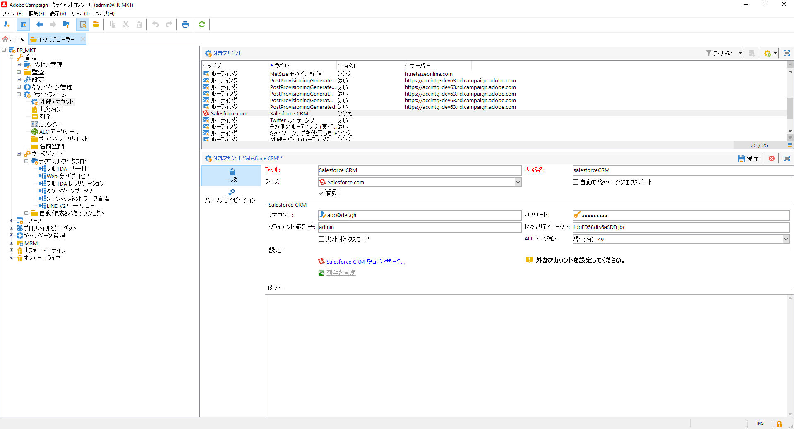
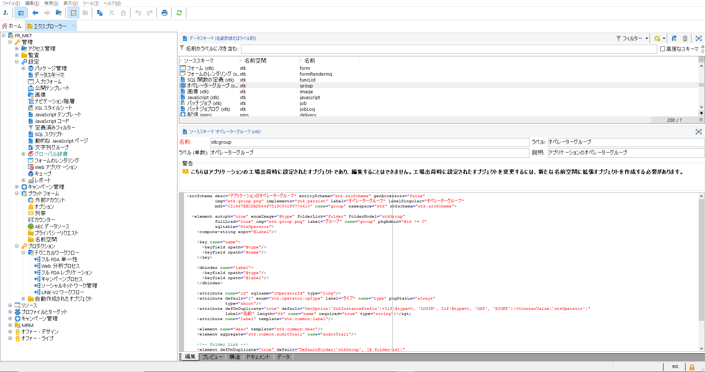
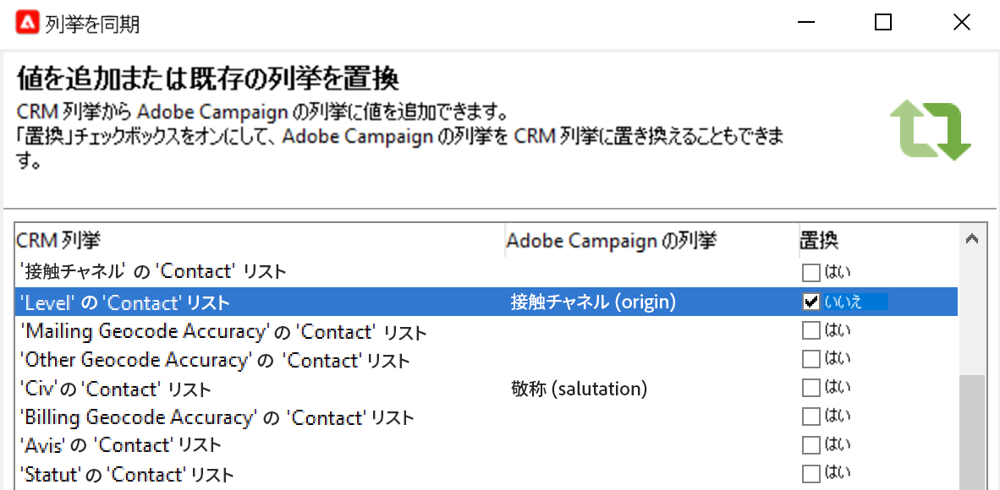

# Campaign と SFDC の連携{#crm-sfdc}

Campaign v8 を **Salesforce.com** に接続するように Campaign CRM コネクタを設定する方法を説明します。

設定が完了したら、専用のワークフローアクティビティでシステム間のデータ同期を実行します。[詳細情報](crm-data-sync.md)。

>[!NOTE]
>
>サポートされている SFDC のバージョンについて詳しくは、Campaign の[互換性マトリックス](../start/compatibility-matrix.md)を参照してください。

Salesforce データを Adobe Campaign にインポートおよびエクスポートするための専用の外部アカウントを設定するには、以下の手順に従います。

## 接続の作成{#new-sfdc-external-account}

まず、Salesforce 外部アカウントを作成する必要があります。

1. Campaign エクスプローラーの&#x200B;**[!UICONTROL 管理／プラットフォーム／外部アカウント]**&#x200B;ノードを参照し、外部アカウントを作成します。
1. 「**タイプ**」セクションの **[!UICONTROL Salesforce.com]** 外部アカウントを選択します。
1. 接続を有効にするための設定を入力します。

   

   Salesforce CRM 外部アカウントを Adobe Campaign で使用できるように設定するには、次の情報を提供する必要があります。

   * Salesforce ログインを「**[!UICONTROL アカウント]**」フィールドに入力します。
   * Salesforce パスワードを入力します。
   * 「**[!UICONTROL クライアント識別子]**」フィールドは無視することができます。
   * Salesforce **[!UICONTROL セキュリティトークン]**&#x200B;をコピー＆ペーストします
   * **[!UICONTROL API バージョン]**&#x200B;を選択します。サポートされる SFDC API のバージョンは Campaign [互換性マトリックス](../start/compatibility-matrix.md)に一覧表示されます。

1. 「**有効にする**」オプションを選択して Campaign でアカウントを有効化します。

>[!NOTE]
>
>設定を承認するには、Adobe Campaign コンソールからログオフし、再度ログオンする必要があります。

## 同期するテーブルを選択{#sfdc-create-tables}

同期するテーブルを設定できるようになりました。

1. 「**[!UICONTROL Salesforce CRM 設定ウィザード...]**」をクリックします。
1. 同期するテーブルを選択し、プロセスを開始します。
1. **[!UICONTROL 管理／設定／データスキーマ]**&#x200B;ノードで、Adobe Campaign で生成されたスキーマを確認します。

   Campaign にインポートされた **Salesforce** のスキーマの例：

   

## 列挙の同期{#sfdc-enum-sync}

スキーマを作成したら、列挙を Salesforce から Adobe Campaign に自動的に同期することができます。

1. 「**[!UICONTROL 列挙を同期しています...]**」リンクからアシスタントを開きます。
1. Salesforce 列挙に対応する Adobe Campaign 列挙を選択します。Adobe Campaign の列挙のすべての値を CRM の値に置き換えることができます。そのためには、**[!UICONTROL 置換]**&#x200B;列の「**[!UICONTROL はい]**」を選択します。

   

1. 「**[!UICONTROL 次へ]**」をクリックしてから「**[!UICONTROL 開始]**」をクリックし、列挙のインポートを開始します。

1. **[!UICONTROL 管理／プラットフォーム／列挙]**&#x200B;ノードを参照し、インポートされた値を確認します。

これで Adobe Campaign と Salesforce.com が接続されました。2 つのシステム間にデータの同期を設定できます。

Adobe Campaign データと SFDC の間でデータを同期させるには、ワークフローを作成し、**[!UICONTROL CRM コネクタ]**&#x200B;アクティビティを使用します。

データの同期について詳しくは、[このページ](crm-data-sync.md)を参照してください。
