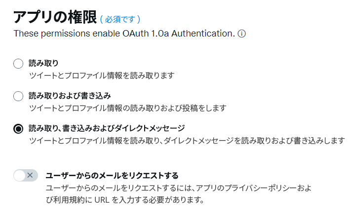
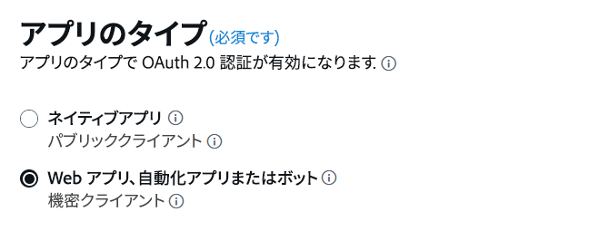
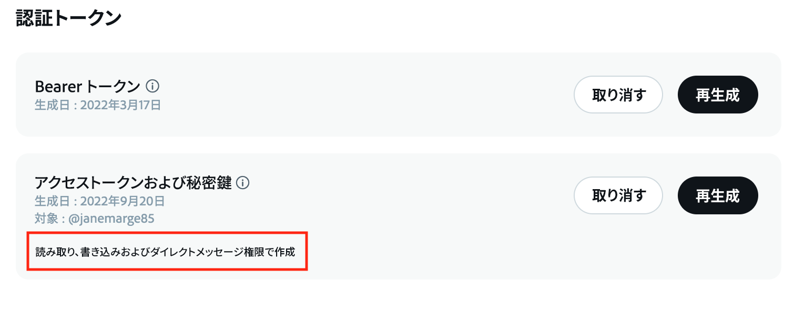
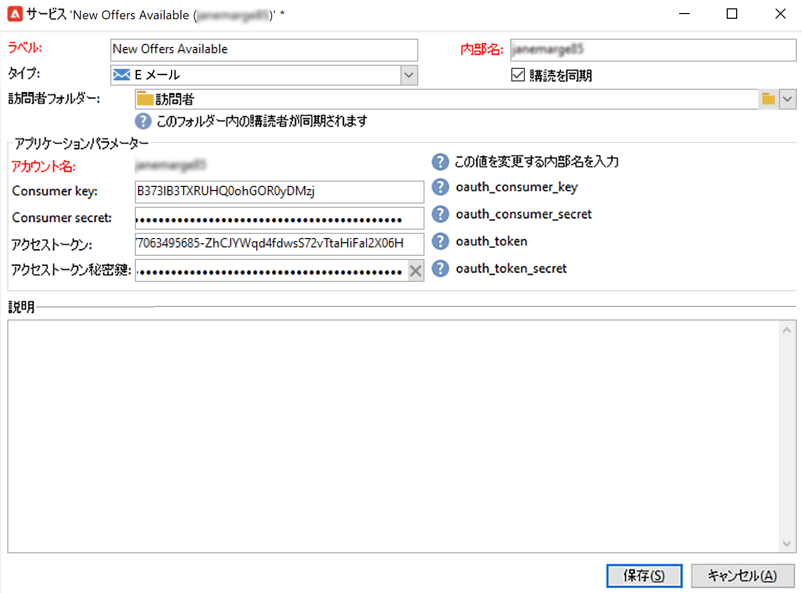
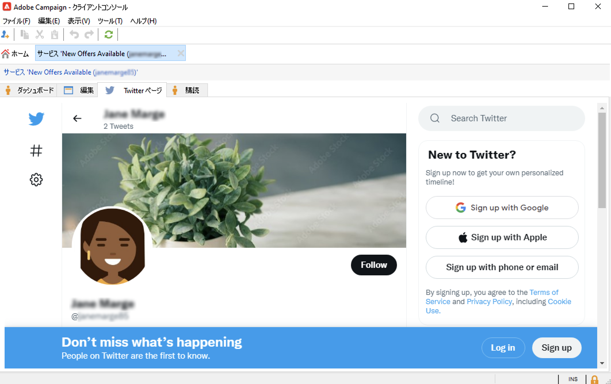

# Campaign と Twitter の連携{#tw-ac-ovv}

この&#x200B;**ソーシャルネットワーク管理（ソーシャルマーケティング）**&#x200B;モジュールを使用すると、Twitter を介して顧客とやり取りできます。この機能を使用すると、次のことができます。

* メッセージの投稿と DM の送信 - Adobe Campaign のソーシャルマーケティングを使用して、Twitter でメッセージを投稿します。フォロワー全員にダイレクトメッセージを送信することも可能です。

* 新しい連絡先の収集 - Adobe Campaign ソーシャルマーケティングを使用すると、新しい連絡先を簡単に取得できます。ユーザーに連絡して、プロファイル情報を共有してよいか尋ねます。ユーザーが同意すると、Adobe Campaign で情報が自動的に収集されます。これにより、キャンペーンのターゲティングを実行し、可能であればクロスチャネル戦略も導入できます。

 Managed Cloud Services ユーザーとして Campaign を Twitter に接続する場合は、[アドビにお問い合わせ](../start/campaign-faq.md#support)ください。この&#x200B;**ソーシャルネットワーク管理（ソーシャルマーケティング）**&#x200B;アドオンは、専用パッケージを通じてお使いの環境にインストールし、Twitter 外部アカウントを設定する必要があります。

Twitter アカウントにツイートを投稿するように Adobe Campaign を設定するには、これらのアカウントの Adobe Campaign への書き込みアクセス権をデリゲートします。そのためには、次の手順を実行する必要があります。

1. Twitter アカウントを作成し、開発者アカウントに新規登録します。[詳細情報](#dev-account)
1. （オプション）配達確認を送信するためのテスト用 Twitter アカウントを作成します。[詳細情報](#tw-test-account)
1. Twitter アプリケーション（Twitter アカウントごとに 1 つのアプリ）を作成します。[詳細情報](#create-an-app-on-twitter)
1. **[!UICONTROL Twitter]** の新しいサービス（Twitter アカウントごとに 1 つのサービス）を作成します。[詳細情報](#create-tw-service)
1. Twitter アカウントを Campaign と同期します。[詳細情報](#synchro-tw-accounts)

## Twitter 開発者アカウント {#dev-account}

この統合を開始するには、[Twitter 開発者アカウント](https://developer.twitter.com){target="_blank"}に新規登録する必要があります。

Campaign は、Twitter API の 1.1 バージョンを使用します。 これを使用するには、開発者ポータル経由で管理者特権でのアクセス権を申請する必要があります。Twitter の昇格アクセスについて詳しくは、[このページ](https://developer.twitter.com/en/portal/products/elevated){target="_blank"}を参照してください。

## Twitter でのアプリケーションの作成 {#create-an-app-on-twitter}

管理者特権でのアクセスが承認されたら、Twitter アプリケーションを作成して、Adobe Campaign が Twitter アカウントにツイートを投稿できるようにします。これを行うには、次の手順に従います。

1. Twitter アカウントにログオンします。
1. [Twitter 開発者ポータル](https://developer.twitter.com/en/apps)に接続します。
1. 「**アプリの作成**」を選択します。
1. Twitter アシスタントの指示に従ってプロセスを進めます。
1. Adobe Campaign がアカウントにツイートを投稿できるようにするには、アプリの「ユーザー認証の設定」セクションから&#x200B;**アプリの権限**&#x200B;を編集します。「**読み取り、書き込み、ダイレクトメッセージ**」を選択します。

   

1. 「**アプリのタイプ**」セクションで、「**Web アプリ、自動アプリまたはボット**」を選択します。「**コールバック URL**」フィールドを空のままにして、設定を保存できます。

   

1. アプリのダッシュボードに戻り、アプリを選択し、「**キーとトークン**」タブを参照します。**アクセストークンと秘密鍵**&#x200B;の下に、**読み取り、書き込み、ダイレクト メッセージ**&#x200B;権限が記載されていない場合は、アプリのトークンと秘密鍵を再生成する必要があります。すべてのキーとトークンは、作成時に保存する必要があります。これらは、Campaign の Twitter サービスを設定するために必要になります。

   

>[!NOTE]
>
>Twitter アカウントごとに 1 つのアプリケーションが必要です。その結果、別のテストアプリケーションを作成し、配達確認をテストアカウントに送信する必要があります。

## Campaign での Twitter サービスの作成 {#create-tw-service}

Campaign インスタンスを Twitter アカウントにリンクするには、 **Twitter** サービスを作成し、Campaign への書き込みアクセス権をデリゲートします。

>[!CAUTION]
>
>Twitter アカウントごとに 1 つの **Twitter** サービスを作成します。その際、別のテストサービスを作成し、配達確認を[テストアカウント](#tw-test-account)に送信する必要があります。
>
>各 **Twitter** サービスも、アドビが MID インスタンスで作成する必要があります。環境の設定については、アドビ担当者にお問い合わせください。

設定を入力するには、Adobe Campaign コンソールと Twitter アプリの権限の両方にアクセスする必要があります。

1.  **Adobe Campaign** で、「**[!UICONTROL プロファイルとターゲット]**」タブを参照し、「**[!UICONTROL サービスと購読]**」リンクを選択します。
1. 新しいサービスを作成します。
1. **[!UICONTROL Twitter]** タイプを選択します。
1. サービスのラベルおよび内部名を入力します。

   >[!CAUTION]
   >
   >サービスの&#x200B;**[!UICONTROL 内部名]**&#x200B;は、Twitter アカウントとまったく同じ名前である必要があります。

1. デフォルトでは、フォロワーは&#x200B;**[!UICONTROL 訪問者]**&#x200B;フォルダーに保存されます。「**[!UICONTROL 訪問者フォルダー]**」フィールドから別の場所を選択します。[詳細情報](../send/twitter.md#direct-tw-messages)

   

   >[!NOTE]
   >
   >この「**[!UICONTROL 購読を同期]**」オプションはデフォルトで有効になっています。このオプションは、Twitter のフォロワーのリストを自動的に復元し、[ダイレクトメッセージを送信](../send/twitter.md#direct-tw-messages)できるようにします。同期は[専用のテクニカルワークフロー](#synchro-tw-accounts)によって実行されます。

1. Twitter アプリから、「**API Key**」フィールドと「**[API Key Secret]**」フィールドの内容をコピーして、Campaign **Twitter** サービスの「**[!UICONTROL Consumer key]**」フィールドと「**[!UICONTROL Consumer secret]**」フィールドに貼り付けます。

1. Twitter アプリから、「**Access Token**」フィールドと「**Access Token Secret**」フィールドの内容をコピーし、Campaign **Twitter** サービスの「**[!UICONTROL アクセストークン]**」フィールドと「**[!UICONTROL アクセストークン秘密鍵]**」フィールドに貼り付けます。

1. Campaign クライアントコンソールで、「**[!UICONTROL 保存]**」をクリックします。これで、書き込みアクセス権が Adobe Campaign にデリゲートされました。

設定を確認するには、次の操作を実行します。

* 作成したばかりの **Twitter** サービスを編集します。
* 「**[!UICONTROL Twitter ページ]**」タブを参照します。Twitter アカウントが表示されます。
   

## Twitter アカウントの同期 {#synchro-tw-accounts}

Campaign と Twitter 間の同期は、専用のテクニカルワークフローで管理されます。これらのワークフローは、**[!UICONTROL 管理／プロダクション／テクニカルワークフロー／ソーシャルネットワーク管理]**&#x200B;フォルダーに格納されます。

これらはデフォルトで停止されます。**ソーシャルマーケティング**&#x200B;モジュールを使用し始めるときは、手動で開始する必要があります。

**[!UICONTROL Twitter アカウントの同期]**&#x200B;テクニカルワークフローは、Adobe Campaign で Twitter アカウントを同期します。このワークフローは、Twitter のフォロワーのリストを復元して、ダイレクトメッセージを送信できるようにします。[詳細情報](../send/twitter.md#direct-tw-messages)

デフォルトでは、このワークフローは毎週木曜日の午前 7:30 にトリガーされます。「**[!UICONTROL 保留中のタスクを今すぐ実行]**」オプションを使用して、この統合の実装時にいつでもワークフローを開始できます。スケジューラーを編集して、ワークフローのトリガー頻度を変更することもできます。詳しくは、[このページ](../../automation/workflow/scheduler.md)を参照してください。

>[!CAUTION]
>
>Twitter サブスクライバーのリストを復元するには、アカウントにリンクされたサービスに対して、「**[!UICONTROL Twitter アカウントの同期]**」オプションをオンにする必要があります。[詳細情報](#create-tw-service)

フォロワーは、「訪問者」という特定のテーブルに格納されます。Twitter フォロワーのリストを表示するには、**[!UICONTROL プロファイルとターゲット／訪問者]**&#x200B;を参照します。

Adobe Campaign は、各フォロワーについて以下の情報を格納します。

* **[!UICONTROL 接触チャネル]**：Twitter
* **[!UICONTROL 外部 ID]**：ユーザー識別子
* **[!UICONTROL ユーザー名]**：ユーザーのアカウント名
* **[!UICONTROL フルネーム]**：ユーザーの名前
* **[!UICONTROL 友人の数]**：フォロワー数
* **[!UICONTROL 確認済み]**：ユーザーが検証済みの Twitter アカウントを持っているかを示すフィールド

設定が完了したら、Twitter アカウントにツイートを投稿し、フォロワーにダイレクトメッセージを送信できます。[詳細情報](../send/twitter.md)

## Twitter でのテストアカウントの作成 {#tw-test-account}

Twitter アカウントに加えて、[ツイートの配達確認](../send/twitter.md#send-tw-proofs)の送信に使用できる非公開 Twitter アカウントを作成します。これを行うには、次の手順に従います。

1. 新しい Twitter アカウントを作成します。
1. そのアカウントの&#x200B;**設定**&#x200B;にアクセスします。
1. 「**プライバシーと安全性**」および「**オーディエンスとタグ付け**」を参照し、「**ツイートの保護**」オプションをオンにします。ツイートやその他のアカウント情報は、フォロワーにのみ表示されます。

前述のように、このテストアカウントで動作するよう Twitter アプリと Campaign サービスを設定します。
