# Campaign と CRM 間のデータの同期 {#data-synchronization}

Adobe Campaignと CRM 間のデータ同期は、 **CRM コネクタ** ワークフローアクティビティ。

Microsoft Dynamics データを Adobe Campaign にインポートするには、次のタイプのワークフローを作成します。

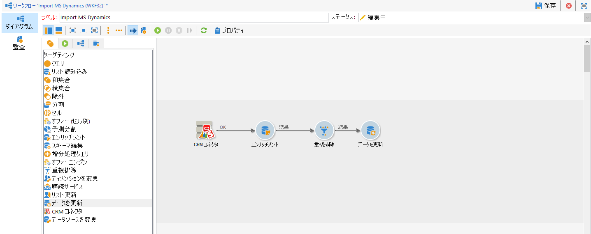

このワークフローでは、Microsoft Dynamics 経由で連絡先がインポートされ、それらが既存の Adobe Campaign データと同期され、重複する連絡先が削除され、Adobe Campaign データベースが更新されます。

**[!UICONTROL CRM コネクタ]**&#x200B;アクティビティは、データを同期するように設定する必要があります。

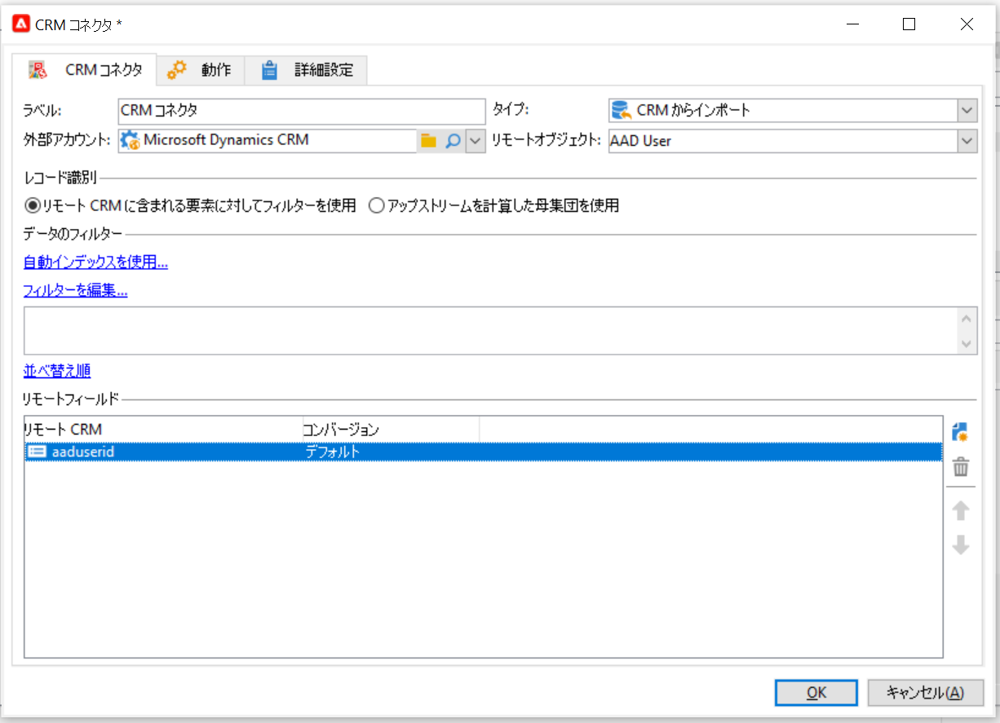

このアクティビティを使用すると、次のことができます。

* CRM からのインポート - [詳細情報](#importing-from-the-crm)
* CRM へのエクスポート - [詳細情報](#exporting-to-the-crm)
* CRM で削除されたオブジェクトのインポート - [詳細情報](#importing-objects-deleted-in-the-crm)
* CRM 内のオブジェクトの削除 - [詳細情報](#deleting-objects-in-the-crm)

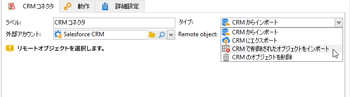

同期を設定する CRM に対応する外部アカウントを選択し、同期するオブジェクトを選択します。アカウント、オポチュニティ、リード、連絡先など

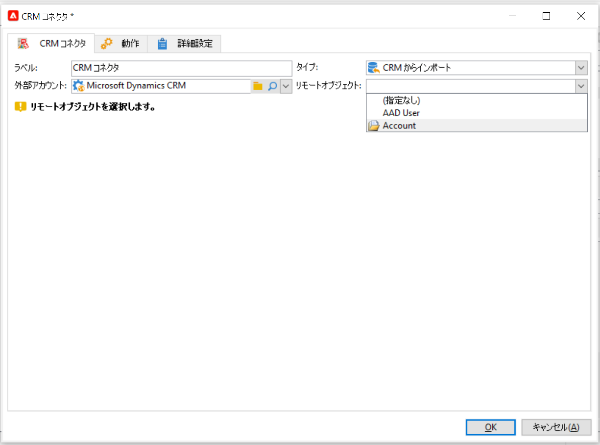

このアクティビティの設定は、実行するプロセスによって異なります。次に、様々な設定について詳しく説明します。

## CRM からのインポート {#importing-from-the-crm}

データを CRM 経由で Adobe Campaign にインポートするには、次のタイプのワークフローを作成する必要があります。

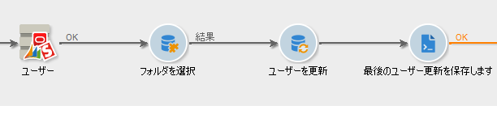

1. 「**[!UICONTROL CRM からインポート]**」操作を選択します。
1. 内 **[!UICONTROL リモートオブジェクト]** 」ドロップダウンリストから、インポートするオブジェクトを選択します。 このオブジェクトは、コネクタの設定時にAdobe Campaignで作成されたテーブルの 1 つと一致します。
1. 内 **[!UICONTROL リモートフィールド]** 「 」セクションで、インポートするフィールドを入力します。

   フィールドを追加するには、ツールバーの&#x200B;**[!UICONTROL 追加]**&#x200B;ボタンをクリックし、**[!UICONTROL 式を編集]**&#x200B;アイコンをクリックします。

   必要に応じて、 **[!UICONTROL コンバージョン]** 列。 使用可能なコンバージョンタイプについて詳しくは、 [この節](#data-format).

   >[!CAUTION]
   >
   >CRM と Adobe Campaign のオブジェクトをリンクするには、CRM でのレコードの識別子が必須です。これは、ボックスが承認されると自動的に追加されます。
   >
   >増分データインポートの場合は、CRM 側での最終変更日も必須です。

1. 必要に応じて、インポートするデータをフィルタリングできます。 そのためには、「**[!UICONTROL フィルターを編集...]**」リンクをクリックします。

   次の例では、2021 年 11 月 1 日以降にアクティビティが記録された連絡先のみが Adobe Campaign によってインポートされます。

   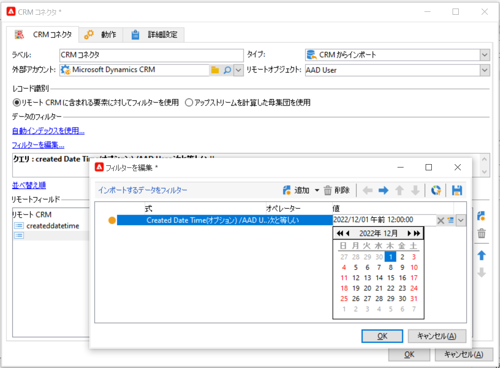

   >[!CAUTION]
   >
   >データのフィルターモードに関する制限について詳しくは、 [この節](#filtering-data).

1. を選択します。 **[!UICONTROL 自動インデックスを使用…]** 日付と最終変更に応じて、CRM とAdobe Campaignの間の増分オブジェクト同期を自動的に管理するオプション。

   詳しくは、[この節](#variable-management)を参照してください。

### 変数の管理 {#variable-management}

をアクティブにする **[!UICONTROL 自動インデックス]** 最後のインポート以降に変更されたオブジェクトのみを収集するオプション。

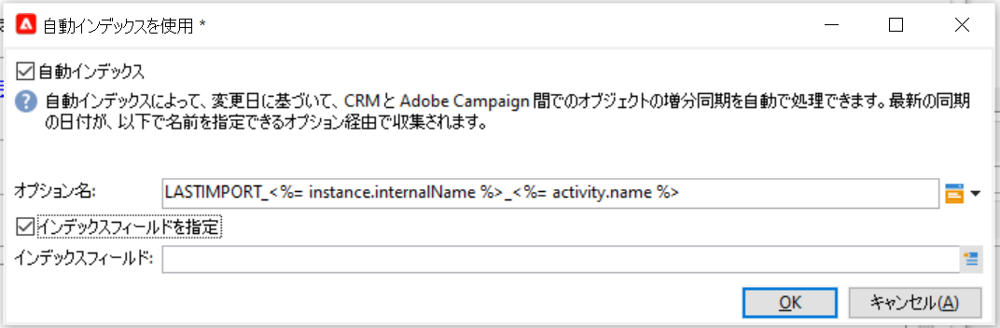

最後の同期の日付が、設定ウィンドウで指定したオプションに保存されます。デフォルトでは、**LASTIMPORT_&lt;%=instance.internalName%>_&lt;%=activityName%>** です。

>[!NOTE]
>
>このメモは、一般的な「**[!UICONTROL CRM コネクタ]**」アクティビティにのみ適用されます。他の CRM アクティビティの場合、プロセスは自動です。
>
>このオプションは、**[!UICONTROL 管理]**／**[!UICONTROL プラットフォーム]**／**[!UICONTROL オプション]**&#x200B;を使用して手動で作成および設定する必要があります。これはテキストオプションである必要があり、その値は **yyyy/MM/dd hh:mm:ss** フォーマットに一致する必要があります。
> 
>以降のインポートではこのオプションを手動で更新する必要があります。

最新の変更を識別するために考慮するリモート CRM フィールドを指定できます。

デフォルトでは、次のフィールドが（指定した順序で）使用されます。

* Microsoft Dynamics の場合：**modifiedon**。
* Salesforce.com の場合：**LastModifiedDate**、**SystemModstamp**。

「**[!UICONTROL 自動インデックス]**」オプションをオンにすると、「**[!UICONTROL JavaScript コード]**」タイプのアクティビティによって、同期ワークフローで使用できる 3 つの変数が生成されます。これらのアクティビティは、次のとおりです。

* **vars.crmOptionName**:最後のインポート日を含むオプションの名前。
* **vars.crmStartImport**:最後のデータインポートの開始日（この日を含む）。
* **vars.crmEndDate**:最後のデータインポートの終了日（この日を含まない）。

   >[!NOTE]
   >
   >これらの日付は、次の形式で表示されます。 **yyyy/MM/dd hh:mm:ss**.

### データのフィルタリング {#filtering-data}

様々な CRM で効率的に操作をおこなうために、次のルールを使用してフィルターを作成する必要があります。

* 各フィルターレベルでは、1 つのタイプの演算子のみを使用できます。
* AND NOT 演算子はサポートされていません。
* 比較は、null 値（「空である」／「空でない」タイプ）または数値にのみ関係します。つまり、値（右側の列）が評価され、この評価の結果は数値である必要があります。したがって、JOIN タイプの比較はサポートされていません。
* 右側の列の値は、JavaScript で評価されます。
* JOIN 比較はサポートされていません。
* 左側の列の式は、フィールドである必要があります。複数の式の組み合わせ、数値などは使用できません。

### 並べ替え順 {#order-by}

Microsoft Dynamics および Salesforce.com では、インポートされるリモートフィールドを昇順または降順で並べ替えることができます。

そのためには、「**[!UICONTROL 並べ替え順]**」リンクをクリックし、列をリストに追加します。

リストでの列の順序が、並べ替え順です。

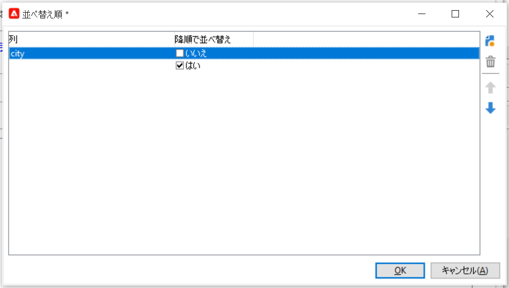

### レコード識別 {#record-identification}

CRM に含まれる（フィルターされた可能性がある）要素をインポートするのではなく、ワークフローで事前に計算された母集団を使用できます。

そのためには、「**[!UICONTROL アップストリームを計算した母集団を使用]**」オプションを選択し、リモート識別子を含むフィールドを指定します。

次に、インポートするインバウンドの母集団のフィールドを次に示すように選択します。

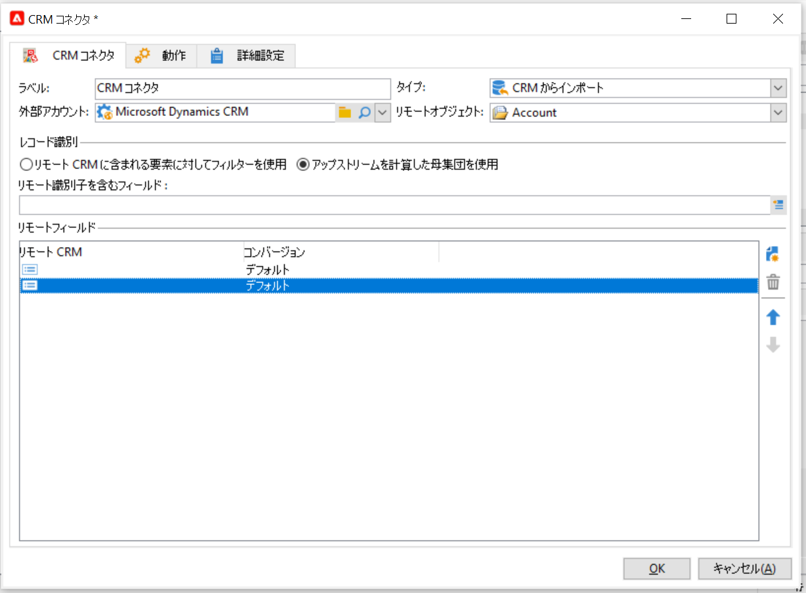

## CRM にエクスポート {#exporting-to-the-crm}

Adobe Campaignのデータを CRM にエクスポートして、その内容全体を CRM データベースにコピーします。

データを CRM にエクスポートするには、次のタイプのワークフローを作成します。

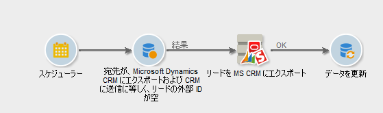

1. 「**[!UICONTROL CRM にエクスポート]**」操作を選択します。
1. 次に移動： **[!UICONTROL リモートオブジェクト]** 」ドロップダウンリストから、エクスポートするオブジェクトを選択します。 このオブジェクトは、コネクタの設定時にAdobe Campaignで作成されたテーブルの 1 つと一致します。

   >[!CAUTION]
   >
   >のエクスポート機能 **[!UICONTROL CRM コネクタ]** アクティビティは、CRM のフィールドを挿入または更新できます。 CRM でフィールドの更新を有効にするには、リモートテーブルのプライマリキーを指定します。 キーがない場合、データは更新されるのではなく挿入されます。

1. より高速なエクスポートを実行する必要がある場合は、  **[!UICONTROL バッチでのエクスポート]** オプション。

   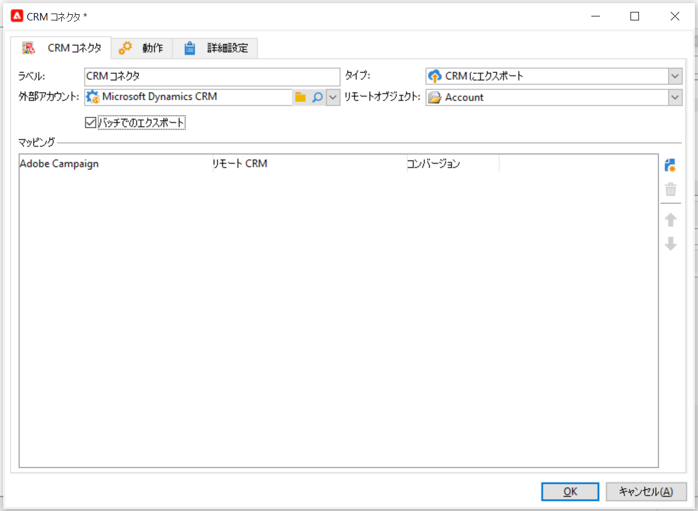

1. 内 **[!UICONTROL マッピング]** セクションで、 **[!UICONTROL 新規]** ：エクスポートするフィールドと CRM でのそのマッピングを指定します。

   フィールドを追加するには、ツールバーの&#x200B;**[!UICONTROL 追加]**&#x200B;ボタンをクリックし、**[!UICONTROL 式を編集]**&#x200B;アイコンをクリックします。

   >[!NOTE]
   >
   >フィールドに一致が定義されていない場合、値は更新できません。これらは CRM に直接挿入されます。

   必要に応じて、 **[!UICONTROL コンバージョン]** 列。 使用可能なコンバージョンタイプについて詳しくは、 [この節](#data-format).

   >[!NOTE]
   >
   >エクスポートされるレコードのリストとエクスポートの結果は、ワークフローが終了または再開されるまでアクセス可能な一時ファイルに保存されます。これにより、エラーが発生した場合に、プロセスを安全に開始できます。

## その他の設定 {#additional-configurations}

### データフォーマット {#data-format}

CRM へのインポートまたは CRM からのインポート中にデータフォーマットを変換できます。

そのためには、適用する変換を対応する列で選択します。

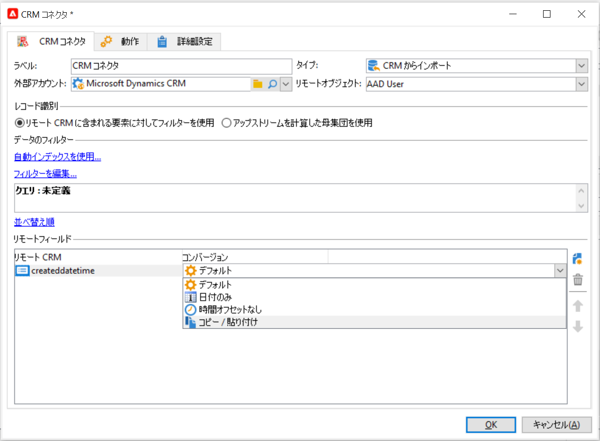

「**[!UICONTROL デフォルト]**」モードでは、自動データ変換が適用されます。ほとんどの場合、これはデータのコピー／貼り付けと同じです。ただし、タイムゾーン管理が適用されます。

その他の使用可能な変換は、次のとおりです。

* **[!UICONTROL 日付のみ]**:日付+時刻タイプのフィールドを削除します。
* **[!UICONTROL 時間オフセットなし]**:は、デフォルトモードで適用されるタイムゾーン管理をキャンセルします。
* **[!UICONTROL コピー/貼り付け]**:は、文字列などの生データを使用します（変換は行われません）。

### エラー処理 {#error-processing}

データのインポートまたはエクスポートのフレームワーク内で、エラーおよび却下に対して特定のプロセスを適用できます。これをおこなうには、「 **[!UICONTROL ファイルで却下を保持]** および **[!UICONTROL エラーを処理]** オプション **[!UICONTROL 動作]** タブをクリックします。

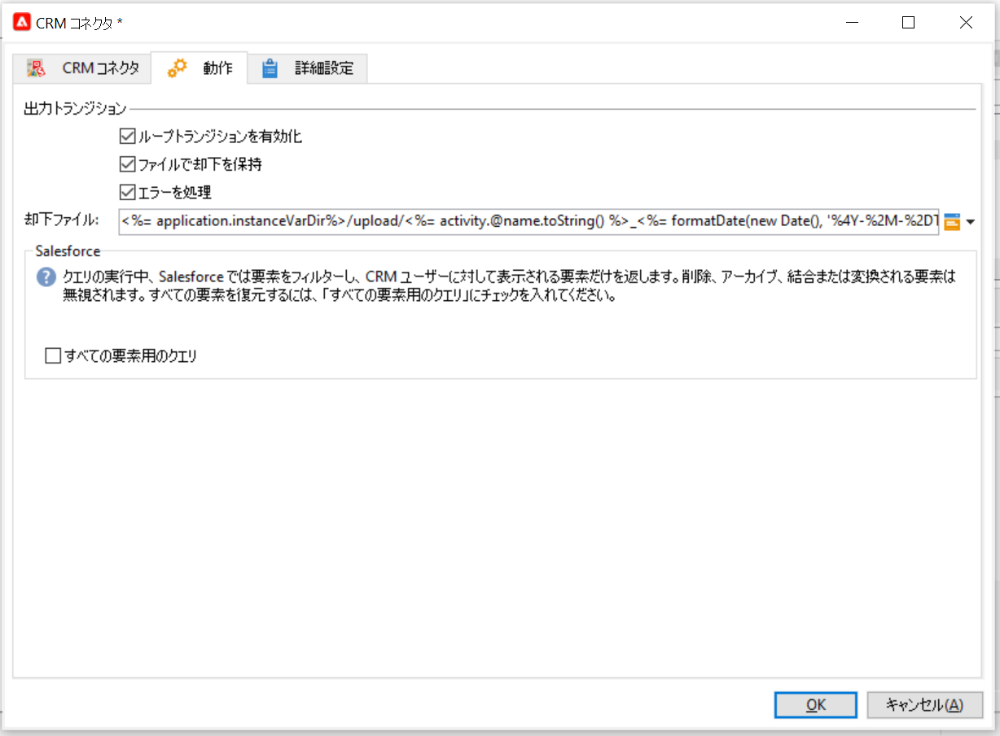

これらのオプションは、関連する出力トランジションを追加します。

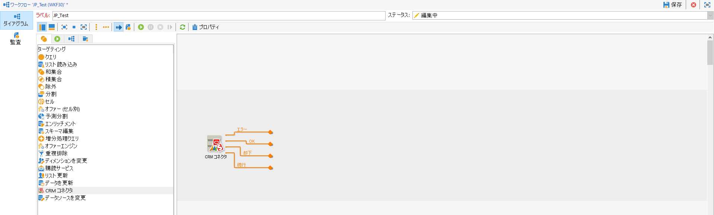

次に、関連するアクティビティを挿入して、データを処理します。 例えば、 **待機** アクティビティを作成し、エラーの再試行をスケジュールします。

「**[!UICONTROL 却下]**」出力トランジションでは、エラーメッセージおよびコードに関連する特定の列を含む出力スキーマにアクセスできます。Salesforce.com の場合、この列は **errorSymbol**（エラーコードとは別のエラー記号）、**errorMessage**（エラーコンテキストの説明）です。

## CRM で削除されたオブジェクトのインポート {#importing-objects-deleted-in-the-crm}

CRM で削除されたオブジェクトをAdobe Campaignにインポートできます。

1. 「**[!UICONTROL CRM で削除されたオブジェクトをインポート]**」操作を選択します。
1. **[!UICONTROL リモートオブジェクト]**&#x200B;ドロップダウンリストに移動し、プロセスの対象となるオブジェクトを選択します。このオブジェクトは、コネクタの設定時にAdobe Campaignで作成されたテーブルの 1 つと一致します。
1. 考慮する削除期間を **[!UICONTROL 開始日]** そして **[!UICONTROL 終了日]** フィールド（日付が含まれます）。

   >[!CAUTION]
   >
   >削除期間は、CRM 固有の制限と一致する必要があります。 例えば、Salesforce.com の場合、30 日以上前に削除された要素は復元できません。

## CRM 内のオブジェクトの削除 {#deleting-objects-in-the-crm}

CRM 上のオブジェクトを削除するには、削除するリモート要素のプライマリキーを指定します。

「**[!UICONTROL 行動]**」タブで、却下の処理を有効にすることができます。このオプションを使用すると、「**[!UICONTROL CRM コネクタ]**」アクティビティの 2 つ目の出力トランジションが生成されます。詳しくは、[エラー処理](#error-processing)を参照してください。
