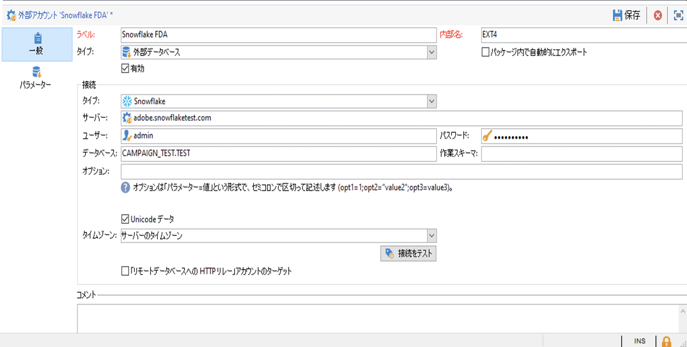
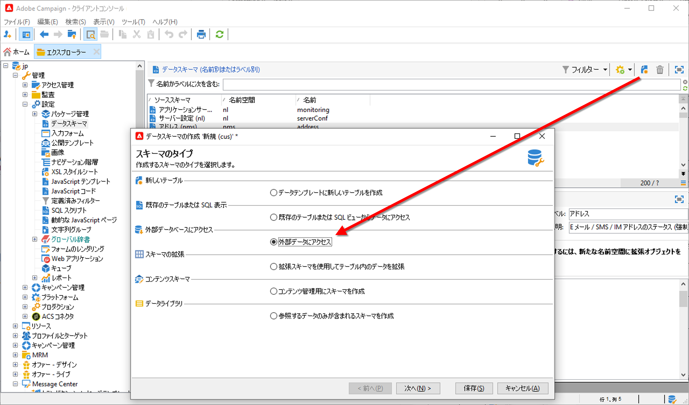
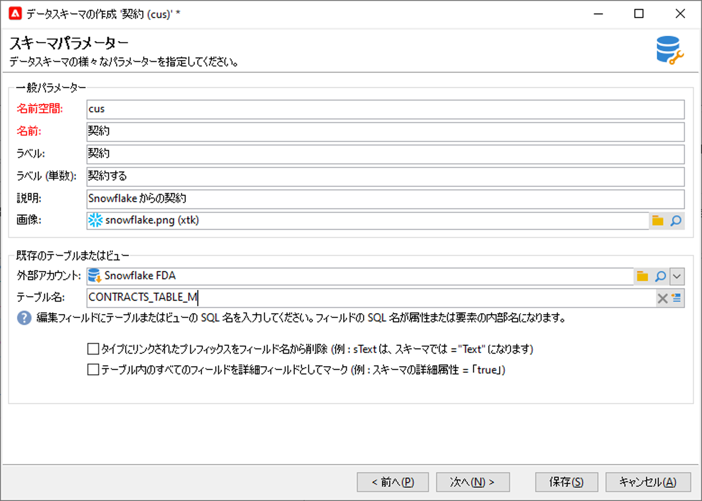
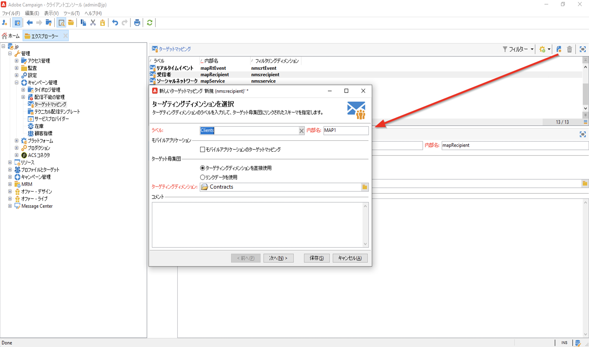
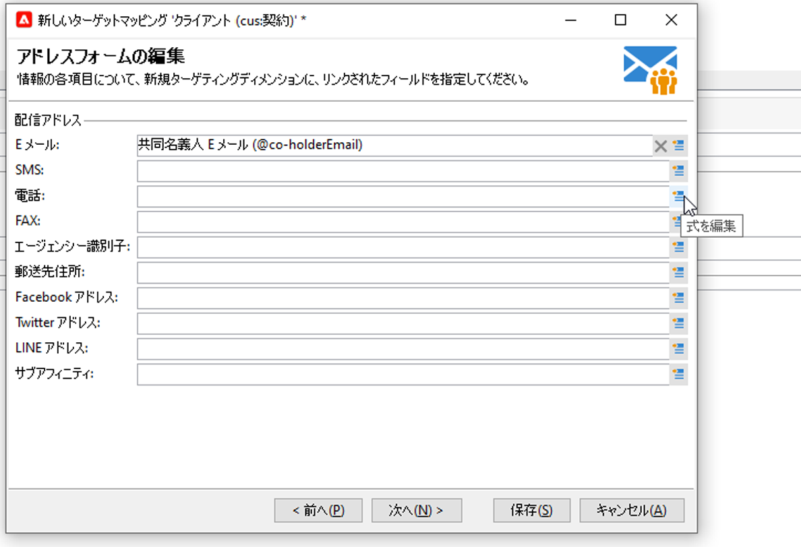
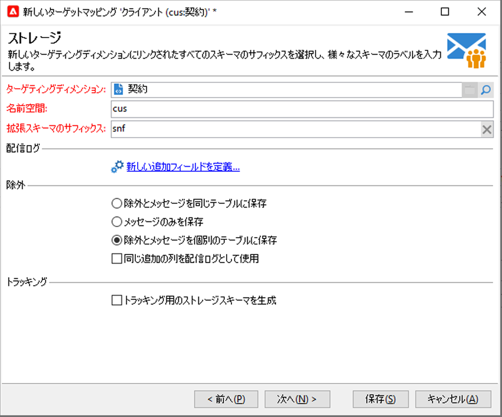
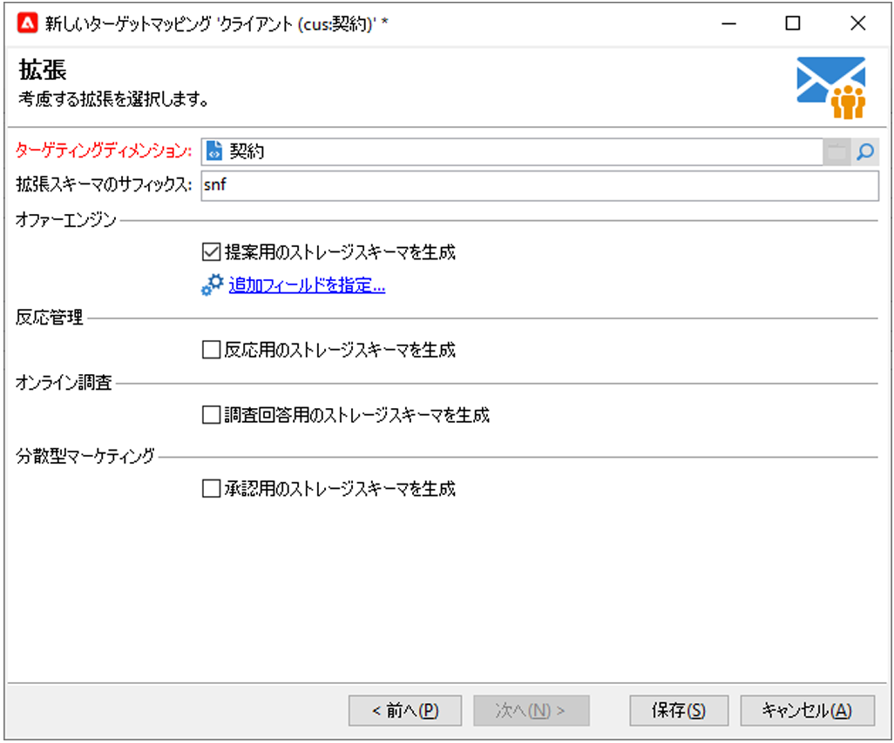

# Federated Data Access（FDA）{#gs-fda}

FDA コネクタ（Federated Data Access）を使用し、Campaign を 1 つ以上の&#x200B;**外部データベース**&#x200B;に接続して、Campaign クラウドデータベースデータに影響を与えることなく、それらに保存されている情報を処理できます。その後、Adobe Campaign データの構造を変更せずに外部データにアクセスできます。

>[!NOTE]
>
>* FDA と互換性のあるデータベースについては、[互換性マトリックス](../start/compatibility-matrix.md)を参照してください。
>
>* [エンタープライズ（FFDA）デプロイメント](../architecture/enterprise-deployment.md)のコンテキストでは、Campaign のローカルデータベースと Snowflake のクラウドデータベース間の通信を管理するために、特定の外部アカウントが利用可能です。この外部アカウントはアドビによって設定されており、変更できません。
>

Campaign FDA オプションを使用すると、サードパーティのデータベースでデータモデルを拡張できます。ターゲットテーブルの構造を自動的に検出し、SQL ソースのデータを使用します。

[!DNL Adobe Campaign] と外部データベースを連携させるには、特定の&#x200B;**権限**&#x200B;が必要です。詳細については、[この節](#fda-permissions)を参照してください。

## ベストプラクティスと制限事項

* **外部データを使用したメールのパーソナライゼーションの最適化**

   専用のワークフローで、メッセージのパーソナライゼーションを事前に処理できます。これを実行するには、配信プロパティの「**[!UICONTROL 分析]**」タブにある「**[!UICONTROL ワークフローを使用してパーソナライズ機能データを準備]**」オプションを使用します。

   このオプションを選択すると、配信を分析する際、ターゲットにリンクされているすべてのデータ（リンクされている外部データベースのテーブルのデータを含む）を一時テーブルに保存するワークフローが、自動的に作成および実行されます。

   このオプションにより、パーソナライゼーション手順を実行する際のパフォーマンスが大幅に向上します。

* **FDA の制限**

   FDA オプションを選択すると、外部データベースのデータをワークフローのバッチモードで操作できます。パフォーマンスの問題を回避するために、パーソナライゼーション、インタラクション、リアルタイムメッセージなどの単一操作のコンテキストでは、FDA モジュールを使用しないことをお勧めします。

   Adobe Campaign と外部データベースの両方を使用する必要がある操作は、できるだけおこなわないようにします。これは、次のような方法で回避できます。

   * Adobe Campaign データベースを外部データベースにエクスポートし、外部データベースからのみ操作を実行して、その結果を Adobe Campaign に再インポートします。

   * 外部の Adobe Campaign データベースからデータを収集し、ローカルで操作を実行します。

   外部データベースのデータを使用する配信でパーソナライゼーションを実行する場合は、ワークフローで使用するデータを収集して一時テーブルに格納してから、一時テーブルのデータを使用して配信をパーソナライズします。

   FDA オプションには、使用する外部データベースシステムの制限事項が適用されます。

## 設定の手順{#fda-configuration-steps}

FDA を使用して外部データベースへのアクセスを設定するには、次の設定手順を実行します。

1. Adobe Managed Services のユーザーとして Campaign インスタンスにドライバーをインストールする場合は、Adobe にお問い合わせください。
1. ドライバーをインストールしたら、Adobe Campaign サーバー上のデータベースに対応する外部アカウントを設定してテストします。[詳細](#fda-external-account)
1. Adobe Campaign で、外部データベースのスキーマを作成します。これにより、外部データベースのデータ構造を識別できるようになります。[詳細情報](#create-data-schema)

<!--
1. If needed, create a new target mapping from the previously created schema. This is required if the recipients of your deliveries come from the external database. This implementation comes with limitations related to message personalization. [Learn more](#define-data-mapping)
-->

Campaign [Enterprise（FFDA）デプロイメント](../architecture/enterprise-deployment.md)を使用する場合、FDA によってアクセスされる外部データベースに保存されているスキーマからターゲットマッピングを作成することはできません。その結果、配信の受信者を外部データベースから取得することはできません。

## 外部データベースの外部アカウント{#fda-external-account}

Campaign インスタンスを外部データベースに接続するには、特定の外部アカウントを作成する必要があります。

そのための手順は次のとおりです。

1. Campaignの&#x200B;**[!UICONTROL エクスプローラー]**&#x200B;から、**[!UICONTROL 管理]** `>` **[!UICONTROL Platform]** `>` **[!UICONTROL 外部アカウント]**&#x200B;を参照します。

1. 「**[!UICONTROL 新規]**」をクリックします。

   >[!NOTE]
   >
   > アクティブにするには、「**[!UICONTROL 有効]**」オプションをオンにする必要があります。必要に応じて、このオプションのチェックを解除して、設定は削除せずにこのデータベースへのアクセスを無効にします。

1. 外部アカウントの&#x200B;**[!UICONTROL タイプ]**&#x200B;として、「**[!UICONTROL 外部データベース]**」を選択します。

1. ドロップダウンリストで外部データベースを選択し、外部アカウントを設定します。次を指定する必要があります。

   * **[!UICONTROL サーバー]**： サーバーの URL

   * **[!UICONTROL アカウント]**：ユーザーの名前

   * **[!UICONTROL パスワード]**：ユーザーアカウントのパスワード

   * **[!UICONTROL データベース]**：データベースの名前

      

1. 「**[!UICONTROL パラメーター]**」タブをクリックし、「**[!UICONTROL 機能をデプロイ]**」ボタンをクリックして機能を作成します。

1. パラメーターを入力したら、「**[!UICONTROL 接続をテスト]**」ボタンをクリックして承認します。

1. このデータベースに Adobe Campaign からアクセスするには、SQL 関数をデプロイする必要があります。「**[!UICONTROL パラメーター]**」タブをクリックし、「**[!UICONTROL 機能をデプロイ]**」ボタンをクリックします。

「**[!UICONTROL パラメーター]**」タブでは、テーブル用およびインデックス用の固有のワークテーブル領域をそれぞれ定義できます。

[!DNL Snowflake] の場合、コネクタは次のオプションをサポートしています。

| オプション | 説明 |
|---|---|
| workschema | ワークテーブルに使用するデータベーススキーマ  |
| warehouse | 使用するデフォルトのウェアハウスの名前。ユーザーのデフォルト値より優先されます。 |
| TimeZoneName | デフォルトでは空で、Campaign Classic アプリケーションサーバーのシステムのタイムゾーンが使用されます。このオプションは、TIMEZONE セッションパラメーターを強制的に指定するために使用できます。 詳しくは、[このページ](https://docs.snowflake.net/manuals/sql-reference/parameters.html#timezone)を参照してください。 |
| WeekStart | WEEK_START セッションパラメーター。デフォルトでは 0 に設定されています。 詳しくは、[このページ](https://docs.snowflake.com/en/sql-reference/parameters.html#week-start)を参照してください。 |
| UseCachedResult | USE_CACHED_RESULTS セッションパラメーター。デフォルトでは TRUE に設定されています。このオプションは、Snowflake でキャッシュされた結果を無効にするために使用できます。 詳しくは、[このページ](https://docs.snowflake.net/manuals/user-guide/querying-persisted-results.html)を参照してください。 |

## データスキーマの作成{#create-data-schema}

Adobe Campaign で外部データベースのスキーマを作成するには、次の手順に従います。

1. データスキーマのリストの上にある「**[!UICONTROL 新規]**」ボタンをクリックし、「**[!UICONTROL 外部データにアクセス]**」を選択します。

   

1. スキーマの名前と説明を入力し、データベースへの接続を有効にする外部アカウントを選択します。これにより、外部データベースで使用できるテーブルのリストにアクセスできます。収集するデータを含むテーブルを選択します。

   

1. 「**[!UICONTROL OK]**」をクリックして確定します。Adobe Campaign では選択したテーブルの構造が自動的に検出され、論理スキーマが生成されます。Adobe Campaign はリンクを生成しません。

1. 「**[!UICONTROL 保存]**」をクリックして作成を確定します。

<!-- 
## Define the target mapping{#define-data-mapping}

You can define a mapping on the data in an external table.

To do this, once the schema of the external table has been created, you need to create a new delivery mapping to use the data in this table as a delivery target.

To do this, follow these steps:

1. Browse to **[!UICONTROL Administration]** `>` **[!UICONTROL Campaign Management]** `>` **[!UICONTROL Target mappings]** from Adobe Campaign explorer.

1. Create a new target mapping and select the schema you just created as the targeting dimension.

   

1. Indicate the fields where the delivery information is stored (last name, first name, email, address, etc.).

   

1. Specify the parameters for information storage, including the suffix of the extension schemas for them to be easily identifiable.

   

   You can choose whether to store exclusions (**excludelog**), with messages (**broadlog**) or in a separate table.

   You can also choose whether to manage tracking for this delivery mapping (**trackinglog**).

1. Then select the extensions to be taken into account. The extension type depends on your platform's parameters and options (view your license contract).

   

   Click the **[!UICONTROL Save]** button to launch delivery mapping creation: all linked tables are created automatically based on the selected parameters.
-->

## 権限{#fda-permissions}

[!DNL Adobe Campaign] と外部データベースにおいて、連携するための特定の&#x200B;**権限**&#x200B;が必要です。

まず、ユーザーが FDA で外部データベースを操作できるように、[!DNL Adobe Campaign] で特定のネームド権限を設定する必要があります。

1. Adobe Campaign エクスプローラーで、**[!UICONTROL 管理／アクセス管理／ネームド権限]**&#x200B;ノードを選択します。
1. 任意のラベルを指定して新しい権限を作成します。
1. ネームド権限の名前を **user:base@server** の形式で入力します。ここで、

   * **user** は、外部データベースのユーザーの名前です。
   * **base** は、外部データベースの名前です。
   * **server** は、外部データベースサーバーの名前です。

1. ネームド権限を保存し、Adobe Campaign エクスプローラーの&#x200B;**[!UICONTROL 管理／アクセス管理／オペレーター]**&#x200B;ノードで、選択したオペレーターにその権限を紐付けます。

次に、外部データベースに格納されているデータを処理するには、Adobe Campaign オペレーターがワークテーブルを作成できるよう、オペレーターにデータベースでの「書き込み」以上の権限を付与する必要があります。作業用テーブルは Adobe Campaign によって自動的に削除されます。

次の権限が必要です。

* **接続**：リモートデータベースへの接続
* **データの読み取り**：顧客データが格納されたテーブルへの読み取り専用アクセス
* **メタデータの読み取り**：テーブル構造を取得するためのサーバーデータカタログへのアクセス
* **ロード**：ワークテーブルへの一括読み込み（収集や結合の作業で必要）
* **テーブル／インデックス／プロシージャ／関数**&#x200B;の&#x200B;**作成／ドロップ**：（Adobe Campaign が生成するワークテーブルの場合のみ）
* **説明**（推奨）：問題が発生した場合にパフォーマンスの監視に使用
* **データの書き込み**：（統合シナリオによる）

データベース管理者は、以下のように、これらの権限を各データベースエンジン特有の権限に対応付ける必要があります。

|   | Snowflake | Amazon Redshift |
|:-:|:-:|:-:|
| **リモートデータベースへの接続** | ウェアハウスでの使用、データベースでの使用、スキーマ特権での使用 | AWS アカウントにリンクされたユーザーの作成 |
| **テーブルの作成** | CREATE TABLE ON SCHEMA 権限 | CREATE 権限 |
| **インデックスの作成** | 該当なし | CREATE 権限 |
| **関数の作成** | CREATE FUNCTION ON SCHEMA 権限 | 外部の Python スクリプトを呼び出せる USAGE ON LANGUAGE plpythonu 権限 |
| **プロシージャの作成** | 該当なし | 外部の Python スクリプトを呼び出せる Python の言語使用権限 |
| **オブジェクト（テーブル、インデックス、関数、プロシージャ）の削除** | オブジェクトの所有者 | オブジェクトの所有者またはスーパーユーザー |
| **実行の監視** | 必要なオブジェクトに対する MONITOR 権限 | EXPLAIN コマンドの使用に権限は不要 |
| **データの書き込み** | INSERT / UPDATE 権限（書き込み操作に応じて異なる） | INSERT および UPDATE 権限 |
| **テーブルへのデータの読み込み** | CREATE STAGE ON SCHEMA およびターゲットテーブルでの SELECT および INSERT 権限 | SELECT および INSERT 権限 |
| **クライアントデータへのアクセス** | SELECT on (FUTURE) TABLE または VIEW 権限 | SELECT 権限 |
| **メタデータへのアクセス** | SELECT on INFORMATION_SCHEMA SCHEMA 権限 | SELECT 権限 |

## ワークフローでの外部データの使用

データスキーマを作成すると、Adobe Campaign ワークフローでデータを処理できるようになります。

以下のように、複数のアクティビティで、外部データベースとのデータのやり取りが可能です。

* **外部データのフィルター** -  **[!UICONTROL クエリ]**&#x200B;アクティビティでは、外部データを追加して、定義したフィルター設定でそのデータを使用できます。

* **サブセットの作成** - **[!UICONTROL 分割]**&#x200B;アクティビティでは、サブセットを作成できます。外部データを使用して、適用するフィルタリング条件を定義できます。

* **外部データベースの読み込み** - **[!UICONTROL データの読み込み（RDBMS）]**&#x200B;アクティビティで外部データを使用できます。

* **情報とリンクの追加** - **[!UICONTROL エンリッチメント]**&#x200B;アクティビティを使用すると、ワークフローの作業用テーブルにデータを追加し、外部テーブルにリンクできます。こうすることで、外部データベースのデータを使用できます。

ワークフローアクティビティから外部データベースへの接続を直接定義して、一時的に使用することもできます。この場合、接続はローカルの外部データベース上に置かれ、現在のワークフロー内で使用するために予約されます。外部アカウントには保存されません。

>[!CAUTION]
>
>このタイプの設定は、データを収集するための一時的な使用に限られます。その他の使用目的には、外部アカウントの設定をお勧めします。

例えば、**[!UICONTROL クエリ]**&#x200B;アクティビティで、外部データベースへの一時的な接続を次のように定義できます。

1. アクティビティを開き、「**[!UICONTROL データを追加…]**」をクリックします。
1. 「**[!UICONTROL 外部データ]**」オプションを選択します。
1. 「**[!UICONTROL データソースをローカルで定義]**」オプションを選択します。
1. ドロップダウンリストからターゲットのデータベースエンジンを選択します。サーバーの名前を入力し、認証パラメーターを指定します。外部データベースの名前も指定します。
1. データが格納されているテーブルを選択します。該当するフィールドにテーブルの名前を直接入力するか、編集アイコンをクリックしてデータベーステーブルのリストにアクセスできます。
1. 「**[!UICONTROL 追加]**」ボタンをクリックして、外部データベースのデータと Adobe Campaign データベースのデータとの間の 1 つまたは複数の紐付けを定義します。「**[!UICONTROL リモートフィールド]**」と「**[!UICONTROL ローカルフィールド]**」の「**[!UICONTROL 式を編集]**」アイコンを使用して、各テーブルのフィールドのリストにアクセスできます。
1. 必要に応じて、フィルタリング条件とデータ並べ替えモードを指定します。
1. 外部データベースで収集する追加のデータを選択します。追加データを選択するには、追加するフィールドをダブルクリックして「**[!UICONTROL 出力列]**」に表示します。
1. 「**[!UICONTROL 完了]**」をクリックして、この設定を確認します。
