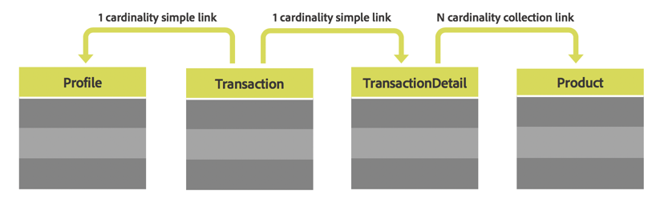

# カスタムリソース {#custom-resources}

Adobe Campaignには事前定義済みのデータモデルが付属しており、データは様々なリソースを使用して定義されます。 リソースを拡張することで提供されるデータモデルをエンリッチメントし、独自のカスタムフィールドや、購入テーブルや製品テーブルなどのカスタムテーブルを追加できます。

カスタムリソースには、API から **/profileAndServicesExt** エンドポイントとカスタムリソース名を使用してアクセスできます。

`https://mc.adobe.io/<ORGANIZATION>/campaign/profileAndServicesExt/<resourceName>/`

>[!NOTE]
>
>標準で使用されていないリソースの場合は、リソース名の前に必ず <b>&quot;cus&quot;</b> プレフィックスを付けてください。

カスタムリソースがプロファイルテーブルにリンクされている限り、カスタムリソースを使用してあらゆる操作を実行できます。 例えば、次のテーブル構造について考えてみましょう。



この場合、**Profile** テーブルにリンクされている限り、**Transaction** テーブル、**TransactionDetails** テーブル、および **Product** テーブルのすべてのリソースを使用できます。

<br/>

***リクエストのサンプル***

拡張された profileAndServicesExt リソースにアクセスするGET リクエストのサンプル

```
-X GET https://mc.adobe.io/<ORGANIZATION>/campaign/profileAndServicesExt/\
-H 'Content-Type: application/json' \
-H 'Authorization: Bearer <ACCESS_TOKEN>' \
-H 'Cache-Control: no-cache' \
-H 'X-Api-Key: <API_KEY>' \
```

リンクされたすべてのカスタムリソースのリストを返します。 その後、リソースの URL を使用して、このドキュメントで説明している API タスクを実行できます。

```
{
"apiName": "resourceType",
"cusProduct": {
        "content": ...,
        "data": "/profileAndServicesExt/cusProduct/",
        "help": "Product",
        "href": "https://mc.adobe.io/<ORGANIZATION>/campaign/profileAndServicesExt/cusProduct/metadata",
        "name": "cusProduct",
        "type": "collection"
    },
"cusTransaction": {
        "content": ...,
        "data": "/profileAndServicesExt/cusTransaction/",
        "help": "Product",
        "href": "https://mc.adobe.io/<ORGANIZATION>/campaign/profileAndServicesExt/cusTransaction/metadata",
        "name": "cusProduct",
        "type": "collection"
    },
    ...
}
```
