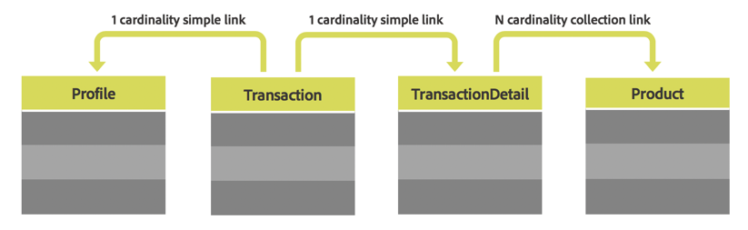

# カスタムリソース {#custom-resources}

Adobe Campaignには事前定義済みのデータモデルが用意されており、データはさまざまなリソースを通じて定義されます。 リソースを拡張して、独自のカスタムフィールドやカスタムテーブル（購入テーブルや製品テーブルなど）を追加することで、提供されるデータモデルを強化できます。

カスタムリソースには、**/profileAndServicesExt** エンドポイントとカスタムリソース名を使用してAPIからアクセスできます。

`https://mc.adobe.io/<ORGANIZATION>/campaign/profileAndServicesExt/<resourceName>/`

>[!NOTE]
>
>すぐに使用できるリソースではないリソースの場合は、リソース名の前に必ず<b>&quot;cus&quot;</b>接頭辞を付けます。

カスタムリソースがプロファイルテーブルにリンクされている限り、任意の操作を実行できます。 例えば、次の表の構造を考えてみましょう。



この場合、**Transaction**、**TransactionDetails**&#x200B;および&#x200B;**Product** テーブルのすべてのリソースは、**Profile** テーブルにリンクされている限り利用できます。

<br/>

***サンプルリクエスト***

拡張profileAndServicesExt リソースにアクセスするためのGET リクエストのサンプル。

```
-X GET https://mc.adobe.io/<ORGANIZATION>/campaign/profileAndServicesExt/\
-H 'Content-Type: application/json' \
-H 'Authorization: Bearer <ACCESS_TOKEN>' \
-H 'Cache-Control: no-cache' \
-H 'X-Api-Key: <API_KEY>' \
```

リンクされたすべてのカスタムリソースのリストが返されます。 その後、リソース URLを使用して、このドキュメントに記載されている任意のAPI タスクを実行できます。

```
{
"apiName": "resourceType",
"cusProduct": {
        "content": ...,
        "data": "/profileAndServicesExt/cusProduct/",
        "help": "Product",
        "href": "https://mc.adobe.io/<ORGANIZATION>/campaign/profileAndServicesExt/cusProduct/metadata",
        "name": "cusProduct",
        "type": "collection"
    },
"cusTransaction": {
        "content": ...,
        "data": "/profileAndServicesExt/cusTransaction/",
        "help": "Product",
        "href": "https://mc.adobe.io/<ORGANIZATION>/campaign/profileAndServicesExt/cusTransaction/metadata",
        "name": "cusProduct",
        "type": "collection"
    },
    ...
}
```
