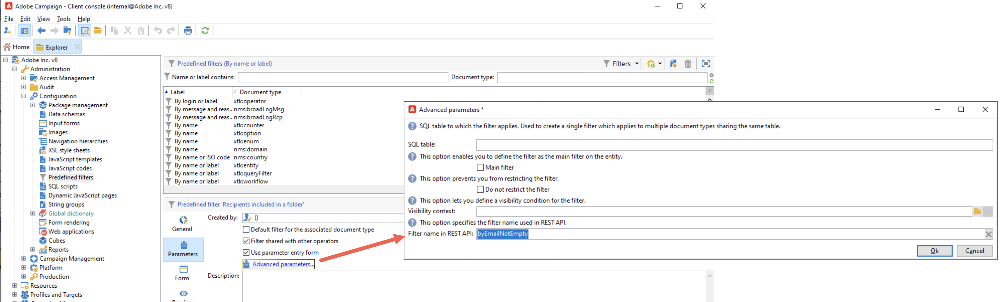

# 推奨事項と制限事項 {#limitations}

## 権限とセキュリティ {#permissions}

### 製品プロファイルのマッピング

Campaign Standardでは、割り当てられた製品プロファイルに関係なく、API に対する昇格された管理者の役割アクセスが付与されました。 Campaign v8 では、異なる製品プロファイルセットが導入されており、Campaign Standardから Campaign v8 製品プロファイルにマッピングする必要があります。

移行すると、既存または事前作成済みのテクニカルアカウントに、管理者と Message Center （トランザクション API へのアクセス用）の 2 つの製品プロファイルが追加されます。 製品プロファイルのマッピングを確認し、管理者の製品プロファイルがテクニカルアカウントにマッピングされないようにする場合は、必要な製品プロファイルを割り当てます。

### テナント ID

移行後、今後の統合では、以前のCampaign Standard テナント ID を置き換えて、REST URL で **Campaign v8 テナント ID** を使用することをお勧めします。

### 主な使用方法

PKey 値の管理は、Campaign Standardと Campaign v8 では異なります。 Campaign Standardで PKeys を保存していた場合は、以前の API 呼び出しから取得した PKeys または href を使用して、以降の API 呼び出しを実装が動的に作成していることを確認します。

## 使用可能な API {#deprecated}

現時点では、以下に示す REST API を使用できます。

* **プロファイル**
* **サービスと購読**
* **カスタムリソース**
* **ワークフロー**
* **トランザクションメッセージ**

>[!AVAILABILITY]
>
>現時点では、**トランザクションメッセージ** REST API は使用できません。
>
>以下に示す REST API は非推奨であり、使用できません。
>* マーケティング履歴
>* 組織単位
>* プライバシー管理

## フィルタリング

* REST API ペイロードでフィルターを使用するには、Campaign v8 でフィルターを編集し、ペイロードで使用する名前を指定する必要があります。 これを行うには、「**[!UICONTROL パラメーター]**」タブからフィルターの追加パラメーターにアクセスし、「**[!UICONTROL REST API のフィルター名]**」フィールドに目的の名前を指定します。

  


* カスタムフィルターを使用するために必要な「by」プレフィックスは不要になりました。 フィルター名は、リクエストでそのまま使用する必要があります。

  例：

  `GET https://mc.adobe.io/<ORGANIZATION>/campaign/profileAndServicesExt/<resourceName>/<customFilterName>?<customFilterparam>=<customFilterValue>`

## 削除されたデータベースフィールド

移行中にデータベースの一部のフィールドが削除されます。 ドロップされたフィールドを使用する場合、REST API は空白の値を返します。 今後、ドロップされたすべてのフィールドは、非推奨となり、削除されます。

## リンクされたリソースを使用して投稿

次のリクエスト本文形式を使用し、「vehicleOwner」が「nms:recipient」へのリンクを表す場合：

```
{
    "vehicleNumber": "20009",
    "vehicleName": "Model E",
    "vehicleOwner":{
        "firstName":"tester 11",
        "lastName":"Smith 11"
    }
}
```

リンク情報は無視されます。 その結果、「vehicleNumber」と「vehicleName」の値のみを含んだ新規レコードが「cusVehicle」の下に生成されます。 ただし、リンクは null のままなので、「vehicleOwner」が null に設定されます。

Campaign v8 で同じリクエスト本文構造を使用し、「vehicle」がプロファイルにリンクされると、エラーが発生します。 このエラーは、「firstName」プロパティが「cusVehicle.」に対して有効であると認識されないために発生します。 ただし、リンクのない属性のみで構成されるリクエスト本文は、問題なく機能します。

## PATCHの操作

* Campaign v8 は、空のリクエスト本文を持つPATCHをサポートしません。204 コンテンツなしステータスを返します。
* Campaign Standardではスキーマ内の要素/属性に対してPATCHがサポートされていますが、Campaign v8 では、場所に対するPATCHの操作はサポートされていません。 の場所でPATCHを試みると、「zipCode」プロパティが「profile」リソースに対して有効でないことを示すエラーメッセージが表示された 500 内部サーバーエラーが発生します。

## REST 応答

次の節では、Campaign Standardと v8 REST 応答の小さな違いについて説明します。

* 単一のGET レコードの場合、応答には応答に href が含まれます。
* 属性を指定してクエリされると、Campaign v8 はカウントとページネーションを応答で提供します。
* POST 操作後、リンクされたリソースの値が応答で返されます。

## エラーコードとメッセージ

次の節では、Campaign Standardと Campaign v8 のエラーコードおよびメッセージの違いについて説明します。

| シナリオ | Campaign Standard | Campaign v8 |
|  ---  |  ---  |  ---  |
| リクエスト本文で無効な PKey を使用 | 500 - 「O5iRp40EGA」属性が不明です（「プロファイル （nms:recipient）」スキーマの定義を参照）。 XTK-170036 式&#39;@id = @O5iRp40EGA&#39;を解析できません。 | 404 - PKey を復号化できません。 （PKey=@jksad） |
| URI で無効な PKey を使用 | 500 - 「O5iRp40EGA」属性が不明です（「プロファイル （nms:recipient）」スキーマの定義を参照）。 XTK-170036 式&#39;@id = @O5iRp40EGA&#39;を解析できません。 | 404 - PKey を復号化できません。 （PKey=@jksad） サポートされていないエンドポイントです。 （endpoint=rest/profileAndServices/profile/@jksad） |
| URI とリクエスト本文での 2 つの異なる生の Pkey の使用 | 500 - RST-360011 エラーが発生しました。管理者にお問い合わせください。 RST-360012 リソース &#39;service&#39;の操作に一貫性がありません – キー&#39;SVC3&#39;を&#39;SVC4&#39;に更新できません。 | 500 - エラーが発生しました。管理者にお問い合わせください。 |
| URI での PKey とリクエスト本文での別の生の PKey の使用 | 500 – 同じキー&#39;SVC4&#39;を持つ&#39;サービス&#39;が既に存在します。 PGS-220000 PostgreSQL エラー：エラー：キー値の重複は、一意の制約「nmsservice_name」に違反します。詳細：キー（sname）=（SVC4）は既に存在します。 | 500 - エラーが発生しました。管理者にお問い合わせください。 |
| URI に存在しない Raw-ID の使用 | 404 - RST-360011 エラーが発生しました。管理者にお問い合わせください。 キー「adobe_nl:0」からのパス「Service」に文書が見つかりません（スキーマ「service」および名前「adobe_nl」の文書） | 404 - キー「adobe_nl」からのパス「Service」を含むドキュメントが見つかりません（スキーマ「service」および名前「adobe_nl」を含むドキュメント） |
| リクエスト本文で存在しない生の ID を使用 | 404 - RST-360011 エラーが発生しました。管理者にお問い合わせください。 パス「Service」 （キー「adobe_nl」）に文書が見つかりません（スキーマ「service」、名前「adobe_nl」の文書） | 404 - キー「adobe_nl」からのパス「Service」を含むドキュメントが見つかりません（スキーマ「service」および名前「adobe_nl」を含むドキュメント） |
| - | 500 - RST-360011 エラーが発生しました。管理者にお問い合わせください。 | 500 - エラーが発生しました。管理者にお問い合わせください。 |
| 無効な性別（または任意の）列挙値を持つプロファイル/サービスを挿入 | 500 - RST-360011 エラーが発生しました。管理者にお問い合わせください。 値「invalid」は「@gender」フィールドの「nms:recipient:gender」列挙には無効です | 500 - エラーが発生しました。管理者にお問い合わせください。 |

## プロファイル – タイムゾーン

Campaign Standardでは、タイムゾーンは、REST API 呼び出しの **profileAndServices/profile** JSON 応答の一部として表示されます。

Campaign v8 では、タイムゾーンは、**profileAndServicesExt/profile** REST API 呼び出しの一部としてユーザーにのみ表示されます。 拡張されたスキーマで追加されるので、**profileAndServices/profile** REST API 呼び出しの一部ではありません。

## ワークフロー – 外部シグナルのトリガー

Campaign Standard Workflow GET API は、ワークフローインスタンス変数とそのデータタイプ（ブール値、文字列など）のパラメーター名を返します。 これは、POST API 呼び出しを介してシグナルをトリガーする際に、適切にフォーマットされた JSON リクエスト本文を作成するために使用されます。

Campaign v8 は広告ワークフローインスタンス変数をサポートしていませんが、開発者がそれらが何であるかを知っていることを期待しています。 そのため、GET API 応答でパラメーター情報を利用できない場合は、POST リクエスト本文の移行後に、パラメーター情報を構築する必要があります。

<!--## Transactional messages

* With Campaign Standard, a POST request returns empty fields for elements and attributes in the request body. With Campaign v8, the response returns values that match the ones in the request body instead.

* When publishing an event configuration, the API preview panel displays the REST URL alongside the request body syntax.

    Since Campaign v8 does not support event configuration fields definition (event creation is just adding a value to eventType enumeration), there is no API preview panel when adding an event type. The REST URL is displayed  in the transactional message user interface once an event transactional message is published.-->
