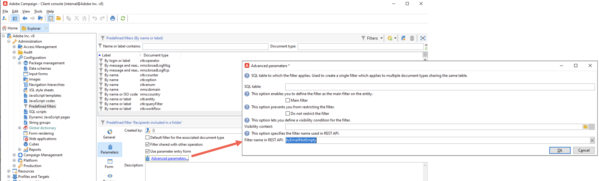

# 推奨事項と制限事項 {#limitations}

## 権限とセキュリティ {#permissions}

### 製品プロファイルの構築

Campaign Standardでは、割り当てられた製品プロファイルに関係なく、APIへの管理者権限が昇格されました。 Campaign v8では、別の製品プロファイルのセットが導入されるため、Campaign StandardからCampaign v8の製品プロファイルへのマッピングが必要になります。

移行を行うと、既存または事前に作成されたテクニカルアカウントに2つの製品プロファイルが追加されます。管理者とメッセージセンター（トランザクション APIにアクセスする場合）。 管理者の製品プロファイルをテクニカルアカウントにマッピングしない場合は、製品プロファイルマッピングを確認し、必要な製品プロファイルを割り当てます。

### テナント ID

移行後、今後の統合を行う場合は、以前のCampaign Standard テナント IDを置き換えて、REST URLで&#x200B;**Campaign v8 テナント ID**&#x200B;を使用することをお勧めします。

### キーの使用状況

PKey値の管理は、Campaign Standard v8とCampaign v8で異なります。 Campaign Standardを使用してPKeyを保存する場合は、以前のAPI呼び出しから取得したPKeyまたはhrefsを使用して、その後のAPI呼び出しを動的にフォーム化します。

## 利用可能なAPI {#deprecated}

現時点では、以下に示すREST APIを使用できます。

* **プロファイル**
* **サービスとサブスクリプション**
* **カスタムリソース**
* **ワークフロー**
* **トランザクションメッセージ**

>[!AVAILABILITY]
>
>現時点では、**トランザクションメッセージ** REST APIは使用できません。
>
>以下に示すREST APIは非推奨（廃止予定）であり、使用できません。
>* マーケティング履歴
>* 組織単位
>* プライバシー管理

## フィルタリング

* REST API ペイロードでフィルターを使用するには、Campaign v8でフィルターを編集し、ペイロードで使用する名前を指定する必要があります。 これを行うには、「**[!UICONTROL パラメーター]**」タブからフィルターの追加パラメーターにアクセスし、「**[!UICONTROL REST APIのフィルター名]**」フィールドに目的の名前を入力します。

  


* カスタムフィルターを使用するために必要な「by」プレフィックスは不要になりました。 フィルター名は、リクエストでそのまま使用する必要があります。

  例：

  `GET https://mc.adobe.io/<ORGANIZATION>/campaign/profileAndServicesExt/<resourceName>/<customFilterName>?<customFilterparam>=<customFilterValue>`

## ドロップされたデータベースフィールド

データベースの一部のフィールドは、移行中に削除されています。 ドロップされたフィールドを使用する場合、REST APIは空白の値を返します。 今後、ドロップされたすべてのフィールドは非推奨となり、削除されます。

## リンクされたリソースを投稿

次のリクエスト本文フォーマットを使用する場合、「vehicleOwner」は「nms:recipient」へのリンクを表します。

```
{
    "vehicleNumber": "20009",
    "vehicleName": "Model E",
    "vehicleOwner":{
        "firstName":"tester 11",
        "lastName":"Smith 11"
    }
}
```

リンク情報は無視されます。 したがって、「vehicleNumber」と「vehicleName」の値のみを含む「cusVehicle」の下に新しいレコードが生成されます。 ただし、リンクはnullのままであるため、「vehicleOwner」はnullに設定されます。

Campaign v8では、同じリクエスト本文構造が使用され、「vehicle」がプロファイルにリンクされている場合、エラーが発生します。 このエラーは、「firstName」プロパティが「cusVehicle」に対して有効であると認識されないために発生します。 ただし、リンクのない属性のみを含むリクエスト本文は問題なく機能します。

## PATCH オペレーション

* Campaign v8は、空のリクエスト本文を持つPATCHをサポートしていません。204 No Content ステータスを返します。
* Campaign Standardは、スキーマ内のエレメントや属性に対してPATCHをサポートしていますが、Campaign v8では場所に対するPATCH操作はサポートされていないことに注意してください。 場所でPATCHを試すと、「zipCode」プロパティが「profile」リソースに対して無効であることを示すエラーメッセージが表示され、500内部サーバーエラーが発生します。

## REST応答

以下の節では、Campaign Standardとv8 REST応答の間の小さな違いを示します。

* 1つのGET レコードの場合、応答にはhrefが含まれます。
* 属性を使用してクエリを実行すると、Campaign v8は応答にカウントとページネーションを提供します。
* POST操作の後、リンクされたリソースの値が応答で返されます。

## エラーコードとメッセージ

以下の節では、Campaign StandardとCampaign v8 エラーコードおよびメッセージの違いを示します。

| シナリオ | Campaign Standard | Campaign v8 |
|  ---  |  ---  |  ---  |
| リクエスト本文で無効なPKeyを使用する | 500 - &#39;O5iRp40EGA&#39;属性が不明です（「プロファイル （nms:recipient）」スキーマの定義を参照）。 XTK-170036式「@id = @O5iRp40EGA」を解析できません。 | 404 - PKeyを復号できません。 （PKey=@jksad） |
| URIで無効なPKeyを使用する | 500 - &#39;O5iRp40EGA&#39;属性が不明です（「プロファイル （nms:recipient）」スキーマの定義を参照）。 XTK-170036式「@id = @O5iRp40EGA」を解析できません。 | 404 - PKeyを復号できません。 （PKey=@jksad）サポートされていないエンドポイント。 （endpoint=rest/profileAndServices/profile/@jksad） |
| URIとリクエスト本文で2つの異なる生のPkeyを使用する | 500 - RST-360011 エラーが発生しました – 管理者にお問い合わせください。 RST-360012 リソース「サービス」に対する一貫性のない操作 – キー「SVC3」を「SVC4」に更新できません。 | 500 - エラーが発生しました – 管理者にお問い合わせください。 |
| URIにPKey、リクエスト本文に別の生のPKeyを使用する | 500 – 同じキー「SVC4」を持つ「Service」が既に存在します。 PGS-220000 PostgreSQL エラー：エラー：重複するキーの値が一意の制約「nmsservice_name」の詳細：キー（sname）=（SVC4）が既に存在します。 | 500 - エラーが発生しました – 管理者にお問い合わせください。 |
| URIでの既存でないRaw-IDの使用 | 404 - RST-360011 エラーが発生しました – 管理者にお問い合わせください。 キー「adobe_nl:0」（スキーマ「service」および名前「adobe_nl」のドキュメント）からパス「Service」のドキュメントが見つかりません | 404 - キー「adobe_nl」（スキーマ「service」および名前「adobe_nl」を持つドキュメント）からパス「Service」を持つドキュメントが見つかりません |
| リクエスト本文で既存でないRaw-IDを使用している | 404 - RST-360011 エラーが発生しました – 管理者にお問い合わせください。 キー「adobe_nl」（スキーマ「service」および名前「adobe_nl」を持つドキュメント）からパス「Service」を持つドキュメントが見つかりません | 404 - キー「adobe_nl」（スキーマ「service」および名前「adobe_nl」を持つドキュメント）からパス「Service」を持つドキュメントが見つかりません |
| - | 500 - RST-360011 エラーが発生しました – 管理者にお問い合わせください。 | 500 - エラーが発生しました – 管理者にお問い合わせください。 |
| 無効な性別（または任意の）列挙値を持つプロファイル/サービスを挿入する | 500 - RST-360011 エラーが発生しました – 管理者にお問い合わせください。 値「invalid」は、「@gender」フィールドの「nms:recipient:gender」列挙に対して無効です | 500 - エラーが発生しました – 管理者にお問い合わせください。 |

## プロファイル – タイムゾーン

Campaign Standardでは、タイムゾーンは&#x200B;**profileAndServices/profile** REST API呼び出しのJSON応答の一部として表示されます。

Campaign v8では、タイムゾーンは&#x200B;**profileAndServicesExt/profile** REST API呼び出しの一部としてのみユーザーに表示されます。 拡張スキーマに追加されているため、**profileAndServices/profile** REST API呼び出しの一部ではありません。

## ワークフロー – 外部信号トリガー

Campaign Standard Workflow GET APIは、ワークフローインスタンス変数およびそのデータタイプ（ブール値、文字列など）などのパラメーター名を返します。 これは、POST API呼び出しを介してシグナルをトリガーする際に、適切な形式のJSON リクエスト本文を作成するために使用されます。

Campaign v8は、広告ワークフローインスタンス変数をサポートしていませんが、開発者がそれらの変数を理解していることを期待しています。 そのため、移行後、POST リクエスト本文のパラメーター情報は、GET API レスポンスのパラメーター情報を利用せずに構築する必要があります。

<!--
## Transactional messages

* With Campaign Standard, a POST request returns empty fields for elements and attributes in the request body. With Campaign v8, the response returns values that match the ones in the request body instead.

* When publishing an event configuration, the API preview panel displays the REST URL alongside the request body syntax.

    Since Campaign v8 does not support event configuration fields definition (event creation is just adding a value to eventType enumeration), there is no API preview panel when adding an event type. The REST URL is displayed  in the transactional message user interface once an event transactional message is published.
-->
