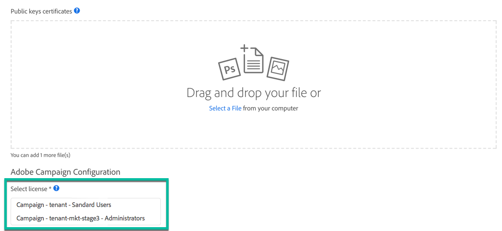

# API アクセスの設定 {#setting-up-api-access}

Adobe Campaign Standardの API アクセスは、以下の手順でセットアップします。 これらの各手順について詳しくは、[Adobe Developer ドキュメント &#x200B;](https://developer.adobe.com/developer-console/docs/guides/#!AdobeDocs/adobeio-auth/master/AuthenticationOverview/ServiceAccountIntegration.md) を参照してください。

>[!IMPORTANT]
>
>[Adobe Developer](https://developer.adobe.com/) で証明書を管理するには、組織の **システム管理者** 権限またはAdmin Consoleの [&#x200B; 開発者アカウント &#x200B;](https://helpx.adobe.com/jp/enterprise/using/manage-developers.html) があることを確認してください。

1. **電子証明書があることを確認するか**、必要に応じて作成します。 証明書に記載されている公開鍵と秘密鍵は、以降の手順で必要になります。
1. **2&rbrace;Adobe Developer&rbrace; で** Adobe Campaign サービスへの新しい統合を作成 [&#x200B; し、設定します。 &#x200B;](https://developer.adobe.com/)次に、資格情報を生成します（API キー、クライアントシークレットなど）。
1. 次の **実装手順** に従って、[OAuth サーバー間 &#x200B;](https://developer.adobe.com/developer-console/docs/guides/authentication/ServerToServerAuthentication/implementation/) 資格情報を作成します。

   >[!IMPORTANT]
   >
   >JWT（JSON web トークン）は、現在非推奨（廃止予定）の段階で、OAuth に置き換えられています。この移行は、Campaign の今後のリリースで段階的に実行されます。 サービスアカウント（JWT）資格情報は非推奨（廃止予定）としてマークされ、2025 年 1 月 27 日（PT）まで引き続き機能します。 したがって、2025 年 1 月 27 日（PT）より前に、新しい OAuth サーバー間資格情報を使用するようにアプリケーションまたは統合を移行する必要があります。 OAuth 認証をお勧めします。 JWT 認証から OAuth 認証に移行するすべての要素は、次のページにあります。
   >* [&#x200B; 移行 &#x200B;](https://developer.adobe.com/developer-console/docs/guides/authentication/ServerToServerAuthentication/migration/)
   >* [実装](https://developer.adobe.com/developer-console/docs/guides/authentication/ServerToServerAuthentication/implementation/)
   >* [&#x200B; 非推奨（廃止予定）の JWT に関する FAQ](https://developer.adobe.com/developer-console/docs/guides/authentication/ServerToServerAuthentication/faqs/)

セキュアなサービス間Adobe I/O API セッションを確立するには、Adobe サービスへのすべてのリクエストで、以下の情報を Authorization ヘッダーに含める必要があります。

```
-X GET https://mc.adobe.io/<ORGANIZATION>/campaign/profileAndServices/profile \
-H 'Content-Type: application/json' \
-H 'Authorization: Bearer <ACCESS_TOKEN>' \
-H 'Cache-Control: no-cache' \
-H 'X-Api-Key: <API_KEY>'
```

* **&lt;ORGANIZATION>**：これは個人の組織 ID で、インスタンスごとに 1 つの組織 ID がAdobeから提供されます。

   * &lt;ORGANIZATION>：実稼動インスタンス、
   * &lt;ORGANIZATION-mkt-stage>：お使いのステージインスタンス。

  組織 ID の値を取得するには、管理者またはAdobeの技術担当者にお問い合わせください。 また、新しい統合を作成する際に、ライセンスリストでAdobe I/Oに取得することもできます（<a href="https://developer.adobe.com/developer-console/docs/guides/authentication/">Adobe Developerのドキュメント </a> を参照してください）。

* **&lt;ACCESS_TOKEN>**:POST リクエストを通じて JSON web トークンを交換する際に取得した個人用アクセストークンです。

* **&lt;API_KEY>**：個人用 API キーです。 Adobe Campaign サービスへの新しい統合を作成した後、Adobe I/Oで提供されます。

  

## トラブルシューティング

AdobeIO 統合中に、次のエラーが表示される場合。

```
{ 
"code": 502, 
"message": "Oops. Something went wrong. Check your URI and try again." 
}
```


CNAME パラメーターが正しく作成されているかどうかを確認するには、管理者またはAdobeの技術担当者に問い合わせてください。
