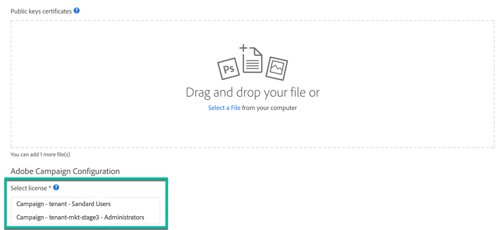

# API アクセスの設定 {#setting-up-api-access}

Adobe Campaign Standard API アクセスは、次の手順で設定します。 これらの各手順について詳しくは、[Adobe Developer ドキュメント &#x200B;](https://developer.adobe.com/developer-console/docs/guides/#!AdobeDocs/adobeio-auth/master/AuthenticationOverview/ServiceAccountIntegration.md)を参照してください。

>[!IMPORTANT]
>
>[Adobe Developer](https://developer.adobe.com/)で証明書を管理するには、組織の&#x200B;**システム管理者**&#x200B;権限、またはAdmin Consoleの[開発者アカウント &#x200B;](https://helpx.adobe.com/jp/enterprise/using/manage-developers.html)権限があることを確認してください。

1. **電子証明書があるかどうかを確認するか、必要に応じて電子証明書を作成します**。 証明書で提供される公開鍵と秘密鍵は、次の手順で必要になります。
1. **Adobe Developer[&#128279;](https://developer.adobe.com/)のAdobe Campaign Service**&#x200B;への新しい統合を作成し、設定します。 次に、資格情報が生成されます（API キー、クライアントシークレット…）。
1. **次の[実装手順](https://developer.adobe.com/developer-console/docs/guides/authentication/ServerToServerAuthentication/implementation/)に従って、OAuth サーバー間**&#x200B;資格情報を作成します

   >[!IMPORTANT]
   >
   >JWT（JSON web トークン）は、現在非推奨（廃止予定）の段階で、OAuth に置き換えられています。 移行は、Campaignの今後のリリース内で段階的に実行されます。 サービスアカウント （JWT）資格情報は非推奨とマークされています。2025年1月27日まで引き続き機能します。 したがって、2025年1月27日（PT）より前に新しいOAuth サーバー間資格情報を使用するには、アプリケーションまたは統合を移行する必要があります。 OAuth認証をお勧めします。 JWT認証からOAuth認証に移行するためのすべての要素は、次のページにあります。
   >* [移行](https://developer.adobe.com/developer-console/docs/guides/authentication/ServerToServerAuthentication/migration/)
   >* [実装](https://developer.adobe.com/developer-console/docs/guides/authentication/ServerToServerAuthentication/implementation/)
   >* [非推奨のJWT FAQ](https://developer.adobe.com/developer-console/docs/guides/authentication/ServerToServerAuthentication/faqs/)

セキュアなサービス間Adobe I/O API セッションを確立するには、Adobe サービスへのあらゆるリクエストに以下の情報をAuthorization ヘッダーに含める必要があります。

```
-X GET https://mc.adobe.io/<ORGANIZATION>/campaign/profileAndServices/profile \
-H 'Content-Type: application/json' \
-H 'Authorization: Bearer <ACCESS_TOKEN>' \
-H 'Cache-Control: no-cache' \
-H 'X-Api-Key: <API_KEY>'
```

* **&lt;ORGANIZATION>**：これはあなたの個人組織IDです。Adobeによって、インスタンスごとに1つの組織IDが提供されます。

   * &lt;ORGANIZATION>：本番インスタンス、
   * &lt;ORGANIZATION-mkt-stage>: ステージインスタンス。

  組織IDの値を取得するには、管理者またはAdobeの技術担当者を参照してください。 新しい統合を作成する際に、ライセンスの一覧からAdobe I/Oに取り込むこともできます（<a href="https://developer.adobe.com/developer-console/docs/guides/authentication/">Adobe Developer ドキュメント </a>を参照）。

* **&lt;ACCESS_TOKEN>**: POST リクエストを通じてJSON Web トークンを交換する際に取得した個人アクセストークン。

* **&lt;API_KEY>**：個人のAPI キー。 Adobe Campaign Serviceへの新しい統合を作成した後、Adobe I/Oで提供されます。

  

## トラブルシューティング

AdobeIO統合中に、次のエラーが表示される場合：

```
{ 
"code": 502, 
"message": "Oops. Something went wrong. Check your URI and try again." 
}
```


CNAME パラメーターが正しく作成されているかどうかを確認するには、管理者またはAdobeの技術担当者を参照してください。
