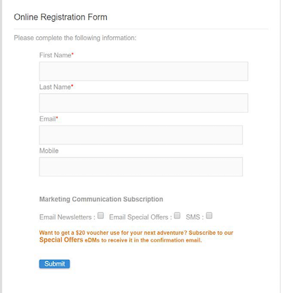
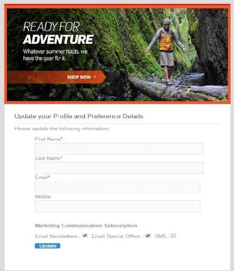
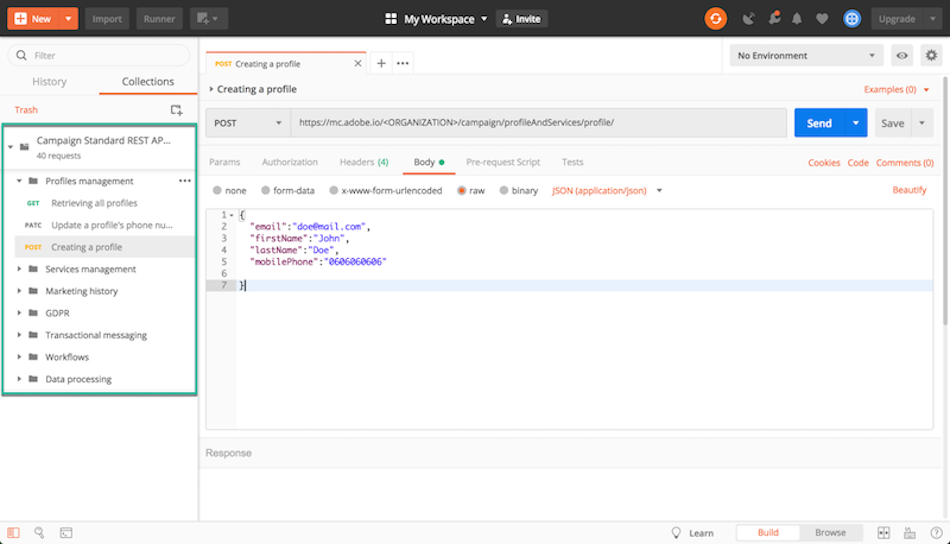
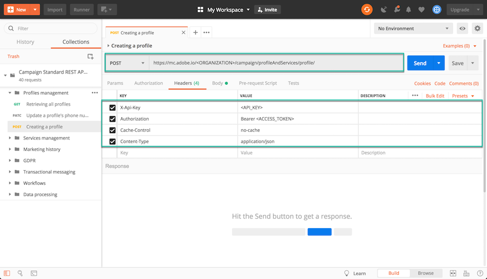
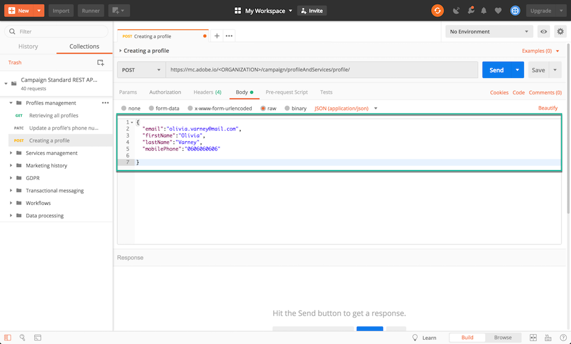
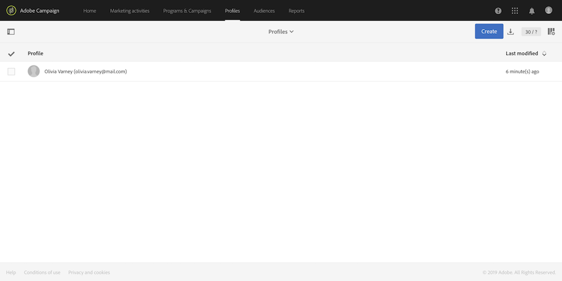

# Campaign Standard API を使用する理由 {#why-using-campaign-standard-apis}

Adobe Campaign Standardは、既存のシステムを Campaign プラットフォームと統合して、実際の問題をリアルタイムで解決するための API を提供します。

サインアップまたはオプトアウトページなどの公開 web サイトでは、プロファイル情報を保存するためにバックエンドシステムに接続する必要があります。 Adobe Campaignなどのバックエンドシステムには、プロファイルデータをに取り込み、それに対してカスタム操作を実行する柔軟性と能力があります。

次に例を示します。

* 見込み客オンライン登録。
* 既存の顧客プロファイルとマーケティングコミュニケーション環境管理。
  <!--* Event based transactional communication triggering – order confirmation, booking Itinerary, password reset, etc.-->
* 買い物かごの放棄に関するメール通信も可能です。

新規登録ランディングページは、顧客や見込み客が名前やメールアドレスを登録する方法を提供します。 Campaign Standardは、プロファイル情報と環境設定を取得したら、ユーザーの興味に基づいてパーソナライズされたメッセージを送信できます。

これらは、以下の要素を使用して構築されています。

1. Campaign API リスナーを含む登録フォーム

   

1. チェックボックスに基づいて実行されるカスタムアクション。 「特別オファーをメールで送信」を選択した顧客には、通常の登録プロセスと比較して、ギフトクーポンを含む別のカスタムメールが送信されます。

   

1. プロファイルは、メールの「詳細を更新」リンクをクリックした後、詳細を変更する場合があります。 プロファイルが「プロファイルおよび環境設定の詳細を更新」ページに移動します。 操作を実行するには、プロファイルの詳細（Pkey）が Campaign サーバーに渡され、プロファイルが取得されて表示されます。 プロファイルが「更新」ボタンをクリックすると、情報が（PATCH コマンドを使用して）システムに更新されます。

   

Campaign Standard API のリクエストを把握するのに役立つリクエストのコレクションを利用できます。 JSON 形式のこのコレクションは、一般的なユースケースを表す事前に設計された API リクエストを提供します。

次の手順では、コレクションを読み込んで使用し、Campaign Standard Database にプロファイルを作成するステップバイステップのユースケースを示します。

>[!NOTE]
>
>この例ではPostmanを使用します。 ただし、お気に入りの REST クライアントを自由に使用できます。

1. [ こちら ](https://helpx.adobe.com/content/dam/help/en/campaign/kb/working-with-acs-api/_jcr_content/main-pars/download_section/download-1/KB_postman_collection.json.zip) をクリックして、JSON コレクションをダウンロードします。

1. Postmanを開き、「**ファイル**/**読み込み** メニューを選択します。

1. ダウンロードしたファイルをウィンドウにドラッグ&amp;ドロップします。 事前に設計された API リクエストが表示され、すぐに使用できます。

   

1. **プロファイルの作成** リクエストを選択してから、独自の情報（&lt;ORGANIZATION>、&lt;API_KEY>、&lt;ACCESS_TOKEN **）で POST リクエストと** Headers> タブを更新します。 詳しくは、[この節](setting-up-api-access.md)を参照してください。

   

1. 新しいプロファイルに追加する情報を「**本文**」タブに入力し、「**送信**」ボタンをクリックしてリクエストを実行します。

   

1. オブジェクトが作成されると、プライマリキー（PKey）が関連付けられます。 これは、リクエスト応答やその他の属性にも表示されます。

   

1. Campaign Standard インスタンスを開き、ペイロードのすべての情報を含むプロファイルが作成されていることを確認します。

   
