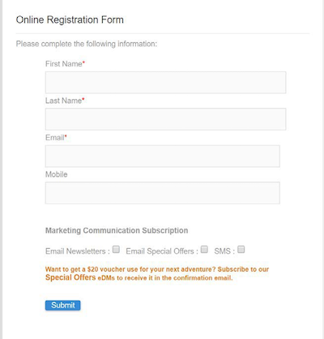
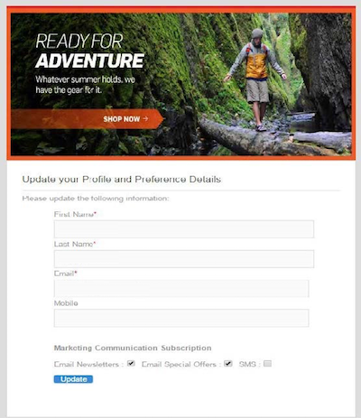
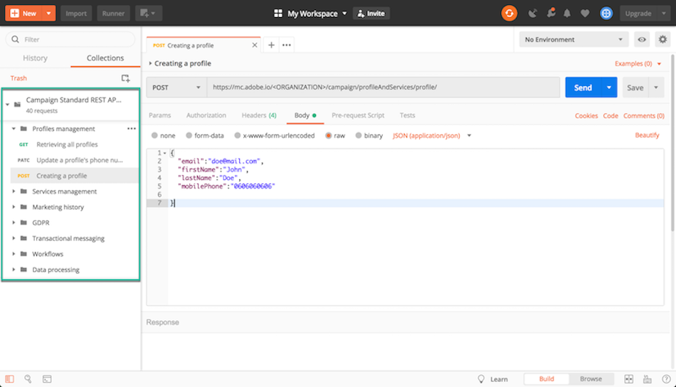
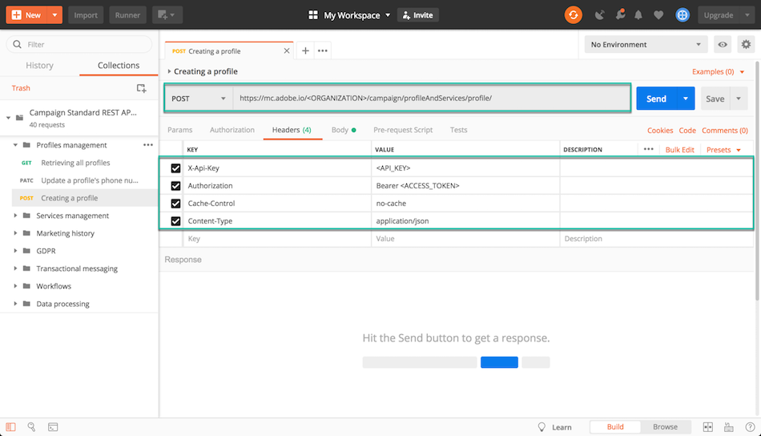
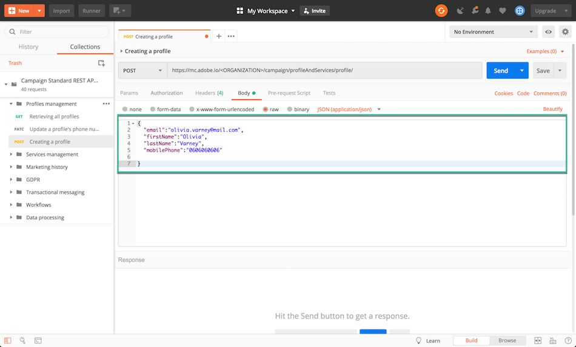
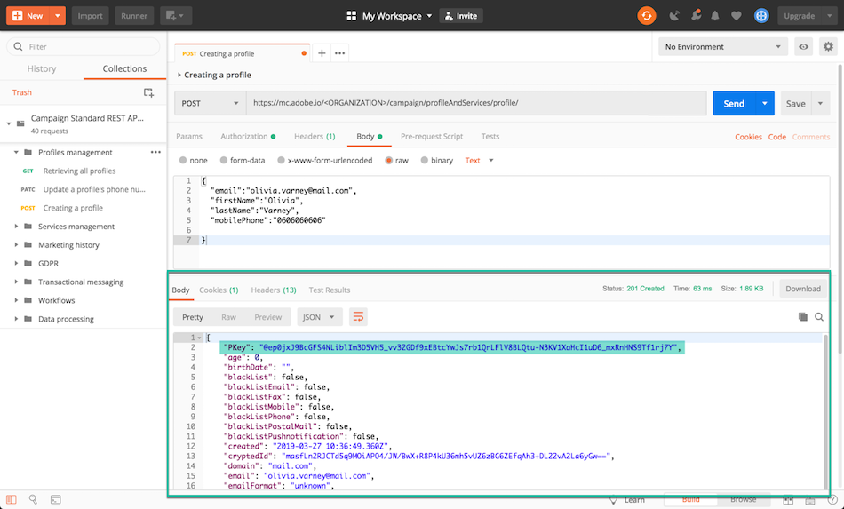
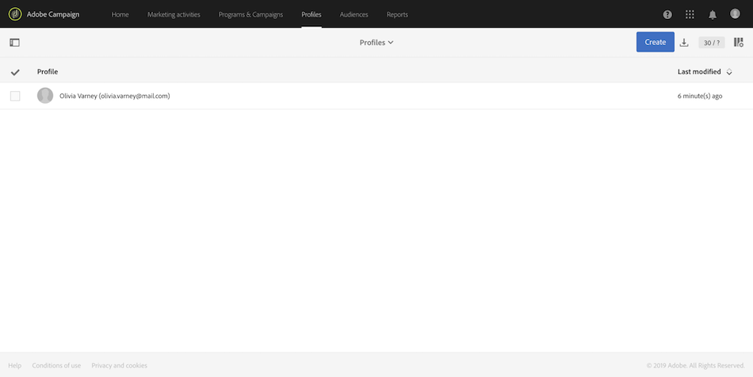

# Campaign Standard APIを使用する理由 {#why-using-campaign-standard-apis}

Adobe Campaign Standardには、既存のシステムとAdobe Campaignの基盤を連携し、実際の課題をリアルタイムで解決するためのAPIが用意されています。

サインアップページやオプトアウトページなどの公開web サイトをバックエンドシステムに接続して、プロファイル情報を保存する必要があります。 Adobe Campaignのようなバックエンドシステムは、プロファイルデータをに取り込み、カスタムオペレーションを実行する柔軟性と機能を備えています。

例をいくつか紹介します。

* 見込み客オンライン登録。
* 既存顧客プロファイルとマーケティングコミュニケーションの環境設定の管理。
  <!--* Event based transactional communication triggering – order confirmation, booking Itinerary, password reset, etc.-->
* また、カート放棄のメール配信も行います。

新規登録ランディングページを活用すれば、顧客や見込み客が名前とメールアドレスを登録できます。 Adobe Campaign Standardを通じてプロファイル情報とプロファイル設定を収集し、オーディエンスの関心にもとづいてパーソナライズされたメッセージを配信できます。

これらは次の要素で構築されています。

1. キャンペーン API リスナーを使用した登録フォーム。

   

1. チェックボックスに基づいて実行するカスタムアクション。 「特別オファーをメール」を選択した顧客には、通常の登録プロセスと比較して、ギフトクーポン付きの別のカスタムメールが送信されます。

   

1. プロファイルは、電子メールの「詳細を更新」リンクをクリックした後、詳細を変更する場合があります。 これにより、プロファイルが「プロファイルと環境設定の詳細を更新」ページに移動します。 操作を実行するには、プロファイルの詳細（Pkey）がCampaign サーバーに渡され、プロファイルが取得され、表示されます。 プロファイルが「更新」ボタンをクリックすると、情報が（PATCHコマンドを介して）システムに更新されます。

   

Campaign Standard API リクエストについて理解するのに役立つリクエストのコレクションを利用できます。 このJSON形式のコレクションでは、一般的なユースケースを表す事前定義済みのAPI リクエストを提供します。

次の手順では、Campaign Standard データベースでプロファイルを作成するためにコレクションをインポートして使用する手順ごとのユースケースについて説明します。

>[!NOTE]
>
>この例ではPostmanを使っています。 ただし、お気に入りのREST クライアントを自由に使用できます。

1. [こちら](https://helpx.adobe.com/content/dam/help/en/campaign/kb/working-with-acs-api/_jcr_content/main-pars/download_section/download-1/KB_postman_collection.json.zip)をクリックして、JSON コレクションをダウンロードします。

1. Postmanを開き、**ファイル** / **読み込み** メニューを選択します。

1. ダウンロードしたファイルをウィンドウにドラッグ&amp;ドロップします。 事前に設計されたAPI リクエストが表示され、使用する準備が整います。

   

1. 「**プロファイルの作成**」リクエストを選択し、POST リクエストと「**ヘッダー**」タブを独自の情報（&lt;ORGANIZATION>、&lt;API_KEY>、&lt;ACCESS_TOKEN>）で更新します。 詳しくは、[この節](setting-up-api-access.md)を参照してください。

   

1. 新しいプロファイルに追加する情報を&#x200B;**Body** タブに入力し、**Send** ボタンをクリックしてリクエストを実行します。

   

1. オブジェクトを作成すると、プライマリキー（PKey）がオブジェクトに関連付けられます。 これは、リクエスト応答やその他の属性に表示されます。

   

1. Campaign Standard インスタンスを開き、プロファイルが作成され、ペイロードのすべての情報が含まれていることを確認します。

   
