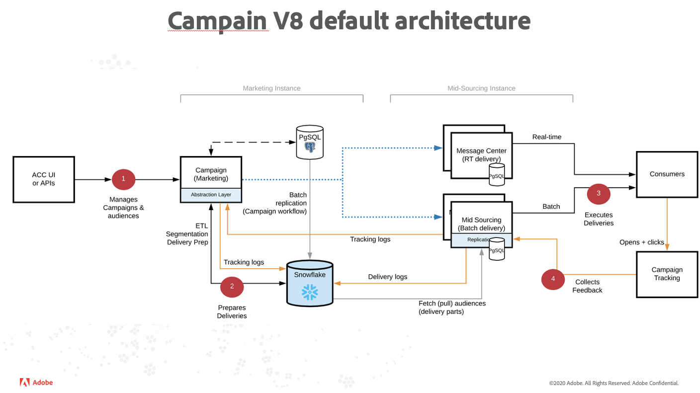
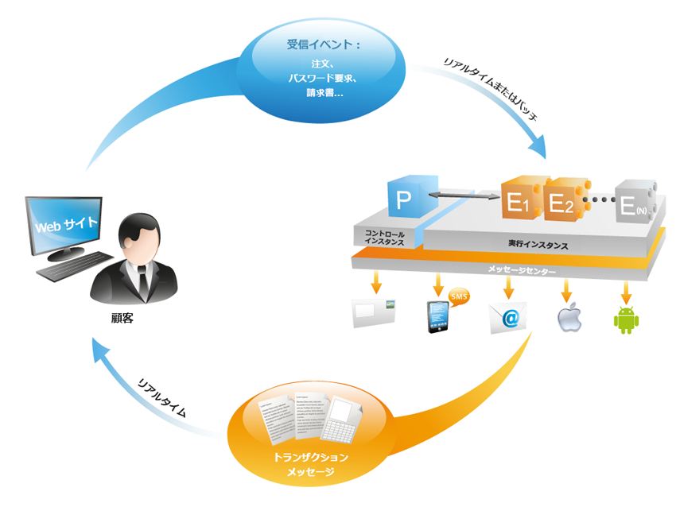

# キャンペーンアーキテクチャの概要{#gs-ac-archi}

## 環境

キャンペーンは、完全なキャンペーン環境を表す各インスタンスを持つ個々のインスタンスとして使用可能になります。

キャンペーンCloud Serviceでは、次の3種類の環境を使用できます。

* **実稼働環境**:ビジネス・プラクティショナー用のアプリケーションをホストします。

* **ステージ環境**:アプリケーションに対する変更を実稼働環境にプッシュする前の、様々なパフォーマンスと品質のテストに使用します。

* **開発環境**:開発者は、ステージおよび実稼働環境と同じ実行時条件でキャンペーンを実装できます。

環境間でパッケージを書き出したり読み込んだりすることができます。

:arrow_upper_right:[Campaign Classicドキュメント](https://experienceleague.adobe.com/docs/campaign-classic/using/getting-started/administration-basics/working-with-data-packages.html)のパッケージの詳細

## ミッドソーシングへのデプロイメント{#mid-sourcing-deployment}

サーバとプロセス間の一般的な通信は、次のスキーマに従って行われます。

* 実行とバウンスの管理モジュールがインスタンスで無効になっています。

* アプリケーションは、SOAP呼び出し（HTTPまたはHTTPS経由）を使用して駆動されるリモートの「ミッドソース」サーバーでメッセージ実行を実行するように設定されます。

>[!NOTE]
>
> キャンペーンv8はハイブリッドアーキテクチャに依存しています。 Campaign Classicv7から移行する場合は、すべての配信がミッドソーシングサーバーを経由することに注意してください。
> その結果、キャンペーンv8では内部ルーティングは&#x200B;**不可能**&#x200B;で、外部アカウントはそれに応じて無効になっています。

## Message Centerのアーキテクチャ{#transac-msg-archi}

トランザクションメッセージング(Message Center)は、トリガーメッセージの管理を目的としたキャンペーンモジュールです。

:bulb:[このセクション](../send/transactional.md)でトランザクションメッセージを送信する方法を説明します。

顧客がWebサイト上で行動すると、イベントがREST APIを介してキャンペーンを送信され、API呼び出しを介して提供された情報やデータがメッセージテンプレートに入力され、トランザクションメッセージがリアルタイムで顧客に送信されます。 これらのメッセージは、個々に、またはまとめて、E メール、SMS またはプッシュ通知経由で送信することができます。

この特定のアーキテクチャでは、高可用性と負荷管理を確保するために、実行セルがコントロールインスタンスから分離されます。

* **コントロールインスタンス**（またはマーケティングインスタンス）は、マーケターやITチームがメッセージテンプレートの作成、設定および発行に使用します。 また、イベントの監視と履歴も一元化します。

   :arrow_upper_right:[Campaign Classicドキュメント](https://experienceleague.adobe.com/docs/campaign-classic/using/transactional-messaging/message-templates/introduction.html?lang=en#transactional-messaging)で、メッセージテンプレートの作成および公開方法を説明します。

* **実行インスタンス**&#x200B;は、受信イベント（パスワードのリセットやWebサイトからの注文など）を取得し、パーソナライズされたメッセージを送信します。 ロードバランサーを介してメッセージを処理し、最大限の可用性を確保するために処理するイベント数を増やすには、複数の実行インスタンスが考えられます。

>[!CAUTION]
>
>コントロールインスタンスおよび実行インスタンスは、異なるマシンにインストールする必要があります。同じ Campaign インスタンスを共有できなくなります。

:arrow_upper_right:Message Centerのアーキテクチャは、[Campaign Classicドキュメント](https://experienceleague.adobe.com/docs/campaign-classic/using/transactional-messaging/introduction/transactional-messaging-architecture.html?lang=en#transactional-messaging)に記載されています

### 認証

これらの機能を使用するには、Adobe Campaignユーザーはコントロールインスタンスにログオンしてトランザクションメッセージテンプレートを作成し、シードリストを使用してメッセージプレビューを生成し、レポートを表示し、実行インスタンスを監視します。

* 単一実行インスタンス
AdobeがホストするMessage Center実行インスタンスと対話する際、外部システムは、提供されたアカウントのログインとパスワードを使用して、セッションログオンメソッドにapi呼び出しを行うことで、最初にセッショントークンを取得できます（デフォルトでは24時間で期限切れになります）。
次に、上記の呼び出しに応答して実行インスタンスが提供するsessionTokenを使用すると、外部アプリケーションはSOAP api呼び出し（rtEventsまたはbatchEvents）を行って通信を送信でき、各SOAP呼び出しにアカウントのログインとパスワードを含める必要はありません。

* 複数の実行インスタンス
ロードバランサーの背後に複数の実行インスタンスがある複数セルの実行アーキテクチャでは、外部アプリケーションが呼び出すログオンメソッドはロードバランサーを経由して行われます。そのため、トークンベースの認証は使用できません。 ユーザー/パスワードベースの認証が必要です。

:arrow_upper_right:トランザクションメッセージングのイベントについて詳しくは、[Campaign Classicドキュメント](https://experienceleague.corp.adobe.com/docs/campaign-classic/using/transactional-messaging/introduction/event-description.html?lang=en#about-transactional-messaging-datamodel)を参照してください