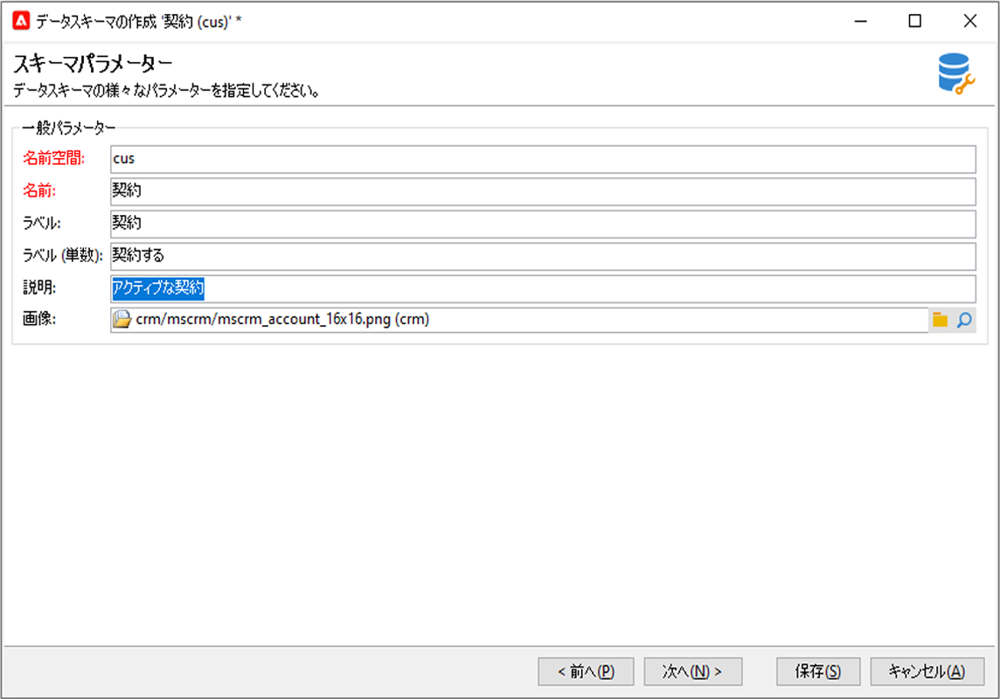

# 新しいスキーマを作成{#create-new-schema}

スキーマを編集、作成および設定するには、Adobe Campaignクライアントコンソールの&#x200B;**[!UICONTROL 管理/設定/データスキーマ]**&#x200B;ノードをクリックします。

>[!NOTE]
>
>組み込みのデータスキーマは、Adobe Campaign Classicコンソールの管理者によってのみ削除できます。


「**[!UICONTROL 編集]**」タブには、スキーマのXMLコンテンツが表示されます。


>[!NOTE]
>
>「名前」編集コントロールを使用すると、名前と名前空間で構成されるスキーマキーを入力できます。 スキーマのルート要素の「name」属性と「名前空間」属性は、スキーマのXML編集ゾーンで自動的に更新されます。

「**[!UICONTROL プレビュー]**」タブは、拡張スキーマを自動的に生成します。


>[!NOTE]
>
>ソーススキーマを保存すると、拡張スキーマの生成が自動的に開始されます。

スキーマの完全な構造を確認する必要がある場合は、**[!UICONTROL プレビュー]**&#x200B;タブを使用できます。 スキーマを拡張すると、そのすべての拡張を視覚化できます。 補完的に、「**[!UICONTROL ドキュメント]**」タブには、すべてのスキーマ属性と要素、およびそのプロパティ（SQLフィールド、タイプ/長さ、ラベル、説明）が表示されます。 「**[!UICONTROL ドキュメント]**」タブは、生成されたスキーマにのみ適用されます。

## 使用例：契約テーブル{#example--creating-a-contract-table}を作成

次の例では、データベース内に&#x200B;**contracts**&#x200B;の新しいテーブルを作成します。 次の表に、各契約の所有者および共有者の姓と名と電子メールアドレスを格納します。

これを行うには、テーブルのスキーマを作成し、対応するテーブルを生成するためにデータベース構造を更新する必要があります。 詳細な手順を以下に示します。

1. Adobe Campaignツリーの&#x200B;**[!UICONTROL 管理/設定/データスキーマ]**&#x200B;ノードを編集し、**[!UICONTROL 新規]**&#x200B;をクリックします。
1. 「**[!UICONTROL データテンプレートに新しいテーブルを作成]**」オプションを選択し、「**[!UICONTROL 次へ]**」をクリックします。

   

1. テーブル名と名前空間を指定します。

   

   >[!NOTE]
   >
   >デフォルトでは、ユーザーが作成したスキーマは「cus」名前空間に保存されます。 詳しくは、[スキーマのID](extend-schema.md#identification-of-a-schema)を参照してください。

1. テーブルのコンテンツを作成します。 設定が足りないことを確認するために、専用のアシスタントを使用することをお勧めします。 これを行うには、「**[!UICONTROL 挿入]**」ボタンをクリックし、追加する設定のタイプを選択します。

   

1. 契約表の設定を定義します。

   ```
   <srcSchema created="AA-MM-DD HH:MM:SS.TZ" desc="Active contracts" img="crm:crm/mscrm/mscrm_account_16x16.png"
           label="Contracts" labelSingular="Contract" lastModified="AA-MM-DD HH:MM:SS.TZ"
           mappingType="sql" name="Contracts" namespace="cus" xtkschema="xtk:srcSchema">
      <element dataSource="nms:extAccount:ffda" desc="Active contracts" img="crm:crm/mscrm/mscrm_account_16x16.png"
           label="Contracts" labelSingular="Contract" name="Contracts">
           <attribute name="holderName" label="Holder last name" type="string"/>
           <attribute name="holderFirstName" label="Holder first name" type="string"/>
           <attribute name="holderEmail" label="Holder email" type="string"/>
           <attribute name="co-holderName" label="Co-holder last name" type="string"/>           
           <attribute name="co-holderFirstName" label="Co-holder first name" type="string"/>           
           <attribute name="co-holderEmail" label="Co-holder email" type="string"/>    
           <attribute name="date" label="Subscription date" type="date"/>     
           <attribute name="noContract" label="Contract number" type="long"/> 
      </element>
   </srcSchema>
   ```

   契約定義済みリスト追加のタイプ。

   ```
   <srcSchema created="AA-MM-DD HH:MM:SS.TZ" desc="Active contracts" img="crm:crm/mscrm/mscrm_account_16x16.png" label="Contracts" labelSingular="Contract" lastModified="AA-MM-DD HH:MM:SS.TZ"mappingType="sql" name="Contracts" namespace="cus" xtkschema="xtk:srcSchema">
      <enumeration basetype="byte" name="typeContract">
         <value label="Home" name="home" value="0"/>
         <value label="Car" name="car" value="1"/>
         <value label="Health" name="health" value="2"/>
         <value label="Pension fund" name="pension fund" value="2"/>
      </enumeration>
      <element dataSource="nms:extAccount:ffda" desc="Active contracts" img="crm:crm/mscrm/mscrm_account_16x16.png"
           label="Contracts" labelSingular="Contract" name="Contracts">
           <attribute name="holderName" label="Holder last name" type="string"/>
           <attribute name="holderFirstName" label="Holder first name" type="string"/>
           <attribute name="holderEmail" label="Holder email" type="string"/>
           <attribute name="co-holderName" label="Co-holder last name" type="string"/>           
           <attribute name="co-holderFirstName" label="Co-holder first name" type="string"/>           
           <attribute name="co-holderEmail" label="Co-holder email" type="string"/>    
           <attribute name="date" label="Subscription date" type="date"/>     
           <attribute name="noContract" label="Contract number" type="long"/> 
      </element>
   </srcSchema>
   ```

1. スキーマを保存し、「**[!UICONTROL 構造]**」タブをクリックして構造を生成します。

   

1. データベース構造を更新して、スキーマがリンクされるテーブルを作成します。 詳しくは、[この節](update-database-structure.md)を参照してください。

