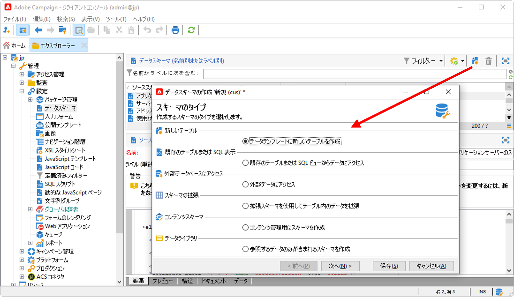

# 新しいスキーマの作成{#create-new-schema}

スキーマを編集、作成および設定するには、Adobe Campaign クライアントコンソールの&#x200B;**[!UICONTROL 管理／設定／データスキーマ]**&#x200B;ノードをクリックします。

>[!NOTE]
>
>組み込みデータスキーマは、Adobe Campaign コンソールの管理者のみが削除できます。


「**[!UICONTROL 編集]**」タブには、スキーマの XML コンテンツが表示されます。


>[!NOTE]
>
>「名前」編集コントロールを使用すると、名前と名前空間で構成されるスキーマキーを入力できます。 スキーマのルート要素の「name」属性と「namespace」属性は、スキーマの XML 編集ゾーンで自動的に更新されます。一部の名前空間は内部のみであることに注意してください。 [詳細情報](schemas.md#reserved-namespaces)。

「**[!UICONTROL プレビュー]**」タブでは、次のように拡張スキーマが自動的に生成されます。


>[!NOTE]
>
>ソーススキーマを保存すると、拡張スキーマの生成が自動的に開始されます。

スキーマの完全な構造を確認する必要がある場合は、「**[!UICONTROL プレビュー]**」タブを使用します。 スキーマを拡張すると、そのすべての拡張を視覚化できます。 「**[!UICONTROL ドキュメント]**」タブには、補足情報として、すべてのスキーマ属性と要素、およびそのプロパティ（SQL フィールド、タイプ／長さ、ラベル、説明）が表示されます。 「**[!UICONTROL ドキュメント]**」タブは、生成されたスキーマにのみ適用されます。

## ユースケース：契約テーブルの作成 {#example--creating-a-contract-table}

次の例では、**契約**&#x200B;の新しいテーブルをデータベースに作成します。 このテーブルには、契約ごとに、所有者と共同所有者の姓と名および E メールアドレスを格納できます。

それには、テーブルのスキーマを作成し、対応するテーブルを生成するためのデータベース構造を更新する必要があります。 詳細な手順は次のとおりです。

1. Adobe Campaign ツリーの&#x200B;**[!UICONTROL 管理／設定／データスキーマ]**&#x200B;ノードを編集し、「**[!UICONTROL 新規]**」をクリックします。
1. 「**[!UICONTROL データテンプレートに新しいテーブルを作成]**」オプションを選択し、「**[!UICONTROL 次へ]**」をクリックします。

   

1. テーブル名と名前空間を指定します。

   

   >[!NOTE]
   >
   >デフォルトでは、ユーザーが作成したスキーマは「cus」名前空間に保存されます。 詳しくは、[スキーマの ID](extend-schema.md#identification-of-a-schema) を参照してください。

1. テーブルの内容を作成します。 設定の見落としがないように、専用のウィザードを使用することをお勧めします。 それには、「**[!UICONTROL 挿入]**」ボタンをクリックし、追加する設定のタイプを選択します。

   

1. 契約テーブルの設定を定義します。

   ベストプラクティスとして、`dataSource="nms:extAccount:ffda"`属性を追加して、Cloudデータベースにテーブルを作成します。 この属性は、新しいテーブルを作成する際にデフォルトで追加されます。

   ```
   <srcSchema created="YYYY-MM-DD HH:MM:SS.TZ" desc="Active contracts" img="crm:crm/mscrm/mscrm_account_16x16.png"
           label="Contracts" labelSingular="Contract" lastModified="YYYY-MM-DD HH:MM:SS.TZ"
           mappingType="sql" name="Contracts" namespace="cus" xtkschema="xtk:srcSchema">
      <element dataSource="nms:extAccount:ffda" desc="Active contracts" img="crm:crm/mscrm/mscrm_account_16x16.png"
           label="Contracts" labelSingular="Contract" name="Contracts">
           <attribute name="holderName" label="Holder last name" type="string"/>
           <attribute name="holderFirstName" label="Holder first name" type="string"/>
           <attribute name="holderEmail" label="Holder email" type="string"/>
           <attribute name="co-holderName" label="Co-holder last name" type="string"/>           
           <attribute name="co-holderFirstName" label="Co-holder first name" type="string"/>           
           <attribute name="co-holderEmail" label="Co-holder email" type="string"/>    
           <attribute name="date" label="Subscription date" type="date"/>     
           <attribute name="noContract" label="Contract number" type="long"/> 
      </element>
   </srcSchema>
   ```

   契約タイプの定義済みリストを追加します。

   ```
   <srcSchema created="AA-MM-DD HH:MM:SS.TZ" desc="Active contracts" img="crm:crm/mscrm/mscrm_account_16x16.png" label="Contracts" labelSingular="Contract" AA-MM-DD HH:MM:SS.TZ"mappingType="sql" name="Contracts" namespace="cus" xtkschema="xtk:srcSchema">
      <enumeration basetype="byte" name="typeContract">
         <value label="Home" name="home" value="0"/>
         <value label="Car" name="car" value="1"/>
         <value label="Health" name="health" value="2"/>
         <value label="Pension fund" name="pension fund" value="2"/>
      </enumeration>
      <element dataSource="nms:extAccount:ffda" desc="Active contracts" img="crm:crm/mscrm/mscrm_account_16x16.png"
           label="Contracts" labelSingular="Contract" name="Contracts">
           <attribute name="holderName" label="Holder last name" type="string"/>
           <attribute name="holderFirstName" label="Holder first name" type="string"/>
           <attribute name="holderEmail" label="Holder email" type="string"/>
           <attribute name="co-holderName" label="Co-holder last name" type="string"/>           
           <attribute name="co-holderFirstName" label="Co-holder first name" type="string"/>           
           <attribute name="co-holderEmail" label="Co-holder email" type="string"/>    
           <attribute name="date" label="Subscription date" type="date"/>     
           <attribute name="noContract" label="Contract number" type="long"/> 
      </element>
   </srcSchema>
   ```

1. スキーマを保存し、「**[!UICONTROL 構造]**」タブをクリックして構造を生成します。

   

1. データベース構造を更新して、スキーマのリンク先となるテーブルを作成します。 詳しくは、[この節](update-database-structure.md)を参照してください。

