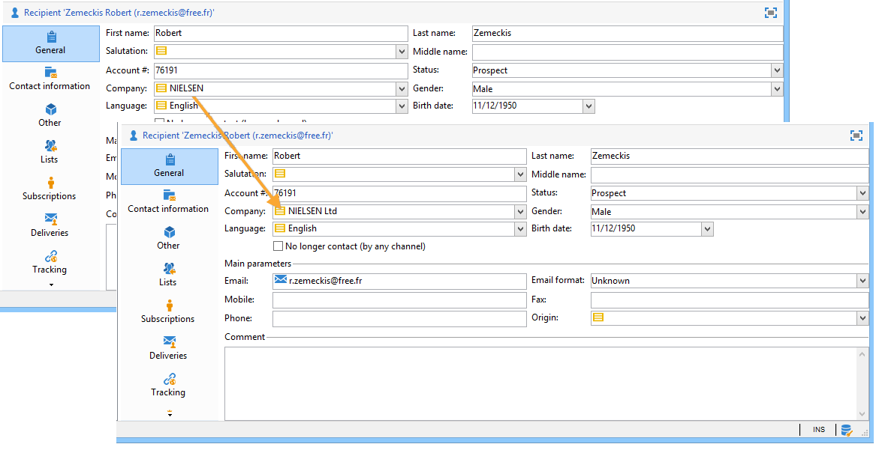

# 列挙の管理 {#manage-enumerations}

定義済みリスト（定義済みリストとも呼ばれます）とは、特定のフィールドに入力するために使用できる値の事前定義済みリストです。 列挙はフィールド値の標準化に役立ち、データ入力の一貫性を高め、クエリを簡素化します。

使用可能な場合、値はドロップダウンリストに表示されます。 値を直接選択するか、入力を開始できます。予測入力では、一致する値を候補として表示し、自動的に完了します。

一部のコンソールフィールドは定義済みリストで設定されます。 列挙が **開く** 場合は、新しい値をフィールドに直接追加することもできます。

## 列挙へのアクセス

これらのフィールドで使用される値は、一元的に管理されます。 エクスプローラーツリーの **管理** / `>` プラットフォーム **/** 列挙 `>` で、追加、編集、更新 **削除でき** す。

* 上部セクションには、列挙が設定されているフィールドのリストが表示されます。
* 下部のセクションには、使用可能な値が一覧表示されます。

列挙が **[!UICONTROL 開く]** 場合、ユーザーは、ユーザーインターフェイスの対応するフィールドに新しい値を直接入力できます。

列挙が **[!UICONTROL 閉じられた]** 場合、新しい値は **列挙** メニューからのみ追加できます。

## 新しい値を追加

新しい列挙値を作成するには、「**[!UICONTROL 追加]**」ボタンをクリックします。

値のラベルを入力します。

## エイリアスクレンジング {#alias-cleansing}

列挙フィールドには、列挙値以外の値を入力できます。 それらの値は、そのまま格納することも、クレンジング処理を適用することもできます。

>[!CAUTION]
>
>データクレンジングは、データベース内のデータに大きな影響を及ぼす重大なプロセスです。Adobe Campaign の大規模なデータ更新が実行され、場合によっては一部の値が削除される結果になることもあります。したがって、この操作はエキスパートユーザー向け機能として予約されています。

入力値は次のいずれかの方法で使用できます。

* 定義済みリストの値に追加：この場合、「**[!UICONTROL オープン]**」オプションを選択する必要があります。
* または、対応するエイリアスに自動的に置き換えます。この場合、このケースは、項目別リストの「**[!UICONTROL エイリアス]**」タブで定義する必要があります。
* エイリアスのリストに格納：エイリアスの割り当ては後で実行します。

### エイリアスの作成 {#creating-an-alias}

「**[!UICONTROL エイリアスクレンジング]**」は、選択した定義済みリストにおいてエイリアスを使用するためのオプションです。このオプションを選択すると、ウィンドウの下部に「**[!UICONTROL エイリアス]**」タブが表示されます。

エイリアスを作成するには、次の手順に従います。

1. 列挙を参照して ant を更新し、「**[!UICONTROL 追加]**」をクリックします。

   

1. 変換元となるエイリアスと、適用する値を入力し、「**[!UICONTROL Ok]**」をクリックします。

1. この操作を確定する前にパラメーターを確認します。

>[!CAUTION]
>
>この手順が確認されると、以前の値は復元できない場合があります。以前の値は置き換えられます。

これにより、ユーザーがAdobe Campaign コンソールまたはフォームの「会社」フィールドに **NEILSEN** と入力すると、その値が自動的に **NIELSEN Ltd** に置き換えられます。 値の置換は、**エイリアスクレンジング** ワークフローによって実行されます。 [データクレンジングの実行](#running-data-cleansing)を参照してください。

### 値からエイリアスへの変換 {#values-into-aliases}

既存の値をエイリアスに変換できます。 これを実行するには、次の手順に従います。

1. 値のリストを右クリックし、「**[!UICONTROL 値をエイリアスに変換…]**」を選択します。

1. 変換する値を選択し、「次へ **[!UICONTROL をクリックし]** す。

1. 「**[!UICONTROL 開始]**」をクリックして変換を実行します。

実行が完了すると、エイリアスのリストに新しいエイリアスが追加されます。

### エイリアスヒット数の取得 {#alias-hits}

ユーザーが列挙に含まれていない値を入力すると、それらは **[!UICONTROL エイリアス]** タブに保存されます。

**エイリアスクレンジング** テクニカルワークフローは、毎晩これらの値を復元し、列挙を更新します。 [データクレンジングの実行](#running-data-cleansing)を参照してください。

必要に応じて、「**[!UICONTROL ヒット数]** 列に、この値が入力された回数を表示できます。 ただし、この値の計算には、時間とメモリの両方を要する場合があります。 詳しくは、[エントリ出現回数の計算](#calculating-entry-occurrences)を参照してください。

### データクレンジングの実行 {#run-data-cleansing}

データクレンジングは&#x200B;**[!UICONTROL エイリアスクレンジング]**&#x200B;ワークフローによって実行されます。列挙用に定義された設定は、実行時に適用されます。[エイリアスクレンジングワークフロー](#alias-cleansing-workflow)を参照してください。

「**[!UICONTROL 値をクレンジング]**」リンクでは、クレンジングの実行をトリガーできます。

「**[!UICONTROL 詳細設定パラメーター]**」リンクでは、収集される値を処理対象にし始める日付を設定できます。

「**[!UICONTROL 開始]**」ボタンをクリックすると、データクレンジングが実行されます。

### エントリ出現回数の計算 {#entry-occurrences}

定義済みリストの「**[!UICONTROL エイリアス]**」サブタブでは、入力されたすべての値の中に特定のエイリアスが含まれていた回数を表示できます。この情報は推定値であり、「**[!UICONTROL ヒット数]**」列に表示されます。

>[!CAUTION]
>
>エイリアスの入力回数を計算するには、長い時間が必要となる場合があります。この機能を使用する際には注意してください。

「**[!UICONTROL 値をクレンジング]**」リンクを使用すると、ヒット数の計算を手動で実行することもできます。これをおこなうには、「**[!UICONTROL 詳細設定パラメーター]**」リンクをクリックし、目的に応じたオプションを選択します。

* 「**[!UICONTROL エイリアスヒット数を更新]**」：入力された日付に基づいて、既に計算済みのヒット数を更新する場合に選択します。
* 「**[!UICONTROL 開始からのエイリアスのヒット数を再計算]**」：Adobe Campaign プラットフォーム全体に対して計算処理を実行する場合に選択します。

指定した期間について計算を自動実行する（例：週に 1 回）ための専用ワークフローを作成することもできます。

そのためには、**[!UICONTROL エイリアスクレンジング]**&#x200B;ワークフローのコピーを作成し、スケジューラーを変更して、**[!UICONTROL 列挙値のクレンジング]**&#x200B;で次の設定を使用します。

* **-updateHits**：エイリアスのヒット数を更新する場合
* **-updateHits:full**：すべてのエイリアスヒットを再計算します。

### エイリアスクレンジングワークフロー {#alias-cleansing-workflow}

**エイリアスクレンジング**&#x200B;ワークフローは、列挙値のクレンジングを実行します。デフォルトでは毎日実行されます。

このワークフローには、**[!UICONTROL 管理／プロダクション／テクニカルワークフロー]**&#x200B;ノードでアクセスできます。

