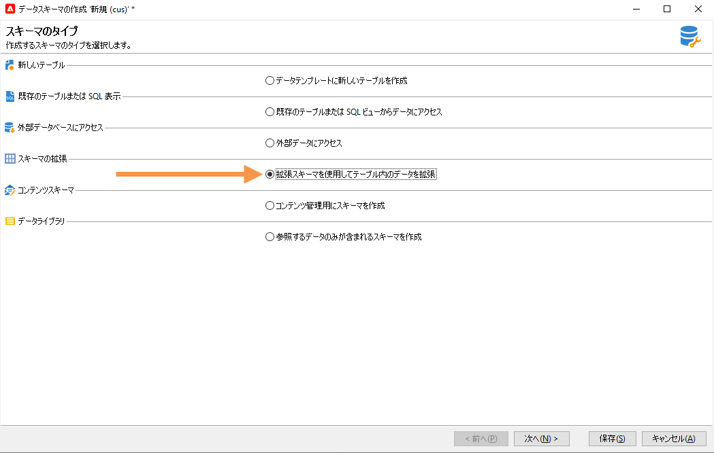
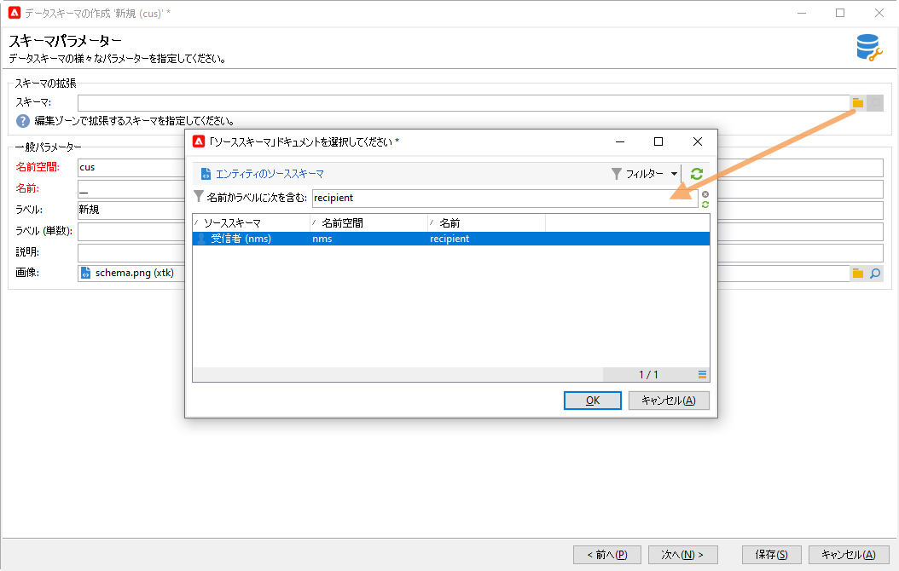
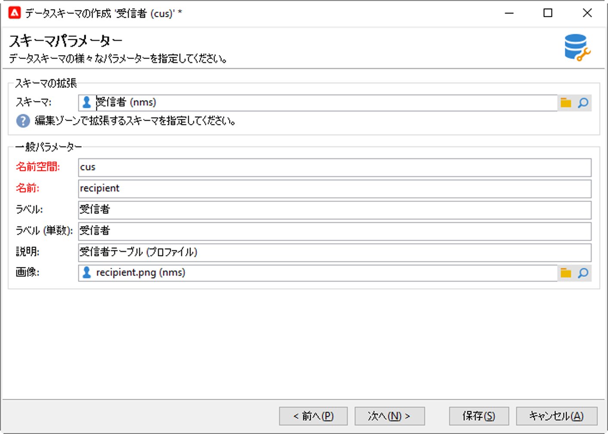
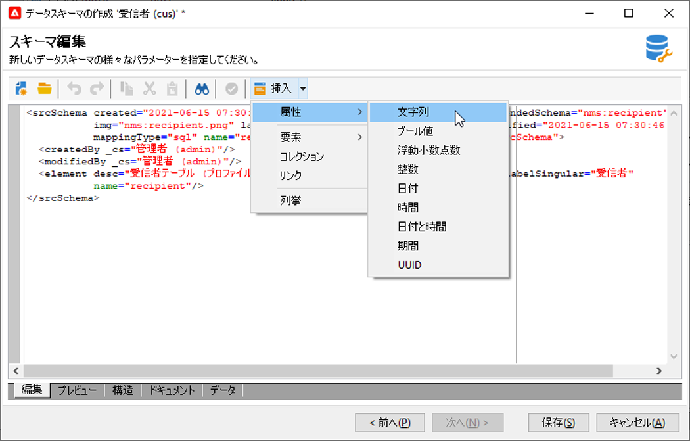
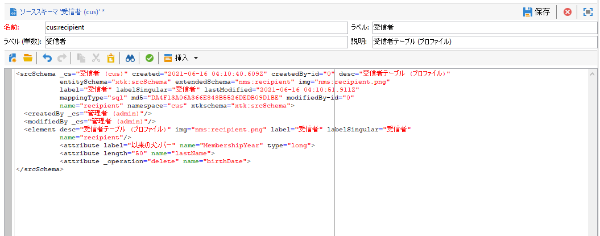
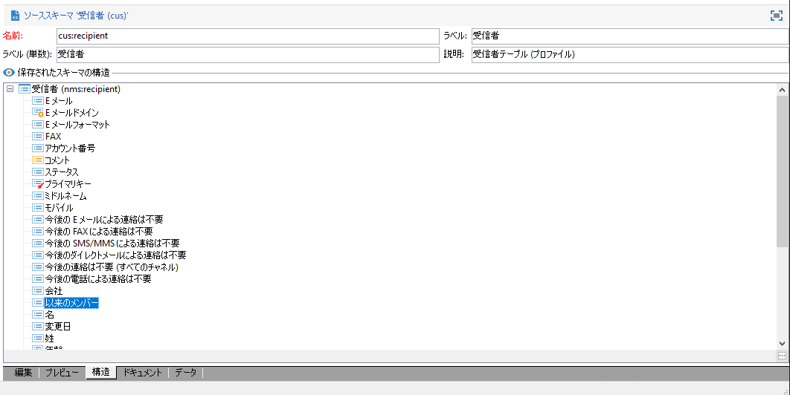

# スキーマの拡張{#extend-schemas}

テクニカルユーザーは、既存のスキーマへの要素の追加、スキーマ内の要素の変更、要素の削除など、実装のニーズに合わせて Campaign データモデルをカスタマイズできます。

Campaign データモデルをカスタマイズする主な手順は次のとおりです。

1. 拡張スキーマの作成
1. Campaign データベースの更新
1. 入力フォームの適合

>[!CAUTION]
>組み込みスキーマは直接変更できません。 組み込みのスキーマを適合させる必要がある場合は、スキーマを拡張します。

??Campaignの組み込みテーブルとそのインタラクションについての詳細は、[このページ](datamodel.md)を参照してください。 [このページ](create-schema.md)で新しいスキーマを作成する際の推奨事項も参照してください。

スキーマを拡張するには、次の手順に従います。

1. エクスプローラーの&#x200B;**[!UICONTROL 管理／設定／データスキーマー]**&#x200B;フォルダーに移動します。
1. 「**新規**」ボタンをクリックし、「**[!UICONTROL 拡張スキーマを使用してテーブルのデータを拡張する]**」を選択します。

   

1. 拡張する組み込みスキーマを特定し、選択します。

   

   慣例に従い、拡張スキーマに組み込みスキーマと同じ名前を付け、カスタム名前空間を使用します。一部の名前空間は社内専用であることに注意してください。 [詳細](schemas.md#reserved-namespaces)

   

1. スキーマエディタで、コンテキストメニューを使用して必要な要素を追加し、保存します。

   

   以下の例では、**MembershipYear** 属性を追加、姓の長さの制限を設定し（この制限はデフォルト値を上書きします）、組み込みスキーマから生年月日を削除します。

   

   ```
   <srcSchema created="YYYY-MM-DD" desc="Recipient table" extendedSchema="nms:recipient"
           img="nms:recipient.png" label="Recipients" labelSingular="Recipient" lastModified="YYYY-MM-DD"
           mappingType="sql" name="recipient" namespace="cus" xtkschema="xtk:srcSchema">
    <element desc="Recipient table" img="nms:recipient.png" label="Recipients" labelSingular="Recipient" name="recipient">
       <attribute label="Member since" name="MembershipYear" type="long"/>
       <attribute length="50" name="lastName"/>
       <attribute _operation="delete" name="birthDate"/>
   </element>
   </srcSchema>
   ```

1. Campaign への接続を一旦解除してから再接続し、「**[!UICONTROL 構造]**」タブのスキーマ構造が更新されることを確認します。

   

1. データベース構造を更新して、変更を適用します。 [詳細情報](update-database-structure.md)

1. データベースに変更が実装されたら、受信者入力フォームを適合させて、変更を表示することができます。 [詳細情報](forms.md)
